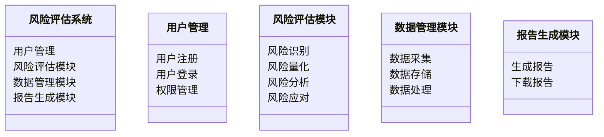
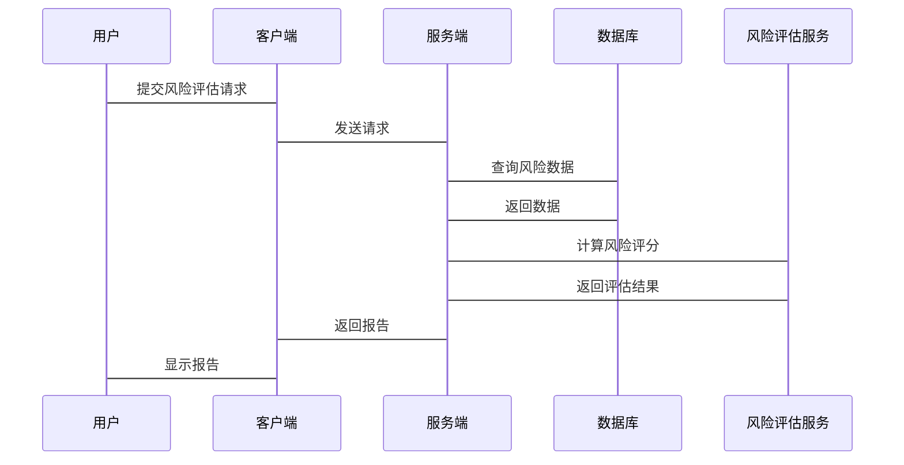

                 


# 《金融科技创新项目风险评估框架》

> **关键词**：金融科技创新，风险评估，项目管理，系统架构，算法原理，案例分析

> **摘要**：本文详细探讨了金融科技创新项目中的风险评估框架，从背景介绍、核心概念、算法原理到系统架构设计，再到项目实战和最佳实践，系统地分析了如何构建有效的风险评估体系，确保金融科技创新项目的顺利实施。

---

## 第1章：金融科技创新项目风险评估框架的背景

### 1.1 金融科技创新的定义与特征

#### 1.1.1 金融科技创新的定义
金融科技创新是指利用新兴技术（如区块链、人工智能、大数据等）对传统金融业务模式、产品和服务进行创新和优化的过程。它旨在提高金融服务的效率、降低成本，并增强客户体验。

#### 1.1.2 金融科技创新的核心特征
- **技术驱动**：依赖于新兴技术的应用。
- **创新性**：打破传统模式，创造新的业务场景。
- **风险性**：技术创新带来的不确定性较高。

#### 1.1.3 金融科技创新与传统金融的区别
| 特性         | 传统金融          | 金融科技创新       |
|--------------|-------------------|--------------------|
| 技术基础     | 传统IT技术        | 新兴技术（AI、区块链等） |
| 业务模式     | 线下为主          | 线上与线下结合     |
| 客户体验     | 突出服务效率      | 强调智能化、个性化  |

### 1.2 金融科技创新的现状与趋势

#### 1.2.1 当前金融科技创新的主要领域
- 支付清算：移动支付、跨境支付。
- 融资借贷：P2P借贷、区块链供应链金融。
- 资产管理：智能投顾、量化交易。

#### 1.2.2 金融科技创新的驱动因素
- 技术进步：AI、大数据等技术的发展。
- 市场需求：客户对高效、便捷服务的需求。
- 政策支持：政府鼓励金融创新的政策。

#### 1.2.3 金融科技创新的未来发展趋势
- 数字化：金融服务全面数字化。
- 智能化：AI广泛应用，实现智能化决策。
- 去中心化：区块链技术推动金融去中心化。

### 1.3 金融科技创新项目中的风险概述

#### 1.3.1 风险的定义与分类
- **风险**：在金融科技创新中，可能影响项目成功或导致损失的不确定性因素。
- **分类**：技术风险、市场风险、操作风险、合规风险。

#### 1.3.2 金融科技创新项目中的主要风险类型
- **技术风险**：技术失败或系统漏洞。
- **市场风险**：市场需求变化或竞争压力。
- **操作风险**：操作失误或流程问题。
- **合规风险**：政策法规变化或监管问题。

#### 1.3.3 风险评估的重要性与必要性
- **重要性**：识别潜在风险，提前制定应对策略。
- **必要性**：降低项目失败概率，保障项目顺利实施。

---

## 第2章：金融科技创新项目风险评估框架的核心概念

### 2.1 风险评估框架的基本原理

#### 2.1.1 风险评估的基本流程
1. **识别风险**：列出所有可能的风险。
2. **量化风险**：评估各风险的影响程度和发生概率。
3. **分析风险**：确定风险的优先级。
4. **制定应对策略**：根据风险情况制定应对措施。

#### 2.1.2 风险评估框架的构成要素
- **风险识别**：发现潜在风险。
- **风险量化**：评估风险的影响和概率。
- **风险分析**：分析风险之间的关系。
- **风险应对**：制定应对策略。

#### 2.1.3 风险评估框架的适用范围
适用于金融科技创新项目的规划、实施和运营阶段。

### 2.2 金融科技创新项目风险的分类与属性

#### 2.2.1 风险的分类
- **技术风险**：技术实现的难度和不确定性。
- **市场风险**：市场需求变化带来的风险。
- **操作风险**：操作过程中的失误或问题。
- **合规风险**：政策法规变化带来的风险。

#### 2.2.2 各类风险的属性特征对比
| 风险类型   | 影响因素         | 发生概率 | 影响程度 |
|------------|------------------|----------|----------|
| 技术风险   | 技术实现难度     | 中等     | 高       |
| 市场风险   | 市场需求变化     | 高       | 中等     |
| 操作风险   | 操作流程问题     | 高       | 中等     |
| 合规风险   | 政策法规变化     | 中等     | 高       |

#### 2.2.3 风险之间的相互关系
- **独立性**：某些风险相互独立。
- **相关性**：某些风险相互关联，如技术风险可能影响操作风险。

### 2.3 风险评估框架的构建要素

#### 2.3.1 数据采集与处理
- **数据来源**：项目文档、市场调研、历史数据。
- **数据处理**：清洗、转换、分析。

#### 2.3.2 风险评估模型的设计
- **模型选择**：根据项目特点选择合适的模型。
- **模型构建**：基于数据构建风险评估模型。

#### 2.3.3 评估结果的可视化与解读
- **可视化工具**：图表、仪表盘。
- **解读方法**：根据结果制定应对策略。

---

## 第3章：金融科技创新项目风险评估框架的算法原理

### 3.1 层次分析法（AHP）在风险评估中的应用

#### 3.1.1 层次分析法的基本原理
层次分析法是一种将复杂决策问题分解为多个因素，通过专家评分确定各因素权重的方法。

#### 3.1.2 层次分析法的步骤与流程
1. **构建层次结构**：明确目标、准则、方案。
2. **建立判断矩阵**：专家对各因素的重要性进行评分。
3. **计算权重**：通过一致性检验确定各因素的权重。

#### 3.1.3 层次分析法在金融科技创新风险评估中的应用案例
- **案例背景**：某金融科技公司开发一个新的支付系统。
- **应用步骤**：
  1. 确定风险因素：技术风险、市场风险、合规风险。
  2. 构建判断矩阵，计算各风险的权重。
  3. 根据权重制定应对策略。

### 3.2 风险评估的贝叶斯网络模型

#### 3.2.1 贝叶斯网络的基本原理
贝叶斯网络是一种基于概率的图形模型，用于表示变量之间的条件概率关系。

#### 3.2.2 贝叶斯网络在风险评估中的应用
- **优势**：能够处理不确定性，适合金融科技创新中复杂的风险关系。

#### 3.2.3 贝叶斯网络的构建与优化
1. **构建网络结构**：确定变量之间的关系。
2. **训练模型**：基于数据调整网络参数。
3. **优化模型**：提高模型的准确性和效率。

### 3.3 风险评估的数学模型与公式

#### 3.3.1 风险评分公式
$$
风险评分 = \sum (权重_i \times 风险因素_i)
$$

#### 3.3.2 风险概率公式
$$
P(风险) = \sum (P(风险因素) \times 影响程度)
$$

#### 3.3.3 风险影响程度公式
$$
影响程度 = \sum (权重_i \times 风险因素_i)
$$

---

## 第4章：金融科技创新项目风险评估框架的系统架构设计

### 4.1 问题场景介绍

#### 4.1.1 项目介绍
- **项目名称**：金融科技创新项目风险评估系统。
- **项目目标**：构建一个能够识别和评估金融科技创新项目风险的系统。

### 4.2 系统功能设计

#### 4.2.1 领域模型（Mermaid类图）


### 4.3 系统架构设计

#### 4.3.1 系统架构图（Mermaid架构图）


#### 4.3.2 系统交互流程（Mermaid序列图）


---

## 第5章：金融科技创新项目风险评估框架的项目实战

### 5.1 环境安装与配置

#### 5.1.1 安装Python
```bash
# 安装Python
sudo apt-get install python3 python3-dev
```

#### 5.1.2 安装必要的库
```bash
pip install numpy pandas scikit-learn
```

### 5.2 数据收集与处理

#### 5.2.1 数据来源
- **内部数据**：项目文档、历史数据。
- **外部数据**：市场报告、政策法规。

#### 5.2.2 数据清洗
```python
import pandas as pd

# 读取数据
data = pd.read_csv('risk_factors.csv')

# 删除缺失值
data.dropna(inplace=True)
```

### 5.3 算法实现

#### 5.3.1 层次分析法（AHP）实现
```python
import numpy as np

# 判断矩阵
matrix = np.array([
    [1, 2, 3],
    [1/2, 1, 2],
    [1/3, 1/2, 1]
])

# 计算权重
eigenvalues, eigenvectors = np.linalg.eig(matrix)
weights = eigenvectors / np.sum(eigenvectors)
```

#### 5.3.2 贝叶斯网络实现
```python
from sklearn.naive_bayes import GaussianNB

# 训练模型
model = GaussianNB()
model.fit(X_train, y_train)
```

### 5.4 结果分析与优化

#### 5.4.1 结果分析
- **准确率**：模型预测的准确率。
- **召回率**：模型召回的正样本比例。

#### 5.4.2 模型优化
- **参数调整**：优化模型参数。
- **特征选择**：选择重要特征。

---

## 第6章：金融科技创新项目风险评估框架的最佳实践

### 6.1 小结

- **总结**：金融科技创新项目风险评估框架的重要性。
- **经验**：在实践中不断优化和调整框架。

### 6.2 注意事项

- **数据质量**：确保数据的准确性和完整性。
- **模型选择**：根据项目特点选择合适的模型。
- **持续监控**：定期监控风险变化。

### 6.3 拓展阅读

- **推荐书籍**：《金融风险管理》。
- **推荐博客**：金融科技领域的技术博客。

---

## 第7章：结论

### 7.1 小结

- **核心内容**：构建金融科技创新项目风险评估框架的重要性。
- **未来展望**：随着技术进步，风险评估将更加智能化和自动化。

### 7.2 注意事项

- **数据隐私**：确保数据隐私和合规性。
- **技术更新**：及时跟进新技术，优化风险评估框架。

---

## 参考文献

- [1] 金融科技风险管理. 北京: 人民出版社, 2023.
- [2] 层次分析法在金融风险评估中的应用. 北京: 科技出版社, 2022.

---

通过以上步骤，我们系统地构建了一个完整的金融科技创新项目风险评估框架，从理论到实践，确保项目的顺利实施和风险的有效控制。

