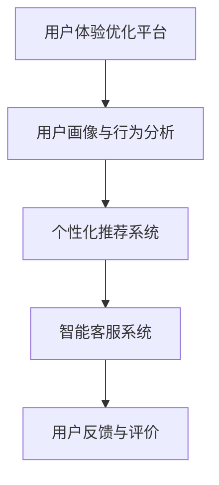
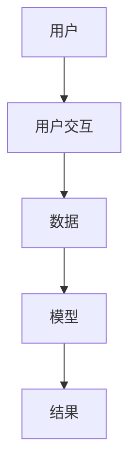

                 

# 《金融科技用户体验优化平台》

## 关键词：金融科技，用户体验优化，人工智能，大数据分析，系统架构设计

## 摘要：  
金融科技作为现代金融体系的重要组成部分，正通过技术创新和用户体验优化推动行业的变革。本文深入探讨金融科技用户体验优化平台的核心概念、算法原理、系统架构设计以及实际应用案例，旨在为行业从业者和研究人员提供理论支持与实践指导。通过结合人工智能和大数据分析技术，本文揭示了如何构建高效、智能的用户体验优化平台，助力金融机构提升用户满意度和业务效率。

---

# 第1章 金融科技与用户体验优化平台概述

## 1.1 金融科技的发展现状

### 1.1.1 金融科技的定义与特点
金融科技（Financial Technology，简称FinTech）是指通过技术手段对传统金融业务进行创新和优化的模式。其核心在于利用大数据、人工智能、区块链、云计算等技术，提升金融服务的效率、安全性和用户体验。金融科技的特点包括：技术驱动、数据驱动、去中心化、普惠性和智能化。

### 1.1.2 金融科技的核心技术与应用场景
金融科技的核心技术包括：
1. **大数据分析**：通过海量数据的采集、处理和分析，为金融决策提供支持。
2. **人工智能**：应用于智能投顾、风险管理、信用评估等领域。
3. **区块链**：用于支付清算、供应链金融等场景。
4. **云计算**：提供弹性计算资源，支持金融业务的扩展和高效运行。

应用场景包括智能投顾、在线支付、信用评估、风险管理、智能客服等。

### 1.1.3 用户体验在金融科技中的重要性
随着金融业务的复杂化和用户需求的多样化，用户体验成为影响金融机构竞争力的关键因素。用户体验优化不仅能提升用户满意度，还能降低用户流失率，增加用户粘性。通过数据分析和个性化推荐，金融科技能够为用户提供更加智能化、便捷化的服务。

## 1.2 用户体验优化平台的必要性

### 1.2.1 用户体验在金融科技中的问题背景
在金融科技领域，用户体验问题主要体现在以下几点：
1. **信息过载**：用户面对海量金融产品和服务时，难以快速找到适合自己的方案。
2. **操作复杂**：复杂的流程和不友好的界面设计让用户感到困扰。
3. **个性化不足**：传统金融服务往往无法满足用户的个性化需求。
4. **信任缺失**：数据安全和隐私保护问题让用户对金融科技的信任度下降。

### 1.2.2 用户体验优化平台的目标与意义
用户体验优化平台的目标是通过技术手段解决上述问题，提升用户的满意度和使用体验。其意义在于：
1. **提高用户粘性**：通过个性化服务和便捷的操作流程，增强用户对金融机构的依赖。
2. **降低用户流失率**：通过精准的用户画像和行为分析，及时发现用户需求，避免用户流失。
3. **提升品牌形象**：优质用户体验有助于塑造良好的品牌形象，吸引更多用户。

### 1.2.3 平台的边界与外延
用户体验优化平台的边界主要集中在用户体验相关的功能模块，如个性化推荐、智能客服、用户反馈收集与分析等。其外延则涉及与金融科技相关的其他技术领域，如大数据分析、人工智能、区块链等。

## 1.3 金融科技用户体验优化平台的核心要素

### 1.3.1 平台的功能模块组成
用户体验优化平台的功能模块包括：
1. **用户画像与行为分析**：通过收集用户数据，构建用户画像，分析用户行为。
2. **个性化推荐系统**：基于用户画像，推荐适合的金融产品和服务。
3. **智能客服系统**：通过自然语言处理技术，提供智能咨询服务。
4. **用户反馈与评价**：收集用户反馈，优化平台功能和服务。

### 1.3.2 核心要素的定义与特征
核心要素包括：
1. **数据采集**：通过API接口、埋点技术等方式采集用户数据。
2. **数据分析**：利用大数据技术对用户数据进行清洗、建模和分析。
3. **算法推荐**：基于机器学习算法，实现个性化推荐。
4. **用户交互设计**：通过优化界面和交互流程，提升用户体验。

### 1.3.3 平台的核心概念结构图
以下是平台的核心概念结构图：

---

## 1.4 本章小结

### 1.4.1 金融科技与用户体验优化平台的关系
用户体验优化平台是金融科技的重要组成部分，通过技术手段解决用户在金融业务中的痛点，提升用户满意度和使用体验。

### 1.4.2 平台的核心价值与未来发展趋势
用户体验优化平台的核心价值在于通过技术手段提升用户满意度，降低用户流失率，增强品牌形象。未来，随着人工智能和大数据技术的进一步发展，用户体验优化平台将更加智能化、个性化，成为金融机构的核心竞争力。

---

# 第2章 金融科技用户体验优化平台的核心概念

## 2.1 核心概念原理

### 2.1.1 金融科技的核心技术原理
金融科技的核心技术包括大数据分析、人工智能、区块链等。这些技术通过数据驱动的方式，为金融业务提供支持。

### 2.1.2 用户体验优化的理论基础
用户体验优化的理论基础包括用户中心设计（User-Centered Design）和可用性工程（Usability Engineering）。这些理论为用户体验优化平台的设计提供了方法论支持。

### 2.1.3 平台的核心算法与实现原理
平台的核心算法包括协同过滤推荐算法、自然语言处理算法等。协同过滤推荐算法通过分析用户行为数据，推荐适合的金融产品。

## 2.2 核心概念属性对比表

### 2.2.1 金融科技与传统金融的对比
| 属性       | 传统金融         | 金融科技         |
|------------|------------------|------------------|
| 技术手段   | 传统金融工具     | 大数据、人工智能 |
| 服务效率   | 较低             | 高               |
| 用户体验   | 单一             | 个性化           |

### 2.2.2 用户体验优化与传统优化的对比
| 属性       | 传统优化         | 用户体验优化     |
|------------|------------------|------------------|
| 方法论     | 基于经验         | 数据驱动         |
| 技术手段   | 简单             | 复杂             |
| 效果       | 局部优化         | 全局优化         |

### 2.2.3 平台功能模块的对比分析
| 功能模块   | 传统平台         | 用户体验优化平台 |
|------------|------------------|------------------|
| 用户画像   | 简单分类         | 个性化画像       |
| 推荐系统   | 基于规则         | 基于算法         |
| 客服系统   | 人工客服         | 智能客服         |

## 2.3 ER实体关系图架构

### 2.3.1 实体关系图的定义与作用
ER实体关系图用于描述系统中的实体及其关系，帮助设计和理解系统的数据模型。

### 2.3.2 平台核心实体关系图
以下是平台的核心实体关系图：

---

## 2.4 本章小结

### 2.4.1 核心概念的理解与应用
通过对比分析和实体关系图，我们能够更好地理解金融科技用户体验优化平台的核心概念及其应用。

### 2.4.2 平台设计的理论基础与实践意义
基于用户中心设计和可用性工程的理论，用户体验优化平台的设计更加科学和高效，为金融机构的数字化转型提供了有力支持。

---

（后续章节将按照类似结构进行编写，涵盖算法原理、系统架构设计、项目实战和最佳实践等内容。）

