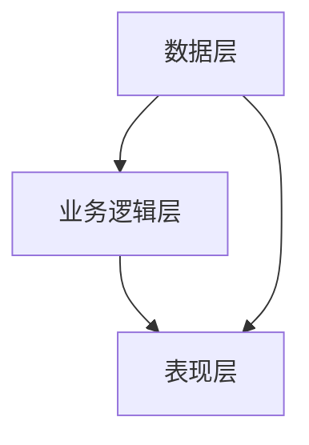
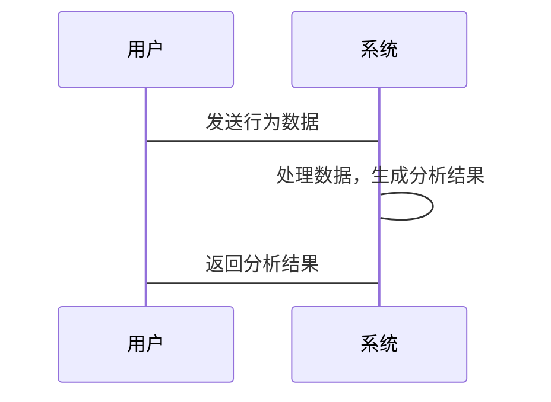

                 


# 金融科技用户行为分析平台

## 关键词：
金融科技、用户行为分析、机器学习、系统架构、数据挖掘、用户画像

## 摘要：
金融科技用户行为分析平台是一种结合了金融技术与用户行为分析的系统，旨在通过分析用户在金融领域的行为数据，提取有价值的信息，从而帮助金融机构优化服务、提高效率和风险控制能力。本文将从背景、核心概念、算法原理、系统架构、项目实战等多方面详细探讨该平台的设计与实现。

---

# 第一部分: 金融科技用户行为分析平台的背景与概述

## 第1章: 金融科技的发展背景

### 1.1 金融科技的定义与特点
金融科技（FinTech）是指利用现代信息技术对传统金融业务进行创新和优化，从而提高效率、降低成本、改善用户体验的一系列技术与应用。其特点包括：

1. **技术驱动**：依赖大数据、人工智能、区块链等技术。
2. **用户-centric**：以用户需求为核心，提供个性化服务。
3. **创新性**：通过技术手段实现传统金融业务的创新。
4. **安全性**：金融数据的处理需要极高的安全性保障。

### 1.2 用户行为分析的重要性
用户行为分析是通过收集和分析用户在产品或服务中的行为数据，了解用户的偏好、需求和行为模式，从而优化产品设计和用户体验。在金融科技领域，用户行为分析具有以下重要意义：

1. **精准营销**：通过分析用户行为，识别潜在客户，制定精准的营销策略。
2. **风险管理**：通过分析用户行为数据，识别异常行为，防范金融风险。
3. **服务优化**：通过了解用户需求，优化服务流程，提高用户满意度。

### 1.3 金融科技用户行为分析平台的目标与价值
金融科技用户行为分析平台的目标是通过收集、处理和分析用户的金融行为数据，为金融机构提供用户画像、行为预测、风险评估等支持，从而提升金融机构的竞争力。

其价值主要体现在以下几个方面：

1. **提高客户满意度**：通过个性化服务，提升用户体验。
2. **降低运营成本**：通过自动化分析，减少人工干预。
3. **增强风险管理能力**：通过识别异常行为，降低金融风险。

---

## 第2章: 核心概念与联系

### 2.1 核心概念原理
#### 2.1.1 数据采集与处理
数据采集是用户行为分析的基础，主要包括以下几种方式：

1. **日志数据**：记录用户在系统中的操作行为，如点击、登录、交易等。
2. **用户调查**：通过问卷、访谈等方式收集用户反馈。
3. **第三方数据**：利用外部数据源，如社交媒体、征信机构等，获取用户信息。

数据处理包括数据清洗、数据转换、数据集成等步骤，确保数据的完整性和一致性。

#### 2.1.2 用户画像与行为建模
用户画像是基于用户的行为数据，构建的用户特征描述。常见的用户画像构建方法包括：

1. **聚类分析**：将用户分为不同的群组，每个群组代表一类用户特征。
2. **关联规则挖掘**：发现用户行为中的关联规则，如“购买A产品的用户通常也会购买B产品”。

行为建模是通过机器学习算法，对用户行为进行建模，预测用户的未来行为。常用的算法包括决策树、随机森林、神经网络等。

#### 2.1.3 数据分析与挖掘
数据分析与挖掘是通过对用户行为数据的分析，提取有价值的信息。常见的分析方法包括：

1. **描述性分析**：总结用户的基本特征和行为模式。
2. **预测性分析**：预测用户的未来行为，如用户流失预测、交易预测等。
3. **诊断性分析**：分析用户行为背后的原因，如用户流失的原因分析。

### 2.2 核心概念对比表
以下是对用户行为分析中几个核心概念的对比：

| 概念 | 定义 | 特点 | 应用场景 |
|------|------|------|----------|
| 数据采集 | 收集用户行为数据 | 实时性、多样性 | 用户行为分析、实时监控 |
| 用户画像 | 基于数据构建的用户特征描述 | 细致性、动态性 | 精准营销、个性化推荐 |
| 行为建模 | 对用户行为进行建模和预测 | 可解释性、可扩展性 | 风险控制、用户预测 |

### 2.3 ER实体关系图架构
以下是用户行为分析平台的实体关系图：

```mermaid
erd
    user_table [用户表]
    behavior_log [行为日志表]
    user_profile [用户画像表]
    transaction_record [交易记录表]
    
    user_table --> behavior_log
    user_table --> user_profile
    behavior_log --> transaction_record
```

---

## 第3章: 金融科技用户行为分析平台的系统架构设计

### 3.1 系统功能模块设计
系统功能模块包括以下几个部分：

1. **数据采集模块**：负责采集用户行为数据。
2. **数据处理模块**：对数据进行清洗、转换和集成。
3. **行为分析模块**：基于机器学习算法，对用户行为进行建模和预测。
4. **用户画像模块**：构建用户画像，支持精准营销和个性化推荐。
5. **结果展示模块**：将分析结果以可视化的方式展示给用户。

### 3.2 系统架构设计
系统架构采用分层架构，包括数据层、业务逻辑层和表现层。



### 3.3 接口设计与交互流程
系统接口设计包括以下几个部分：

1. **数据采集接口**：用于接收用户行为数据。
2. **分析结果接口**：用于返回分析结果。
3. **用户画像接口**：用于获取用户画像信息。

交互流程如下：



---

## 第4章: 项目实战

### 4.1 环境搭建
项目实战需要以下环境：

1. **开发工具**：Python、Jupyter Notebook
2. **数据库**：MySQL、MongoDB
3. **机器学习库**：Scikit-learn、XGBoost
4. **可视化工具**：Matplotlib、Seaborn

### 4.2 核心功能实现

#### 4.2.1 数据采集与处理
代码示例：

```python
import pandas as pd
import numpy as np

# 数据采集
data = pd.read_csv('user_behavior.csv')

# 数据清洗
data.dropna(inplace=True)
data = data[~data.duplicated()]

# 数据转换
data['timestamp'] = pd.to_datetime(data['timestamp'])
```

#### 4.2.2 用户画像构建
代码示例：

```python
from sklearn.cluster import KMeans

# 数据预处理
X = data[['age', 'gender', 'income']].values

# 聚类分析
kmeans = KMeans(n_clusters=3)
kmeans.fit(X)
clusters = kmeans.predict(X)

# 用户画像
user_profile = data[['user_id', 'age', 'gender', 'income', 'clusters']].copy()
```

#### 4.2.3 行为建模与预测
代码示例：

```python
from sklearn.ensemble import RandomForestClassifier

# 数据分割
X_train, X_test, y_train, y_test = train_test_split(X, y, test_size=0.2)

# 建立模型
model = RandomForestClassifier(n_estimators=100)
model.fit(X_train, y_train)

# 模型评估
accuracy = model.score(X_test, y_test)
print(f'模型准确率：{accuracy}')
```

---

## 第5章: 最佳实践与注意事项

### 5.1 小结
金融科技用户行为分析平台通过分析用户行为数据，为金融机构提供用户画像、行为预测等支持，从而提升金融机构的竞争力。本文从背景、核心概念、系统架构到项目实战，详细探讨了该平台的设计与实现。

### 5.2 注意事项
1. **数据隐私保护**：用户行为数据涉及用户隐私，需严格遵守相关法律法规。
2. **模型可解释性**：行为分析模型需具备较高的可解释性，便于业务人员理解和使用。
3. **系统安全性**：用户行为分析平台需具备较高的安全性，防止数据泄露和攻击。

### 5.3 拓展阅读
1. 《机器学习实战》
2. 《数据挖掘导论》
3. 《FinTech: 颠覆性创新与金融服务的未来》

---

通过本文的详细讲解，读者可以全面了解金融科技用户行为分析平台的设计与实现，并能够根据实际需求进行相应的优化和扩展。

