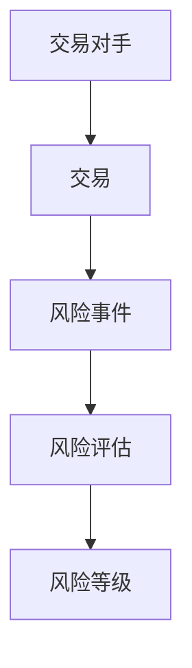
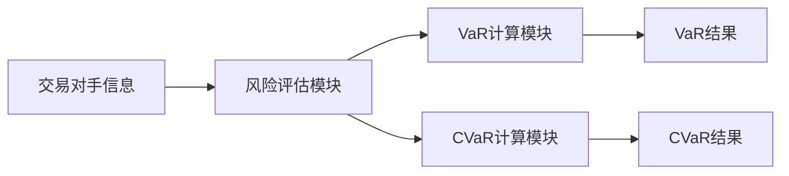
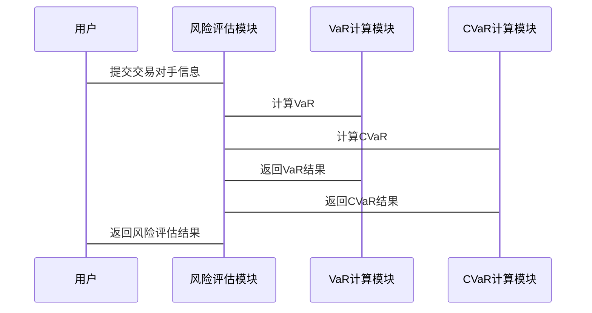

                 


# 《金融衍生品交易对手风险评估》

---

## 关键词：
金融衍生品、交易对手风险、VaR、CVaR、蒙特卡洛模拟

---

## 摘要：
本文详细探讨了金融衍生品交易中的交易对手风险评估方法，从核心概念、算法原理到系统架构设计，逐步分析了如何通过数学模型和实际案例来评估和管理交易对手风险。文章不仅介绍了VaR和CVaR等常用风险度量模型，还结合蒙特卡洛模拟方法，展示了如何在复杂金融环境中进行风险预测和控制。通过系统化的分析与实战案例，本文为金融机构提供了有效的风险评估策略和实施路径。

---

## 正文：

### 第一部分：金融衍生品交易对手风险评估概述

#### 第1章：金融衍生品与交易对手风险概述

##### 1.1 金融衍生品的基本概念
###### 1.1.1 金融衍生品的定义与分类
金融衍生品（Financial Derivatives）是基于基础资产（如股票、债券、商品等）的金融工具，其价值来源于基础资产的价格波动。衍生品主要包括期货、期权、互换和远期合约等类型。

###### 1.1.2 金融衍生品的主要类型
- **期货合约**：约定在未来某一时间以预定价格买卖资产的标准化合约。
- **期权合约**：买方有权在特定时间内以行权价格买入或卖出资产的权利。
- **互换合约**：双方约定在未来按约定的方式交换现金流。
- **远期合约**：非标准化的私人协议，约定在未来某一时间买卖资产。

###### 1.1.3 金融衍生品的市场特点
- 高杠杆性：衍生品通常具有杠杆效应，小的市场波动可能导致较大的收益或损失。
- 高风险性：衍生品价格波动大，且复杂性高，容易引发系统性风险。
- 多样性：衍生品种类繁多，适用不同市场环境和投资者需求。

##### 1.2 交易对手风险的定义与特征
###### 1.2.1 交易对手风险的定义
交易对手风险（Counterparty Risk）是指在金融交易中，交易对手方无法履行合同义务，导致交易失败或损失的风险。

###### 1.2.2 交易对手风险的核心要素
- **信用风险**：交易对手因信用问题无法履行合约义务。
- **市场风险**：市场价格波动导致交易对手违约。
- **操作风险**：交易执行过程中的失误或欺诈行为。

###### 1.2.3 交易对手风险的分类与影响
- **结算风险**：交易对手在结算过程中违约的风险。
- **价差风险**：因市场价格波动导致交易对手需要支付更多资金的风险。
- **法律风险**：因法律变更或合同纠纷导致的风险。

##### 1.3 交易对手风险评估的重要性
###### 1.3.1 风险评估在金融衍生品交易中的作用
- 通过评估交易对手的信用状况，选择合适的交易对手。
- 量化交易对手风险，制定风险对冲策略。

###### 1.3.2 交易对手风险对金融机构的影响
- 可能导致直接的经济损失。
- 影响金融机构的声誉和市场地位。
- 可能引发系统性金融风险。

###### 1.3.3 风险评估的必要性与边界
- 必要性：金融机构需要通过风险评估来控制交易风险。
- 边界：风险评估仅能提供参考，不能完全消除风险。

---

#### 第2章：交易对手风险评估的核心概念与联系

##### 2.1 核心概念原理
###### 2.1.1 信用风险与市场风险的关联
- 信用风险是交易对手因自身信用问题违约的风险。
- 市场风险是市场价格波动导致的风险。
- 两者相互影响，共同构成交易对手风险。

###### 2.1.2 交易对手信用风险的评估模型
- **VaR模型**：度量在给定置信水平下，可能的最大损失。
- **CVaR模型**：度量在VaR水平下的平均损失。

###### 2.1.3 风险度量的数学模型
- VaR和CVaR模型是常用的交易对手风险度量工具。

##### 2.2 核心概念属性特征对比表
| **属性**       | **信用风险**               | **市场风险**               |
|----------------|----------------------------|----------------------------|
| 定义           | 交易对手违约风险           | 市场价格波动风险           |
| 主要因素       | 交易对手信用状况           | 市场价格波动               |
| 度量方法       | VaR、CVaR                | VaR、波动率               |
| 影响范围       | 交易对手违约影响           | 市场整体波动影响           |

##### 2.3 ER实体关系图


---

### 第二部分：交易对手风险评估的算法原理

#### 第3章：VaR（Value at Risk）模型

##### 3.1 VaR模型的定义与原理
- VaR模型用于度量在给定置信水平下，资产组合可能遭受的最大损失。
- 公式：$$ VaR = \text{损失的分位数} $$

##### 3.2 VaR模型的计算方法
- **历史模拟法**：基于历史数据计算VaR。
- **方差-协方差法**：假设资产收益服从正态分布，计算VaR。
- **蒙特卡洛模拟法**：通过模拟市场情景计算VaR。

##### 3.3 VaR模型的优缺点
- 优点：简单易懂，计算速度快。
- 缺点：假设资产收益服从正态分布，可能与实际市场不符。

#### 第4章：CVaR（Conditional Value at Risk）模型

##### 4.1 CVaR模型的定义与原理
- CVaR模型用于度量在VaR水平下的平均损失。
- 公式：$$ CVaR = \text{VaR之后的平均损失} $$

##### 4.2 CVaR模型的计算方法
- 基于VaR结果，计算VaR水平下的平均损失。

##### 4.3 CVaR模型的应用场景
- 当需要更精确地度量尾部风险时，使用CVaR模型。

#### 第5章：蒙特卡洛模拟方法

##### 5.1 蒙特卡洛模拟的基本原理
- 通过随机数模拟市场情景，计算资产收益的分布。

##### 5.2 蒙特卡洛模拟在风险评估中的应用
- 模拟不同市场情景，计算VaR和CVaR。

##### 5.3 蒙特卡洛模拟的实现步骤
1. 确定资产收益分布模型。
2. 生成随机数。
3. 计算资产收益。
4. 统计结果，计算VaR和CVaR。

---

### 第三部分：系统分析与架构设计方案

#### 第6章：系统功能设计

##### 6.1 风险评估模块
- 输入交易对手信息。
- 计算VaR和CVaR值。
- 输出风险评估结果。

##### 6.2 系统架构设计


#### 第7章：系统接口设计

##### 7.1 接口描述
- 输入接口：交易对手信息。
- 输出接口：VaR和CVaR结果。

#### 第8章：系统交互设计

##### 8.1 序列图


---

### 第四部分：项目实战

#### 第9章：环境安装与核心代码实现

##### 9.1 环境安装
- Python 3.8+
- NumPy库
- SciPy库
- Matplotlib库

##### 9.2 核心代码实现
```python
import numpy as np
import pandas as pd
from scipy.stats import norm

# 示例数据：资产收益
returns = np.array([0.01, -0.02, 0.03, -0.01, 0.02])

# 计算VaR（95%置信水平）
alpha = 0.95
sorted_returns = np.sort(returns)
n = len(sorted_returns)
index = int(alpha * n)
VaR = -sorted_returns[index]

# 计算CVaR
CVaR = np.mean(sorted_returns[index:])
```

#### 第10章：案例分析与解读

##### 10.1 实际案例分析
- 假设某金融机构持有某资产组合，历史收益数据为：[0.01, -0.02, 0.03, -0.01, 0.02]。
- 计算VaR（95%置信水平）和CVaR。

##### 10.2 代码解读与分析
- VaR值表示在95%置信水平下，最大损失为2%。
- CVaR值表示在VaR水平下的平均损失为1.6%。

---

### 第五部分：总结与最佳实践

#### 第11章：总结与小结

##### 11.1 总结
- 本文详细介绍了金融衍生品交易对手风险评估的方法和流程。
- 通过VaR、CVaR和蒙特卡洛模拟方法，展示了如何量化交易对手风险。

##### 11.2 小结
- 风险评估是金融机构管理交易对手风险的重要工具。
- 通过科学的方法和工具，可以有效降低交易对手风险。

---

#### 第12章：注意事项与拓展阅读

##### 12.1 注意事项
- 风险评估结果仅供参考，不能完全消除风险。
- 需要结合实际情况调整模型参数。

##### 12.2 拓展阅读
- 推荐阅读《金融风险管理》（John C. Hull 著）。
- 关注金融衍生品市场的最新动态和监管政策。

---

### 结语：
通过本文的系统化分析与实战案例，读者可以全面掌握金融衍生品交易对手风险评估的核心方法和技巧，为金融机构的风险管理提供有力支持。

