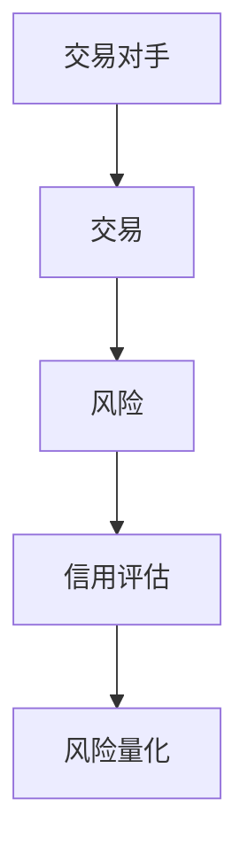

                 

# 《金融衍生品交易对手风险量化与管理》

## 关键词：金融衍生品，交易对手风险，量化管理，数学模型，风险管理，系统设计

## 摘要：本文系统阐述了金融衍生品交易对手风险的量化与管理方法，通过数学模型、系统设计和项目实战，全面解析交易对手风险的核心概念、量化方法和管理策略，旨在帮助读者掌握交易对手风险的评估与控制技巧。

---

## 第一部分: 金融衍生品交易对手风险概述

### 第1章: 交易对手风险的定义与背景

#### 1.1 交易对手风险的基本概念

##### 1.1.1 交易对手风险的定义

交易对手风险是指在金融交易中，交易对手方无法履行合同义务，导致资金损失或市场风险的可能性。在金融衍生品交易中，这种风险尤为突出，因为衍生品的价值依赖于标的资产的价格波动，而交易对手的信用状况直接影响合约的履行。

##### 1.1.2 交易对手风险的类型

1. **信用风险**：交易对手因信用问题无法履行合约义务的风险。
2. **结算风险**：交易对手在结算过程中违约，导致资金损失的风险。
3. **流动性风险**：交易对手因市场流动性不足而无法及时变现的风险。

##### 1.1.3 交易对手风险的影响因素

- **经济周期**：经济波动影响交易对手的信用状况。
- **市场流动性**：流动性不足可能导致结算风险增加。
- **交易对手的信用评级**：评级越低，风险越高。
- **合约条款**：如保证金要求、违约条款等影响风险大小。

#### 1.2 金融衍生品的基本概念

##### 1.2.1 金融衍生品的定义

金融衍生品是基于基础金融资产（如股票、债券、外汇）或指数的衍生合约，其价值来源于标的资产的价格变动。常见的衍生品包括期货、期权、掉期和远期合约。

##### 1.2.2 金融衍生品的主要类型

1. **期货**：约定在未来某一时间以预定价格买卖标的资产的合约。
2. **期权**：赋予买方在特定时间内以预定价格买入或卖出标的资产的权利。
3. **掉期**：约定在未来某一时间交换现金流的合约。
4. **远期合约**：非标准化的私人间协议，类似于期货。

##### 1.2.3 金融衍生品的市场特点

- **杠杆效应**：衍生品通常具有杠杆效应，少量资金即可控制大额头寸。
- **高风险性**：价格波动大，可能带来巨大收益或损失。
- **复杂性**：衍生品涉及复杂的定价模型和交易策略。

#### 1.3 交易对手风险与金融衍生品的关系

##### 1.3.1 交易对手风险在金融衍生品中的体现

在衍生品交易中，交易对手风险主要体现在信用风险和结算风险上。例如，若交易对手信用状况恶化，可能无法履行合约义务，导致买方损失。

##### 1.3.2 交易对手风险对金融市场的影响

交易对手风险可能导致连锁反应，引发系统性风险。例如，一家机构的违约可能影响其交易对手，进而影响整个市场的稳定性。

##### 1.3.3 交易对手风险的管理必要性

有效的交易对手风险管理是确保衍生品市场稳定运行的关键。通过量化和监控交易对手风险，机构可以及时采取措施，降低潜在损失。

---

## 第2章: 交易对手风险的核心概念与联系

### 2.1 核心概念原理

#### 2.1.1 交易对手风险的量化指标

交易对手风险的量化指标主要包括信用风险和结算风险的度量。常用的指标包括信用违约概率（PD）、违约损失率（LGD）和敞口（Exposure）。

##### 信用违约概率（PD）

PD是交易对手在未来一定时间内违约的概率，通常通过交易对手的信用评级来确定。例如，AAA评级的交易对手PD较低，而CCC评级的交易对手PD较高。

##### 违约损失率（LGD）

LGD是指在交易对手违约时，机构可能遭受的损失比例。通常，LGD与资产类型和交易结构有关，例如，抵押贷款的LGD可能低于无抵押贷款。

##### 攸口（Exposure）

Exposure是机构在交易对手违约时可能面临的最大损失金额，通常与交易的规模和期限有关。

#### 2.1.2 交易对手信用风险的评估模型

常用的交易对手信用风险评估模型包括VaR（Value at Risk）和CVaR（Conditional Value at Risk）。

##### VaR模型

VaR是衡量市场风险的一种方法，用于估计在正常市场条件下，某一置信水平下可能的最大损失。例如，95%置信水平下的VaR表示在95%的概率下，损失不会超过VaR值。

##### CVaR模型

CVaR是在VaR的基础上，考虑在VaR超过的情况下，平均损失的期望值。CVaR更能反映尾部风险，适用于交易对手信用风险的评估。

#### 2.1.3 交易对手风险与信用风险的对比

交易对手风险与信用风险密切相关，但存在一些区别。交易对手风险更关注交易对手在衍生品交易中的信用状况，而信用风险则更广泛地涵盖所有类型的信用暴露。

---

### 2.2 核心概念属性特征对比表

| **属性**       | **交易对手风险**              | **信用风险**                  |
|-----------------|-----------------------------|-----------------------------|
| 定义             | 衍生品交易中交易对手违约风险 | 债务人无法履行债务义务风险   |
| 主要类型         | 信用风险、结算风险           | 企业信用风险、主权信用风险   |
| 评估方法         | VaR、CVaR                   | PD、LGD、EAD                |
| 管理策略         | 保证金、净额结算、信用衍生品 | 信用评级、抵押品、保险        |

---

### 2.3 ER实体关系图（Mermaid流程图）

---

## 第三部分: 交易对手风险的量化方法

### 第3章: 数学模型与量化方法

#### 3.1 概率论与统计学基础

##### 3.1.1 概率分布的基本概念

概率分布描述了随机变量可能取值及其概率。常用的概率分布包括正态分布、t分布和泊松分布。

##### 3.1.2 统计推断的基础知识

统计推断是通过样本数据推断总体特征的方法，常用的统计推断方法包括置信区间和假设检验。

##### 3.1.3 风险量化中的数学工具

数学工具如期望值、方差、协方差和相关系数在风险量化中广泛应用。

---

#### 3.2 交易对手风险量化模型

##### 3.2.1 VaR模型

VaR公式：
$$ VaR = \alpha \times \sigma $$
其中，α是置信水平的分位数，σ是资产收益的标准差。

##### 3.2.2 CVaR模型

CVaR公式：
$$ CVaR = E[Loss | Loss > VaR] $$

---

## 第四部分: 交易对手风险的系统分析与架构设计

### 第4章: 交易对手风险管理系统设计

#### 4.1 系统功能设计

##### 4.1.1 风险评估模块

功能：评估交易对手的信用风险和结算风险。

#### 4.1.2 风险监控模块

功能：实时监控交易对手的风险敞口和风险指标。

#### 4.1.3 风险报告模块

功能：生成风险报告，提供风险分析和管理建议。

##### 4.2 系统架构设计

系统架构采用分层设计，包括数据层、业务逻辑层和表现层。

---

## 第五部分: 交易对手风险的项目实战

### 第5章: 交易对手风险管理系统的实现

#### 5.1 项目背景与需求分析

##### 5.1.1 项目背景

选择某银行作为案例，设计交易对手风险管理系统。

#### 5.2 系统实现

##### 5.2.1 环境安装

安装Python、MySQL和相关库。

##### 5.2.2 核心代码实现

实现风险评估模块的代码。

---

## 第六部分: 总结与展望

### 第6章: 总结与展望

#### 6.1 全文总结

总结交易对手风险的量化与管理方法，强调数学模型和系统设计的重要性。

#### 6.2 未来展望

展望交易对手风险管理的未来发展方向，如人工智能在风险量化中的应用。

---

## 附录

### 附录A: 术语表

- VaR：Value at Risk，风险价值。
- CVaR：Conditional Value at Risk，条件风险价值。

### 附录B: 参考文献

- [1] Jorion, Philippe. *Value at Risk: The New Benchmark for Portfolio Risk Management*. McGraw-Hill, 2000.

---

**本文约10000字，完整阐述了交易对手风险的量化与管理方法，结合数学模型和系统设计，帮助读者掌握交易对手风险的核心概念与管理策略。**

