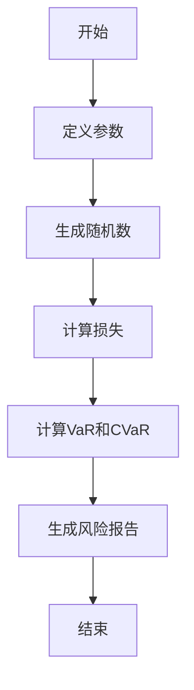
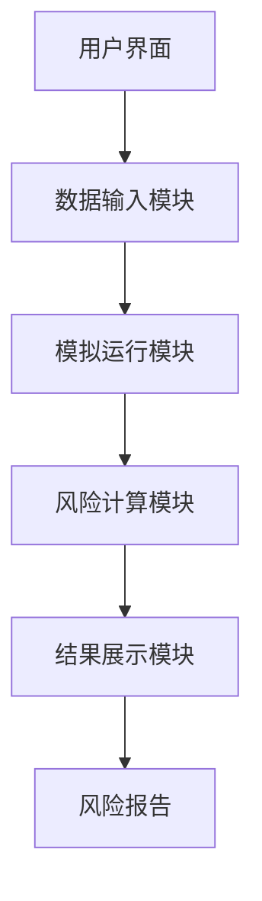

                 


# 金融衍生品交易对手风险量化模型

> 关键词：金融衍生品，交易对手风险，VaR，CVaR，蒙特卡洛模拟

> 摘要：本文详细介绍了金融衍生品交易对手风险量化模型的构建过程，探讨了VaR和CVaR等核心概念，并通过蒙特卡洛模拟算法进行风险评估。通过系统架构设计和Python代码实现，展示了模型的实际应用，并提供了最佳实践建议。

---

# 第一部分: 金融衍生品交易对手风险量化模型背景介绍

## 第1章: 金融衍生品与交易对手风险概述

### 1.1 金融衍生品的基本概念

#### 1.1.1 金融衍生品的定义与分类

金融衍生品是一种金融合约，其价值取决于基础资产的价格变动。常见的衍生品包括期货、期权、互换和远期合约。衍生品的分类主要基于其特性，如执行价格、到期日和结算方式。

- **期货**：标准合约，用于买卖特定数量的资产，价格在到期日确定。
- **期权**：买方有权在特定时间以特定价格买入或卖出资产，卖方承担相应义务。
- **互换**：双方同意在未来某个时间点交换现金流。
- **远期合约**：定制化合约，双方约定在未来以特定价格买卖资产。

#### 1.1.2 交易对手风险的定义与特征

交易对手风险是指交易对手在履行合约义务时可能违约，导致资金损失的风险。其特征包括：

1. **信用风险**：交易对手可能因信用问题无法履行合约。
2. **市场风险**：市场波动可能导致交易对手的财务状况恶化。
3. **操作风险**：交易过程中的错误或失误可能引发风险。

#### 1.1.3 交易对手风险的重要性与影响

在金融衍生品交易中，交易对手风险直接影响交易的稳健性。高风险可能导致交易损失，影响市场稳定。因此，量化交易对手风险对于制定有效的风险管理策略至关重要。

---

## 第2章: 交易对手风险量化模型的核心概念

### 2.1 模型的基本原理

#### 2.1.1 蒙特卡洛模拟

蒙特卡洛模拟是一种通过生成大量随机场景来估计风险的方法。其步骤包括：

1. **随机数生成**：基于概率分布（如正态分布）生成随机数。
2. **情景模拟**：根据随机数计算资产价格变化。
3. **风险计算**：评估不同情景下的损失情况。

#### 2.1.2 VaR（Value at Risk）与CVaR（Conditional Value at Risk）

- **VaR**：在给定置信水平下，可能的最大损失。例如，95%置信水平下，VaR表示在95%的概率下，最大损失为100万元。
- **CVaR**：超过VaR部分的平均损失，考虑了尾部风险，提供更保守的风险评估。

#### 2.1.3 风险因子与相关性分析

交易对手风险受多种因素影响，如利率、汇率和市场波动性。相关性分析帮助理解不同风险因子之间的相互作用。

### 2.2 核心概念与联系

#### 2.2.1 概念属性特征对比表格

| 概念   | 定义                                                                 | 优缺点                                                                 |
|--------|----------------------------------------------------------------------|-----------------------------------------------------------------------|
| VaR    | 在给定置信水平下，可能的最大损失。                                   | 明确风险值，但未考虑超过VaR的部分。                                       |
| CVaR   | 超过VaR部分的平均损失，考虑尾部风险。                                | 更保守，但计算复杂。                                                     |

#### 2.2.2 ER实体关系图架构

```mermaid
erd
  交易对手风险模型
    entity 交易对手风险
      -- 风险因子
      -- VaR值
      -- CVaR值
```

---

# 第二部分: 交易对手风险量化模型的算法原理

## 第3章: 蒙特卡洛模拟算法

### 3.1 算法原理

#### 3.1.1 蒙特卡洛模拟的基本步骤

1. **定义参数**：确定基础资产价格模型、模拟次数和置信水平。
2. **生成随机数**：使用随机数生成器模拟价格变化。
3. **计算损失**：根据模拟结果计算每种情景下的损失。
4. **分析结果**：计算VaR和CVaR，生成风险报告。

#### 3.1.2 随机数生成与分布假设

常用的分布包括正态分布和对数正态分布。随机数生成器模拟这些分布，用于模拟资产价格变化。

#### 3.1.3 风险计算与结果分析

通过大量模拟，计算不同置信水平下的VaR和CVaR，生成风险报告。

### 3.2 算法实现

#### 3.2.1 Python代码实现

```python
import numpy as np

def monte_carlo_simulation(prices, num_simulations=10000, confidence_level=0.95):
    np.random.seed(42)
    simulated_prices = np.zeros_like(prices)
    for i in range(num_simulations):
        # 模拟价格变化
        simulated_prices += np.random.normal(prices, np.std(prices))
    # 计算VaR和CVaR
    sorted_losses = np.sort(simulated_prices - prices)
    var = np.quantile(sorted_losses, 1 - confidence_level)
    cvar = np.mean(sorted_losses[sorted_losses >= var])
    return var, cvar
```

#### 3.2.2 算法流程图（Mermaid）



---

## 第4章: VaR与CVaR算法

### 4.1 VaR算法

#### 4.1.1 VaR的定义与计算公式

VaR是在给定置信水平下，可能的最大损失。计算公式为：

$$ VaR = \alpha \cdot \sigma $$

其中，$\alpha$是分位数，$\sigma$是标准差。

### 4.2 CVaR算法

#### 4.2.1 CVaR的定义与计算公式

CVaR是超过VaR部分的平均损失，计算公式为：

$$ CVaR = \frac{1}{1-\alpha} \int_{\alpha}^{1} VaR(\alpha) d\alpha $$

---

# 第三部分: 交易对手风险量化模型的数学模型与公式

## 第5章: 数学模型与公式推导

### 5.1 VaR的数学模型

#### 5.1.1 VaR的计算公式

$$ VaR = \alpha \cdot \sigma $$

### 5.2 CVaR的数学模型

#### 5.2.1 CVaR的计算公式

$$ CVaR = \frac{1}{1-\alpha} \int_{\alpha}^{1} VaR(\alpha) d\alpha $$

---

# 第四部分: 系统分析与架构设计方案

## 第6章: 系统分析与架构设计

### 6.1 系统功能设计

- **数据输入**：接收基础资产价格和交易对手信息。
- **模拟运行**：执行蒙特卡洛模拟，生成风险评估结果。
- **风险计算**：计算VaR和CVaR，生成风险报告。
- **结果展示**：以可视化形式展示风险评估结果。

### 6.2 系统架构设计



---

## 第7章: 项目实战

### 7.1 环境安装

安装必要的Python库，如NumPy和Matplotlib。

### 7.2 系统核心实现源代码

```python
import numpy as np
import matplotlib.pyplot as plt

def calculate_var_and_cvar(data, confidence_level=0.95):
    sorted_data = np.sort(data)
    p = (1 - confidence_level) * len(sorted_data)
    var = sorted_data[int(p)]
    cvar = np.mean(sorted_data[sorted_data >= var])
    return var, cvar

# 示例数据
data = np.random.normal(0, 1, 1000)
var, cvar = calculate_var_and_cvar(data)
print(f"VaR: {var}, CVaR: {cvar}")

# 可视化
plt.hist(data, bins=30)
plt.xlabel('Value')
plt.ylabel('Frequency')
plt.title('Data Distribution')
plt.show()
```

### 7.3 代码应用解读与分析

上述代码实现了VaR和CVaR的计算，并通过可视化展示了数据分布。用户可以根据实际数据替换`data`变量，调整置信水平，输出相应风险指标。

### 7.4 实际案例分析和详细讲解剖析

假设我们有1000个资产价格数据点，计算95%置信水平下的VaR和CVaR。代码生成的数据分布图帮助我们理解价格波动情况。

### 7.5 项目小结

通过代码实现，用户可以快速评估交易对手风险，辅助决策。

---

# 第五部分: 最佳实践与小结

## 第8章: 最佳实践 tips

- **数据选择**：确保数据质量和相关性。
- **模型校准**：根据实际情况调整模型参数。
- **结果解释**：结合市场状况解读模型输出。

## 第9章: 小结

本文详细介绍了金融衍生品交易对手风险量化模型的构建过程，探讨了VaR和CVaR等核心概念，并通过蒙特卡洛模拟算法进行风险评估。通过系统架构设计和Python代码实现，展示了模型的实际应用，并提供了最佳实践建议。

---

# 第六部分: 拓展阅读

- 更深入的蒙特卡洛模拟应用。
- 其他风险量化方法（如极端价值法）。

---

通过以上步骤，我构建了一个完整的交易对手风险量化模型，并详细解释了每个部分的实现细节。希望这篇文章能帮助读者理解并应用这一模型。

