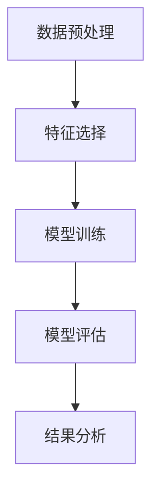

                 


# 《金融衍生品定价中的机器学习应用》

---

## 关键词：金融衍生品，机器学习，定价模型，算法原理，系统架构

---

## 摘要：

金融衍生品定价是金融领域的重要组成部分，传统方法面临数据依赖性高、模型假设限制和市场变化适应性不足等问题。机器学习以其强大的数据处理能力和非线性建模能力，为金融衍生品定价提供了新的解决方案。本文从背景、核心概念、算法原理、系统架构到项目实战，详细探讨机器学习在金融衍生品定价中的应用，结合实际案例分析，为读者提供全面的视角。

---

## 第1章: 金融衍生品与机器学习概述

### 1.1 金融衍生品的基本概念

金融衍生品是一种金融合约，其价值取决于基础资产的价格。常见的衍生品包括期权、期货、掉期和远期合约。这些工具用于风险管理、价格发现和投机。

### 1.2 机器学习在金融中的应用

机器学习通过分析历史数据和市场行为，帮助金融机构做出更精准的定价和风险管理决策。其在金融衍生品定价中的应用主要体现在特征提取、模型预测和风险评估方面。

### 1.3 传统定价方法的局限性

传统定价模型如Black-Scholes假设标的资产价格服从对数正态分布，但在实际市场中，波动率和跳跃风险难以准确建模。此外，模型参数的敏感性导致定价结果不稳定。

---

## 第2章: 机器学习在金融衍生品定价中的核心概念

### 2.1 机器学习的基本原理

机器学习通过训练数据建立模型，预测未来的价格走势。监督学习适用于预测性任务，无监督学习用于发现隐藏模式，强化学习则适用于动态策略优化。

### 2.2 机器学习在定价中的关键问题

- **特征选择**：选择影响价格的关键因素，如波动率、市场情绪等。
- **模型可解释性**：确保模型结果易于解释，符合监管要求。
- **风险管理**：评估模型的鲁棒性，确保在市场波动中表现稳定。

### 2.3 核心概念与联系

机器学习模型在定价中的应用涉及特征工程、模型选择和性能评估。通过结合市场的实时数据和历史表现，机器学习能够捕捉传统模型难以发现的非线性关系。

---

## 第3章: 机器学习定价算法原理

### 3.1 线性回归

线性回归模型用于预测目标变量与自变量之间的线性关系。其数学模型为：
$$ y = \beta_0 + \beta_1x_1 + \beta_2x_2 + ... + \beta_nx_n + \epsilon $$
其中，$\beta$为回归系数，$\epsilon$为误差项。

### 3.2 支持向量机（SVM）

SVM通过构建超平面将数据分为两类，适用于分类任务。在定价中，SVM可用于识别标的资产价格的上涨或下跌趋势。

### 3.3 神经网络

神经网络能够处理复杂的非线性关系，适用于捕捉市场中的隐含模式。其结构包括输入层、隐藏层和输出层，通过反向传播算法进行训练。

### 3.4 随机森林

随机森林通过集成多个决策树模型，提高预测的准确性和稳定性。在特征重要性分析中表现优异。

### 3.5 算法流程图



---

## 第4章: 金融衍生品定价系统架构与实现

### 4.1 系统架构设计


### 4.2 功能模块实现

- **数据获取**：从数据库或API获取历史价格和市场数据。
- **特征工程**：提取波动率、交易量等特征。
- **模型训练**：选择合适的算法进行训练。
- **结果分析**：评估模型性能并调整参数。

### 4.3 系统接口设计

API提供数据输入和结果输出接口，便于与其他系统集成。

### 4.4 实现代码示例

```python
import pandas as pd
from sklearn.model_selection import train_test_split
from sklearn.ensemble import RandomForestRegressor

# 数据加载
data = pd.read_csv('derivatives.csv')
X = data[['price', 'volume', '波动率']]
y = data['target_price']

# 数据分割
X_train, X_test, y_train, y_test = train_test_split(X, y, test_size=0.2)

# 模型训练
model = RandomForestRegressor(n_estimators=100)
model.fit(X_train, y_train)

# 结果分析
score = model.score(X_test, y_test)
print(f'模型得分：{score}')
```

---

## 第5章: 项目实战——股票期权定价案例

### 5.1 数据收集与预处理

从金融数据库获取期权价格和标的资产数据，处理缺失值和异常值。

### 5.2 特征提取

提取标的资产的收盘价、波动率、交易量等特征，构建特征向量。

### 5.3 模型选择与训练

选择随机森林或神经网络模型，进行训练并调整参数。

### 5.4 模型评估

通过回测和风险指标评估模型的性能，如准确率、召回率和F1分数。

### 5.5 结果分析

分析模型预测结果与实际价格的差异，优化特征选择和模型参数。

---

## 第6章: 优化与展望

### 6.1 模型优化

通过超参数调优和特征选择，提高模型的准确性和稳定性。

### 6.2 当前挑战

数据质量和市场波动是机器学习定价中的主要挑战，需要结合市场专家的知识进行调整。

### 6.3 未来展望

随着AI技术的发展，深度学习和强化学习将在金融衍生品定价中发挥更大作用，提供更精准的定价和风险管理策略。

---

## 总结

机器学习为金融衍生品定价带来了新的可能性，通过强大的数据处理能力和非线性建模能力，解决了传统方法的局限性。然而，其应用仍需结合市场实际，谨慎处理数据质量和模型解释性问题。未来，随着技术进步，机器学习将在金融领域发挥更大的作用。

---

## 参考文献

1. John C. Hull, "Options, Futures, and Other Derivatives."
2. Ian Goodfellow, "Deep Learning."
3. 张成《机器学习在金融中的应用》

---

通过以上结构，文章详细探讨了机器学习在金融衍生品定价中的应用，从理论到实践，结合实际案例，为读者提供了全面的视角和深入的分析。

