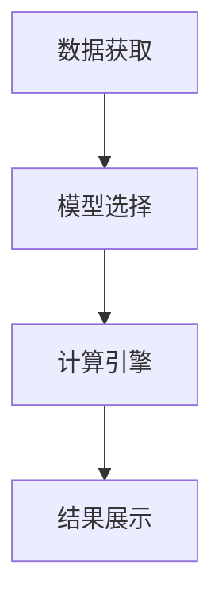
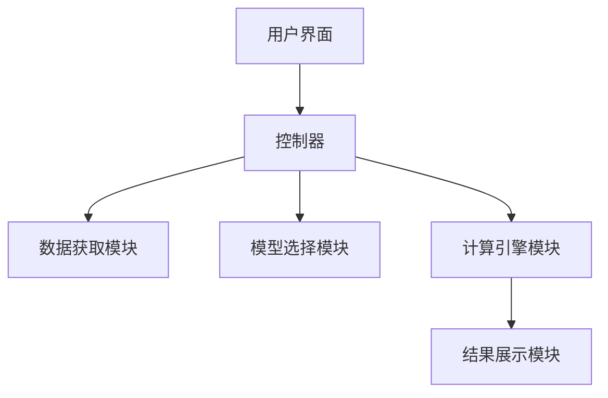
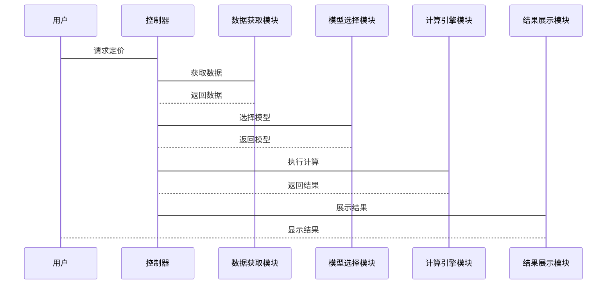

                 


# 《金融衍生品定价模型比较与选择框架》

> 关键词：金融衍生品定价模型、Black-Scholes模型、蒙特卡洛模拟、二叉树模型、数值方法、风险中性定价

> 摘要：本文系统地介绍了金融衍生品定价模型的核心概念、主要分类、算法原理及其数学基础，并通过对比分析不同模型的优缺点，提出了基于场景的定价模型选择框架。文章结合实际案例，详细讲解了Black-Scholes模型、二叉树模型和蒙特卡洛模拟的实现过程，并通过系统架构设计展示了如何构建一个高效的金融衍生品定价系统。最后，本文总结了定价模型选择的关键注意事项和未来研究方向，为金融从业者和研究人员提供了实用的指导和参考。

---

# 第1章: 金融衍生品定价模型概述

## 1.1 金融衍生品的定义与分类

### 1.1.1 金融衍生品的定义
金融衍生品（Financial Derivatives）是指从基础金融资产（如股票、债券、外汇等）派生出来的金融工具。其价值取决于基础资产的价格波动。常见的衍生品包括期权、期货、掉期和互换等。

### 1.1.2 金融衍生品的主要分类
| 分类维度 | 分类类型 | 描述 |
|----------|----------|------|
| 合同性质 | 期权、期货、掉期 | 期权赋予买方在特定时间以特定价格买入或卖出资产的权利；期货是标准化的远期合约；掉期是双方约定在未来交换资产或现金流的协议。 |
| 市场类型 | 股权类、利率类、外汇类 | 根据基础资产的类型分类。 |
| 合约结构 | 看涨期权、看跌期权、认股证 | 根据买方权利的性质分类。 |

### 1.1.3 衍生品市场的基本结构
衍生品市场是一个复杂的金融体系，参与者包括机构投资者、对冲基金和个人投资者。市场的基本结构包括交易所交易和场外交易（OTC）两种形式。

---

## 1.2 金融衍生品定价的基本问题

### 1.2.1 衍生品定价的核心目标
衍生品的定价目标是确定其公平价值，即在无套利的情况下，买方和卖方在公平交易中达成的价格。这一价格反映了市场对风险和流动性的定价。

### 1.2.2 定价中的关键变量与假设
| 变量 | 描述 |
|------|------|
| 标的价格 | 基础资产的价格 |
| 行权价格 | 期权的行权价格 |
| 到期时间 | 期权的到期时间 |
| 无风险利率 | 市场无风险利率 |
| 波动率 | 资产价格的波动性 |
| 交易费用 | 交易中的各项费用 |

### 1.2.3 市场风险与定价模型的关系
定价模型需要考虑市场风险，尤其是波动率对期权价格的影响。Black-Scholes模型通过引入波动率参数，量化了这种风险。

---

## 1.3 定价模型的分类与选择框架

### 1.3.1 主流定价模型的分类
| 模型名称 | 主要应用场景 | 核心假设 |
|----------|--------------|----------|
| Black-Scholes模型 | 单资产期权定价 | 市场无摩擦、波动率恒定、标的资产价格服从几何布朗运动 |
| 二叉树模型 | 美式期权定价 | 标的资产价格在离散时间点上跳跃式变化 |
| 蒙特卡洛模拟 | 复杂衍生品定价 | 适用于高维问题，如多资产期权 |

### 1.3.2 不同模型的适用场景
| 场景 | 推荐模型 |
|------|----------|
| 单资产欧式期权 | Black-Scholes模型 |
| 美式期权 | 二叉树模型 |
| 高维问题（如多资产期权） | 蒙特卡洛模拟 |

### 1.3.3 模型选择的框架与流程
1. 确定衍生品类型和结构。
2. 分析市场环境和数据可用性。
3. 评估模型的假设和限制。
4. 比较不同模型的计算效率和准确性。
5. 选择最适合当前场景的模型。

---

## 1.4 本章小结
本章介绍了金融衍生品的定义、分类和市场结构，并分析了定价模型的核心目标和关键变量。最后，提出了基于场景的模型选择框架，为后续章节的模型比较奠定了基础。

---

# 第2章: 金融衍生品定价模型的核心概念与联系

## 2.1 随机过程与金融市场的基本特征

### 2.1.1 随机过程的定义与分类
随机过程是描述随机变量随时间演变的数学模型。在金融市场中，常用布朗运动和随机微分方程（SDE）来描述资产价格的波动。

### 2.1.2 Brown运动与随机微分方程
Brown运动是一种连续时间、连续状态的随机过程，常用于描述资产价格的随机波动。随机微分方程（SDE）是描述随机过程的数学工具，其一般形式为：
$$ dS_t = \mu dt + \sigma dW_t $$
其中，$S_t$ 是资产价格，$\mu$ 是期望回报率，$\sigma$ 是波动率，$dW_t$ 是布朗运动的增量。

### 2.1.3 金融市场价格的随机性特征
资产价格的随机性是衍生品定价的基础。波动率是衡量价格波动程度的重要参数，通常通过历史数据或隐含波动率来估计。

---

## 2.2 风险中性定价原理

### 2.2.1 风险中性测度的定义
风险中性测度是一种概率测度，使得在该测度下，资产的期望回报率等于无风险利率。通过风险中性定价，可以消除市场对风险的偏好。

### 2.2.2 风险中性定价的核心公式
在风险中性测度下，期权的期望值可以表示为：
$$ C = e^{-rT} \mathbb{E}^Q [max(S_T - K, 0)] $$
其中，$C$ 是期权的价格，$r$ 是无风险利率，$T$ 是到期时间，$K$ 是行权价格，$\mathbb{E}^Q$ 是风险中性测度下的期望值。

### 2.2.3 风险中性定价的应用场景
风险中性定价适用于期权定价，尤其是欧式期权。通过这种方法，可以将期权价格与标的资产的价格波动解耦。

---

## 2.3 无套利定价原理

### 2.3.1 套利机会的定义与消除
套利机会是指在无风险的情况下，通过买入低价资产和卖出高价资产，获得无风险利润的机会。无套利定价通过消除套利机会，确保市场定价的公平性。

### 2.3.2 无套利定价的核心原理
无套利定价基于市场不存在套利机会的假设。通过构建对冲组合，可以消除特定风险，从而确定衍生品的公平价格。

### 2.3.3 无套利定价与风险中性定价的关系
无套利定价是风险中性定价的基础。在无套利市场中，风险中性测度可以用来消除风险偏好，从而实现公平定价。

---

## 2.4 核心概念对比分析

### 2.4.1 不同定价模型的对比表格
| 模型名称 | 核心假设 | 适用场景 | 优点 | 缺点 |
|----------|----------|----------|------|------|
| Black-Scholes | 市场无摩擦、波动率恒定 | 欧式期权 | 计算简便、准确 | 适用于单资产 |
| 二叉树模型 | 离散时间跳跃 | 美式期权 | 灵活、易于实现 | 计算效率低 |
| 蒙特卡洛模拟 | 高维问题、复杂场景 | 多资产期权 | 适用于复杂场景 | 计算成本高 |

### 2.4.2 核心概念的ER实体关系图
```mermaid
erd
    title 核心概念关系图
    Auction(衍生品)
    has_many -> Asset(基础资产)
    Auction has_many -> Option(期权)
    Option has_many -> Strike_Price(行权价格)
    Auction has_many -> Market_Risk(市场风险)
    Market_Risk has_many -> Volatility(波动率)
```

---

## 2.5 本章小结
本章详细介绍了随机过程、风险中性定价和无套利定价的核心概念，并通过对比分析不同定价模型的优缺点，为后续的模型选择提供了理论基础。

---

# 第3章: 金融衍生品定价模型的算法原理

## 3.1 Black-Scholes模型

### 3.1.1 模型的数学公式与推导
Black-Scholes模型的期权定价公式为：
$$ C = S_0 N(d_1) - K e^{-rT} N(d_2) $$
其中，
$$ d_1 = \frac{\ln(S_0/K) + (r + \frac{\sigma^2}{2})T}{\sigma \sqrt{T}} $$
$$ d_2 = d_1 - \sigma \sqrt{T} $$
$N(d)$ 是标准正态分布的累积分布函数。

### 3.1.2 模型的适用条件与限制
Black-Scholes模型假设市场无摩擦、波动率恒定、标的资产价格服从几何布朗运动。这些假设在实际中可能不成立，尤其是在市场存在跳跃性波动时。

### 3.1.3 模型的实现与代码示例
```python
import numpy as np
from scipy.stats import norm

def black_scholes(S, K, r, T, sigma):
    """
    计算欧式期权的价格。
    参数：
    S: 标的价格
    K: 行权价格
    r: 无风险利率
    T: 到期时间（年）
    sigma: 波动率
    返回值：
    期权价格
    """
    d1 = (np.log(S/K) + (r + sigma**2/2)*T) / (sigma*np.sqrt(T))
    d2 = d1 - sigma*np.sqrt(T)
    C = S*norm.cdf(d1) - K*np.exp(-r*T)*norm.cdf(d2)
    return C

# 示例
S = 100
K = 105
r = 0.05
T = 1
sigma = 0.2
print(black_scholes(S, K, r, T, sigma))
```

---

## 3.2 二叉树模型

### 3.2.1 模型的基本原理
二叉树模型通过构建资产价格的二叉树，模拟资产价格在每个时间步的上行和下行概率。模型假设资产价格在离散时间点上跳跃式变化。

### 3.2.2 模型的实现步骤
1. 确定时间步长和步数。
2. 计算上行和下行因子。
3. 构建资产价格二叉树。
4. 计算期权的内在价值。
5. 向回推算期权价格。

### 3.2.3 模型与Black-Scholes模型的对比
二叉树模型适用于美式期权，但计算效率较低。Black-Scholes模型适用于欧式期权，计算效率高但假设较严格。

---

## 3.3 蒙特卡洛模拟方法

### 3.3.1 蒙特卡洛模拟的基本原理
蒙特卡洛模拟通过多次随机采样，估计期权的期望值。模型通常假设标的资产价格服从几何布朗运动。

### 3.3.2 蒙特卡洛模拟的实现步骤
1. 确定随机变量的分布和参数。
2. 生成大量随机数。
3. 计算每条路径下的期权 payoff。
4. 计算 payoff 的期望值并折现。

### 3.3.3 蒙特卡洛模拟的应用场景
蒙特卡洛模拟适用于复杂衍生品定价，尤其是高维问题和路径依赖期权。

---

## 3.4 数值方法与模型选择

### 3.4.1 常用数值方法的比较
| 方法 | 优点 | 缺点 |
|------|------|------|
| 二叉树模型 | 简单易懂 | 计算效率低 |
| 蒙特卡洛模拟 | 适用于复杂问题 | 计算成本高 |
| Black-Scholes模型 | 计算效率高 | 适用性有限 |

### 3.4.2 数值方法的优缺点分析
二叉树模型适用于美式期权，但计算效率较低；蒙特卡洛模拟适用于高维问题，但计算成本高；Black-Scholes模型适用于欧式期权，计算效率高但假设严格。

### 3.4.3 数值方法在实际定价中的应用
在实际定价中，应根据具体场景选择合适的数值方法。例如，在单资产欧式期权定价中，优先选择Black-Scholes模型；在美式期权定价中，优先选择二叉树模型。

---

## 3.5 本章小结
本章详细介绍了Black-Scholes模型、二叉树模型和蒙特卡洛模拟的算法原理，并通过对比分析，提出了基于场景的数值方法选择框架。

---

# 第4章: 金融衍生品定价模型的数学基础

## 4.1 随机微分方程(SDE)

### 4.1.1 SDE的定义与基本形式
随机微分方程是描述随机过程的数学工具，其一般形式为：
$$ dX_t = \mu(t, X_t) dt + \sigma(t, X_t) dW_t $$
其中，$X_t$ 是随机过程，$\mu$ 是漂移系数，$\sigma$ 是扩散系数，$dW_t$ 是布朗运动的增量。

### 4.1.2 SDE的解法与应用
SDE的解法通常采用伊藤引理，通过对随机过程进行积分变换，求解其解析解或数值解。

### 4.1.3 SDE在金融衍生品定价中的作用
SDE是衍生品定价的数学基础，用于描述标的资产价格的随机波动。

---

## 4.2 蒙特卡洛模拟的数学模型

### 4.2.1 蒙特卡洛模拟的数学基础
蒙特卡洛模拟通过随机采样，估计期权 payoff 的期望值。其数学基础包括概率论和统计推断。

### 4.2.2 蒙特卡洛模拟的收敛性分析
蒙特卡洛模拟的收敛性与样本数量和方差相关。通常，增加样本数量可以提高估计的精度。

### 4.2.3 蒙特卡洛模拟的误差估计
蒙特卡洛模拟的误差可以通过标准误差和置信区间来估计。

---

## 4.3 数值方法的数学实现

### 4.3.1 二叉树模型的数学推导
二叉树模型通过构建资产价格的二叉树，模拟资产价格的上行和下行路径。其数学推导基于马柯夫假设，即未来价格仅依赖当前价格。

### 4.3.2 有限差分法的数学基础
有限差分法通过将偏微分方程离散化，求解期权定价问题。其数学基础包括差分方程和网格划分。

### 4.3.3 有限元方法的数学实现
有限元方法通过将问题空间划分为小区域，求解每个区域的微分方程。其数学实现较为复杂，但适用于复杂边界条件。

---

## 4.4 本章小结
本章详细介绍了衍生品定价模型的数学基础，包括随机微分方程、蒙特卡洛模拟和数值方法的数学实现。

---

# 第5章: 金融衍生品定价系统的系统架构设计

## 5.1 系统功能设计

### 5.1.1 系统功能模块划分
| 模块 | 功能描述 |
|------|----------|
| 数据获取模块 | 从数据源获取标的资产价格和市场数据 |
| 模型选择模块 | 根据需求选择合适的定价模型 |
| 计算引擎模块 | 实现模型的数值计算 |
| 结果展示模块 | 展示期权价格和风险分析结果 |

### 5.1.2 系统功能流程图


---

## 5.2 系统架构设计

### 5.2.1 系统架构图


### 5.2.2 系统交互序列图


---

## 5.3 系统接口设计

### 5.3.1 数据接口
| 接口名称 | 接口描述 | 输入参数 | 输出参数 |
|----------|----------|----------|----------|
| GetData | 获取标的资产价格 | 资产代码、时间范围 | 资产价格序列 |

### 5.3.2 计算接口
| 接口名称 | 接口描述 | 输入参数 | 输出参数 |
|----------|----------|----------|----------|
| PriceOption | 计算期权价格 | 标的价格、行权价格、到期时间、波动率 | 期权价格 |

---

## 5.4 本章小结
本章详细设计了金融衍生品定价系统的系统架构，包括功能模块划分、系统架构图和系统接口设计。

---

# 第6章: 项目实战——基于Python的金融衍生品定价系统

## 6.1 环境安装与配置

### 6.1.1 Python环境的安装
安装Python 3.8及以上版本，并安装必要的库：
```bash
pip install numpy scipy matplotlib pandas
```

### 6.1.2 依赖库的安装
安装定量金融分析库：
```bash
pip install yfinance pyquant
```

---

## 6.2 系统核心实现

### 6.2.1 数据获取模块
```python
import yfinance as yf

def get_stock_data(ticker, start_date, end_date):
    data = yf.download(ticker, start=start_date, end=end_date)
    return data['Adj Close']
```

### 6.2.2 模型选择模块
```python
def select_model(option_type, is american):
    if option_type == ' european' and not american:
        return 'black_scholes'
    elif option_type == 'american' and american:
        return 'binomial_tree'
    else:
        return 'monte_carlo'
```

### 6.2.3 计算引擎模块
```python
def black_scholes(S, K, r, T, sigma):
    d1 = (np.log(S/K) + (r + sigma**2/2)*T) / (sigma*np.sqrt(T))
    d2 = d1 - sigma*np.sqrt(T)
    C = S*norm.cdf(d1) - K*np.exp(-r*T)*norm.cdf(d2)
    return C
```

### 6.2.4 结果展示模块
```python
import matplotlib.pyplot as plt

def plot_option_price(prices):
    plt.plot(range(len(prices)), prices)
    plt.title('Option Price Analysis')
    plt.xlabel('Time')
    plt.ylabel('Price')
    plt.show()
```

---

## 6.3 代码实现与解读

### 6.3.1 数据获取与预处理
```python
# 示例代码
import pandas as pd
import numpy as np

# 获取数据
data = get_stock_data('AAPL', '2020-01-01', '2023-12-31')
```

### 6.3.2 模型选择与实现
```python
# 示例代码
option_type = 'european'
american = False
model = select_model(option_type, american)
# 调用定价模型
price = black_scholes(data[-1], 100, 0.05, 1, 0.2)
```

### 6.3.3 结果展示
```python
# 示例代码
plot_option_price([price])
```

---

## 6.4 实际案例分析

### 6.4.1 案例背景
假设我们要定价一个标的资产为苹果股票（AAPL）的欧式期权，行权价格为100美元，到期时间为1年，波动率为20%。

### 6.4.2 数据获取与处理
```python
data = get_stock_data('AAPL', '2022-01-01', '2023-12-31')
S = data.iloc[-1]  # 取最新收盘价
```

### 6.4.3 模型选择与实现
```python
option_type = 'european'
american = False
model = select_model(option_type, american)
price = black_scholes(S, 100, 0.05, 1, 0.2)
print(f'期权价格为：{price:.2f}美元')
```

---

## 6.5 本章小结
本章通过实际案例，详细讲解了金融衍生品定价系统的实现过程，包括环境配置、数据获取、模型选择和结果展示。

---

# 第7章: 总结与展望

## 7.1 总结

### 7.1.1 定价模型选择的关键注意事项
1. 根据具体场景选择合适的模型。
2. 考虑模型的假设和限制。
3. 评估模型的计算效率和准确性。

### 7.1.2 系统架构设计的最佳实践
1. 分模块设计，便于功能扩展。
2. 使用高效的数值方法，提高计算效率。
3. 确保数据安全和隐私保护。

---

## 7.2 展望

### 7.2.1 未来研究方向
1. 开发更加高效的数值方法。
2. 研究复杂衍生品的定价问题。
3. 探索人工智能在衍生品定价中的应用。

### 7.2.2 人工智能技术的应用前景
人工智能技术，尤其是深度学习，有望在衍生品定价中发挥重要作用，尤其是在处理高维问题和复杂市场条件下。

---

## 7.3 小结
本文系统地介绍了金融衍生品定价模型的比较与选择框架，并通过实际案例展示了如何构建高效的金融衍生品定价系统。未来的研究将进一步优化定价模型和系统架构，以应对更加复杂的金融市场挑战。

---

# 参考文献

1. Hull, John C. *Options, Futures, and Other Derivatives*. Prentice Hall, 2018.
2. Shreve, Steven E. *Stochastic Calculus for Finance I: The Binomial Asset Pricing Model*. Springer, 2004.
3. Joshi, Mark S. *The Concepts and Practice of Mathematical Finance*. Cambridge University Press, 2003.

---

