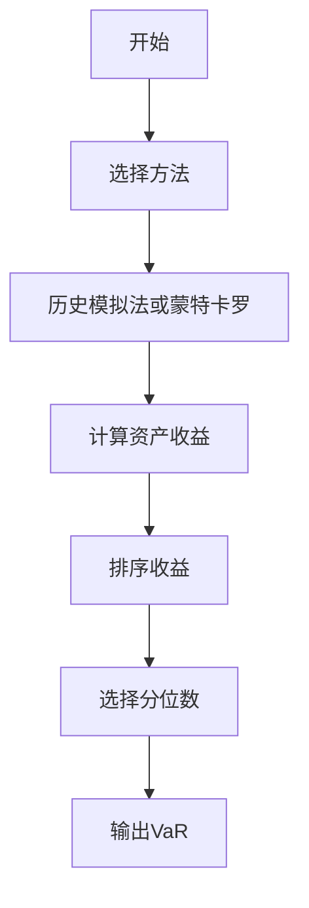
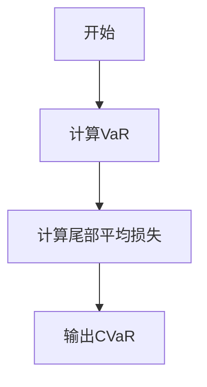
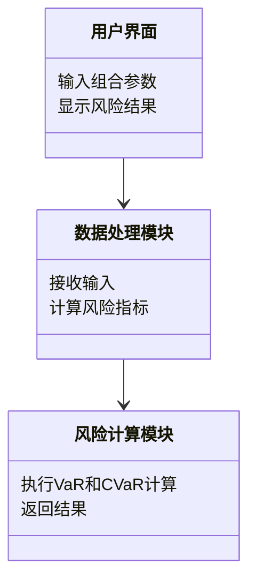
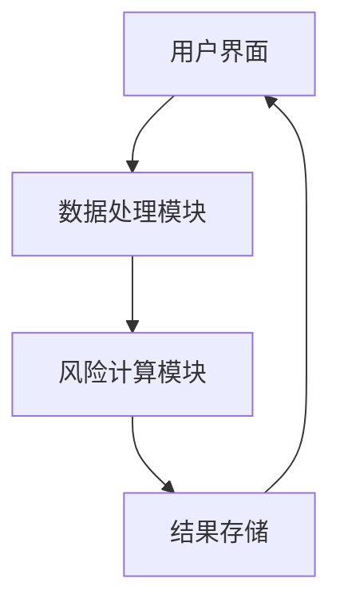
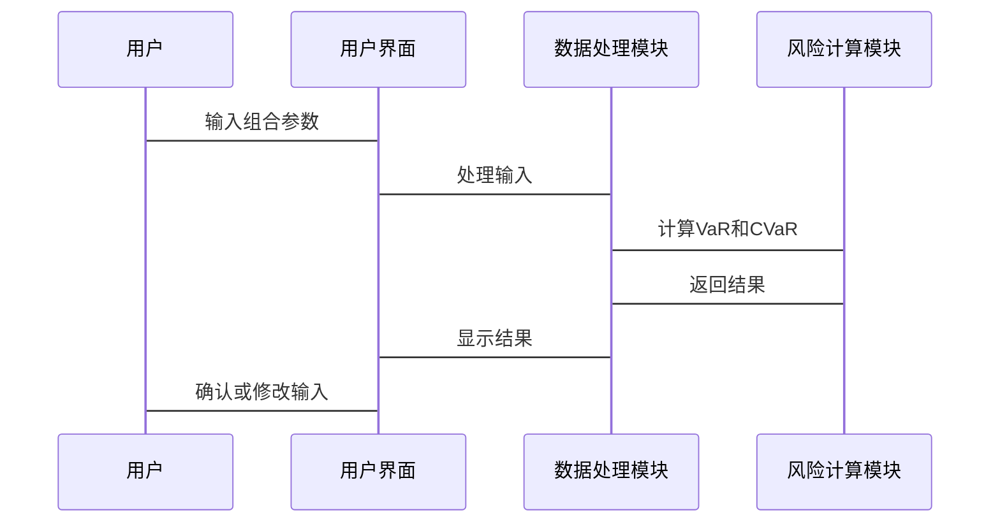

                 


# 《金融衍生品组合风险分析工具》

> 关键词：金融衍生品、风险分析、组合风险、VaR、CVaR、金融工具、风险管理

> 摘要：本文系统地介绍了金融衍生品组合风险分析工具的设计与实现，涵盖了金融衍生品的基本概念、风险分析的核心原理、算法实现、系统架构设计以及实际应用案例。通过详细的理论分析和实践操作，本文为读者提供了一个全面理解金融衍生品组合风险分析的框架，帮助用户有效管理和控制金融风险。

---

## 第1章: 金融衍生品与风险分析概述

### 1.1 金融衍生品的基本概念

#### 1.1.1 金融衍生品的定义
金融衍生品是一种金融合约，其价值取决于基础资产的价格波动。常见的衍生品包括期权、期货、掉期和远期合约。

#### 1.1.2 金融衍生品的主要类型
1. **期权**：买方有权在特定时间以特定价格购买或出售资产。
2. **期货**：双方同意在未来某一时间以预定价格买卖资产。
3. **掉期**：双方交换现金流的协议，通常基于资产或利率。
4. **远期合约**：类似于期货，但流动性较低。

#### 1.1.3 金融衍生品的市场现状
衍生品市场是全球最大的金融市场之一，广泛用于对冲和投机。市场规模庞大，涉及多种金融工具和复杂的交易策略。

### 1.2 风险分析的基本概念

#### 1.2.1 风险的定义
风险是未来损失的不确定性，通常表现为资产价格波动、市场变化等。

#### 1.2.2 风险分析的重要性
在金融领域，风险分析是评估和管理投资组合风险的关键工具，帮助投资者做出明智的决策。

#### 1.2.3 金融衍生品组合风险的特点
组合风险具有非线性、相关性和复杂性等特点，需要综合考虑多个因素。

### 1.3 组合风险分析的背景与意义

#### 1.3.1 金融衍生品组合风险的复杂性
组合风险受多种因素影响，如市场波动、流动性风险和信用风险。

#### 1.3.2 组合风险分析的必要性
通过分析组合风险，投资者可以优化投资组合，降低潜在损失。

#### 1.3.3 组合风险分析的边界与外延
分析范围包括单个资产和组合资产，外延涉及市场、信用和操作风险。

---

## 第2章: 金融衍生品组合风险分析的核心概念

### 2.1 风险分析的核心原理

#### 2.1.1 风险分析的基本原理
风险分析通过量化模型评估潜在损失，常用方法包括VaR和CVaR。

#### 2.1.2 金融衍生品组合风险的数学模型
模型通常基于概率论和统计学，考虑资产价格的分布特性。

#### 2.1.3 风险分析的常用方法
1. **VaR**：在给定置信水平下，可能的最大损失。
2. **CVaR**：在VaR基础上，考虑尾部风险的平均损失。

### 2.2 核心概念与联系

#### 2.2.1 VaR与CVaR
VaR是损失的分位数，CVaR是超过VaR的平均损失。

#### 2.2.2 风险因素与组合风险的关系
资产价格波动、市场流动性等风险因素影响组合风险。

#### 2.2.3 风险度量的属性特征对比表格
| 属性   | VaR                | CVaR               |
|--------|--------------------|--------------------|
| 定义   | 分位数损失          | 平均尾部损失        |
| 优点   | 计算简便            | 更全面考虑尾部风险  |
| 缺点   | 未考虑尾部平均       | 计算复杂            |

#### 2.2.4 ER实体关系图架构
```mermaid
erd
    组合风险分析
    组合
    资产
    风险因素
    风险模型
    VaR
    CVaR
```

---

## 第3章: 金融衍生品组合风险分析的算法原理

### 3.1 VaR计算的算法原理

#### 3.1.1 VaR的定义
VaR是在给定置信水平下，投资组合的最大可能损失。

#### 3.1.2 VaR的计算方法
常用历史模拟法和蒙特卡罗模拟法。

#### 3.1.3 VaR的数学模型
$$ VaR = \text{分位数}(\text{资产收益分布}, \alpha) $$

#### 3.1.4 VaR的计算流程图


### 3.2 CVaR计算的算法原理

#### 3.2.1 CVaR的定义
CVaR是超过VaR的平均损失。

#### 3.2.2 CVaR的计算方法
在VaR的基础上，计算超过VaR的平均值。

#### 3.2.3 CVaR的数学模型
$$ CVaR = \frac{1}{1-\alpha} \int_{\alpha}^1 L(d) dd $$

#### 3.2.4 CVaR的计算流程图


---

## 第4章: 金融衍生品组合风险分析的系统架构设计

### 4.1 系统分析与设计

#### 4.1.1 问题场景介绍
系统需要分析多个金融衍生品的组合风险，支持用户自定义输入。

#### 4.1.2 系统功能设计


#### 4.1.3 系统架构设计


#### 4.1.4 系统接口设计
1. 输入接口：接收组合参数和风险模型选择。
2. 输出接口：显示VaR和CVaR结果。

#### 4.1.5 系统交互流程


---

## 第5章: 金融衍生品组合风险分析工具的项目实战

### 5.1 项目环境与工具安装

#### 5.1.1 环境搭建
安装Python、NumPy、Pandas和Matplotlib。

#### 5.1.2 工具安装与配置
安装Jupyter Notebook，配置环境变量。

### 5.2 项目核心实现

#### 5.2.1 风险分析算法实现
```python
import numpy as np
import pandas as pd

def calculate_var(historical_returns, confidence_level):
    sorted_returns = np.sort(historical_returns)
    index = int(len(sorted_returns) * confidence_level)
    return -sorted_returns[index]

# 示例数据
returns = np.random.normal(0, 1, 1000)
confidence_level = 0.95
var = calculate_var(returns, confidence_level)
print(f"VaR at {confidence_level} confidence level: {var}")
```

#### 5.2.2 工具功能实现
```python
def calculate_cvar(historical_returns, confidence_level):
    var = calculate_var(historical_returns, confidence_level)
    tail_losses = historical_returns[ historical_returns <= var]
    cvar = -np.mean(tail_losses)
    return cvar

cvar = calculate_cvar(returns, confidence_level)
print(f"CVaR at {confidence_level} confidence level: {cvar}")
```

#### 5.2.3 代码解读与分析
VaR计算基于历史模拟法，CVaR计算考虑了尾部平均损失。

### 5.3 实际案例分析

#### 5.3.1 案例背景介绍
分析一个包含股票和期权的投资组合，评估其风险。

#### 5.3.2 数据准备与处理
使用历史价格数据计算资产收益。

#### 5.3.3 风险分析过程
计算VaR和CVaR，评估组合的风险水平。

#### 5.3.4 结果分析与解读
解释结果的实际意义，帮助用户优化投资组合。

---

## 第6章: 最佳实践与总结

### 6.1 最佳实践Tips

#### 6.1.1 工具使用技巧
1. 确保数据质量。
2. 定期更新模型参数。

#### 6.1.2 风险分析的注意事项
1. 考虑模型假设的局限性。
2. 结合市场环境变化调整模型。

#### 6.1.3 工具维护与优化
1. 定期检查模型性能。
2. 更新算法以适应新市场情况。

### 6.2 小结
本文系统地介绍了金融衍生品组合风险分析工具的设计与实现，提供了丰富的理论和实践内容，帮助读者全面理解并应用该工具。

### 6.3 注意事项
在实际应用中，需注意数据质量和模型假设的合理性。

### 6.4 拓展阅读
推荐阅读关于VaR和CVaR的经典文献，深入理解风险度量方法。

---

以上是《金融衍生品组合风险分析工具》的详细目录大纲，确保内容全面，逻辑清晰，帮助读者深入理解金融衍生品组合风险分析的核心内容和实际应用。

