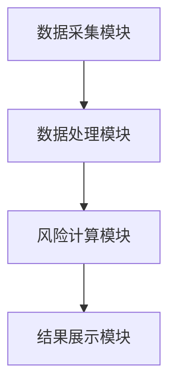

                 


# 《金融衍生品风险敞口分析》

> 关键词：金融衍生品、风险敞口、VaR、CVaR、蒙特卡洛模拟、系统架构设计、风险管理

> 摘要：本文详细探讨了金融衍生品风险敞口分析的核心概念、分析方法、数学模型和系统架构设计。通过案例分析和实战指导，帮助读者掌握如何有效评估和管理金融衍生品的风险敞口。

---

## # 第一部分：金融衍生品风险敞口分析概述

### ## 第1章：金融衍生品基础与风险敞口的概念

#### ### 1.1 金融衍生品的基本概念

- **1.1.1 金融衍生品的定义**  
  金融衍生品是一种金融工具，其价值取决于基础资产（如股票、债券、商品或指数）的价格变动。常见的衍生品包括期权、期货、远期合约和互换。

- **1.1.2 金融衍生品的主要类型**  
  | 衍生品类型 | 描述 | 标的资产 | 合约特点 |
  |------------|------|----------|----------|
  | 期货       | 标准化合约，交易双方在未来以约定价格买卖标的资产 | 商品、金融资产 | 标准化、场内交易 |
  | 期权       | 给买方在特定时间以特定价格买卖标的资产的权利 | 股票、指数 | 非标准化、场内外交易 |
  | 远期合约   | 定制化合约，双方约定在未来特定价格买卖标的资产 | 商品、金融资产 | 非标准化、场外交易 |
  | 互换       | 交易双方在未来交换现金流 | 利率、汇率 | 定期、场外交易 |

- **1.1.3 金融衍生品的市场特点**  
  - 杠杆效应：用少量资金控制较大头寸。
  - 风险对冲：用于 hedging（对冲）市场风险。
  - 复杂性：衍生品的价值依赖于复杂的数学模型。

#### ### 1.2 风险敞口的定义与分类

- **1.2.1 风险敞口的定义**  
  风险敞口是指投资者在特定市场条件下的潜在损失程度。在金融衍生品中，风险敞口主要来源于价格波动、波动率变化、信用风险等。

- **1.2.2 风险敞口的主要分类**  
  - **市场风险**：由于市场价格波动导致的损失。
  - **信用风险**：由于交易对手违约导致的损失。
  - **流动性风险**：无法迅速以合理价格买卖资产的风险。
  - **操作风险**：由于操作失误或系统故障导致的损失。

- **1.2.3 风险敞口的影响因素**  
  | 因素 | 描述 |
  |------|------|
  | 标的资产价格 | 衍生品价值的核心驱动因素 |
  | 波动率 | 市场波动对衍生品价值的影响程度 |
  | 利率 | 影响期权和债券衍生品价值的关键因素 |
  | 时间 | 衍生品的时间价值和波动性随时间变化 |

#### ### 1.3 金融衍生品风险敞口分析的重要性

- **1.3.1 风险管理的核心作用**  
  风险管理是金融衍生品交易中的核心环节，通过分析和控制风险敞口，可以降低潜在损失。

- **1.3.2 金融衍生品风险敞口分析的必要性**  
  - 帮助投资者理解衍生品的潜在风险。
  - 为投资决策提供数据支持。
  - 有效控制市场波动对资产组合的影响。

- **1.3.3 风险敞口分析在金融决策中的应用**  
  - 优化资产配置。
  - 评估交易策略的风险。
  - 为风险定价提供依据。

---

## # 第二部分：金融衍生品风险敞口分析的方法论

### ## 第2章：金融衍生品风险敞口分析的方法与技术

#### ### 2.1 风险敞口的度量方法

- **2.1.1 风险价值（VaR）**  
  VaR是衡量投资组合在一定置信水平下的潜在损失。例如，95%置信水平下的VaR表示在95%的概率下，损失不超过 VaR 值。

  - **计算方法**  
    使用蒙特卡洛模拟或历史模拟计算资产价格的波动情况，确定在给定置信水平下的最大损失。

- **2.1.2 穿透风险（CVaR）**  
  CVaR是VaR的扩展，衡量在VaR超过后的平均损失。

  - **公式**  
    $$ CVaR = \frac{1}{1-\alpha} \int_{\alpha}^{1} VaR(d) dd $$  
    其中，$\alpha$ 是置信水平。

- **2.1.3 波动率法**  
  波动率法通过计算资产价格的波动率来估计风险敞口。

  - **公式**  
    $$ \text{风险敞口} = \text{波动率} \times \text{资产价值} $$

#### ### 2.2 蒙特卡洛模拟与情景分析

- **2.2.1 蒙特卡洛模拟**  
  蒙特卡洛模拟通过生成大量可能的市场情景，计算衍生品在这些情景下的价值变化，从而估计风险敞口。

  - **步骤**  
    1. 确定标的资产的价格变化模型（如布朗运动）。
    2. 生成大量随机价格路径。
    3. 计算每条路径下的衍生品价值。
    4. 统计结果，计算 VaR 或 CVaR。

- **2.2.2 情景分析**  
  情景分析基于特定市场假设（如最佳和最坏情况），计算衍生品在这些情况下的价值变化。

---

## # 第三部分：金融衍生品风险敞口分析的数学模型

### ## 第3章：数学模型与公式推导

#### ### 3.1 Black-Scholes 模型

- **模型描述**  
  Black-Scholes 模型用于计算欧式期权的价值，假设标的资产价格服从几何布朗运动。

- **公式推导**  
  $$ C = S_0 N(d_1) - K e^{-rT} N(d_2) $$  
  其中，  
  $$ d_1 = \frac{\ln(\frac{S_0}{K}) + (r + \frac{\sigma^2}{2})T}{\sigma \sqrt{T}} $$  
  $$ d_2 = d_1 - \sigma \sqrt{T} $$  
  $S_0$ 是标的资产当前价格，$K$ 是行权价，$r$ 是无风险利率，$\sigma$ 是波动率，$T$ 是时间。

#### ### 3.2 VaR 和 CVaR 的计算公式

- **VaR 公式**  
  $$ VaR = \text{资产价值} \times \text{波动率} \times z \sigma $$  
  其中，$z$ 是标准正态分布的分位数，$\sigma$ 是标准差。

- **CVaR 公式**  
  $$ CVaR = \frac{1}{1-\alpha} \int_{\alpha}^{1} VaR(d) dd $$

---

## # 第四部分：系统架构设计与实现

### ## 第4章：系统架构设计

#### ### 4.1 系统功能设计

- **功能模块**  
  - 数据采集模块：获取标的资产价格数据。
  - 模型计算模块：计算 VaR 和 CVaR。
  - 结果展示模块：可视化风险敞口分析结果。

#### ### 4.2 系统架构图



#### ### 4.3 接口设计

- **API 接口**  
  - `/api/v1/derivatives/vaR`：接收标的资产数据，返回 VaR 值。
  - `/api/v1/derivatives/cVaR`：接收标的资产数据，返回 CVaR 值。

---

## # 第五部分：项目实战与案例分析

### ## 第5章：项目实战

#### ### 5.1 环境安装

- **Python 环境**  
  安装 Python 和相关库（如 numpy、pandas、scipy）。

#### ### 5.2 核心代码实现

```python
import numpy as np
import scipy.stats as stats

def calculate VaR(asset_returns, confidence_level):
    # 计算 VaR
    sorted_returns = np.sort(asset_returns)
    alpha = confidence_level / 100
    VaR = sorted_returns[int(alpha * len(sorted_returns))]
    return VaR

def calculate CVaR(asset_returns, confidence_level):
    # 计算 CVaR
    sorted_returns = np.sort(asset_returns)
    alpha = confidence_level / 100
    tail = sorted_returns[int(alpha * len(sorted_returns)):]
    CVaR = np.mean(tail)
    return CVaR
```

#### ### 5.3 案例分析

- **案例：股票期权的风险分析**
  - 数据：某股票的历史收益率和波动率。
  - 计算 VaR 和 CVaR，评估期权的风险敞口。

---

## # 第六部分：总结与展望

### ## 第6章：总结与展望

- **6.1 小结**  
  本文详细介绍了金融衍生品风险敞口分析的核心概念、分析方法和系统实现。

- **6.2 展望**  
  随着人工智能的发展，未来可以利用机器学习模型更精确地预测市场风险，优化风险敞口分析。

---

通过以上内容，读者可以全面了解金融衍生品风险敞口分析的理论与实践，掌握如何利用数学模型和系统工具进行风险评估和管理。

