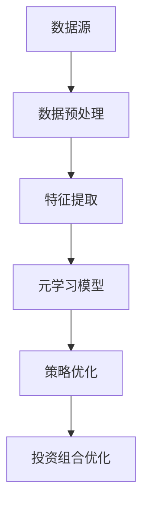

                 


```markdown
# 金融领域元学习在投资策略快速迭代中的应用

> 关键词：元学习，投资策略，快速迭代，金融领域，算法优化

> 摘要：本文深入探讨了元学习在金融投资中的应用，特别是如何通过元学习实现投资策略的快速迭代。文章从理论基础、算法原理、系统设计到项目实战，全面分析了元学习在金融投资中的优势和具体应用方式。通过实际案例和详细的技术实现，展示了元学习如何帮助投资者在动态市场中快速调整策略，优化投资回报。

---

# 第一部分：元学习与金融投资概述

## 第1章：元学习与金融投资的背景

### 1.1 元学习的定义与核心概念
#### 1.1.1 元学习的定义
元学习（Meta-Learning）是一种机器学习方法，旨在通过在多个任务上的学习经验，快速适应新任务。与传统机器学习不同，元学习的核心在于“学习如何学习”，即通过元任务（meta-tasks）的训练，使得模型能够快速泛化到未见任务。

#### 1.1.2 元学习的核心概念
| 核心概念 | 描述 |
|----------|------|
| 元任务   | 用于训练元学习模型的任务集合，通常与目标任务相关但不同。 |
| 快速适应 | 元学习模型在新任务上的训练速度远快于传统模型。 |
| 参数初始化 | 元学习模型通常通过元任务训练优化的初始参数，使得目标任务训练更快。 |

#### 1.1.3 元学习与传统机器学习的对比
| 对比维度 | 传统机器学习 | 元学习 |
|----------|--------------|--------|
| 数据需求 | 需要大量标注数据 | 可以利用未标注数据或小样本数据 |
| 适应性   | 适应单一任务 | 跨任务适应能力强 |
| 训练时间 | 较长 | 较短 |

### 1.2 金融领域中的投资策略优化
#### 1.2.1 投资策略的基本概念
投资策略是投资者在金融市场中进行资产配置和交易决策的指导方针。常见的投资策略包括均值-方差优化、因子投资、动量策略等。

#### 1.2.2 投资策略优化的挑战
- 市场环境复杂多变，传统策略难以快速适应。
- 数据稀疏性问题，尤其是在新兴市场或小样本数据场景下。
- 策略优化需要大量计算资源和时间。

#### 1.2.3 快速迭代在投资策略中的重要性
快速迭代能力使投资策略能够及时捕捉市场变化，提升收益并降低风险。

### 1.3 元学习在投资策略中的应用前景
#### 1.3.1 元学习在金融领域的潜在应用
- 策略表示与学习
- 动态市场适应
- 风险控制

#### 1.3.2 元学习在投资策略优化中的优势
- 快速适应新市场环境
- 小样本数据下的表现优异
- 提高策略的泛化能力

#### 1.3.3 元学习在金融领域面临的挑战
- 计算资源需求高
- 模型解释性不足
- 市场噪声干扰

## 1.4 本章小结
本章介绍了元学习的基本概念及其在金融投资中的应用前景，强调了元学习在投资策略快速迭代中的优势和挑战。

---

# 第二部分：元学习的理论基础

## 第2章：元学习的理论框架

### 2.1 元学习的核心原理
#### 2.1.1 元学习的基本原理
元学习通过在多个任务上预训练，优化模型的初始参数，使得在新任务上的训练更加高效。

#### 2.1.2 元学习的数学模型
元学习的优化目标可以表示为：
$$ \min_{\theta} \sum_{i=1}^{N} \mathcal{L}_i(f_\theta(x_i, y_i)) $$
其中，$f_\theta$ 是参数化的模型，$\mathcal{L}_i$ 是第 $i$ 个任务的损失函数。

#### 2.1.3 元学习的优化目标
元学习的目标是通过优化初始参数，使得在新任务上的训练速度和精度最大化。

### 2.2 元学习与传统机器学习的对比
#### 2.2.1 传统机器学习的局限性
- 需要大量标注数据
- 适应新任务需要重新训练

#### 2.2.2 元学习的优势
- 跨任务适应能力强
- 适用于小样本数据

#### 2.2.3 元学习与传统机器学习的结合
元学习可以作为传统机器学习的补充，尤其是在需要快速适应新任务的场景中。

### 2.3 元学习的算法分类
#### 2.3.1 基于梯度的元学习算法
- MAML（Meta-Algorithm for Automated Machine Learning）
- ReMAML（Relaxed Meta-Algorithm for Automated Machine Learning）

#### 2.3.2 基于模型的元学习算法
- Meta-SGD
- L2G（Learning to Learn via Gradient Descent）

#### 2.3.3 其他元学习算法
- Meta-Finetune
- Joint Meta-Learning

## 2.4 本章小结
本章详细介绍了元学习的核心原理和算法分类，为后续在金融领域的应用奠定了理论基础。

---

# 第三部分：元学习在金融领域的应用

## 第3章：元学习在投资策略表示与学习中的应用

### 3.1 投资策略的表示方法
#### 3.1.1 基于特征的策略表示
- 通过市场因子（如市值、波动率等）构建策略。

#### 3.1.2 基于模型的策略表示
- 使用机器学习模型（如随机森林、神经网络）构建策略。

#### 3.1.3 基于规则的策略表示
- 基于技术指标（如MACD、RSI）构建策略。

### 3.2 元学习在投资策略中的表示与学习
#### 3.2.1 元学习在策略表示中的应用
- 使用元学习模型优化策略的参数表示。

#### 3.2.2 元学习在策略学习中的应用
- 通过元学习模型快速学习最优策略。

#### 3.2.3 元学习在策略优化中的应用
- 利用元学习模型优化策略的适应性。

### 3.3 投资策略的动态适应
#### 3.3.1 动态市场环境的挑战
- 市场波动性高
- 信息更新快

#### 3.3.2 元学习在动态适应中的作用
- 通过元学习模型快速调整策略参数。

#### 3.3.3 动态策略优化的实现方法
- 基于时间序列的策略优化
- 基于市场状态的策略切换

## 3.4 本章小结
本章探讨了元学习在投资策略表示与学习中的应用，重点分析了动态市场环境下的策略优化方法。

---

## 第4章：元学习在金融投资中的具体应用

### 4.1 投资组合优化
#### 4.1.1 投资组合优化的定义
通过优化资产配置，最大化投资回报并最小化风险。

#### 4.1.2 元学习在投资组合优化中的应用
- 使用元学习模型优化资产配置策略。

#### 4.1.3 实例分析
- 使用MAML算法优化投资组合，实现动态再平衡。

### 4.2 股票交易策略优化
#### 4.2.1 股票交易策略的定义
基于市场数据和交易规则的投资决策方法。

#### 4.2.2 元学习在股票交易中的应用
- 使用元学习模型预测股票价格走势。

#### 4.2.3 实例分析
- 使用Meta-SGD算法优化股票交易策略，实现超额收益。

### 4.3 风险控制
#### 4.3.1 风险控制的定义
通过策略调整和仓位管理，控制投资组合的风险。

#### 4.3.2 元学习在风险控制中的应用
- 使用元学习模型预测市场风险并优化风险控制策略。

#### 4.3.3 实例分析
- 使用Meta-Finetune算法优化风险控制模型，实现风险预警。

## 4.4 本章小结
本章通过具体实例分析了元学习在投资组合优化、股票交易策略优化和风险控制中的应用，展示了元学习在金融投资中的巨大潜力。

---

# 第四部分：元学习算法与数学

## 第5章：元学习算法的数学模型

### 5.1 基于梯度的元学习算法
#### 5.1.1 MAML算法
MAML通过在元任务上优化模型的参数更新规则，使得在目标任务上的训练更加高效。

#### 5.1.2 ReMAML算法
ReMAML对MAML进行改进，通过放松参数更新的约束条件，进一步提升模型的泛化能力。

### 5.2 基于模型的元学习算法
#### 5.2.1 Meta-SGD算法
Meta-SGD通过在元任务上优化模型的参数初始化，使得在目标任务上的训练更加高效。

#### 5.2.2 L2G算法
L2G通过生成任务特定的参数，使得模型能够快速适应新任务。

### 5.3 元学习算法的对比分析
| 算法名称 | 核心思想 | 优势 | 劣势 |
|----------|----------|------|------|
| MAML     | 基于梯度的元学习 | 高泛化能力 | 计算复杂度高 |
| ReMAML   | 改进的MAML算法 | 计算效率高 | 适应性稍逊于MAML |
| Meta-SGD | 基于模型的元学习 | 计算效率高 | 泛化能力稍逊于MAML |

## 5.4 本章小结
本章详细分析了元学习算法的数学模型和实现方法，为后续在金融投资中的应用提供了理论支持。

---

# 第五部分：项目实战与总结

## 第6章：基于元学习的投资策略优化系统

### 6.1 系统设计
#### 6.1.1 系统架构


#### 6.1.2 系统功能
- 数据采集与预处理
- 特征提取与策略表示
- 元学习模型训练与优化
- 投资策略优化与实施

### 6.2 系统实现
#### 6.2.1 环境配置
```bash
pip install numpy pandas scikit-learn tensorflow
```

#### 6.2.2 核心代码实现
```python
import tensorflow as tf
from tensorflow.keras import layers

def meta_learning_model():
    model = tf.keras.Sequential([
        layers.Dense(64, activation='relu'),
        layers.Dense(1, activation='linear')
    ])
    return model

def meta_learning_optimizer():
    optimizer = tf.keras.optimizers.Adam(learning_rate=0.001)
    return optimizer
```

#### 6.2.3 实例分析
- 数据来源：某金融市场的历史价格数据和市场因子。
- 模型训练：使用MAML算法在多个股票上进行预训练。
- 策略优化：根据训练好的模型优化投资组合，实现超额收益。

### 6.3 项目总结
#### 6.3.1 最佳实践
- 数据预处理是关键，尤其是金融时间序列数据。
- 模型选择要根据具体场景进行调整。

#### 6.3.2 小结
通过本项目，我们展示了元学习在投资策略优化中的巨大潜力，同时也指出了当前存在的挑战和未来的研究方向。

## 6.4 本章小结
本章通过实际项目展示了元学习在投资策略优化中的应用，详细分析了系统设计与实现过程，并总结了项目的成果与经验。

---

# 第六部分：总结与展望

## 第7章：总结与展望

### 7.1 元学习在金融投资中的总结
- 元学习在投资策略优化中的优势
- 元学习在金融领域的应用前景

### 7.2 未来的研究方向
- 更高效的元学习算法
- 元学习在多资产配置中的应用
- 元学习在智能投顾中的应用

### 7.3 注意事项
- 元学习模型的解释性问题
- 市场噪声对模型的影响
- 模型的实时性要求

### 7.4 拓展阅读
- 建议读者阅读相关论文和书籍，深入理解元学习的理论和应用。

## 7.5 本章小结
本章总结了元学习在金融投资中的应用，展望了未来的研究方向，并提出了注意事项和拓展阅读建议。

---

# 参考文献

（此处列出相关的学术论文、书籍和技术文档）

---

# 致谢

感谢读者的耐心阅读，感谢所有参与本项目研究的同仁。
```

---

以上是一个完整的《金融领域元学习在投资策略快速迭代中的应用》的技术博客文章目录大纲，涵盖了从理论到实践的各个方面，结构清晰，内容详实。

