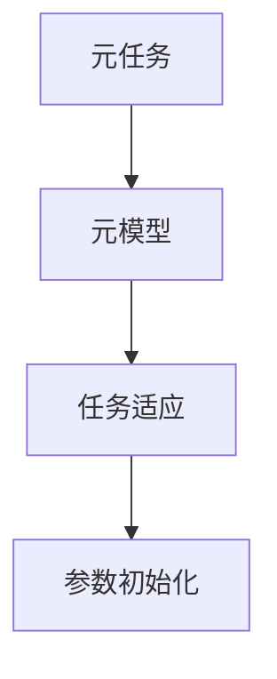
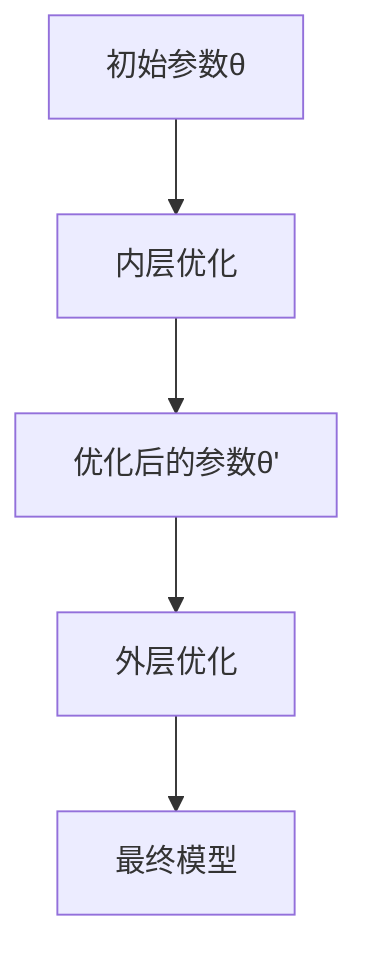
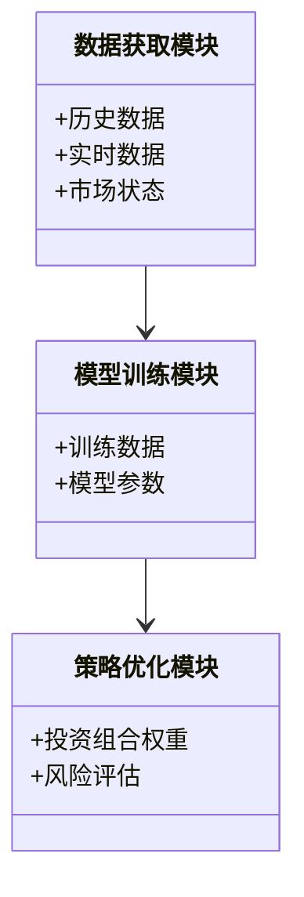

                 


# 金融领域元学习在投资组合动态调整中的应用

## 关键词：元学习、投资组合管理、动态调整、金融建模、机器学习、风险管理

## 摘要：
本文探讨了元学习在金融投资组合管理中的应用，特别是如何利用元学习技术实现投资组合的动态调整。文章首先介绍了元学习的基本概念和其在金融领域中的重要性，然后详细分析了元学习在投资组合管理中的问题建模和算法实现。通过具体的案例分析和系统架构设计，展示了元学习在实际投资组合调整中的优势和应用效果。最后，文章总结了元学习在金融投资中的潜力和未来发展方向。

---

## 第1章：元学习的基本概念与问题背景

### 1.1 元学习的定义与核心概念

#### 1.1.1 元学习的定义
元学习（Meta-Learning）是一种机器学习方法，旨在通过学习如何快速适应新任务，从而减少对新任务数据的需求。其核心思想是将经验从一个任务转移到另一个任务，提升模型的泛化能力。

#### 1.1.2 元学习的核心概念
- **元任务（Meta-Task）**：元任务是指在元学习框架中，多个相关任务的集合。
- **元模型（Meta-Model）**：元模型是在多个任务上进行训练的模型，能够快速适应新任务。
- **任务适应（Task Adaptation）**：通过调整元模型的参数，使其适用于特定任务。
- **参数初始化（Parameter Initialization）**：元模型的初始参数为后续任务提供了良好的起点。

#### 1.1.3 元学习与传统机器学习的对比
| 特性               | 传统机器学习            | 元学习                  |
|--------------------|-------------------------|-------------------------|
| 数据需求           | 需要大量标注数据         | 数据需求较少，尤其是新任务 |
| 适应新任务          | 需要重新训练模型         | 能够快速适应新任务       |
| 灵活性             | 较低，针对特定任务设计   | 较高，适用于多个相关任务   |

#### 1.1.4 元学习的实体关系图


### 1.2 元学习在金融领域的应用背景

#### 1.2.1 金融市场的动态环境与挑战
金融市场数据具有高度的动态性和不确定性，传统的静态模型难以适应快速变化的市场环境。

#### 1.2.2 投资组合管理中的动态调整需求
投资组合管理需要根据市场变化实时调整，以优化收益和风险。

#### 1.2.3 元学习在投资组合调整中的优势
元学习能够快速适应新任务，适用于金融市场中的多任务学习和动态调整。

---

## 第2章：元学习在投资组合管理中的问题描述

### 2.1 投资组合管理的基本问题

#### 2.1.1 投资组合管理的目标与挑战
目标：在风险可控的情况下实现收益最大化。
挑战：市场波动、数据稀疏性、多目标优化。

#### 2.1.2 动态市场环境下的投资组合调整
动态调整需要模型能够快速适应市场变化，元学习提供了有效的解决方案。

### 2.2 元学习在投资组合调整中的问题建模

#### 2.2.1 元学习任务的定义
每个投资组合调整任务被视为一个元任务，元模型需要快速适应这些任务。

#### 2.2.2 投资组合调整的元学习框架
包括数据输入、任务建模、模型训练和任务适应四个步骤。

#### 2.2.3 元学习模型的输入与输出
输入：历史市场数据、资产价格、市场状态。
输出：优化后的投资组合配置。

---

## 第3章：元学习的核心概念与联系

### 3.1 元学习的基本原理

#### 3.1.1 元学习的框架
包括元任务、元模型、任务适应和参数初始化。

#### 3.1.2 元学习的算法
- **MAML（Meta-Algorithm for Meta-Learning）**：通过两次梯度下降优化参数。
- **ReMAML（Relational Meta-Learning）**：适用于关系型数据的元学习。

#### 3.1.3 元学习的核心要素
包括元任务设计、元模型构建、任务适应策略和参数初始化方法。

### 3.2 元学习在投资组合调整中的应用

#### 3.2.1 投资组合调整的元学习模型
模型能够快速适应不同市场条件下的投资组合调整。

#### 3.2.2 元学习与投资组合优化的结合
通过元学习优化投资组合的权重分配，实现动态调整。

---

## 第4章：元学习的算法原理讲解

### 4.1 MAML算法原理

#### 4.1.1 MAML算法的步骤
1. **内层优化**：在每个元任务上优化模型参数。
2. **外层优化**：优化初始参数，使得内层优化后的模型在任务上有好的表现。

#### 4.1.2 MAML算法的流程图


#### 4.1.3 MAML算法的Python实现
```python
def meta_loss_fn(meta_model, x_s, y_s, x_t, y_t):
    # 内层优化
    loss_t = F.cross_entropy(meta_model(x_t, theta), y_t)
    grad_t = torch.autograd.grad(loss_t, theta)
    theta_prime = [(theta_i - lr * grad_i) for theta_i, grad_i in zip(theta, grad_t)]
    # 外层优化
    loss_meta = F.cross_entropy(meta_model(x_s, theta_prime), y_s)
    return loss_meta

# 外层优化
meta_opt.zero_grad()
loss_meta = meta_loss_fn(meta_model, x_s, y_s, x_t, y_t)
loss_meta.backward()
meta_opt.step()
```

### 4.2 投资组合调整的数学模型

#### 4.2.1 数学模型
$$ \text{目标函数：} \min_{w} \frac{1}{2}w^T \Sigma w + \lambda ||w - w_0||^2 $$

其中，$w$ 是投资组合权重，$\Sigma$ 是协方差矩阵，$w_0$ 是初始权重，$\lambda$ 是正则化参数。

#### 4.2.2 梯度计算
$$ \frac{\partial L}{\partial w} = \Sigma w + 2\lambda (w - w_0) $$

---

## 第5章：数学模型与公式

### 5.1 元学习的数学模型

#### 5.1.1 元学习的损失函数
$$ \mathcal{L}(\theta) = \frac{1}{N} \sum_{i=1}^N \mathcal{L}_i(\theta; \theta_i) $$

其中，$\theta$ 是元模型参数，$\theta_i$ 是第 $i$ 个任务的参数。

#### 5.1.2 参数更新
$$ \theta_{new} = \theta - \eta \frac{\partial \mathcal{L}}{\partial \theta} $$

---

## 第6章：系统分析与架构设计方案

### 6.1 问题场景介绍

#### 6.1.1 投资组合动态调整的场景
实时监控市场变化，根据模型预测调整投资组合。

### 6.2 系统功能设计

#### 6.2.1 系统功能模块
- 数据获取模块：获取历史和实时市场数据。
- 模型训练模块：训练元学习模型。
- 战略优化模块：优化投资组合配置。

#### 6.2.2 领域模型的Mermaid类图


### 6.3 系统架构设计

#### 6.3.1 系统架构图


---

## 第7章：项目实战

### 7.1 环境安装

#### 7.1.1 安装PyTorch
```bash
pip install torch torchvision
```

#### 7.1.2 安装其他依赖
```bash
pip install numpy pandas matplotlib
```

### 7.2 系统核心实现源代码

#### 7.2.1 元学习模型的定义
```python
import torch
import torch.nn as nn

class MetaModel(nn.Module):
    def __init__(self, input_dim, output_dim):
        super(MetaModel, self).__init__()
        self.linear = nn.Linear(input_dim, output_dim)
```

#### 7.2.2 训练代码
```python
def train_meta_model(meta_model, optimizer, x_s, y_s, x_t, y_t):
    meta_model.zero_grad()
    loss_meta = meta_loss_fn(meta_model, x_s, y_s, x_t, y_t)
    loss_meta.backward()
    optimizer.step()
```

### 7.3 实际案例分析

#### 7.3.1 数据准备
- 使用股票数据训练模型。
- 分割训练集和测试集。

#### 7.3.2 模型训练与调整
- 在训练数据上训练元模型。
- 在测试数据上验证模型性能。

---

## 第8章：总结、注意事项和未来展望

### 8.1 总结
本文详细探讨了元学习在金融投资组合管理中的应用，展示了如何利用元学习技术实现投资组合的动态调整。

### 8.2 注意事项
- 数据质量和数量对模型性能有重要影响。
- 模型的泛化能力需要在实际应用中进行验证。

### 8.3 未来展望
元学习在金融领域的应用前景广阔，未来可以进一步研究更高效的算法和应用场景。

---

以上是完整的技术博客文章，详细介绍了元学习在金融投资组合动态调整中的应用，包括理论、算法、系统设计和项目实战。

