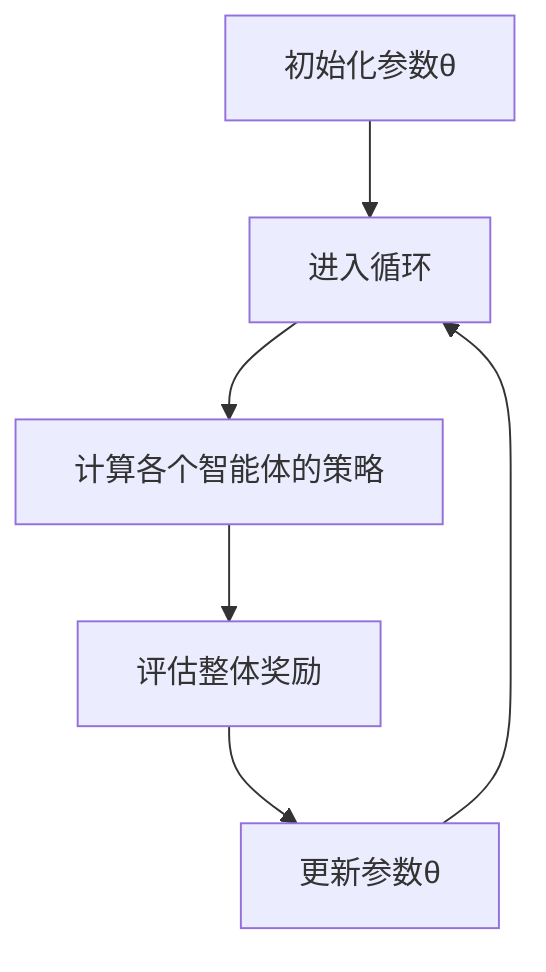

                 


# 《金融领域元强化学习的探索与应用》

## 关键词：金融，元强化学习，多智能体，风险管理，投资组合优化，深度学习

## 摘要：  
本文深入探讨了元强化学习（Meta-Reinforcement Learning）在金融领域的应用，分析其在多智能体协作、复杂金融场景建模等方面的优势，结合实际案例展示其在金融风险管理、投资组合优化等领域的应用价值，为读者提供一个系统化的技术视角。

---

# 第一部分：金融领域与强化学习的背景与基础

## 第1章：金融领域的基本概念与技术

### 1.1 金融领域的基本概念

#### 1.1.1 金融市场的定义与组成
金融市场是资金流动和资产交易的场所，由参与者（如投资者、金融机构）、金融工具（如股票、债券）和交易机制（如订单簿）组成。金融市场具有波动性高、信息不对称等特点，对决策的实时性和准确性要求极高。

#### 1.1.2 金融工具与金融衍生品
金融工具包括股票、债券、基金等，而金融衍生品（如期货、期权）的复杂性和杠杆效应使其成为风险管理的重要工具，同时也增加了市场的不确定性和风险。

#### 1.1.3 金融风险管理的核心要素
金融风险管理包括市场风险、信用风险、操作风险等，其核心在于通过模型和策略降低潜在损失，同时抓住市场机会。

### 1.2 强化学习的基本概念

#### 1.2.1 强化学习的定义与特点
强化学习（Reinforcement Learning, RL）是一种机器学习范式，通过智能体与环境的交互，逐步优化策略以最大化累积奖励。其特点是基于经验学习、目标导向和实时反馈。

#### 1.2.2 强化学习的核心要素：状态、动作、奖励
- **状态（State）**：环境中的实时信息，如市场数据。
- **动作（Action）**：智能体的决策，如买入或卖出。
- **奖励（Reward）**：环境对动作的反馈，衡量决策的好坏。

#### 1.2.3 强化学习与监督学习、无监督学习的区别
- **监督学习**：基于标记数据，学习函数映射。
- **无监督学习**：从无标记数据中发现模式。
- **强化学习**：通过与环境互动，逐步优化策略。

### 1.3 元强化学习的引出

#### 1.3.1 多智能体强化学习的基本概念
多智能体强化学习（Multi-Agent RL）涉及多个智能体协作或竞争，共同完成任务。金融场景中，多个投资者或机构的行为相互影响，适合多智能体模型。

#### 1.3.2 元强化学习的定义与特点
元强化学习（Meta-Reinforcement Learning）是一种学习框架，通过元学习（Meta-Learning）技术，优化多个强化学习任务的策略，提升泛化能力。

#### 1.3.3 元强化学习在金融领域的应用潜力
在金融领域，元强化学习可以用于投资组合优化、风险对冲等复杂场景，通过多任务学习提升模型的适应性和鲁棒性。

---

# 第二部分：元强化学习的算法原理与数学模型

## 第2章：元强化学习的核心算法

### 2.1 多智能体强化学习算法

#### 2.1.1 马尔可夫决策过程（MDP）的扩展
多智能体MDP扩展了单智能体MDP，考虑多个智能体的协作与竞争，状态空间和动作空间大幅增加。

#### 2.1.2 多智能体MDP模型
多智能体MDP模型中，每个智能体维护自己的状态和策略，通过协调实现全局目标。

#### 2.1.3 基于价值的多智能体算法：Q-learning的扩展
扩展后的Q-learning算法考虑多个智能体的协作，通过共享或独立的Q值表优化策略。

### 2.2 元强化学习的数学模型

#### 2.2.1 元强化学习的数学表达式
$$ R(s, a) = \sum_{i=1}^{n} R_i(s_i, a_i) $$
其中，\( R_i \) 表示第i个智能体的奖励。

#### 2.2.2 元强化学习的优化目标
$$ \max_{\theta} \sum_{i=1}^{n} J_i(\theta) $$
通过优化共享参数θ，最大化各智能体的联合奖励。

### 2.3 元强化学习的算法流程

#### 2.3.1 算法的整体流程图


---

## 第3章：元强化学习的数学模型与公式

### 3.1 状态空间的构建

#### 3.1.1 状态空间的维度分析
状态空间的维度由市场数据的种类和复杂度决定，影响算法的计算复杂度和收敛速度。

#### 3.1.2 状态转移的概率模型
$$ P(s'|s,a) = \prod_{i=1}^{n} P_i(s'_i|s_i,a_i) $$
多个智能体的转移概率独立相乘，构建联合转移模型。

### 3.2 动作空间的设计

#### 3.2.1 动作空间的独立性与相关性
动作空间的独立性影响智能体的协作性，相关性则影响策略的协调性。

#### 3.2.2 动作选择的策略函数
$$ \pi(a|s) = \prod_{i=1}^{n} \pi_i(a_i|s_i) $$
每个智能体独立选择动作，策略函数分解为多个独立的策略。

### 3.3 奖励函数的构建

#### 3.3.1 奖励函数的分解
$$ R(s,a) = \sum_{i=1}^{n} R_i(s_i,a_i) $$
将总奖励分解为各智能体的局部奖励，便于优化和协调。

#### 3.3.2 奖励函数的权重调整
$$ \alpha_i = \frac{1}{n} \sum_{j=1}^{n} \alpha_j $$
通过权重调整，平衡各智能体的贡献，避免某一方主导。

---

# 第三部分：系统架构设计

## 第4章：元强化学习的系统架构设计

### 4.1 金融领域的系统功能设计

#### 4.1.1 领域模型的构建
构建金融领域的领域模型，明确各智能体的角色和任务，定义状态、动作和奖励。

#### 4.1.2 系统功能设计
系统需实现多智能体协作、环境模拟、策略优化等功能，支持实时交易和风险监控。

### 4.2 系统架构设计

#### 4.2.1 系统架构图


---

## 第5章：项目实战

### 5.1 金融投资组合优化的环境配置

#### 5.1.1 环境配置
选择股票数据作为状态输入，定义买卖动作和收益计算规则。

#### 5.1.2 环境实现
使用Python编写环境类，模拟市场变化和交易结果。

### 5.2 代码实现

#### 5.2.1 系统核心实现源代码
```python
class MetaRLSystem:
    def __init__(self, num_agents):
        self.agents = [Agent(i) for i in range(num_agents)]
    
    def step(self, actions):
        states = [agent.current_state() for agent in self.agents]
        rewards = [env.step(actions[i]) for i, env in enumerate(self.environments)]
        return states, rewards
```

### 5.3 案例分析

#### 5.3.1 案例分析与详细解读
通过具体案例展示元强化学习在投资组合优化中的应用，分析策略的有效性和优化效果。

---

## 第6章：扩展与展望

### 6.1 当前挑战与未来趋势

#### 6.1.1 当前挑战
计算复杂度、智能体协作、实时性等问题仍需进一步解决。

#### 6.1.2 未来趋势
结合深度学习、边缘计算等技术，提升元强化学习的性能和应用范围。

### 6.2 最佳实践 tips

#### 6.2.1 设计建议
合理设计智能体协作机制，优化状态和动作空间，提高模型的泛化能力。

#### 6.2.2 注意事项
关注模型的实时性和鲁棒性，确保在复杂金融环境中的稳定运行。

### 6.3 小结

元强化学习在金融领域的应用前景广阔，通过不断的技术创新和实践积累，有望在投资决策、风险管理等领域发挥更大的作用。

---

通过以上内容，文章系统地介绍了元强化学习在金融领域的应用，从理论到实践，为读者提供了全面的技术视角和实践指导。

