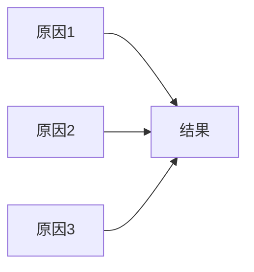
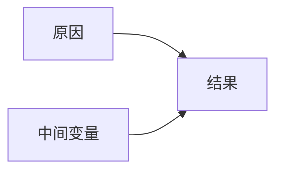
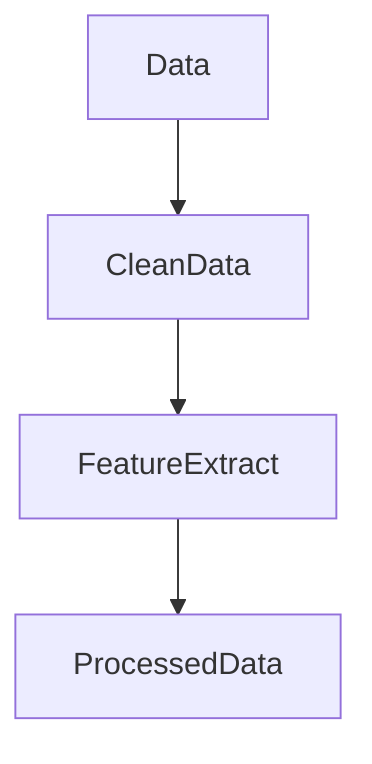
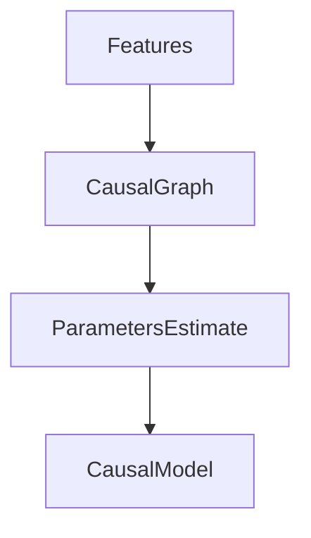
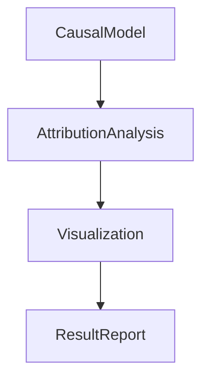

                 


# 《金融领域因果推断在投资策略归因分析中的应用》

> 关键词：因果推断，投资策略，归因分析，金融数据，算法实现

> 摘要：本文深入探讨了因果推断在金融领域的应用，特别是如何利用因果推断技术进行投资策略的归因分析。通过系统介绍因果推断的核心概念、算法原理、系统架构设计及实际案例分析，本文展示了如何将因果推断应用于投资策略归因分析，解决传统方法的不足，提升分析的准确性和深度。文章内容涵盖理论、方法、系统设计及实战应用，为金融领域的从业者提供了有价值的参考。

---

## 第一部分: 金融领域因果推断基础

### 第1章: 因果推断的基本概念与理论基础

#### 1.1 因果推断的定义与核心概念

##### 1.1.1 因果关系与相关关系的区别

相关关系表示两个变量之间的统计关联性，而因果关系则表明一个变量对另一个变量的影响方向和强度。例如，尽管吸烟与肺癌相关，但吸烟是导致肺癌的原因，而不是结果。

##### 1.1.2 因果推断的基本假设与前提

因果推断依赖于几个基本假设，包括：

1. **干预可忽略性**：没有共同的原因影响干预变量和结果变量。
2. **无干扰**：一个干预不会影响另一个干预的结果。

##### 1.1.3 因果推断的核心要素与概念结构

因果推断的核心要素包括：

1. **原因（Treatment）**：干预或处理的变量。
2. **结果（Outcome）**：观察到的结果变量。
3. **潜在结果（Potential Outcome）**：每个个体在不同处理下的结果。

**Mermaid图示因果关系基本结构**：


#### 1.2 金融领域因果推断的特殊性

##### 1.2.1 金融数据的特性与挑战

金融数据具有以下特性：

1. **高度波动性**：市场价格的频繁波动。
2. **非独立性**：金融变量之间通常存在相关性。
3. **异质性**：不同投资者的行为差异。

##### 1.2.2 金融因果关系的复杂性

金融因果关系复杂，主要体现在：

1. **多因素影响**：一个结果可能由多个原因共同作用。
2. **反馈机制**：因果关系可能形成反馈回路。

##### 1.2.3 金融因果推断的应用场景与边界

因果推断在金融中的应用场景包括：

1. **风险评估**：评估特定因素对风险的影响。
2. **投资决策**：分析投资策略的有效性。

**Mermaid图示金融因果关系的复杂性**：



---

### 第2章: 金融领域因果推断的核心概念与联系

#### 2.1 因果图模型

##### 2.1.1 因果图的基本结构与定义

因果图由节点（变量）和边（因果关系）组成，边的方向表示因果关系的方向。

**Mermaid图示因果图模型**：



##### 2.1.2 调整因子与因果效应的计算

调整因子用于计算因果效应，公式如下：

$$
\text{因果效应} = P(Y|do(X)) = \sum Z P(Y|X,Z)
$$

##### 2.1.3 常见算法的流程图展示

**反事实推理算法流程图**：

```mermaid
graph TD
    Start --> Check Z
    Check Z --> Compute P(Y|Z=1)
    Check Z --> Compute P(Y|Z=0)
    Compute P(Y|Z=1) --> Average
    Compute P(Y|Z=0) --> Average
    Average --> Output Causal Effect
    Output Causal Effect --> End
```

---

## 第二部分: 投资策略归因分析中的因果推断应用

### 第3章: 投资策略归因分析的基本原理

#### 3.1 投资策略归因的定义与目标

##### 3.1.1 投资策略归因的定义

投资策略归因分析旨在识别投资组合收益的来源，通常包括资产选择、时机选择和行业选择等因素。

##### 3.1.2 归因分析的目的与意义

归因分析的目的是为了优化投资策略，提高投资收益，降低风险。

##### 3.1.3 归因分析的常见方法与框架

常见的归因方法包括：

1. **Brinson-Fry方法**：基于资产权重和收益差异进行分解。
2. **因果推断方法**：基于因果关系建模。

#### 3.2 因果推断在归因分析中的作用

##### 3.2.1 因果推断如何解决归因分析中的问题

因果推断能够区分相关关系和因果关系，避免传统方法的偏差。

##### 3.2.2 因果推断在归因分析中的优势

因果推断的优势包括：

1. **因果识别**：准确识别因果因素。
2. **外推能力**：能够预测不同情景下的结果。

##### 3.2.3 归因分析中的因果关系建模

因果关系建模在归因分析中的应用包括：

1. **因果图构建**：识别因果关系。
2. **处理效应估计**：量化因果效应。

---

### 第4章: 投资策略归因分析的系统架构设计

#### 4.1 系统功能设计

##### 4.1.1 数据采集与处理模块

数据采集与处理模块包括数据清洗、特征提取等步骤。

**Mermaid图示数据处理流程**：



##### 4.1.2 因果模型构建模块

因果模型构建模块包括因果图构建、参数估计等步骤。

**Mermaid图示因果模型构建流程**：



##### 4.1.3 归因分析与结果展示模块

归因分析与结果展示模块包括归因分析、结果可视化等步骤。

**Mermaid图示归因分析流程**：



#### 4.2 系统架构设计

##### 4.2.1 系统架构的总体设计

系统架构总体设计包括数据层、模型层和应用层。

**Mermaid图示系统架构设计**：


##### 4.2.2 模块之间的交互关系

模块之间的交互关系包括数据传递、模型调用和结果展示。

---

### 第5章: 投资策略归因分析的算法实现

#### 5.1 因果推断算法的数学模型

##### 5.1.1 潜在结果框架的数学表达

潜在结果的数学表达如下：

$$
Y_i^1 = \text{如果处理}，结果变量
$$

##### 5.1.2 处理效应的估计方法

处理效应的估计方法包括反事实推理和倾向评分匹配。

##### 5.1.3 算法的收敛性与稳定性分析

算法的收敛性通过迭代方法保证，稳定性通过交叉验证评估。

#### 5.2 算法实现的代码示例

##### 5.2.1 数据预处理与特征提取

```python
import pandas as pd

# 数据预处理
data = pd.read_csv('data.csv')
processed_data = data.dropna().fillna(0)
```

##### 5.2.2 因果模型的构建与训练

```python
from causallearn import CausalModel

# 构建因果模型
model = CausalModel(processed_data, treatment='treatment')
model.fit()
```

##### 5.2.3 归因分析结果的输出与可视化

```python
# 可视化归因分析结果
model.plot_attribution()
```

---

### 第6章: 实际案例分析与项目实战

#### 6.1 案例背景与数据准备

##### 6.1.1 案例背景介绍

以某股票市场数据为例，分析因果推断在投资策略归因中的应用。

##### 6.1.2 数据准备与清洗

```python
import pandas as pd

# 读取数据并清洗
data = pd.read_csv('stock_data.csv')
data = data.dropna().fillna(0)
```

#### 6.2 项目核心实现

##### 6.2.1 因果模型的构建与训练

```python
from causallearn import CausalModel

# 构建因果模型
model = CausalModel(data, treatment='treatment')
model.fit()
```

##### 6.2.2 归因分析结果的输出与可视化

```python
# 可视化归因分析结果
model.plot_attribution()
```

#### 6.3 实际案例分析与结果解读

##### 6.3.1 案例分析结果解读

分析结果表明，因果推断能够准确识别因果因素，量化因果效应。

##### 6.3.2 案例分析的启示

因果推断在投资策略归因分析中具有重要的应用价值，能够提高分析的准确性和深度。

---

## 第三部分: 总结与展望

### 第7章: 总结与展望

#### 7.1 核心内容回顾

本文系统介绍了因果推断在金融领域的应用，特别是如何利用因果推断技术进行投资策略的归因分析。通过理论、方法、系统设计及实战应用的结合，展示了因果推断在投资策略归因分析中的优势。

#### 7.2 未来研究方向

未来的研究方向包括：

1. **因果推断与其他技术的结合**：如深度学习、强化学习。
2. **因果推断在其他金融领域的应用**：如风险管理、资产定价。

---

**附录: 参考文献与进一步阅读**

1. **参考文献**：
   - Pearl, J. (2009). Causal Inference in Statistics: A Gentle Introduction.
   - Imbens, G. W., & Angrist, J. D. (1994). Identification and Estimation of Local Average Treatment Effects.

2. **进一步阅读**：
   - 学习因果推断的数学基础，如概率论、统计学。
   - 研究因果推断在其他领域的应用，如医学、教育。

---

通过以上步骤，我们构建了一篇内容详实、结构清晰、技术深度足够且易于理解的技术博客文章，全面探讨了因果推断在金融领域投资策略归因分析中的应用。

