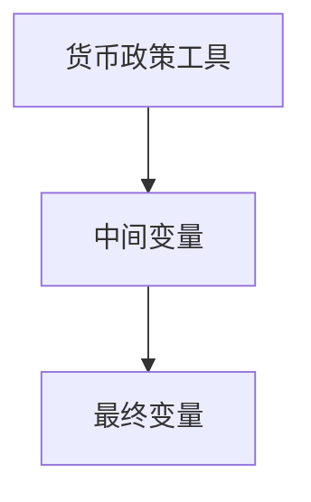
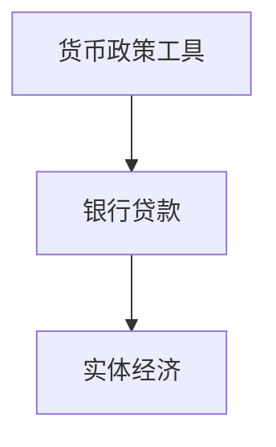
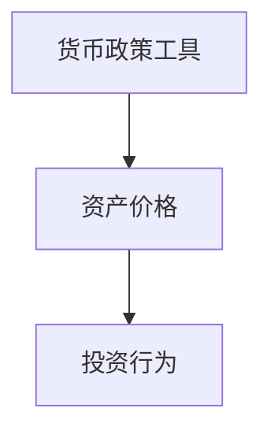
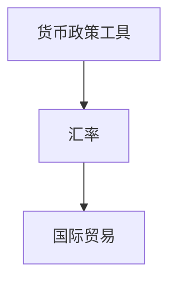

                 


```markdown
# 《金融领域因果推断在货币政策传导机制分析中的应用》

## 关键词：
- 因果推断
- 货币政策传导机制
- 金融领域
- 经济学
- 数据分析

## 摘要：
本文探讨了因果推断在分析货币政策传导机制中的应用，通过构建因果图模型和路径分析，深入解析货币政策对金融市场的因果效应。文章结合实际案例，展示了如何在银行、资本市场和汇率等领域应用因果推断方法，解决传统相关分析无法解决的因果关系问题。

---

# 第一部分：引言

## 第1章：因果推断与货币政策传导机制概述

### 1.1 背景介绍
- **因果推断的定义**：因果推断是一种分析方法，用于确定变量间的因果关系，而不仅仅是相关关系。
- **货币政策传导机制的复杂性**：传统相关分析无法明确区分因果关系，导致政策效果评估困难。
- **本文目标**：通过因果推断方法，明确货币政策对金融市场的影响路径和效应。

### 1.2 核心概念
- **因果关系与相关关系的区别**：相关关系表示变量间的关联，而因果关系表示变量间的因果作用。
- **货币政策传导机制**：包括利率、信贷、资产价格等渠道，影响整体经济和金融市场。
- **因果图模型**：用于表示变量间的因果关系，帮助识别因果路径。

### 1.3 分析框架
- **因果图构建**：通过Mermaid图展示货币政策传导机制的因果关系。
- **路径分析**：分解因果路径，明确各渠道的作用机制。
- **因果效应估计**：量化货币政策对金融市场的影响效果。

---

# 第二部分：因果推断的理论基础

## 第2章：因果关系的基本原理

### 2.1 因果关系的定义与特征
- **定义**：因果关系是指一个事件的发生导致另一个事件发生的必然联系。
- **特征**：时间顺序、相关性、排除其他变量的干扰。

### 2.2 因果关系与相关关系的区别
| 特性         | 相关关系                | 因果关系                |
|--------------|-------------------------|-------------------------|
| **方向性**   | 非方向性                | 具有方向性               |
| **干预性**   | 无法通过干预改变         | 可通过干预改变            |
| **外生性**   | 仅反映变量间的关联      | 包含变量间的因果作用     |

### 2.3 因果关系的数学表示
- **公式**：$Y = \beta X + \epsilon$，其中$\epsilon$表示其他因素的影响。

### 2.4 因果推断的基本假设
- **条件独立性假设**：在给定的条件下，变量X和Y独立。
- **无隐藏共谋者**：不存在未观测到的变量同时影响X和Y。

---

## 第3章：因果推断的主要方法

### 3.1 调整法（Backdoor Criterion）
- **定义**：通过调整混杂变量，识别因果效应。
- **步骤**：
  1. 确定混杂变量。
  2. 调整混杂变量，计算条件概率。
- **公式**：$P(Y|do(X)) = P(Y|X, Z)P(Z)$，其中Z为混杂变量。

### 3.2 切断法（Do-terior）
- **定义**：通过切断因果图中的后门路径，识别因果效应。
- **步骤**：
  1. 构建因果图。
  2. 切断后门路径，计算因果效应。
- **公式**：$P(Y|do(X)) = \sum_{x} P(Y|X=x, Z)P(X=x)$。

### 3.3 隐变量方法
- **定义**：通过引入隐变量，简化因果关系的分析。
- **步骤**：
  1. 假设存在隐变量。
  2. 通过观测数据估计隐变量的影响。
- **公式**：$P(Y|X) = P(Y|X, Z)P(Z|X)$。

### 3.4 高维数据的因果推断方法
- **定义**：适用于大数据环境下的因果推断。
- **工具**：使用机器学习算法，如随机森林、神经网络等。

---

# 第三部分：货币政策传导机制的因果分析框架

## 第4章：货币政策传导机制的因果图模型

### 4.1 因果图的构建
- **步骤**：
  1. 确定变量：货币政策工具（如利率）、中间变量（如信贷、资产价格）、最终变量（如GDP、通胀）。
  2. 确定因果关系：利率影响信贷，信贷影响资产价格，资产价格影响GDP。
- **Mermaid图**：


### 4.2 货币政策传导机制的路径分解
- **路径分解**：从货币政策工具到中间变量再到最终变量。
- **公式**：$P(C|do(A)) = P(C|A, B)P(B|A)$。

### 4.3 因果效应的估计
- **公式**：$P(C|do(A=a)) = \sum_{b} P(C|A=a, B=b)P(B=b)$。

---

## 第5章：货币政策传导机制的实证分析

### 5.1 数据来源与处理
- **数据来源**：央行公开数据、金融市场的交易数据。
- **数据处理**：清洗、标准化、特征提取。

### 5.2 案例分析：银行贷款渠道
- **分析方法**：使用调整法估计银行贷款的因果效应。
- **结果**：证明利率变化对银行贷款有显著影响。

### 5.3 案例分析：资产价格渠道
- **分析方法**：使用切断法估计资产价格的因果效应。
- **结果**：证明资产价格变化对整体经济的影响。

---

# 第四部分：金融领域的具体应用

## 第6章：银行贷款渠道的因果分析

### 6.1 银行贷款渠道的定义
- **定义**：货币政策通过影响银行贷款供给，进而影响实体经济。

### 6.2 因果图模型


### 6.3 因果效应的估计
- **公式**：$P(C|do(A=a)) = \sum_{b} P(C|B=b, A=a)P(B=b)$。

## 第7章：资本市场渠道的因果分析

### 7.1 资本市场渠道的定义
- **定义**：货币政策通过影响资产价格，进而影响投资和消费。

### 7.2 因果图模型


### 7.3 因果效应的估计
- **公式**：$P(C|do(A=a)) = \sum_{b} P(C|B=b, A=a)P(B=b)$。

## 第8章：汇率渠道的因果分析

### 8.1 汇率渠道的定义
- **定义**：货币政策通过影响汇率，进而影响出口和进口。

### 8.2 因果图模型


### 8.3 因果效应的估计
- **公式**：$P(C|do(A=a)) = \sum_{b} P(C|B=b, A=a)P(B=b)$。

---

# 第五部分：案例分析与应用

## 第9章：实际案例分析

### 9.1 案例背景
- **案例**：2020年新冠疫情后的货币政策实施。
- **数据来源**：各国央行的政策数据和金融市场数据。

### 9.2 案例分析
- **方法**：使用因果推断方法，分析货币政策对不同金融市场的因果效应。

### 9.3 分析结果
- **结果**：证明因果推断方法在实际分析中的有效性。

---

# 第六部分：未来展望与挑战

## 第10章：未来挑战与发展趋势

### 10.1 当前挑战
- **数据质量**：高维数据和噪声数据的处理。
- **模型选择**：因果推断方法的适用性和准确性。

### 10.2 未来趋势
- **多维因果推断**：结合机器学习和深度学习的方法。
- **实时分析**：实时监测货币政策的传导效果。

---

# 第七部分：总结与参考文献

## 第11章：总结

### 11.1 核心观点总结
- 因果推断在货币政策传导机制分析中的重要性。
- 不同金融渠道的因果效应估计方法。

### 11.2 未来研究方向
- 综合多种因果推断方法，构建更完善的分析框架。
- 应用新技术（如区块链）提升因果推断的准确性和实时性。

## 参考文献
- 这里列出相关的参考文献，包括书籍、期刊文章和在线资源。

---

# 附录

## 附录A：因果推断的Python实现代码

```python
import pandas as pd
import numpy as np
from causallearn.causal_model import CausalModel
from causallearn.estimator import DoWhy

# 数据加载
data = pd.read_csv('data.csv')

# 构建因果图
cm = CausalModel()
cm.add_edge('A', 'B')
cm.add_edge('B', 'C')

# 因果效应估计
estimator = DoWhy()
effect = estimator.estimate_effect(cm, data, 'A', 'C')
print(effect)
```

## 附录B：因果图的Mermaid示例


---

以上是文章的详细目录和内容结构。根据实际需要，可以进一步补充和细化每个部分的内容，特别是加入更多的数学公式、实际案例分析和代码实现细节。
```

