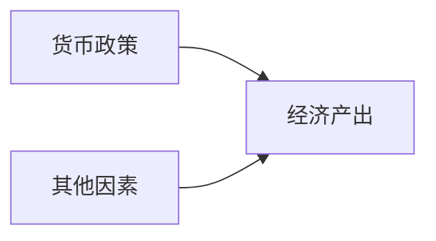

                 

## 《金融领域因果推理在货币政策效果分析中的应用》

### 关键词：因果推理，货币政策，经济产出，潜在结果模型，因果图，倾向评分匹配

### 摘要：本文深入探讨了因果推理在货币政策效果分析中的应用，从理论基础到实际案例，系统地介绍了如何通过因果推理方法准确评估货币政策的效果。通过构建潜在结果模型和因果图模型，分析货币政策的直接效应和间接效应，并结合倾向评分匹配和双重稳健回归等方法，提供了一个全面的分析框架，帮助读者理解因果推理在金融领域的实际应用。

---

## 第一部分：金融领域因果推理基础

### 第1章：因果推理与货币政策概述

#### 1.1 因果推理的基本概念

##### 1.1.1 因果关系的定义与特征

因果关系是指一个事件（原因）导致另一个事件（结果）发生的必然联系。在金融领域，因果推理用于分析政策或变量之间的因果关系，例如货币政策对经济产出的影响。

**特征：**
- **时间顺序性：** 原因发生在结果之前。
- **相关性：** 原因和结果相关联。
- **排除性：** 排除非混淆因素的影响。

##### 1.1.2 货币政策的机制与目标

货币政策通过调整利率、货币供应量等工具影响市场参与者的经济行为，进而影响整体经济产出。其目标通常包括控制通胀、促进就业和经济增长。

##### 1.1.3 因果推理在金融领域的应用背景

传统的统计方法难以有效分离变量之间的因果关系，特别是在存在多重变量和潜在混淆因素的情况下。因果推理提供了一种更严谨的方法来评估政策效果。

#### 1.2 货币政策效果分析的挑战

##### 1.2.1 货币政策效果的复杂性

货币政策的效果可能受到多种因素的影响，如市场预期、金融机构行为等，这使得效果的分析变得复杂。

##### 1.2.2 传统统计方法的局限性

传统回归分析难以避免混淆变量的影响，可能导致估计结果偏差。

##### 1.2.3 因果推理在货币政策分析中的优势

因果推理通过构建因果模型，能够更准确地识别政策变量的因果效应，控制其他潜在变量的干扰。

#### 1.3 本书的研究目标与结构安排

##### 1.3.1 研究目标

本文旨在探讨因果推理在货币政策效果分析中的应用，构建分析框架，提供实际案例。

##### 1.3.2 本书的结构安排

- 第一部分：因果推理基础
- 第二部分：因果推理在货币政策分析中的应用
- 第三部分：实际案例分析
- 第四部分：总结与展望

##### 1.3.3 预期成果与应用价值

通过本文，读者将能够掌握因果推理的基本概念和方法，并能够将其应用于货币政策效果分析中，提升政策评估的科学性和准确性。

### 第2章：因果推理的核心概念与数学模型

#### 2.1 潜在结果模型

##### 2.1.1 潜在结果模型的定义

潜在结果模型认为，每个观测单位在每个可能的处理水平下都有一个潜在的结果。

##### 2.1.2 潜在结果模型的数学表达

$$ Y_i^{do(t)} $$

其中，$Y_i$表示个体i的经济产出，$do(t)$表示将货币政策设置为t。

##### 2.1.3 平均处理效应（ATE）的公式推导

$$ ATE = E[Y^{do(t)}] $$

#### 2.2 因果图模型

##### 2.2.1 因果图的基本结构

因果图由节点和边组成，边表示因果关系。例如，货币政策（A）影响经济产出（B），同时其他因素（C）也可能影响经济产出。

##### 2.2.2 货币政策效果的因果图表示

#### 2.3 货币政策效果的因果关系特征

##### 2.3.1 货币政策的直接效应

货币政策直接影响经济产出的部分。

##### 2.3.2 货币政策的间接效应

货币政策通过其他变量（如市场预期）影响经济产出的部分。

##### 2.3.3 货币政策的总效应

直接效应和间接效应的总和。

### 第3章：因果推理在货币政策分析中的应用框架

#### 3.1 货币政策效果分析的因果推理框架

##### 3.1.1 货币政策的处理变量

货币政策工具，如利率调整。

##### 3.1.2 经济产出的响应变量

GDP增长率。

##### 3.1.3 其他相关变量的控制

如市场预期、消费者信心等。

#### 3.2 货币政策效果分析的因果识别策略

##### 3.2.1 倾向评分匹配（PSM）

通过估计每个样本在处理组的概率，进行匹配分析。

##### 3.2.2 双重稳健回归（DID）

通过双重差分法，控制个体固定效应和时间固定效应。

##### 3.2.3 因果图识别方法

根据因果图结构，识别处理变量和结果变量之间的路径。

#### 3.3 货币政策效果分析的验证方法

##### 3.3.1 内部验证方法

通过交叉验证等方法，验证模型的稳定性。

##### 3.3.2 外部验证方法

在外部数据集上验证模型的预测能力。

##### 3.3.3 模拟验证方法

通过模拟数据，验证模型的准确性。

#### 3.4 本章小结

通过构建因果推理框架，能够更准确地识别货币政策的因果效应，为政策制定提供科学依据。

---

## 第二部分：因果推理在货币政策分析中的应用框架

### 第4章：货币政策效果分析的因果推理方法

#### 4.1 倾向评分匹配（PSM）

##### 4.1.1 倾向评分的估计

通过 logistic回归模型估计每个样本在处理组的概率。

##### 4.1.2 匹配过程

根据倾向评分进行一对一或一对多匹配，构建平衡样本。

##### 4.1.3 匹配后的分析

通过回归分析，估计处理效应。

#### 4.2 双重稳健回归（DID）

##### 4.2.1 差分法

计算处理前后的差分。

##### 4.2.2 双重差分法

计算个体和时间的双重差分。

#### 4.3 因果图识别方法

##### 4.3.1 构建因果图

明确变量之间的因果关系。

##### 4.3.2 识别路径

识别处理变量到结果变量的路径。

##### 4.3.3 估计效应

通过截断潜在结果模型，估计因果效应。

### 第5章：货币政策效果分析的系统设计

#### 5.1 系统功能设计

##### 5.1.1 数据收集

收集货币政策执行情况、经济产出数据。

##### 5.1.2 模型选择

选择合适的因果推理模型。

##### 5.1.3 结果验证

验证模型的准确性和稳健性。

#### 5.2 系统架构设计

##### 5.2.1 数据流图

展示数据输入、处理、分析和输出的流程。

##### 5.2.2 模块划分

数据预处理模块、模型构建模块、结果分析模块。

#### 5.3 系统交互设计

##### 5.3.1 用户界面

展示分析结果的仪表盘。

##### 5.3.2 接口设计

API接口用于数据输入和输出。

---

## 第三部分：项目实战

### 第6章：货币政策效果分析的实战案例

#### 6.1 项目背景

分析某国央行降息政策对GDP的影响。

#### 6.2 数据收集与预处理

##### 6.2.1 数据来源

政府发布的经济数据、央行货币政策记录。

##### 6.2.2 数据清洗

处理缺失值、异常值。

#### 6.3 模型实现

##### 6.3.1 倾向评分匹配

使用Python的`pandas`和`sklearn`库进行倾向评分匹配。

##### 6.3.2 双重稳健回归

使用`statsmodels`库进行双重稳健回归分析。

#### 6.4 结果分析

##### 6.4.1 基准分析

估计降息政策的直接效应。

##### 6.4.2 稳健性检验

通过交叉验证和敏感性分析验证结果的稳定性。

#### 6.5 案例总结

##### 6.5.1 分析结果

降息政策显著提高了GDP增长率。

##### 6.5.2 政策启示

政策制定者应考虑政策的直接和间接效应。

#### 6.5.3 案例小结

通过实际案例分析，验证了因果推理方法的有效性。

---

## 第四部分：总结与展望

### 第7章：总结与展望

#### 7.1 本文总结

系统介绍了因果推理在货币政策效果分析中的应用，构建了分析框架，并通过案例验证了方法的有效性。

#### 7.2 未来展望

未来可以在更复杂的情境下应用因果推理，如多处理变量和高维数据的情况。

#### 7.3 最佳实践

- 明确研究目标和问题。
- 选择合适的因果推理方法。
- 进行充分的验证和稳健性检验。

#### 7.4 注意事项

- 数据质量对结果影响重大。
- 模型选择需根据具体情境。

#### 7.5 拓展阅读

推荐相关书籍和论文，进一步深入学习因果推理。

---

通过本文的系统介绍和实际案例分析，读者将能够掌握因果推理的基本概念和方法，并能够将其应用于货币政策效果分析中，提升政策评估的科学性和准确性。

