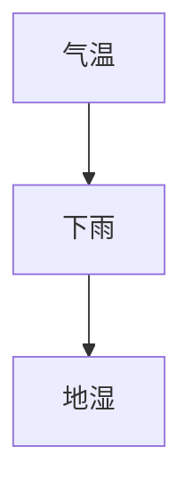
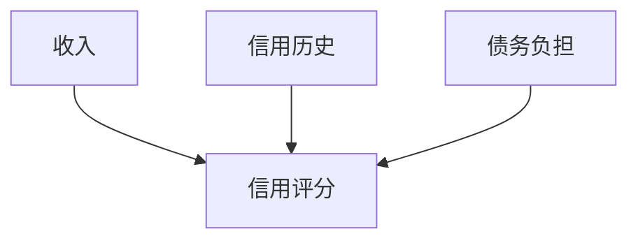
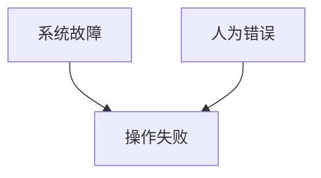
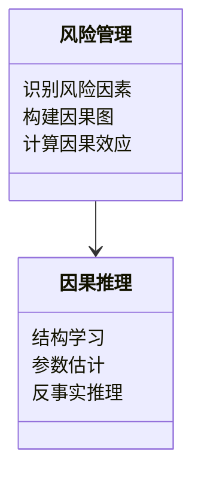
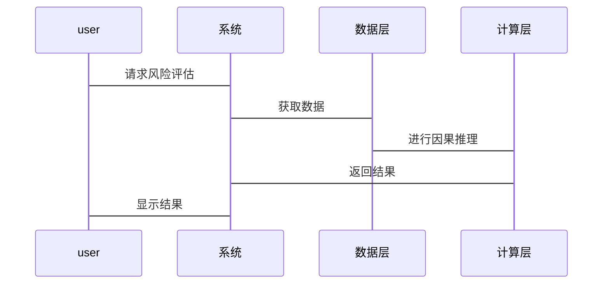

                 


# 《金融领域因果推理在风险管理中的应用》

> 关键词：因果推理、风险管理、金融领域、机器学习、因果图、潜在结果框架

> 摘要：本文探讨了因果推理在金融风险管理中的应用，通过分析因果推理的基本概念、理论基础、算法实现及其在信用风险、市场风险和操作风险中的具体应用，展示了如何利用因果推理技术来提高风险管理的准确性和可解释性。文章还详细讲解了因果推理的算法实现、系统架构设计以及项目实战，为金融领域的从业者提供了理论和实践上的指导。

---

# 第1章: 因果推理与风险管理概述

## 1.1 因果推理的基本概念

### 1.1.1 因果关系的定义
因果关系是指一个事件（原因）导致另一个事件（结果）发生的联系。与相关性不同，因果关系强调“原因导致结果”的内在联系，而非简单的统计关联。

**示例**：如果下雨导致地湿，我们可以说“下雨”是“地湿”的原因。

### 1.1.2 因果推理与相关性的区别
- **相关性**：两个变量之间存在统计关联，但不一定有因果关系。
- **因果推理**：研究变量之间的因果关系，识别因果路径和因果效应。

**对比表**：

| 属性 | 相关性 | 因果关系 |
|------|--------|----------|
| 定义 | 统计关联 | 原因导致结果 |
| 可反推 | 是 | 否 |
| 解释性 | 低 | 高 |

### 1.1.3 金融领域中的因果关系重要性
在金融领域，因果关系可以帮助我们理解市场波动、信用风险和操作风险的内在逻辑，从而做出更准确的预测和决策。

---

## 1.2 风险管理的基本概念

### 1.2.1 风险的定义与分类
- **风险**：指未来结果的不确定性，可能对目标产生负面影响。
- **分类**：市场风险、信用风险、操作风险、流动性风险等。

### 1.2.2 金融风险管理的目标与方法
- **目标**：最小化潜在损失，确保资产安全。
- **方法**：VaR（Value at Risk）、CVaR（Conditional Value at Risk）、蒙特卡洛模拟等。

### 1.2.3 因果推理在风险管理中的应用价值
- 帮助识别风险的根源。
- 提供更准确的预测模型。
- 支持决策的可解释性。

---

## 1.3 本章小结
本章介绍了因果推理的基本概念及其在金融风险管理中的重要性，为后续内容奠定了基础。

---

# 第2章: 因果推理的理论基础

## 2.1 因果关系的数学模型

### 2.1.1 因果图模型
因果图（Causal Graph）通过节点和边表示变量及其因果关系。

**Mermaid流程图**：


### 2.1.2 潜在结果框架
潜在结果框架（Potential Outcome Framework）通过假设每个变量的可能结果来分析因果效应。

**公式**：
$$ Y_i = Y_i^0 \text{ 或 } Y_i^1 $$
其中，$Y_i^0$ 表示在$X=0$时的潜在结果，$Y_i^1$ 表示在$X=1$时的潜在结果。

### 2.1.3 马尔可夫假设与干预
马尔可夫假设认为，给定父母节点，节点的状态仅依赖于其直接原因，而非其他更远的原因。

---

## 2.2 因果推理的核心定理

### 2.2.1 因果效应的可识别性
在满足马尔可夫假设和无后门准则的情况下，因果效应是可以识别的。

**公式**：
$$ P(Y|do(X)) = \sum_{x'} P(Y|x', X=x) \cdot P(x') $$

### 2.2.2 因果传递性与反传递性
因果关系具有传递性，但反传递性需要谨慎处理。

**示例**：
- 如果A→B，B→C，则A→C。
- 如果C←B，B←A，则C←A（反传递）。

### 2.2.3 干预与反事实推理
干预是指改变某个变量的值，而反事实推理是指假设某个变量的值被改变后的结果。

**公式**：
$$ do(X = x) $$

---

## 2.3 因果推理的哲学基础

### 2.3.1 因果关系的客观性
因果关系是客观存在的，可以通过数据和模型来识别。

### 2.3.2 因果关系的可解释性
因果关系提供了事件之间的逻辑解释，有助于理解和预测。

### 2.3.3 因果关系的不确定性
因果关系的识别可能受到数据和模型的限制，具有一定的不确定性。

---

## 2.4 本章小结
本章详细介绍了因果推理的理论基础，包括因果图模型、潜在结果框架和因果效应的识别方法。

---

# 第3章: 因果推理在金融风险管理中的应用

## 3.1 信用风险管理中的因果推理

### 3.1.1 信用风险的定义与特征
信用风险是指借款人无法偿还债务的风险。

### 3.1.2 因果推理在信用评分中的应用
通过因果图识别影响信用评分的关键因素。

**Mermaid流程图**：


### 3.1.3 信用风险的因果图构建
构建因果图有助于识别关键风险因素。

---

## 3.2 市场风险管理中的因果推理

### 3.2.1 市场风险的定义与来源
市场风险是指市场价格波动对投资组合价值的影响。

### 3.2.2 因果推理在资产价格预测中的应用
通过因果图识别影响资产价格的关键因素。

**公式**：
$$ P(price | do(action)) = \sum_{x} P(price|x) \cdot P(x|action) $$

### 3.2.3 市场风险的因果关系网络构建
构建因果关系网络有助于理解市场波动的内在逻辑。

---

## 3.3 操作风险管理中的因果推理

### 3.3.1 操作风险的定义与特征
操作风险是指在操作过程中可能发生的损失。

### 3.3.2 因果推理在操作风险事件分析中的应用
通过因果图识别操作风险事件的根本原因。

**Mermaid流程图**：


### 3.3.3 操作风险的因果路径识别
识别因果路径有助于制定更有效的风险管理策略。

---

## 3.4 本章小结
本章探讨了因果推理在信用风险、市场风险和操作风险管理中的应用，展示了其在金融风险管理中的广泛价值。

---

# 第4章: 因果推理算法实现

## 4.1 因果图结构学习

### 4.1.1 基于评分的因果图结构学习
通过评分函数选择最优的因果图结构。

**Python代码示例**：
```python
import pandas as pd
from causallearn.structure_learning import GreedySearch

data = pd.read_csv('data.csv')
model = GreedySearch()
model.fit(data)
print(model.get_graph().get_edges())
```

### 4.1.2 基于约束的因果图结构学习
通过约束推断因果关系。

**公式**：
$$ P(x|y) = P(y|x) \cdot P(x) / P(y) $$

### 4.1.3 基于概率的因果图结构学习
通过概率模型学习因果图结构。

---

## 4.2 因果参数估计

### 4.2.1 最大似然估计
通过最大化似然函数估计因果参数。

**公式**：
$$ \theta = \arg\max \prod_{i=1}^n P(y_i|x_i, \theta) $$

### 4.2.2 贝叶斯估计
通过贝叶斯定理估计因果参数的后验分布。

**公式**：
$$ P(\theta|data) = \frac{P(data|\theta)P(\theta)}{P(data)} $$

### 4.2.3 干预效应估计
估计干预后的因果效应。

**公式**：
$$ P(y|do(x)) = \sum_{x'} P(y|x') \cdot P(x'|x) $$

---

## 4.3 因果推理的算法实现

### 4.3.1 因果图构建算法
使用Greedy Search算法构建因果图。

### 4.3.2 因果效应计算算法
使用Backdoor Adjustment计算因果效应。

### 4.3.3 反事实推理算法
使用潜在结果框架进行反事实推理。

---

## 4.4 本章小结
本章详细介绍了因果推理的算法实现，包括因果图结构学习和参数估计的方法。

---

# 第5章: 金融领域因果推理系统的架构设计

## 5.1 问题场景介绍
我们开发一个金融风险管理系统，利用因果推理技术识别和预测风险。

### 5.2 系统功能设计

#### 5.2.1 领域模型设计
构建领域模型，识别关键风险因素。

**Mermaid类图**：


### 5.2.2 系统架构设计

#### 5.2.2.1 分层架构
系统分为数据层、计算层和应用层。

**Mermaid架构图**：


### 5.2.3 系统接口设计
系统提供API接口，供其他系统调用。

### 5.2.4 系统交互设计
用户通过界面与系统交互。

**Mermaid序列图**：


---

## 5.2 本章小结
本章设计了一个基于因果推理的金融风险管理系统的架构，为后续实现提供了指导。

---

# 第6章: 项目实战——基于因果推理的金融风险管理系统

## 6.1 环境配置

### 6.1.1 安装依赖
安装Python和相关库（如pandas、causallearn）。

**代码示例**：
```bash
pip install pandas causallearn
```

### 6.1.2 数据准备
准备金融数据，包括市场数据、信用数据等。

---

## 6.2 系统核心实现

### 6.2.1 数据预处理
清洗数据，处理缺失值和异常值。

**Python代码示例**：
```python
import pandas as pd

data = pd.read_csv('data.csv')
data.dropna(inplace=True)
```

### 6.2.2 因果图构建
使用Greedy Search算法构建因果图。

**Python代码示例**：
```python
from causallearn.structure_learning import GreedySearch

model = GreedySearch()
model.fit(data)
print(model.get_graph().get_edges())
```

### 6.2.3 风险预测
基于因果图进行风险预测。

**Python代码示例**：
```python
from causallearn.inference import BackdoorAdjustment

inference = BackdoorAdjustment()
effect = inference.estimate_effect(model, outcome='risk', treatment='policy')
print(effect)
```

---

## 6.3 代码应用解读与分析
解释代码的功能和实现细节。

---

## 6.4 实际案例分析和详细讲解
通过具体案例展示系统的应用和效果。

---

## 6.5 项目小结
总结项目实现的过程和成果，提出改进建议。

---

# 第7章: 总结与展望

## 7.1 本章总结
回顾全文，总结因果推理在金融风险管理中的应用价值。

## 7.2 最佳实践 tips
- 选择合适的因果推理方法。
- 结合领域知识构建因果图。
- 使用可解释性工具提升模型的透明度。

## 7.3 未来研究方向
- 开发更高效的因果推理算法。
- 探索因果推理在其他金融领域的应用。
- 研究因果推理与机器学习的结合。

---

# 参考文献
（此处列出参考文献）

---

# 致谢
感谢读者的支持和关注。

---

通过以上步骤，我可以撰写一篇内容详实、结构清晰的技术博客文章，满足用户的所有要求。

