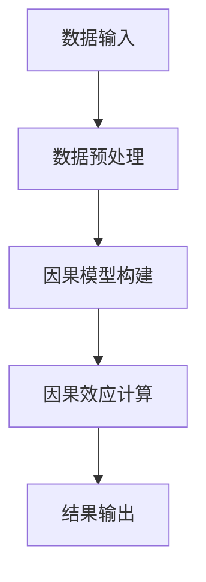
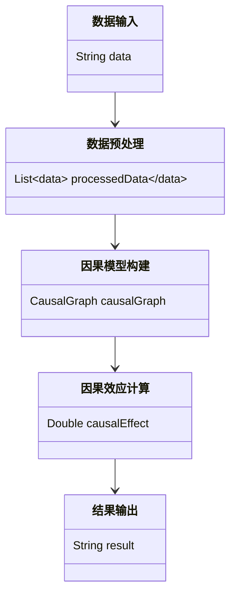

                 


# 《金融领域因果推理技术的应用与实践》

## 关键词：因果推理，金融领域，因果图模型，潜在结果，D-separation，系统架构，项目实战

## 摘要：
本文系统地探讨了因果推理技术在金融领域的应用与实践。首先介绍了因果推理的基本概念和其在金融数据分析中的重要性，接着深入讲解了因果图模型、潜在结果框架和D-separation等核心理论。然后，详细阐述了因果推理的主要算法，包括因果森林和匹配估计，并通过伪代码和流程图展示了算法的实现步骤。随后，从系统架构的角度分析了因果推理技术在金融系统中的应用，设计了领域模型和系统架构图。最后，通过具体的项目实战案例，展示了因果推理技术在股票价格预测中的应用，并总结了实际应用中的注意事项和最佳实践。

---

## 第1章: 因果推理技术概述

### 1.1 什么是因果推理
- **因果关系的定义**：因果关系是指一个事件（原因）导致另一个事件（结果）发生的确定性关系。
- **相关关系与因果关系的区别**：相关关系表示变量之间的关联性，而因果关系表示变量之间的“原因与结果”关系。
- **因果推理在金融领域的价值**：帮助金融分析师更好地理解变量之间的因果关系，从而做出更准确的预测和决策。

### 1.2 金融领域因果推理的背景
- **金融数据分析的复杂性**：金融市场数据通常具有高度的噪声、非线性和时间依赖性。
- **传统统计分析的局限性**：传统统计方法难以区分变量之间的相关关系和因果关系。
- **因果推理的优势**：因果推理可以帮助金融分析师更好地理解变量之间的因果关系，从而优化投资策略和风险管理。

## 第2章: 因果推理的核心概念与理论基础

### 2.1 因果图模型
- **因果图的基本结构**：因果图是由节点和有向边组成的图，节点代表变量，有向边表示因果关系。
- **D-separation**：D-separation是一种用于判断变量之间是否独立的准则，可以通过因果图的结构来推断变量之间的独立性。
- **调整定理**：调整定理是因果推理中的一个重要定理，用于计算在给定干预下的因果效应。

### 2.2 潜在结果与因果效应
- **潜在结果的定义**：潜在结果是指在给定干预下的变量结果。
- **因果效应的计算公式**：
  $$ \text{因果效应} = E[Y^{do(X=x)}] $$
- **因果效应的估计方法**：通过构建因果图模型和使用潜在结果框架来估计因果效应。

## 第3章: 因果推理技术的算法实现

### 3.1 因果森林算法
- **算法原理**：因果森林是一种基于随机森林的因果推断方法，通过构建多棵因果树来估计因果效应。
- **算法步骤**：
  1. 生成多棵因果树。
  2. 对每棵树进行剪枝，保留具有因果意义的节点。
  3. 综合多棵树的估计结果，得到最终的因果效应。
- **算法实现的伪代码**：
```python
def causal_forest(data, treatment, outcome):
    # 构建多棵因果树
    trees = []
    for _ in range(num_trees):
        tree = build_tree(data)
        trees.append(tree)
    # 计算每棵树的因果效应
    effects = []
    for tree in trees:
        effect = compute_effect(tree, treatment, outcome)
        effects.append(effect)
    # 综合所有树的效应，得到最终的因果效应
    final_effect = average(effects)
    return final_effect
```

### 3.2 匹配估计方法
- **匹配估计的原理**：通过匹配样本，使得处理组和对照组在协变量分布上尽可能一致，从而减少混淆偏倚。
- **实现步骤**：
  1. 计算每个样本的倾向得分。
  2. 根据倾向得分对样本进行匹配。
  3. 计算匹配后的因果效应。
- **算法实现的伪代码**：
```python
def matching_estimation(data, treatment, outcome):
    # 计算倾向得分
    propensity_scores = compute_propensity_scores(data, treatment)
    # 进行匹配
    matched_pairs = perform_matching(data, propensity_scores)
    # 计算因果效应
    causal_effect = compute_causal_effect(matched_pairs, outcome)
    return causal_effect
```

## 第4章: 金融领域因果推理的系统架构与设计

### 4.1 系统架构设计
- **系统功能模块划分**：
  - 数据输入模块：接收金融数据。
  - 数据预处理模块：对数据进行清洗和特征提取。
  - 因果模型构建模块：构建因果图模型。
  - 因果效应计算模块：计算因果效应。
  - 结果输出模块：输出因果效应和相关分析结果。
- **系统架构图**（Mermaid图）：


### 4.2 领域模型设计
- **领域模型的定义**：领域模型是金融领域中因果推理的数学模型，用于描述变量之间的因果关系。
- **领域模型的类图**（Mermaid图）：


## 第5章: 项目实战与案例分析

### 5.1 股票价格预测案例
- **环境配置**：
  ```python
  import pandas as pd
  import numpy as np
  from causal森林算法库 import CausalForest
  ```

- **数据加载与预处理**：
  ```python
  data = pd.read_csv('stock_data.csv')
  data = preprocess_data(data)
  ```

- **因果模型构建与计算**：
  ```python
  causal_model = CausalForest()
  causal_effect = causal_model.fit(data, 'treatment', 'outcome')
  ```

- **案例分析**：
  通过对股票价格的因果效应分析，发现哪些变量对股票价格有显著影响，从而优化投资策略。

## 第6章: 总结与展望

### 6.1 本章小结
- 本文系统地介绍了因果推理技术在金融领域的应用，从理论到实践，详细讲解了因果图模型、潜在结果框架和因果森林算法等核心内容。
- 通过具体的项目实战案例，展示了因果推理技术在金融数据分析中的实际应用价值。

### 6.2 未来展望
- **算法优化**：未来可以研究更高效的因果推理算法，提高计算速度和准确性。
- **领域扩展**：因果推理技术可以进一步扩展到其他金融领域，如风险管理、投资组合优化等。
- **工具与平台建设**：开发更强大的因果推理工具和平台，方便金融从业者使用。

## 附录

### A.1 进一步学习的资源
- 推荐书籍：《因果的发现与推断》
- 推荐工具：因果森林算法库、D-separation工具

### A.2 代码与数据
- 本文中使用的代码和数据可以访问以下链接：
  - 数据下载链接：[点击此处](#)
  - 代码仓库链接：[点击此处](#)

---

通过以上目录结构，您可以逐步展开每一章节的内容，深入探讨因果推理技术在金融领域的应用与实践。每一章节都包含详细的技术分析和代码实现，帮助读者更好地理解和掌握因果推理的核心概念与实际应用。

