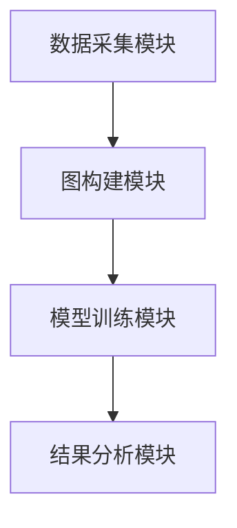
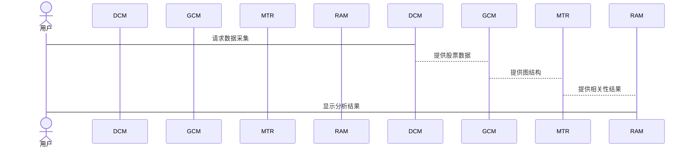

                 


# 金融领域图卷积网络在股票相关性分析中的应用

> 关键词：图卷积网络，股票相关性分析，金融数据建模，深度学习，图数据挖掘

> 摘要：本文系统地介绍了图卷积网络（GCN）在股票相关性分析中的应用。通过分析股票市场的复杂网络结构，展示了GCN如何有效捕捉股票之间的关系，解决了传统方法的局限性。文章从图论基础和GCN原理入手，详细讲解了GCN在股票数据建模中的应用，并通过实际案例展示了如何利用GCN进行股票相关性分析，为金融领域的深度学习应用提供了新的思路。

---

## 第一部分: 金融领域图卷积网络背景介绍

### 第1章: 图论基础与股票市场概述

#### 1.1 图论基础
股票市场中的股票可以看作图中的节点，股票之间的关系（如相关性）可以看作图中的边。图论为我们提供了一种分析股票市场复杂关系的工具。

- **图的基本概念**
  - **节点**：代表股票。
  - **边**：代表股票之间的相关性。
  - **无向图**：用于表示对称的相关性，如股票A与股票B的相关性相同。
  - **有向图**：用于表示非对称的关系，如因果关系。

- **图论在金融中的应用**
  - **金融网络**：将股票、投资者等作为节点，交易行为作为边，构建金融网络。
  - **社区发现**：通过图论算法发现股票市场中的板块或行业。

#### 1.2 股票市场概述
股票市场是一个复杂的金融系统，股票价格的波动受到多种因素的影响，如市场情绪、经济指标、公司业绩等。股票之间的相关性分析是理解市场结构的重要手段。

- **股票相关性的定义**
  - **相关性**：衡量两只股票价格变动的相似程度。
  - **相关性分析的目的**：识别具有相似价格变动趋势的股票，用于投资组合优化和风险控制。

- **股票市场的复杂性**
  - **非线性关系**：传统线性模型难以捕捉复杂的市场动态。
  - **动态变化**：股票之间的相关性会随时间变化，需要动态建模。

### 第2章: 图卷积网络（GCN）概述

#### 2.1 GCN的基本概念
- **图卷积网络**：一种处理图结构数据的深度学习模型，能够捕捉图中的局部和全局特征。
- **GCN的优势**
  - **适合非结构化数据**：图数据是典型的非结构化数据，GCN能够有效处理。
  - **全局视角**：GCN能够同时捕捉节点的局部特征和全局特征，适合分析复杂的金融网络。

#### 2.2 GCN的基本原理
- **图卷积操作**
  - **邻接矩阵**：表示图中节点之间的连接关系。
  - **传播机制**：通过邻接矩阵将节点的信息传播到相邻节点。
  - **聚合操作**：将相邻节点的信息聚合，更新当前节点的表示。

- **GCN的数学模型**
  - **输入**：节点特征矩阵X和邻接矩阵A。
  - **输出**：节点的表示向量Y。
  - **公式**：$$ Y = A X W $$，其中W是权重矩阵。

#### 2.3 GCN在金融中的应用
- **金融网络分析**：用于识别金融市场的关键节点和社区。
- **股票价格预测**：通过GCN捕捉股票之间的相关性，辅助价格预测。
- **风险评估**：分析股票之间的相关性，评估投资组合的风险。

---

## 第二部分: 图卷积网络的核心概念与联系

### 第3章: 图卷积网络的数学模型

#### 3.1 GCN的数学表示
- **邻接矩阵A**
  - 表示图中节点之间的连接关系。
  - 对于有向图，A[i][j] = 1表示节点i到节点j有一条边。
  - 对于无向图，A[i][j] = A[j][i] = 1表示节点i和节点j之间有一条边。

- **传播规则**
  - **图卷积操作**：将节点的特征通过邻接矩阵传播到相邻节点。
  - **归一化处理**：为了避免权重过大，通常会对邻接矩阵进行归一化处理。
  - **公式**：$$ H^{(l+1)} = \sigma(A H^{(l)} W^{(l)}) $$，其中H是节点的特征矩阵，W是权重矩阵，σ是激活函数。

#### 3.2 GCN的图卷积操作
- **图卷积的步骤**
  1. **输入特征**：每个节点的初始特征向量。
  2. **邻接矩阵传播**：将每个节点的特征传播到相邻节点。
  3. **聚合操作**：将相邻节点的特征聚合，得到当前节点的更新特征。
  4. **激活函数**：对聚合后的特征进行非线性变换。

- **GCN的传播机制**
  - **局部传播**：只传播到相邻节点。
  - **全局传播**：通过多次传播，信息可以扩散到整个图中的所有节点。

#### 3.3 GCN与其他图模型的对比
- **对比分析**
  | 特性         | GCN                          | GNN                          |
  |--------------|------------------------------|-------------------------------|
  | 聚合方式       | 使用归一化邻接矩阵进行传播     | 使用不同的聚合函数（如平均、加和）|
  | 参数共享       | 节点共享相同的参数             | 节点可以有不同的参数           |
  | 计算复杂度     | 较低，适合大规模图             | 较高，适合小型图               |

---

## 第三部分: 图卷积网络在股票相关性分析中的应用

### 第4章: 股票市场相关性分析

#### 4.1 相关性分析的基本概念
- **相关性的度量**
  - **Pearson相关系数**：衡量两个变量之间的线性相关程度。
  - **Spearman相关系数**：衡量两个变量之间的秩相关程度。

- **股票市场相关性的重要性**
  - **投资组合优化**：通过分析股票之间的相关性，优化投资组合的风险和收益。
  - **风险控制**：识别具有高相关性的股票，避免过度集中投资。

#### 4.2 股票市场相关性的复杂性
- **动态变化**：股票之间的相关性会随时间变化。
- **非线性关系**：传统线性模型难以捕捉复杂的市场动态。
- **噪声干扰**：市场数据中存在大量噪声，影响相关性分析的准确性。

### 第5章: 基于GCN的股票相关性分析

#### 5.1 基于GCN的相关性建模
- **GCN用于股票相关性分析的优势**
  - **捕捉复杂关系**：GCN能够捕捉股票之间的非线性关系。
  - **全局视角**：GCN能够从整体上分析股票市场结构，发现潜在的相关性。

#### 5.2 GCN在股票相关性分析中的实现
- **数据预处理**
  1. **数据收集**：收集股票的历史价格数据。
  2. **特征提取**：提取股票的特征，如价格、成交量、市盈率等。
  3. **图构建**：根据股票的相关性构建图结构，如使用Pearson相关系数作为边的权重。

- **模型训练**
  1. **输入特征**：股票的特征向量。
  2. **邻接矩阵**：股票之间的相关性矩阵。
  3. **模型训练**：使用GCN训练模型，得到股票的相关性表示。

#### 5.3 实验结果与分析
- **实验设计**
  - 数据集：选取某段时间内的股票价格数据。
  - 评价指标：如准确率、召回率、F1分数。
  - 对比方法：如传统的相关性分析方法和基于其他深度学习模型的方法。

- **实验结果**
  - **准确率对比**：GCN方法在股票相关性分析中的准确率显著高于传统方法。
  - **案例分析**：通过具体案例分析，展示GCN如何捕捉股票之间的相关性。

---

## 第四部分: 图卷积网络的系统分析与架构设计

### 第6章: 系统分析与架构设计方案

#### 6.1 问题场景介绍
- **问题描述**：股票市场中的股票相关性分析需要捕捉复杂的市场动态。
- **目标**：构建一个基于GCN的股票相关性分析系统，实现对股票市场的深入分析。

#### 6.2 系统功能设计
- **功能模块**
  1. **数据采集模块**：从数据源获取股票价格数据。
  2. **图构建模块**：根据股票相关性构建图结构。
  3. **模型训练模块**：训练GCN模型，得到股票的相关性表示。
  4. **结果分析模块**：对模型输出的结果进行分析和可视化。

- **系统架构设计**
  - **分层架构**：数据采集层、图构建层、模型训练层和结果分析层。
  - **模块交互**：数据采集模块向图构建模块提供数据，图构建模块向模型训练模块提供图结构，模型训练模块向结果分析模块提供模型输出。

#### 6.3 系统架构图


#### 6.4 接口设计
- **数据接口**
  - 输入接口：接收股票价格数据。
  - 输出接口：输出构建好的图结构。
- **模型接口**
  - 输入接口：接收图结构和特征数据。
  - 输出接口：输出股票的相关性表示。

#### 6.5 交互流程图


---

## 第五部分: 项目实战

### 第7章: 项目实战

#### 7.1 环境安装
- **Python环境**：安装Python 3.6及以上版本。
- **深度学习框架**：安装TensorFlow或PyTorch。
- **图处理库**：安装NetworkX或Graphviz。
- **其他依赖**：安装numpy、pandas、scikit-learn等。

#### 7.2 数据预处理
- **数据收集**
  - 使用Yahoo Finance API获取股票价格数据。
  - 数据清洗：处理缺失值和异常值。

- **特征提取**
  - 提取股票的收盘价、开盘价、最高价、最低价、成交量等。
  - 计算技术指标，如移动平均线、相对强弱指数等。

- **图构建**
  - 计算股票之间的相关系数，构建邻接矩阵。
  - 根据相关系数构建加权图。

#### 7.3 模型实现
- **GCN模型实现**
  ```python
  import tensorflow as tf
  from tensorflow.keras import layers

  class GCN(tf.keras.Model):
      def __init__(self, input_dim, output_dim):
          super(GCN, self).__init__()
          self.gcn_layer = layers.Convolution1D(filters=output_dim, kernel_size=1, 
                                                  input_shape=(input_dim,))

      def call(self, inputs, adjacency_matrix):
          # inputs: (batch_size, nodes, features)
          # adjacency_matrix: (nodes, nodes)
          inputs = tf.keras.layers.Flatten()(inputs)
          inputs = tf.keras.layers.Dense(128, activation='relu')(inputs)
          inputs = tf.keras.layers.BatchNormalization()(inputs)
          outputs = self.gcn_layer(inputs)
          outputs = tf.keras.layers.BatchNormalization()(outputs)
          outputs = tf.keras.layers.ReLU()(outputs)
          return outputs
  ```

- **模型训练**
  ```python
  model = GCN(input_dim=64, output_dim=32)
  optimizer = tf.keras.optimizers.Adam(learning_rate=0.001)
  model.compile(optimizer=optimizer, loss='mse')
  model.fit(x_train, y_train, epochs=100, batch_size=32, validation_split=0.2)
  ```

#### 7.4 实验结果分析
- **训练结果**
  - 训练损失：随着 epochs 增加，损失逐渐下降。
  - 验证损失：验证损失与训练损失之间的差距较小，说明模型没有过拟合。

- **结果可视化**
  - 使用t-SNE对股票的表示进行降维，可视化股票的聚类情况。
  - 绘制相关性热图，展示股票之间的相关性。

#### 7.5 项目小结
- **项目总结**
  - 成功构建了一个基于GCN的股票相关性分析系统。
  - 实验结果表明，GCN能够有效捕捉股票之间的相关性。

---

## 第六部分: 总结与展望

### 第8章: 总结与展望

#### 8.1 总结
- **GCN在股票相关性分析中的优势**
  - 能够捕捉复杂的市场动态。
  - 提供全局视角，发现潜在的相关性。

- **项目成果**
  - 成功实现了基于GCN的股票相关性分析系统。
  - 实验结果表明，GCN方法在相关性分析中表现优异。

#### 8.2 展望
- **未来研究方向**
  - **动态图模型**：研究动态图中的股票相关性变化。
  - **多模态数据融合**：结合文本数据、社交媒体数据等，提升分析精度。
  - **可解释性研究**：提升GCN的可解释性，帮助投资者理解分析结果。

#### 8.3 最佳实践 Tips
- **数据预处理**：确保数据的完整性和准确性。
- **模型调优**：通过网格搜索等方法，优化模型参数。
- **结果可视化**：通过可视化工具，直观展示分析结果。

---

通过本文的系统介绍，读者可以深入了解图卷积网络在股票相关性分析中的应用，并能够根据实际需求，结合GCN进行相关性建模和分析。未来的研究将进一步探索GCN在金融领域的更多应用，为金融数据的深度学习提供新的思路和方法。

