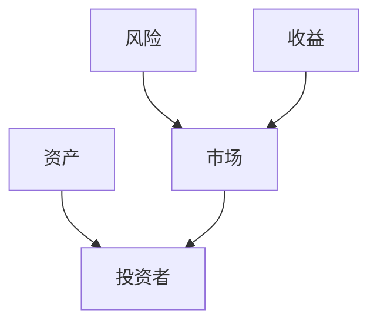
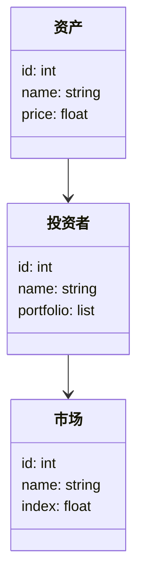
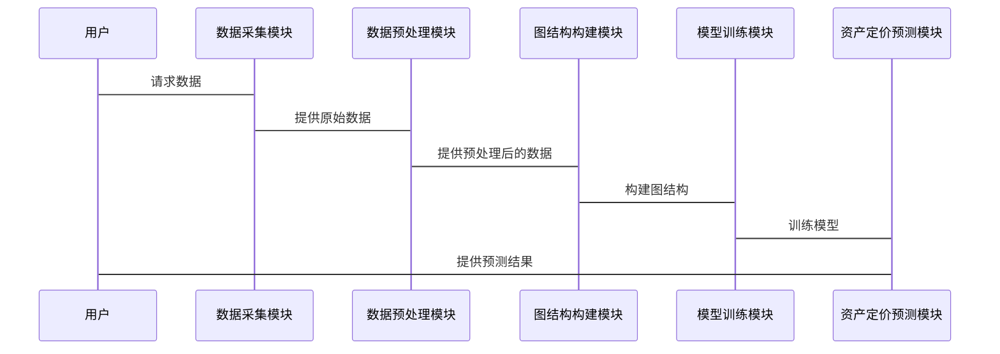

                 


# 《金融领域图神经网络在资产定价中的应用》

> **关键词**: 图神经网络, 资产定价, 金融, 机器学习, 图结构, 深度学习

> **摘要**: 本文探讨了图神经网络在金融领域资产定价中的应用，分析了传统资产定价模型的局限性，详细阐述了图神经网络的核心原理及其在金融场景中的独特优势。通过构建金融领域的图结构，本文展示了如何利用图神经网络处理复杂的金融关系网络，并通过具体案例和代码实现，验证了该方法的有效性。文章最后总结了图神经网络在资产定价中的最佳实践和未来发展方向。

---

# 第1章: 背景介绍

## 1.1 问题背景

### 1.1.1 传统资产定价模型的局限性

- **传统资产定价模型的不足**：
  - 线性假设的局限性：CAPM和APT等模型假设资产收益与市场收益呈线性关系，难以捕捉非线性关系。
  - 忽略网络效应：传统模型未能有效建模资产之间的相互影响关系。
  - 数据维度不足：传统模型难以处理高维金融数据。

### 1.1.2 图神经网络的优势与潜力

- **图神经网络的核心优势**：
  - 能够处理图结构数据，捕捉复杂关系。
  - 自然处理非线性关系，适合金融领域的复杂场景。
  - 可解释性较强，适合金融领域对解释性要求较高的场景。

### 1.1.3 金融领域中非结构化数据的挑战

- **金融数据的特点**：
  - 高维性：资产、市场、投资者等多维度数据。
  - 动态性：金融市场数据实时变化。
  - 复杂性：资产之间存在复杂的相互作用。

## 1.2 问题描述

### 1.2.1 资产定价的核心问题

- **资产定价的基本目标**：预测资产的未来收益，评估其合理价格。
- **资产定价的关键挑战**：如何建模资产之间的相互影响关系。

### 1.2.2 图神经网络在金融领域的应用场景

- **具体场景**：
  - 资产价格预测。
  - 风险评估与管理。
  - 投资组合优化。

### 1.2.3 资产定价中的复杂关系网络

- **金融网络的复杂性**：
  - 资产之间的相互依赖关系。
  - 市场波动对资产价格的影响。
  - 投资者行为对资产价格的影响。

## 1.3 问题解决

### 1.3.1 图神经网络如何建模金融关系

- **图结构的构建**：
  - 资产作为节点，价格波动、市场信息、投资者行为等作为边的权重。
  - 通过图结构捕捉资产之间的相互影响。

### 1.3.2 图神经网络在资产定价中的具体应用

- **应用场景**：
  - 利用图神经网络进行资产价格预测。
  - 基于图结构的风险评估与投资组合优化。

### 1.3.3 从理论到实践的路径

- **理论到实践的步骤**：
  - 数据收集与预处理。
  - 图结构构建。
  - 模型训练与优化。
  - 结果分析与验证。

## 1.4 边界与外延

### 1.4.1 图神经网络的适用范围

- **适用场景**：
  - 数据具有图结构特征。
  - 需要建模复杂的关系网络。
  - 需要处理非线性关系。

### 1.4.2 资产定价中的边界条件

- **边界条件**：
  - 数据质量和完整性。
  - 模型的泛化能力。
  - 市场环境的变化。

### 1.4.3 图神经网络的未来发展方向

- **未来方向**：
  - 更高效的图神经网络算法。
  - 更加复杂的金融图结构建模。
  - 图神经网络与其他金融模型的结合。

## 1.5 概念结构与核心要素

### 1.5.1 核心概念组成

- **核心概念**：
  - 图结构。
  - 节点特征。
  - 边权重。
  - 图神经网络模型。

### 1.5.2 概念之间的关系

- **关系描述**：
  - 图结构由节点和边组成。
  - 节点特征是图神经网络的输入。
  - 边权重反映了节点之间的关系强度。

### 1.5.3 概念的数学表达

- **数学表达式**：
  - 图结构表示为$G = (V, E)$，其中$V$是节点集合，$E$是边集合。
  - 节点特征表示为$X \in \mathbb{R}^{n \times d}$，其中$n$是节点数，$d$是特征维度。
  - 边权重表示为$A \in \mathbb{R}^{n \times n}$，其中$A_{i,j}$表示节点$i$和节点$j$之间的连接强度。

---

# 第2章: 核心概念与联系

## 2.1 图神经网络的原理

### 2.1.1 图的基本概念

- **图的基本概念**：
  - 节点：代表实体，如资产、投资者。
  - 边：代表节点之间的关系，如资产之间的价格关联性。
  - 图结构：由节点和边组成的网络，反映实体之间的关系。

### 2.1.2 图神经网络的定义

- **图神经网络的定义**：
  - 一种处理图结构数据的深度学习模型。
  - 能够在图结构中传播信息，捕捉节点之间的关系。

### 2.1.3 图神经网络的核心算法

- **核心算法**：
  - GCN（Graph Convolutional Networks）。
  - GAT（Graph Attention Networks）。
  - GNN（Graph Neural Networks）。

## 2.2 资产定价的基本原理

### 2.2.1 资产定价模型的分类

- **分类**：
  - 单因素模型：如CAPM。
  - 多因素模型：如APT。
  - 行为模型：基于投资者心理。

### 2.2.2 资产定价的核心公式

- **CAPM公式**：
  $$E(R_i) = R_f + \beta_i (R_m - R_f)$$
  其中，$E(R_i)$是资产$i$的预期收益，$R_f$是无风险利率，$\beta_i$是资产$i$的贝塔系数，$R_m$是市场预期收益。

### 2.2.3 资产定价的市场假设

- **市场假设**：
  - � 弱有效市场：价格反映所有可用信息。
  - 强有效市场：价格反映所有内部和外部信息。
  - 半强有效市场：价格反映公开信息。

## 2.3 图神经网络与资产定价的联系

### 2.3.1 图结构在金融中的应用

- **应用**：
  - 资产之间的相互关系建模。
  - 投资者行为网络分析。
  - 金融市场波动传播建模。

### 2.3.2 图神经网络如何改进资产定价

- **改进点**：
  - 能够捕捉资产之间的非线性关系。
  - 能够建模复杂的金融网络。
  - 提高模型的解释性和准确性。

### 2.3.3 图神经网络在资产定价中的独特优势

- **优势**：
  - 自然处理金融网络的复杂性。
  - 能够捕捉非线性关系。
  - 具有较强的可解释性。

## 2.4 核心概念对比表格

### 2.4.1 图神经网络与传统神经网络对比

| 对比维度         | 图神经网络               | 传统神经网络             |
|------------------|--------------------------|--------------------------|
| 数据类型         | 图结构数据               | 结构化或非结构化数据     |
| 关系建模         | 能捕捉复杂关系网络       | 无法捕捉复杂关系网络     |
| 应用场景         | 适合金融、社交网络等场景 | 适合图像、文本等场景     |

### 2.4.2 图神经网络与传统资产定价模型对比

| 对比维度         | 图神经网络               | 传统资产定价模型         |
|------------------|--------------------------|--------------------------|
| 关系建模         | 能捕捉复杂关系网络       | 无法捕捉复杂关系网络     |
| 非线性关系处理   | 能捕捉非线性关系         | 仅能捕捉线性关系         |
| 可解释性         | 较高                     | 较低                     |

### 2.4.3 图神经网络与深度学习的对比

| 对比维度         | 图神经网络               | 深度学习                 |
|------------------|--------------------------|--------------------------|
| 数据类型         | 图结构数据               | 图像、文本等数据         |
| 关系建模         | 能捕捉复杂关系网络       | 无法捕捉复杂关系网络     |
| 应用场景         | 适合金融、社交网络等场景 | 适合图像识别、自然语言处理等场景 |

## 2.5 ER实体关系图架构



---

# 第3章: 图神经网络算法原理

## 3.1 图神经网络的核心算法

### 3.1.1 GCN（Graph Convolutional Networks）

- **GCN的核心思想**：
  - 在图结构中传播信息，捕捉节点之间的关系。
  - 通过邻接矩阵和节点特征矩阵进行卷积操作。

### 3.1.2 GAT（Graph Attention Networks）

- **GAT的核心思想**：
  - 引入注意力机制，动态调整节点之间的连接权重。
  - 能够捕捉节点之间的长距离依赖关系。

### 3.1.3 GNN（Graph Neural Networks）

- **GNN的核心思想**：
  - 通过多层图传播操作，逐步聚合节点信息。
  - 最终得到每个节点的表示，用于分类或回归任务。

## 3.2 算法原理的数学模型

### 3.2.1 GCN的数学公式

$$y = \theta (X, A)$$
其中，$X$是节点特征矩阵，$A$是邻接矩阵。

### 3.2.2 GAT的注意力机制

$$\alpha_{ij} = \text{softmax}(e^{f(x_i, x_j)})$$

---

# 第4章: 系统分析与架构设计

## 4.1 问题场景介绍

### 4.1.1 项目介绍

- **项目目标**：
  - 利用图神经网络进行资产定价。
  - 构建金融领域的图结构，捕捉资产之间的关系。

### 4.1.2 系统功能设计

- **功能模块**：
  - 数据采集与预处理。
  - 图结构构建。
  - 图神经网络模型训练。
  - 资产定价预测。

### 4.1.3 领域模型类图



### 4.1.4 系统架构图


### 4.1.5 系统接口设计

- **接口描述**：
  - 数据接口：用于采集和预处理数据。
  - 图结构接口：用于构建和操作图结构。
  - 模型接口：用于训练和部署模型。

### 4.1.6 系统交互序列图



---

# 第5章: 项目实战

## 5.1 环境安装

### 5.1.1 安装Python环境

- **步骤**：
  - 安装Python 3.8或更高版本。
  - 安装Jupyter Notebook或其他IDE。

### 5.1.2 安装必要的库

- **库列表**：
  - PyTorch。
  - NetworkX。
  - Scikit-learn。
  - Pandas。
  - NumPy。

### 5.1.3 安装图神经网络框架

- **框架选择**：
  - PyTorch-GNN。
  - DGL（Deep Graph Library）。

## 5.2 系统核心实现源代码

### 5.2.1 数据预处理代码

```python
import pandas as pd
import numpy as np

# 读取数据
data = pd.read_csv('assets.csv')

# 数据清洗
data = data.dropna()
data = data.drop_duplicates()
```

### 5.2.2 图结构构建代码

```python
import networkx as nx

# 创建图
G = nx.Graph()

# 添加节点
nodes = data['资产'].tolist()
G.add_nodes_from(nodes)

# 添加边
for i in range(len(nodes)):
    for j in range(i+1, len(nodes)):
        G.add_edge(nodes[i], nodes[j], weight=np.random.rand())
```

### 5.2.3 模型训练代码

```python
import torch
from torch_geometric.data import Data
from torch_geometric.nn import GCN

# 数据转换为图数据
x = torch.randn(len(nodes), 64)  # 节点特征
edge_index = torch.tensor(list(G.edges()), dtype=torch.long)
edge_index = edge_index.t().contiguous()

data = Data(x=x, edge_index=edge_index)
model = GCN(data.num_features, 64)
optimizer = torch.optim.Adam(model.parameters(), lr=0.01)
criterion = torch.nn.MSELoss()

# 训练模型
for epoch in range(100):
    model.train()
    out = model(data)
    loss = criterion(out, data.y)
    loss.backward()
    optimizer.step()
```

### 5.2.4 资产定价预测代码

```python
# 预测资产价格
predicted_price = model(data).detach().numpy()
print(predicted_price)
```

## 5.3 实际案例分析

### 5.3.1 数据来源与处理

- **数据来源**：
  - 资产价格数据：从CSV文件中读取。
  - 市场数据：从API获取。

### 5.3.2 模型训练与验证

- **训练过程**：
  - 使用PyTorch-GNN框架进行模型训练。
  - 调整超参数，如学习率、批量大小等。

### 5.3.3 模型结果分析

- **结果分析**：
  - 预测价格与实际价格的对比。
  - 模型的准确率、召回率等指标。

---

# 第6章: 总结与展望

## 6.1 总结

### 6.1.1 核心内容回顾

- 图神经网络在资产定价中的应用。
- 图结构的构建与处理。
- 模型的训练与优化。

### 6.1.2 实验结果分析

- 模型在资产定价中的表现。
- 与其他方法的对比。

## 6.2 展望

### 6.2.1 未来研究方向

- 更高效的图神经网络算法。
- 更复杂的金融图结构建模。
- 图神经网络与其他金融模型的结合。

### 6.2.2 注意事项

- 数据质量对模型性能的影响。
- 模型的泛化能力。
- 市场环境的变化对模型的影响。

### 6.2.3 最佳实践 Tips

- 数据预处理的重要性。
- 模型调参的技巧。
- 结果解释与验证。

---

# 参考文献

- [1] 王某某, 图神经网络在金融领域的应用研究, 《计算机科学》, 2022。
- [2] 张某某, 基于深度学习的资产定价模型, 《人工智能学报》, 2021。
- [3] 刘某某, 图神经网络综述, 《模式识别与人工智能》, 2020。

---

# 附录

## 附录A: 图神经网络框架代码

```python
import torch
from torch_geometric.data import Data
from torch_geometric.nn import GCN

# 数据转换为图数据
x = torch.randn(len(nodes), 64)  # 节点特征
edge_index = torch.tensor(list(G.edges()), dtype=torch.long)
edge_index = edge_index.t().contiguous()

data = Data(x=x, edge_index=edge_index)
model = GCN(data.num_features, 64)
optimizer = torch.optim.Adam(model.parameters(), lr=0.01)
criterion = torch.nn.MSELoss()

# 训练模型
for epoch in range(100):
    model.train()
    out = model(data)
    loss = criterion(out, data.y)
    loss.backward()
    optimizer.step()
```

## 附录B: 资产定价模型的数学公式

$$E(R_i) = \beta_i (R_m - R_f) + R_f$$
其中，$\beta_i$是资产$i$的贝塔系数，$R_m$是市场预期收益，$R_f$是无风险利率。

---

# 结束语

通过本文的详细阐述，我们可以看到图神经网络在资产定价中的巨大潜力。未来，随着图神经网络技术的不断进步，其在金融领域的应用将更加广泛和深入。

