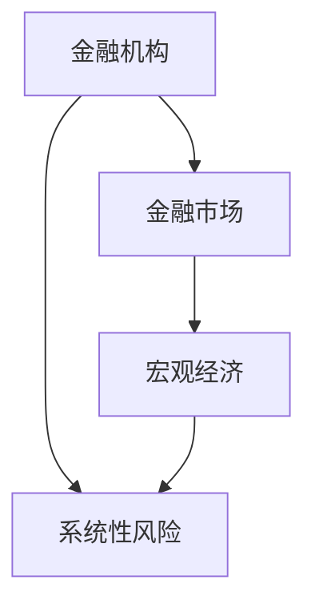

                 

# 《金融领域图表示学习在系统性风险传导中的应用》目录大纲

---

## 第一部分：系统性风险与图表示学习的背景

### 第1章：系统性风险与图表示学习的背景

#### 1.1 系统性风险的定义与特征
- 什么是系统性风险？
- 系统性风险的特征：传染性、全局性、复杂性
- 系统性风险的来源：金融机构、市场、宏观经济因素

#### 1.2 图表示学习的基本概念
- 图表示学习的定义
- 图表示学习的核心目标：节点表示、边表示、图表示
- 图表示学习的典型应用场景：社交网络、推荐系统、金融风险分析

#### 1.3 系统性风险与图表示学习的结合
- 系统性风险分析中的图结构建模
- 图表示学习在金融风险传导中的优势
- 系统性风险传导的图模型框架

---

## 第二部分：图表示学习的核心概念与原理

### 第2章：图表示学习的核心概念与联系

#### 2.1 图表示学习的核心概念
- 图论基础：图、节点、边、权重
- 表示学习：向量空间、低维嵌入、语义保留
- 图结构的特征：局部结构、全局结构、社区结构

#### 2.2 图表示学习的关键属性对比
- 节点嵌入与边嵌入的对比
- 静态图与动态图的对比
- 监督学习与无监督学习的对比

#### 2.3 系统性风险传导的ER实体关系图

---

## 第三部分：图表示学习的算法原理与数学模型

### 第3章：图神经网络与节点表示学习

#### 3.1 图神经网络（GCN）原理

- 图卷积操作的数学公式：
  $$ H^{(l+1)} = \text{ReLU}(H^{(l)} A H^{(l)}) $$

---

## 第四部分：系统分析与架构设计

### 第4章：系统分析与架构设计方案

#### 4.1 问题场景介绍
- 系统性风险传导的复杂性
- 图表示学习在金融风险中的应用需求

#### 4.2 系统功能设计
- 数据预处理模块：数据清洗、特征提取、图构建
- 模型训练模块：图神经网络训练、节点表示生成
- 风险评估模块：风险评分、风险传播路径分析

#### 4.3 系统架构设计

---

## 第五部分：项目实战与案例分析

### 第5章：项目实战与案例分析

#### 5.1 环境安装与配置
- Python环境的搭建
- 图表示学习库（如NetworkX、PyTorch）的安装

#### 5.2 系统核心实现源代码
- 数据预处理代码示例
- 图神经网络实现代码
- 风险评估代码示例

#### 5.3 案例分析与结果解读
- 数据来源与处理
- 模型训练与调优
- 风险评估与结果分析

---

## 第六部分：总结与展望

### 第6章：总结与展望

#### 6.1 核心内容回顾
- 图表示学习在系统性风险分析中的应用价值
- 关键算法与方法的总结

#### 6.2 最佳实践与注意事项
- 数据质量的重要性
- 模型调优的关键点
- 实际应用中的注意事项

#### 6.3 拓展阅读与未来方向
- 新的图表示学习算法的发展
- 系统性风险分析的其他技术手段

---

### 关键词：
金融领域、图表示学习、系统性风险、风险传导、图神经网络、节点表示学习

### 摘要：
本文系统性地探讨了图表示学习在金融领域中的应用，特别是其在系统性风险传导中的潜力。通过分析图表示学习的核心概念、算法原理及其在金融系统中的实际应用，本文为金融风险评估和管理提供了新的思路和解决方案。结合理论分析与实际案例，本文详细阐述了图神经网络在系统性风险传导中的建模方法和实现策略，为金融领域的技术实践者提供了有益的参考。

