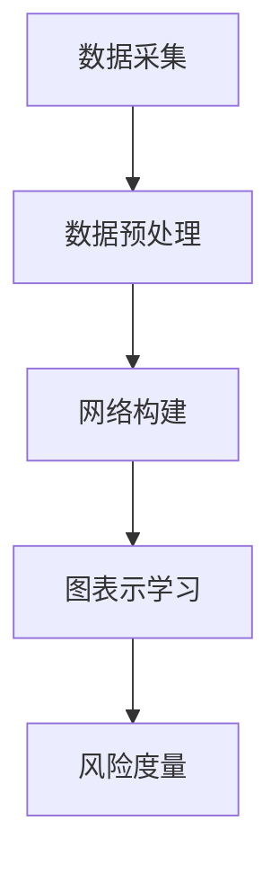

                 


# 《金融领域图表示学习在系统性风险度量中的应用》

> 关键词：系统性风险，图表示学习，金融网络，系统性风险度量，复杂网络，深度学习，金融风险评估

> 摘要：本文探讨了图表示学习在金融领域系统性风险度量中的应用。通过分析系统性风险的定义、测度方法以及图表示学习的核心算法，本文展示了如何利用图表示学习技术构建金融网络模型，从而更准确地度量系统性风险。文章从背景介绍、算法原理、系统架构设计到项目实战，详细阐述了图表示学习在金融风险管理中的应用，为金融领域的系统性风险评估提供了新的思路和方法。

---

# 第1章 系统性风险与图表示学习概述

## 1.1 系统性风险的定义与特征

### 1.1.1 系统性风险的定义
系统性风险是指由于金融系统中的某些重要因素（如经济衰退、政策变化或市场波动）导致整个金融系统发生系统性危机的可能性。与非系统性风险不同，系统性风险影响整个金融系统的稳定性，具有系统性、广泛性和传染性的特点。

### 1.1.2 系统性风险的核心特征
1. **系统性**：风险影响整个金融系统，而非单一机构或资产。
2. **传染性**：风险可能通过金融网络中的关联性从一个机构或资产传导到其他机构或资产。
3. **不可分割性**：系统性风险无法通过分散投资完全消除。

### 1.1.3 系统性风险的度量方法
1. **VaR（Value-at-Risk）**：衡量在一定置信水平下可能遭受的最大损失。
2. **CVaR（Conditional Value-at-Risk）**：衡量在VaR水平上的平均损失，考虑了尾部风险。
3. **系统性风险指数**：通过网络分析方法计算各金融机构对系统性风险的贡献度。

---

## 1.2 图表示学习的定义与特点

### 1.2.1 图表示学习的定义
图表示学习是一种通过将图结构中的节点或边映射到低维向量空间，以捕捉图的结构特征和语义信息的学习方法。其核心目标是将复杂的图数据转化为易于处理的向量表示，同时保留图的拓扑结构和语义信息。

### 1.2.2 图表示学习的核心特点
1. **全局性**：图表示学习不仅考虑单个节点的特征，还考虑节点之间的关系。
2. **鲁棒性**：能够处理图数据中的噪声和缺失值。
3. **可扩展性**：适用于大规模图数据的处理和分析。

---

## 1.3 金融领域中的图表示学习

### 1.3.1 金融领域的复杂网络特征
金融系统可以看作是一个复杂的网络，其中节点代表金融机构、资产或交易，边代表它们之间的关联性或交易关系。

### 1.3.2 图表示学习在金融中的应用潜力
1. **风险传播分析**：通过图表示学习，可以分析系统性风险在金融网络中的传播路径。
2. **机构间关联性分析**：通过图表示学习，可以量化金融机构之间的关联性，识别系统性风险的主要来源。
3. **实时风险监控**：通过动态更新图表示，可以实时监控金融系统的风险状况。

---

# 第2章 图表示学习的基础

## 2.1 图论基础

### 2.1.1 图的定义与表示
图由节点（顶点）和边组成，可以用邻接矩阵或邻接表的形式表示。

### 2.1.2 图的属性与特征
1. **节点度**：节点的度表示其连接的边数。
2. **中心性**：衡量节点在网络中的重要程度，包括度中心性、介数中心性和接近中心性。
3. **社区结构**：图中节点的社区划分，反映节点之间的紧密联系。

### 2.1.3 图的遍历算法
1. **深度优先搜索（DFS）**：从起点开始，尽可能深入访问未被访问的节点。
2. **广度优先搜索（BFS）**：从起点开始，逐层访问所有相邻节点。

---

## 2.2 表示学习的基础

### 2.2.1 向量空间模型
向量空间模型将文本或数据映射到高维向量空间中，通过向量的相似度衡量数据之间的关系。

### 2.2.2 嵌入技术的原理
嵌入技术通过训练模型将高维数据映射到低维嵌入空间，保留数据的语义信息。

### 2.2.3 图表示学习的目标函数
目标函数通常包括重构损失和正则化项，旨在优化节点或边的表示，使其能够准确反映图的结构特征。

---

## 2.3 图表示学习的核心算法

### 2.3.1 Node2Vec算法
Node2Vec是一种基于随机游走的节点表示学习算法，通过生成节点的上下文表示，学习节点的嵌入向量。

#### Node2Vec算法流程
1. **随机游走**：从起点开始，按照一定的概率选择下一个访问的节点。
2. **负采样**：通过负采样技术生成上下文节点。
3. **训练模型**：使用逻辑回归模型训练节点嵌入。

### 2.3.2 GraphSAGE算法
GraphSAGE是一种基于归纳式学习的图表示学习算法，通过聚合邻居节点的特征，生成节点的表示。

#### GraphSAGE算法流程
1. **初始化**：为每个节点初始化一个嵌入向量。
2. **聚合邻居特征**：通过聚合操作（如平均、最大值或加权和）生成节点的新嵌入。
3. **训练模型**：通过对比学习或分类任务训练模型。

### 2.3.3 GAT（Graph Attention Networks）算法
GAT是一种基于注意力机制的图表示学习算法，通过自注意力机制捕捉节点之间的关系。

#### GAT算法流程
1. **计算注意力权重**：通过多头注意力机制计算节点之间的注意力权重。
2. **聚合邻居特征**：根据注意力权重聚合邻居节点的特征。
3. **更新节点嵌入**：通过聚合结果更新节点的嵌入向量。

---

# 第3章 系统性风险度量的理论基础

## 3.1 系统性风险的度量方法

### 3.1.1 VaR（Value-at-Risk）
VaR是在给定置信水平下，资产可能遭受的最大损失。例如，在95%的置信水平下，VaR表示在95%的情况下，资产的最大损失不会超过该值。

### 3.1.2 CVaR（Conditional Value-at-Risk）
CVaR是在VaR水平上的平均损失，用于衡量尾部风险。例如，在95%的置信水平下，CVaR表示在5%的情况下，资产的平均损失。

### 3.1.3 系统性风险指数
系统性风险指数通过网络分析方法计算各金融机构对系统性风险的贡献度，反映了金融系统中的系统性风险水平。

---

## 3.2 金融网络的构建与分析

### 3.2.1 金融网络的构建
1. **数据来源**：包括金融机构之间的交易数据、资产价格数据、市场数据等。
2. **网络表示**：将金融机构或资产表示为图中的节点，交易或关联关系表示为边。

### 3.2.2 金融网络的分析方法
1. **网络中心性分析**：通过计算节点的中心性，识别金融网络中的关键节点。
2. **网络社区分析**：通过社区划分，识别金融网络中的关联性较强的子网络。
3. **网络风险传播分析**：通过图表示学习，分析风险在金融网络中的传播路径。

---

# 第4章 图表示学习在系统性风险度量中的应用

## 4.1 图表示学习在金融网络中的应用

### 4.1.1 金融网络的节点表示
通过图表示学习算法，将金融机构或资产映射到低维嵌入空间，反映其在网络中的重要性和关联性。

### 4.1.2 风险传播模型
基于图表示学习的嵌入向量，构建风险传播模型，分析系统性风险在金融网络中的传播路径。

---

## 4.2 系统性风险度量的案例分析

### 4.2.1 案例背景
以2008年金融危机为例，分析系统性风险在金融网络中的传播路径和影响。

### 4.2.2 数据准备
收集金融机构之间的交易数据和资产价格数据，构建金融网络。

### 4.2.3 图表示学习的应用
1. **节点表示**：使用Node2Vec算法生成金融机构的嵌入向量。
2. **风险传播分析**：基于嵌入向量，分析系统性风险的传播路径。

---

# 第5章 系统架构与实现

## 5.1 系统架构设计

### 5.1.1 系统功能设计
1. **数据采集**：采集金融机构的交易数据和资产价格数据。
2. **网络构建**：构建金融网络，表示金融机构之间的关联关系。
3. **图表示学习**：使用图表示学习算法生成节点嵌入向量。
4. **风险度量**：基于嵌入向量，计算系统性风险的度量指标。

### 5.1.2 系统架构图


---

## 5.2 系统实现细节

### 5.2.1 数据预处理
1. **数据清洗**：去除噪声数据和缺失值。
2. **数据标准化**：对数据进行标准化处理，确保模型训练的稳定性。

### 5.2.2 图表示学习的实现
1. **Node2Vec算法实现**
   ```python
   import numpy as np
   from sklearn.linear_model import LogisticRegression

   def node2vec(G, node, walk_length, p, q):
       # 随机游走生成上下文
       walks = []
       for _ in range(walk_length):
           walk = []
           current_node = node
           while len(walk) < walk_length:
               neighbors = list(G[current_node].keys())
               if not neighbors:
                   break
               idx = np.random.choice(len(neighbors))
               next_node = neighbors[idx]
               walk.append(next_node)
               current_node = next_node
           walks.append(walk)
       return walks
   ```

2. **模型训练**
   ```python
   from sklearn.model_selection import train_test_split
   from sklearn.metrics import accuracy_score

   X_train, X_test, y_train, y_test = train_test_split(X, y, test_size=0.2)
   model = LogisticRegression().fit(X_train, y_train)
   accuracy = model.score(X_test, y_test)
   ```

---

## 5.3 系统测试与优化

### 5.3.1 系统测试
1. **功能测试**：测试系统是否能够正确采集数据、构建网络、生成嵌入向量和计算风险度量。
2. **性能测试**：测试系统在大规模数据下的运行效率。

### 5.3.2 系统优化
1. **算法优化**：优化图表示学习算法的计算效率，减少内存占用。
2. **数据优化**：优化数据预处理流程，提高数据处理效率。

---

# 第6章 项目实战与案例分析

## 6.1 项目背景

### 6.1.1 项目目标
通过图表示学习技术，构建金融网络模型，分析系统性风险的传播路径。

### 6.1.2 数据来源
使用公开的金融数据，包括金融机构之间的交易数据和资产价格数据。

---

## 6.2 项目实施

### 6.2.1 环境配置
1. **安装依赖**：安装所需的Python库，如NetworkX、Gensim、Scikit-learn等。
2. **数据下载**：下载金融数据，包括金融机构的交易数据和资产价格数据。

### 6.2.2 数据预处理
1. **数据清洗**：去除噪声数据和缺失值。
2. **数据标准化**：对数据进行标准化处理。

### 6.2.3 网络构建
使用NetworkX库构建金融网络，节点表示金融机构，边表示它们之间的交易关系。

### 6.2.4 图表示学习
使用Node2Vec算法生成金融机构的嵌入向量。

### 6.2.5 风险度量
基于嵌入向量，计算系统性风险的度量指标，分析风险传播路径。

---

## 6.3 案例分析

### 6.3.1 风险传播路径分析
通过图表示学习生成的嵌入向量，分析系统性风险在金融网络中的传播路径。

### 6.3.2 风险度量结果
展示系统性风险的度量结果，包括VaR、CVaR和系统性风险指数。

---

# 第7章 总结与展望

## 7.1 研究总结
通过图表示学习技术，本文成功构建了金融网络模型，分析了系统性风险的传播路径，为金融风险管理提供了新的思路和方法。

## 7.2 未来研究方向
1. **算法优化**：进一步优化图表示学习算法，提高计算效率和准确性。
2. **应用场景拓展**：探索图表示学习在其他金融领域的应用，如信用风险评估和投资组合优化。

## 7.3 注意事项
在实际应用中，需要注意数据的质量和完整性，确保模型的准确性和可靠性。

---

# 参考文献

（此处可以列出相关的参考文献，包括书籍、论文和在线资源等。）

---

通过本文的详细阐述，我们可以看到图表示学习在金融领域系统性风险度量中的巨大潜力。未来，随着图表示学习技术的不断发展，其在金融风险管理中的应用将更加广泛和深入。

