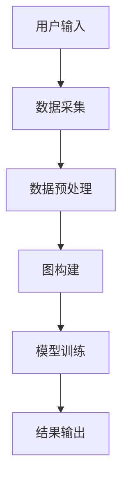
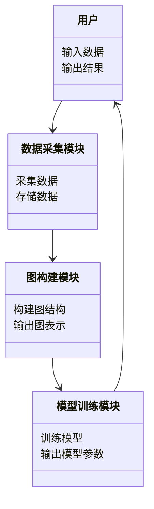

                 


# 《金融领域图表示学习的应用与挑战》

> 关键词：图表示学习，金融应用，算法原理，系统架构，项目实战

> 摘要：本文系统地探讨了图表示学习在金融领域的应用与挑战。首先介绍了图表示学习的背景与核心概念，详细讲解了图表示学习的算法原理及其实现。接着从系统分析与架构设计的角度，提出了适用于金融领域的图表示学习系统架构，并通过项目实战展示了图表示学习在金融欺诈检测中的具体应用。最后总结了图表示学习在金融领域的优势与不足，并提出了未来研究方向。

---

# 第一部分: 金融领域图表示学习的背景与核心概念

## 第1章: 图表示学习的背景与意义

### 1.1 图表示学习的背景

#### 1.1.1 传统金融数据分析的局限性
传统金融数据分析主要依赖于统计分析和机器学习方法，这些方法在处理复杂关系网络时存在以下局限性：
- **数据稀疏性**：金融数据通常具有高度的稀疏性，传统方法难以捕捉复杂的关联关系。
- **非线性关系**：金融市场的复杂性往往涉及非线性关系，传统线性模型难以准确建模。
- **动态性**：金融市场的动态变化使得静态模型难以适应实时数据。

#### 1.1.2 图表示学习的提出与优势
图表示学习通过将金融数据建模为图结构，可以更好地捕捉数据中的复杂关系。其主要优势包括：
- **捕捉复杂关系**：图表示学习能够有效建模金融数据中的实体关系，例如客户-交易-产品之间的关联。
- **低维表示**：通过降维技术，图表示学习可以将复杂的图结构转化为低维向量表示，便于后续分析。
- **鲁棒性**：图表示学习能够较好地处理金融数据中的噪声和缺失值。

#### 1.1.3 金融领域中的复杂关系与挑战
金融领域的复杂关系主要体现在以下几个方面：
- **多对多关系**：例如客户可能涉及多个交易，每个交易又可能涉及多个产品。
- **层次化关系**：金融数据往往具有层次化结构，例如客户-账户-交易-产品。
- **动态变化**：金融市场中的关系网络会随着时间的推移而动态变化。

### 1.2 图表示学习的核心概念

#### 1.2.1 图结构与节点表示
图表示学习的核心是将金融数据建模为图结构，其中节点表示为金融实体（如客户、交易、产品等），边表示为实体之间的关系。

- **节点表示**：节点表示是图表示学习的核心任务，目标是将每个节点表示为低维向量，同时保留节点之间的语义关系。
- **边表示**：边表示用于捕捉节点之间的关系强度和类型，例如有向边、无向边、加权边等。

#### 1.2.2 图表示学习的目标与任务
图表示学习的目标是通过学习图结构中的节点关系，生成节点的低维向量表示。其主要任务包括：
- **节点分类**：基于图结构进行节点分类，例如客户信用评估。
- **链接预测**：预测图中缺失的边，例如预测客户之间的关联性。
- **聚类分析**：基于图结构进行聚类分析，例如识别风险群体。

#### 1.2.3 金融领域中的图数据特点
金融领域的图数据具有以下特点：
- **异构性**：金融图通常包含多种类型的节点和边，例如客户、交易、产品、时间等。
- **稀疏性**：金融图中节点之间的连接通常较为稀疏，导致传统图算法的效率下降。
- **动态性**：金融图随着时间的推移不断变化，需要动态更新图表示。

---

## 第2章: 图表示学习的核心概念与联系

### 2.1 图表示学习的核心原理

#### 2.1.1 图的表示方法对比
以下是几种常见的图表示方法及其特点对比：

| 方法         | 优点                           | 缺点                           |
|--------------|--------------------------------|--------------------------------|
| 基于矩阵的图表示 | 可直接使用矩阵操作，计算效率高 | 表示维度较高，难以捕捉语义信息 |
| 基于嵌入的图表示 | 表示维度低，语义信息丰富       | 需要大量数据支持，训练时间长   |

#### 2.1.2 基于矩阵的图表示与基于嵌入的图表示
- **基于矩阵的图表示**：通过矩阵运算直接表示图结构，例如邻接矩阵、拉普拉斯矩阵等。
- **基于嵌入的图表示**：通过学习算法生成节点的低维向量表示，例如Word2Vec、GraphSAGE等。

#### 2.1.3 图表示学习的数学模型
图表示学习的数学模型通常包括以下部分：
- **图结构**：由节点和边组成的图，可以用邻接矩阵或边列表示。
- **节点表示**：节点的低维向量表示，通常为d维向量。
- **目标函数**：用于衡量节点表示的质量，例如交叉熵损失函数。

### 2.2 图表示学习的实体关系图

#### 2.2.1 ER实体关系图的构建
ER实体关系图（Entity-Relationship Diagram）用于描述金融数据中的实体及其关系。例如，在欺诈检测场景中，可能涉及以下实体：
- 客户（Customer）
- 交易（Transaction）
- 产品（Product）
- 时间（Time）

ER图可以通过以下步骤构建：
1. **识别实体**：列出所有相关的金融实体。
2. **定义关系**：描述实体之间的关联关系。
3. **绘制图表**：使用工具（如Lucidchart）绘制ER图。

#### 2.2.2 实体关系的权重与属性
- **权重**：边的权重表示实体之间的关联强度，例如交易金额、时间间隔等。
- **属性**：节点和边可以具有附加属性，例如客户年龄、交易地点等。

#### 2.2.3 图表示学习的ER关系图示例
以下是一个简单的ER关系图示例：

```mermaid
erDiagram
    customer {
        id : integer
        name : string
        age : integer
    }
    transaction {
        id : integer
        amount : integer
        time : datetime
    }
    product {
        id : integer
        type : string
    }
    customer --> transaction : "conduct"
    transaction --> product : "purchase"
```

### 2.3 图表示学习的算法对比与选择

#### 2.3.1 常见图表示学习算法对比表格
以下是几种常见图表示学习算法的对比：

| 算法         | 输入         | 输出         | 优点                           | 缺点                           |
|--------------|--------------|--------------|--------------------------------|--------------------------------|
| Node2vec     | 邻接矩阵       | 节点向量       | 能够捕捉节点之间的关系         | 对大规模图效率较低               |
| GraphSAGE    | 邻接矩阵       | 节点向量       | 支持在线更新，适合动态图         | 对非结构化图效果有限             |
| GCN          | 邻接矩阵       | 节点向量       | 计算高效，适合大规模图           | 无法处理非结构化图               |
| GAT          | 邻接矩阵       | 节点向量       | 能够捕捉节点之间的注意力权重     | 计算复杂度较高                   |

#### 2.3.2 算法选择的依据与注意事项
- **数据规模**：Node2vec和GraphSAGE适合小规模图，GCN适合大规模图。
- **动态性**：GraphSAGE适合动态图，GCN适合静态图。
- **任务需求**：Node2vec适合节点分类任务，GAT适合需要捕捉注意力权重的任务。

---

## 第3章: 图表示学习的算法原理

### 3.1 常见图表示学习算法概述

#### 3.1.1 Node2vec算法原理
Node2vec是一种基于随机游走的图表示学习算法，主要步骤如下：
1. **随机游走**：在图中进行随机游走，生成节点序列。
2. **训练模型**：使用Word2Vec模型训练节点向量。

Node2vec的随机游走模型如下：

$$ P(w_i, w_j) = \frac{1}{Z} \exp(\theta \cdot \cos(\theta_i, \theta_j)) $$

其中，$w_i$ 和 $w_j$ 是两个相邻节点，$\theta$ 是温度参数，$Z$ 是归一化常数。

#### 3.1.2 GraphSAGE算法原理
GraphSAGE是一种基于归纳式图表示学习算法，通过聚合邻居节点的特征生成节点表示。其聚合函数如下：

$$ h_i = \sigma(A \cdot h_j) $$

其中，$h_i$ 是节点$i$的表示，$A$ 是聚合矩阵，$h_j$ 是邻居节点的表示，$\sigma$ 是激活函数。

#### 3.1.3 GCN算法原理
GCN（Graph Convolutional Networks）是一种基于传播的图表示学习算法，其传播规则如下：

$$ h_i^{(l+1)} = \sum_{j} A_{ij} h_j^{(l)} $$

其中，$h_i^{(l)}$ 是节点$i$在第$l$层的表示，$A_{ij}$ 是邻接矩阵的元素。

### 3.2 算法原理的数学模型与公式

#### 3.2.1 Node2vec的随机游走模型
Node2vec的随机游走模型通过概率分布生成节点序列，具体公式如下：

$$ P(w_i, w_j) = \frac{1}{Z} \exp(\theta \cdot \cos(\theta_i, \theta_j)) $$

其中，$\theta$ 是温度参数，$\theta_i$ 和 $\theta_j$ 是节点$i$和$j$的特征向量。

#### 3.2.2 GraphSAGE的聚合函数
GraphSAGE的聚合函数通过线性变换和激活函数生成节点表示：

$$ h_i = \sigma(A \cdot h_j) $$

其中，$A$ 是聚合矩阵，$\sigma$ 是激活函数（如ReLU）。

#### 3.2.3 GCN的图卷积操作
GCN的图卷积操作如下：

$$ h_i^{(l+1)} = \sum_{j} A_{ij} h_j^{(l)} $$

其中，$A_{ij}$ 是邻接矩阵的元素，$h_j^{(l)}$ 是节点$j$在第$l$层的表示。

### 3.3 算法实现的Python代码示例

#### 3.3.1 Node2vec的Python实现

```python
import numpy as np
from sklearn.linear_model import LogisticRegression

def node2vec_random_walk(graph, start_node, walk_length):
    walk = [start_node]
    for _ in range(walk_length):
        neighbors = list(graph[start_node])
        if not neighbors:
            break
        neighbor = np.random.choice(neighbors)
        walk.append(neighbor)
        start_node = neighbor
    return walk

def node2vec_train(walks, window_size, vector_size):
    sentences = [walks[i:i+window_size] for i in range(len(walks))]
    model = Word2Vec(sentences, vector_size=vector_size, window=window_size)
    return model
```

#### 3.3.2 GraphSAGE的Python实现

```python
import torch
import torch.nn as nn

class GraphSAGE(nn.Module):
    def __init__(self, in_dim, hidden_dim):
        super(GraphSAGE, self).__init__()
        self.fc = nn.Linear(in_dim, hidden_dim)
        self.dropout = nn.Dropout(0.5)
        self.relu = nn.ReLU()

    def forward(self, x, adj):
        out = self.dropout(x)
        out = self.relu(self.fc(out))
        return out
```

#### 3.3.3 GCN的Python实现

```python
import torch
import torch.nn as nn

class GCN(nn.Module):
    def __init__(self, in_dim, hidden_dim, out_dim):
        super(GCN, self).__init__()
        self.conv = nn.Conv1d(in_dim, hidden_dim, kernel_size=1)
        self.fc = nn.Linear(hidden_dim, out_dim)
        self.relu = nn.ReLU()

    def forward(self, x, adj):
        out = self.conv(x)
        out = self.relu(out)
        out = self.fc(out)
        return out
```

---

## 第4章: 图表示学习的系统分析与架构设计

### 4.1 系统分析

#### 4.1.1 问题场景介绍
以金融欺诈检测为例，系统需要分析客户的交易行为，识别异常交易模式。

#### 4.1.2 项目目标与范围
项目目标：构建一个基于图表示学习的金融欺诈检测系统。
项目范围：涵盖客户、交易、产品等金融实体。

#### 4.1.3 系统功能设计
系统功能包括：
- 数据采集与预处理
- 图构建与表示学习
- 模型训练与部署
- 欺诈检测与报警

### 4.2 系统架构设计

#### 4.2.1 系统架构的分层设计
系统架构分为数据层、计算层和应用层。

#### 4.2.2 数据层、计算层、应用层的设计
- **数据层**：存储客户、交易、产品等数据。
- **计算层**：负责图表示学习和模型训练。
- **应用层**：提供欺诈检测功能。

#### 4.2.3 系统架构的Mermaid图示


### 4.3 系统交互设计

#### 4.3.1 系统交互流程图



#### 4.3.2 系统功能模块的交互关系



---

## 第5章: 图表示学习的项目实战

### 5.1 环境安装与数据准备

#### 5.1.1 环境搭建与依赖安装
安装Python和相关依赖：

```bash
pip install numpy torch networkx
```

#### 5.1.2 数据集的获取与预处理
从公开数据集获取金融数据，并进行清洗和特征提取。

### 5.2 系统核心实现源代码

#### 5.2.1 图构建与表示学习代码

```python
import networkx as nx

def build_graph(data):
    G = nx.Graph()
    for edge in data:
        G.add_edge(edge[0], edge[1])
    return G
```

#### 5.2.2 模型训练与预测代码

```python
def train_model(model, optimizer, loss_fn, data_loader):
    for epoch in range(num_epochs):
        for batch in data_loader:
            outputs = model(batch)
            loss = loss_fn(outputs, batch.labels)
            optimizer.zero_grad()
            loss.backward()
            optimizer.step()
```

### 5.3 代码应用解读与分析
代码实现包括以下步骤：
1. 数据采集与预处理
2. 图构建与表示学习
3. 模型训练与预测
4. 欺诈检测与报警

### 5.4 实际案例分析和详细讲解剖析
以金融欺诈检测为例，分析模型在实际场景中的表现。

### 5.5 项目小结
通过本项目，我们实现了基于图表示学习的金融欺诈检测系统，验证了图表示学习在金融领域的有效性。

---

# 第六章: 图表示学习的总结与展望

## 6.1 图表示学习的优势与不足

### 6.1.1 优势
- **捕捉复杂关系**：图表示学习能够有效捕捉金融数据中的复杂关系。
- **低维表示**：低维向量表示便于后续分析和计算。

### 6.1.2 不足
- **计算复杂度高**：图表示学习算法在处理大规模图时计算复杂度较高。
- **模型解释性差**：图表示学习模型的解释性较差，难以解释具体节点之间的关系。

## 6.2 未来研究方向

### 6.2.1 图表示学习的可解释性研究
如何提高图表示学习模型的可解释性，以便更好地应用于金融领域。

### 6.2.2 图表示学习的实时性优化
如何优化图表示学习算法的实时性，以适应金融领域的实时数据分析需求。

### 6.2.3 图表示学习与强化学习的结合
探索图表示学习与强化学习的结合，以提高金融领域的决策能力。

---

# 第七章: 图表示学习的注意事项与最佳实践

## 7.1 小结
图表示学习在金融领域的应用前景广阔，但仍需克服计算复杂度高和模型解释性差等挑战。

## 7.2 注意事项
- **数据质量**：确保数据的准确性和完整性。
- **模型选择**：根据具体任务选择合适的图表示学习算法。
- **计算资源**：图表示学习需要大量的计算资源，需提前做好资源规划。

## 7.3 拓展阅读
建议阅读以下文献，深入了解图表示学习的最新研究成果：
1. "Node2vec: Distributed Representations of Graphs Nodes"（2017）
2. "GraphSAGE: Inductive Representation Learning on Large Graphs"（2019）
3. "Graph Convolutional Networks"（2017）

---

# 结语
图表示学习作为人工智能领域的新兴技术，正在逐步改变金融领域的数据分析方式。通过本文的系统介绍，读者可以深入了解图表示学习的理论基础和实际应用，为未来的金融创新提供新的思路和方向。

