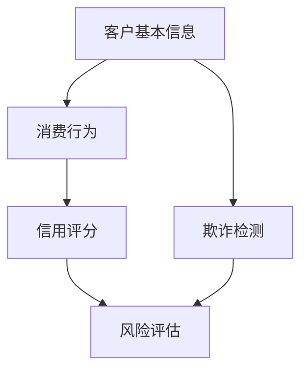

                 


# 《金融领域多任务学习在信用评分中的应用》

> 关键词：多任务学习，信用评分，金融领域，人工智能，机器学习

> 摘要：本文探讨了多任务学习在金融领域信用评分中的应用，详细介绍了多任务学习的基本概念、优势以及在信用评分中的具体应用。通过构建多任务学习模型，结合实际案例分析，展示了如何利用多任务学习技术提高信用评分的准确性和效率。本文还提供了系统的架构设计、项目实战代码及详细解读，帮助读者深入了解多任务学习在信用评分中的实现与应用。

---

## 第一部分: 背景介绍

### 第1章: 信用评分的背景与重要性

#### 1.1 信用评分的定义与作用
信用评分是一种评估个人或企业在贷款、信用卡申请等金融行为中信用风险的方法。它通过分析申请者的财务状况、消费行为和历史信用记录，预测其未来按时还款的可能性。信用评分在金融领域中起着至关重要的作用，直接影响金融机构的风险控制能力和盈利能力。

#### 1.2 信用评分的重要性
- **风险控制**：信用评分帮助金融机构识别高风险客户，降低坏账率。
- **提升效率**：自动化信用评分流程可以提高审批效率，减少人为错误。
- **促进金融包容性**：通过科学的评分模型，能够为更多信用记录较少的客户提供金融服务。

#### 1.3 传统信用评分的挑战
- **数据稀疏性**：部分客户可能没有足够的历史数据，导致传统评分模型难以准确评估。
- **模型泛化能力不足**：单一任务的评分模型在面对复杂金融环境时，可能无法全面捕捉客户信用风险。
- **模型可解释性**：复杂的评分模型可能导致解释性较差，难以满足监管要求。

---

### 第2章: 多任务学习的背景与优势

#### 2.1 多任务学习的定义与特点
多任务学习（Multi-Task Learning, MTL）是一种机器学习方法，旨在同时学习多个相关任务，通过共享部分参数或特征，提高模型的泛化能力和学习效率。其核心思想是利用任务之间的关联性，减少对每个任务独立学习的需求。

#### 2.2 多任务学习在金融领域的优势
- **提高模型泛化能力**：通过共享特征，多任务学习能够更好地捕捉不同任务之间的关联，增强模型的泛化能力。
- **降低数据需求**：在数据稀缺的情况下，多任务学习可以通过任务间的共享信息，减少对每个任务独立数据的需求。
- **提高模型解释性**：多任务学习可以通过任务间的共享特征，帮助理解不同任务之间的关系，从而提高模型的可解释性。

---

## 第二部分: 多任务学习在信用评分中的核心概念与联系

### 第3章: 多任务学习的核心原理

#### 3.1 多任务学习的原理
多任务学习通过共享表示层和任务特定层，将多个任务的学习目标结合起来。共享表示层捕捉不同任务之间的共同特征，任务特定层则针对每个任务的特殊需求进行优化。

#### 3.2 多任务学习的数学模型
多任务学习的数学模型通常可以表示为：
$$
\min_{\theta} \sum_{i=1}^n \sum_{t=1}^T \lambda_t L(\theta, t_i) + \lambda_{\text{reg}} \|\theta\|^2
$$
其中，$\theta$ 是模型参数，$L(\theta, t_i)$ 是第 $i$ 个样本的任务 $t$ 的损失函数，$\lambda_t$ 和 $\lambda_{\text{reg}}$ 是调节参数，控制任务损失和正则化项的权重。

### 第4章: 信用评分中的多任务学习任务关系

#### 4.1 信用评分中的多任务学习任务
在信用评分中，多任务学习可以同时学习以下任务：
- **风险评估**：预测客户违约的概率。
- **欺诈检测**：识别欺诈性申请。
- **信用评分预测**：预测客户的信用评分。

#### 4.2 多任务学习任务之间的关系
任务之间的关系可以通过以下方式建模：
- **共享特征**：任务之间共享某些特征，如客户的基本信息和消费行为。
- **任务特定特征**：每个任务有自己的特定特征，如欺诈检测任务可能关注交易频率和异常行为。

---

## 第三部分: 多任务学习在信用评分中的应用

### 第5章: 系统分析与架构设计

#### 5.1 信用评分系统的实体关系
信用评分系统涉及的主要实体包括：
- **用户**：包括客户的基本信息和信用历史。
- **信用评分**：包括客户的信用评分值和评分时间。
- **评分任务**：包括评分任务的类型和执行时间。

#### 5.2 系统功能设计
系统功能设计包括：
- **数据预处理**：清洗和归一化数据。
- **模型训练**：基于多任务学习框架训练模型。
- **评分预测**：根据训练好的模型预测客户的信用评分。

---

## 第四部分: 项目实战

### 第6章: 环境搭建与数据准备

#### 6.1 环境搭建
安装必要的库：
```bash
pip install numpy pandas scikit-learn tensorflow
```

#### 6.2 数据准备
使用公开数据集（如Kaggle上的信用评分数据）进行分析。

---

## 第五部分: 总结与展望

### 第7章: 总结与最佳实践

#### 7.1 总结
多任务学习在信用评分中的应用能够有效提高模型的泛化能力和准确性，同时降低数据需求和模型复杂性。

#### 7.2 最佳实践
- **任务关联性分析**：在设计多任务学习模型时，需深入分析任务之间的关联性，选择合适的共享策略。
- **数据质量控制**：确保数据的完整性和准确性，避免因数据问题影响模型性能。
- **模型解释性优化**：通过可视化和分析模型的共享特征，提高模型的可解释性。

---

## 第六部分: 附录

### 附录A: 代码实现

#### 附录A.1: 多任务学习模型实现
```python
import tensorflow as tf
from tensorflow import keras

# 定义多任务学习模型
def multi_task_model(input_shape, num_tasks):
    inputs = keras.Input(shape=input_shape)
    shared_layer = keras.layers.Dense(64, activation='relu')(inputs)
    task_outputs = []
    for _ in range(num_tasks):
        task_layer = keras.layers.Dense(32, activation='relu')(shared_layer)
        task_outputs.append(keras.layers.Dense(1, activation='sigmoid')(task_layer))
    model = keras.Model(inputs=inputs, outputs=task_outputs)
    return model

# 编译模型
model = multi_task_model(input_shape=(input_dim,), num_tasks=3)
model.compile(optimizer='adam', loss='binary_crossentropy')
```

#### 附录A.2: 任务关系分析
使用Mermaid图展示任务关系：


---

## 结语

通过本文的详细分析与实战，我们展示了多任务学习在信用评分中的强大能力。未来，随着人工智能技术的不断发展，多任务学习将在金融领域发挥更大的作用，为信用评分提供更加精准和高效的解决方案。

--- 

> **关键词**：多任务学习，信用评分，金融领域，人工智能，机器学习  
> **摘要**：本文探讨了多任务学习在金融领域信用评分中的应用，通过构建多任务学习模型，结合实际案例分析，展示了如何利用多任务学习技术提高信用评分的准确性和效率。

