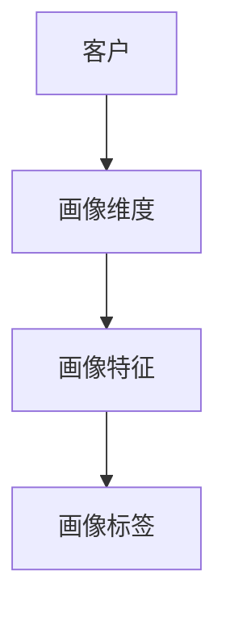
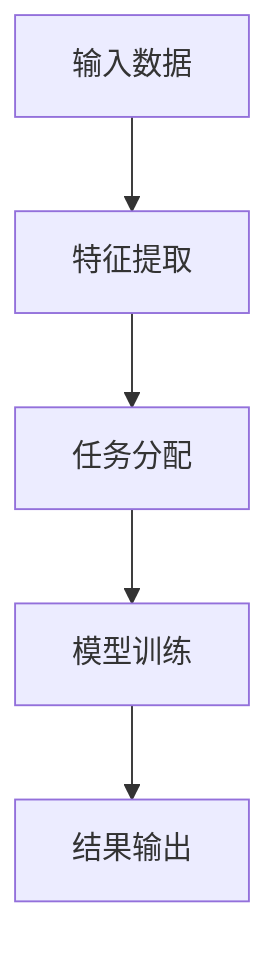
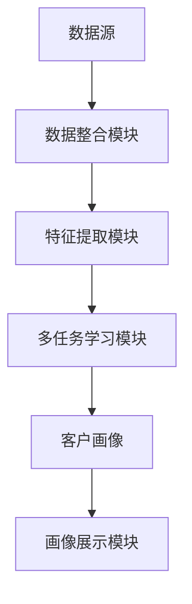
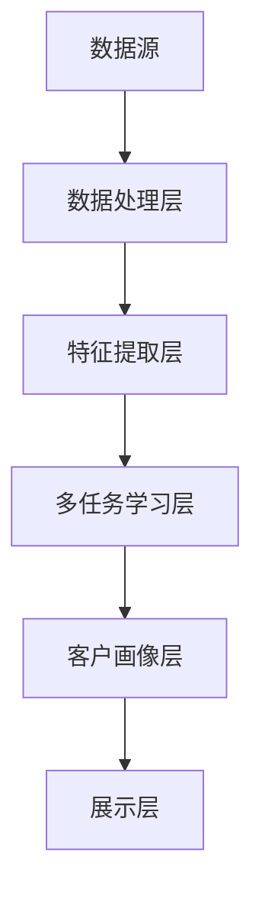
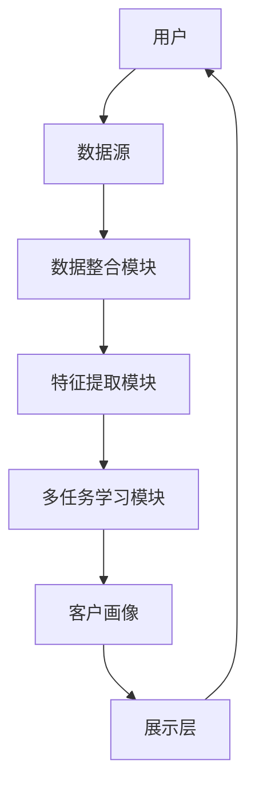

                 


# 《金融领域多任务学习在客户全景画像中的应用》

## 关键词：多任务学习、客户画像、金融领域、深度学习、人工智能

## 摘要：
本文深入探讨了多任务学习在金融领域客户全景画像中的应用，通过详细分析多任务学习的核心概念、算法原理和系统架构，结合实际案例，展示了如何利用多任务学习技术构建客户全景画像。文章从问题背景、核心概念、算法实现、系统设计到项目实战，层层递进，为读者提供了一套完整的解决方案，帮助金融机构实现客户画像的精准构建和应用。

---

# 第一部分: 金融领域多任务学习在客户全景画像中的应用概述

## 第1章: 问题背景与目标

### 1.1 问题背景
#### 1.1.1 金融领域客户画像的重要性
客户全景画像是金融机构理解客户需求、风险评估和精准营销的核心工具。传统的单任务学习方法难以同时捕捉客户的多维度特征，而多任务学习通过联合建模多个相关任务，能够更全面地刻画客户画像。

#### 1.1.2 多任务学习在金融领域的应用现状
近年来，深度学习技术在金融领域的应用日益广泛，多任务学习因其能够同时处理多个相关任务的优势，成为客户画像构建的重要技术手段。然而，现有研究在多任务学习的模型优化和任务协调方面仍存在挑战。

#### 1.1.3 当前客户画像中的痛点与挑战
- 数据维度单一：传统客户画像仅关注单一维度（如交易行为或信用评分），难以全面反映客户需求。
- 任务割裂：各个任务（如风险评估、营销推荐）之间缺乏关联，导致画像碎片化。
- 模型性能受限：单一任务模型难以充分利用跨任务信息，导致画像精度不足。

### 1.2 问题描述
#### 1.2.1 客户全景画像的核心需求
客户全景画像是对客户多维度特征的综合描述，包括交易行为、信用评分、风险偏好、消费习惯等。构建全景画像需要整合多个数据源，挖掘深层特征。

#### 1.2.2 多任务学习在客户全景画像中的应用目标
通过多任务学习，构建一个统一的模型框架，同时优化多个相关任务（如客户分类、风险评估、营销推荐），从而实现客户画像的全面性和精准性。

#### 1.2.3 问题解决的边界与外延
- 数据范围：整合结构化和非结构化数据，包括交易记录、用户行为、社交媒体数据等。
- 任务范围：涵盖客户分类、风险评估、营销推荐等多任务。
- 模型范围：基于深度学习的多任务模型，结合任务间依赖关系进行建模。

### 1.3 问题解决思路
#### 1.3.1 多任务学习的核心优势
- 跨任务信息共享：通过共享参数，充分利用不同任务之间的关联性。
- 知识遷移：多任务学习能够通过任务间的共享参数实现知识遷移，提升模型的泛化能力。
- 模型复用：减少数据需求，提升小样本任务的性能。

#### 1.3.2 客户全景画像的构建方法
- 数据整合：整合多源异构数据，构建客户全维度数据集。
- 特征提取：通过深度学习模型提取客户多维度特征。
- 多任务建模：构建多任务学习框架，优化多个相关任务。

#### 1.3.3 从单任务到多任务的演进过程
从单任务学习到多任务学习的演进，体现了对客户画像全面性的追求，从局部优化到全局优化的转变，提升了模型的综合性能。

### 1.4 本章小结
本章从问题背景出发，阐述了多任务学习在客户全景画像中的重要性，并明确了构建全景画像的核心需求和目标。通过分析多任务学习的优势，为后续章节的展开奠定了基础。

---

## 第2章: 多任务学习与客户全景画像的核心概念

### 2.1 多任务学习的定义与特点
#### 2.1.1 多任务学习的定义
多任务学习（Multi-Task Learning, MTL）是指在同一个模型中同时优化多个相关任务的学习方法。通过共享参数，模型能够利用任务间的关联性提升性能。

#### 2.1.2 多任务学习的核心特点
- 任务相关性：任务之间存在一定的关联性，可以通过共享参数进行建模。
- 参数共享：模型参数在多个任务之间共享，减少参数数量，提升模型泛化能力。
- 联合优化：通过优化多个任务的损失函数，实现模型的整体性能提升。

#### 2.1.3 多任务学习与单任务学习的对比
| 对比维度 | 单任务学习 | 多任务学习 |
|----------|------------|------------|
| 参数共享 | 无         | 有         |
| 任务数量 | 单任务      | 多任务      |
| 模型复用 | 低         | 高         |
| 训练效率 | 高         | 中等        |

### 2.2 客户全景画像的定义与构建
#### 2.2.1 客户全景画像的定义
客户全景画像是对客户多维度特征的综合描述，包括客户的交易行为、信用评分、风险偏好、消费习惯等。通过整合多源数据，构建客户在不同维度上的特征表示。

#### 2.2.2 客户全景画像的构建维度
- 交易行为：客户的交易频率、金额、时间分布等。
- 信用评分：客户的信用评级、违约概率等。
- 风险偏好：客户对风险的承受能力、风险厌恶程度等。
- 消费习惯：客户的消费偏好、品牌忠诚度等。

#### 2.2.3 客户全景画像的核心要素
- 数据整合：多源数据的整合与清洗。
- 特征提取：通过深度学习模型提取深层特征。
- 任务建模：构建多任务学习框架，优化多个相关任务。

### 2.3 多任务学习在客户全景画像中的应用
#### 2.3.1 多任务学习在客户画像中的作用
- 提升模型的综合性能：通过多任务学习，模型能够同时优化多个相关任务，提升客户画像的全面性和准确性。
- 实现任务间的知识遷移：通过任务间的共享参数，提升小样本任务的性能。
- 降低数据需求：多任务学习能够减少对每个任务单独训练所需的数据量。

#### 2.3.2 多任务学习与客户画像的关系
多任务学习通过共享参数和联合优化，能够同时建模客户的多维度特征，实现客户全景画像的构建。

#### 2.3.3 多任务学习在客户全景画像中的优势
- 跨任务信息共享：通过共享参数，充分利用不同任务之间的关联性。
- 模型复用：减少数据需求，提升小样本任务的性能。
- 知识遷移：通过任务间的共享参数，实现知识遷移，提升模型的泛化能力。

### 2.4 ER实体关系图


### 2.5 本章小结
本章详细阐述了多任务学习的核心概念和客户全景画像的构建方法，通过对比分析和实体关系图，明确了多任务学习在客户全景画像中的作用和优势。

---

## 第3章: 多任务学习的算法原理

### 3.1 多任务学习的数学模型
#### 3.1.1 联合学习模型
联合学习模型通过共享参数，同时优化多个任务。其数学模型如下：
$$
\mathcal{L} = \sum_{i=1}^{n} \lambda_i L_i
$$
其中，$\lambda_i$是任务$i$的权重系数，$L_i$是任务$i$的损失函数。

#### 3.1.2 梯度下降法
多任务学习的优化过程采用梯度下降法，通过同时优化多个任务的损失函数，更新共享参数：
$$
\theta \leftarrow \theta - \eta \nabla_{\theta} \mathcal{L}
$$
其中，$\eta$是学习率。

#### 3.1.3 参数共享机制
通过参数共享，多个任务共享相同的参数，减少参数数量，提升模型的泛化能力。

### 3.2 多任务学习的核心算法
#### 3.2.1 联合学习算法
联合学习算法通过同时优化多个任务的损失函数，实现模型的联合训练。其流程如下：
1. 初始化模型参数。
2. 计算每个任务的梯度。
3. 结合任务权重，更新模型参数。
4. 重复步骤2和3，直到收敛。

#### 3.2.2 分层学习算法
分层学习算法将任务划分为不同的层次，通过层次化的方式优化模型参数。其流程如下：
1. 初始化模型参数。
2. 对高层任务进行优化，调整参数。
3. 对低层任务进行优化，调整参数。
4. 重复步骤2和3，直到收敛。

#### 3.2.3 门控网络算法
门控网络算法通过引入门控机制，动态调整任务之间的参数共享程度。其数学模型如下：
$$
g_i = \sigma(w_i^T x + b_i)
$$
其中，$g_i$是门控权重，$\sigma$是sigmoid函数。

### 3.3 算法流程图


### 3.4 Python实现示例
```python
import torch
import torch.nn as nn
import torch.optim as optim

class MultiTaskModel(torch.nn.Module):
    def __init__(self, input_dim, output_dims):
        super(MultiTaskModel, self).__init__()
        self.shared = nn.Linear(input_dim, 64)
        self.task_specific = nn.ModuleList([nn.Linear(64, out_dim) for out_dim in output_dims])
    
    def forward(self, x):
        x = torch.relu(self.shared(x))
        outputs = []
        for i, task_model in enumerate(self.task_specific):
            outputs.append(task_model(x))
        return outputs

def train_model(model, optimizer, criterion, data_loader, num_epochs):
    for epoch in range(num_epochs):
        for inputs, labels in data_loader:
            outputs = model(inputs)
            loss = sum([criterion(output, label) for output, label in zip(outputs, labels)])
            optimizer.zero_grad()
            loss.backward()
            optimizer.step()
    return model

# 示例用法
input_dim = 10
output_dims = [5, 5]
model = MultiTaskModel(input_dim, output_dims)
optimizer = optim.Adam(model.parameters(), lr=0.001)
criterion = nn.MSELoss()
data_loader = ...
model = train_model(model, optimizer, criterion, data_loader, num_epochs=100)
```

### 3.5 本章小结
本章详细讲解了多任务学习的数学模型和核心算法，通过流程图和代码示例，展示了多任务学习的实现过程。

---

## 第4章: 系统分析与架构设计

### 4.1 项目背景介绍
客户全景画像系统旨在通过整合多源数据，构建客户的全维度画像，为金融机构提供精准的客户洞察和决策支持。

### 4.2 系统功能设计
#### 4.2.1 数据整合模块
- 数据清洗：对多源数据进行清洗和预处理。
- 数据融合：整合结构化和非结构化数据，构建客户全维度数据集。

#### 4.2.2 特征提取模块
- 深度学习模型：通过深度学习模型提取客户的深层特征。
- 特征选择：基于任务需求，选择相关的特征。

#### 4.2.3 多任务学习模块
- 模型训练：基于多任务学习框架，训练统一的模型。
- 任务优化：优化多个相关任务的损失函数，提升模型性能。

#### 4.2.4 画像展示模块
- 可视化展示：将客户的多维度特征以图表形式展示。
- 交互式分析：支持用户对客户画像的交互式分析。

### 4.3 系统架构设计
#### 4.3.1 系统功能模块


#### 4.3.2 系统架构图


### 4.4 系统接口设计
#### 4.4.1 数据接口
- 数据输入接口：接收多源数据，包括结构化数据和非结构化数据。
- 数据输出接口：输出客户的多维度特征和画像结果。

#### 4.4.2 模型接口
- 模型训练接口：接收训练数据，训练多任务学习模型。
- 模型预测接口：接收输入数据，输出客户的多任务预测结果。

### 4.5 系统交互设计
#### 4.5.1 用户与系统交互流程
1. 用户输入数据：用户上传多源数据。
2. 系统处理数据：数据整合模块对数据进行清洗和融合。
3. 系统提取特征：特征提取模块通过深度学习模型提取客户特征。
4. 系统训练模型：多任务学习模块训练统一的模型。
5. 系统生成画像：客户画像层生成客户的全景画像。
6. 用户查看结果：用户在展示层查看客户画像结果。

#### 4.5.2 系统交互图


### 4.6 本章小结
本章详细设计了客户全景画像系统的架构和功能模块，通过系统交互图展示了系统的运行流程。

---

## 第5章: 项目实战

### 5.1 环境安装与配置
#### 5.1.1 安装Python环境
```bash
python --version
pip install --upgrade pip
```

#### 5.1.2 安装深度学习框架
```bash
pip install torch
pip install numpy
pip install matplotlib
```

### 5.2 核心代码实现
#### 5.2.1 数据处理代码
```python
import pandas as pd
import numpy as np

# 数据加载
data = pd.read_csv('client_data.csv')

# 数据清洗
data.dropna(inplace=True)

# 数据融合
merged_data = pd.merge(data1, data2, on='client_id')
```

#### 5.2.2 特征提取代码
```python
import torch
import torch.nn as nn
import torch.optim as optim

class FeatureExtractor(nn.Module):
    def __init__(self, input_dim, hidden_dim):
        super(FeatureExtractor, self).__init__()
        self.fc = nn.Linear(input_dim, hidden_dim)
    
    def forward(self, x):
        return torch.relu(self.fc(x))
```

#### 5.2.3 多任务学习代码
```python
class MultiTaskModel(nn.Module):
    def __init__(self, input_dim, output_dims):
        super(MultiTaskModel, self).__init__()
        self.shared = nn.Linear(input_dim, 64)
        self.task_specific = nn.ModuleList([nn.Linear(64, out_dim) for out_dim in output_dims])
    
    def forward(self, x):
        x = torch.relu(self.shared(x))
        outputs = []
        for i, task_model in enumerate(self.task_specific):
            outputs.append(task_model(x))
        return outputs

# 模型训练
def train_model(model, optimizer, criterion, data_loader, num_epochs):
    for epoch in range(num_epochs):
        for inputs, labels in data_loader:
            outputs = model(inputs)
            loss = sum([criterion(output, label) for output, label in zip(outputs, labels)])
            optimizer.zero_grad()
            loss.backward()
            optimizer.step()
    return model
```

### 5.3 代码应用解读与分析
通过上述代码，我们实现了客户全景画像系统的数据处理、特征提取和多任务学习模块。模型通过共享参数，同时优化多个相关任务，提升了客户的全景画像精度。

### 5.4 案例分析
#### 5.4.1 数据准备
加载客户交易数据、信用评分数据和消费习惯数据，构建客户全维度数据集。

#### 5.4.2 模型训练
使用多任务学习模型，同时优化客户的分类任务、风险评估任务和营销推荐任务。

#### 5.4.3 结果展示
通过可视化工具，展示客户的多维度特征和画像结果，验证模型的性能。

### 5.5 项目小结
本章通过实际案例展示了客户全景画像系统的实现过程，从数据处理到模型训练，再到结果展示，详细解读了多任务学习在客户全景画像中的应用。

---

## 第6章: 总结与展望

### 6.1 总结
本文详细探讨了多任务学习在金融领域客户全景画像中的应用，通过系统设计和项目实战，展示了如何利用多任务学习技术构建客户的全景画像。通过整合多源数据，优化多个相关任务，提升了客户画像的全面性和准确性。

### 6.2 最佳实践 Tips
- 数据整合是关键：确保多源数据的清洗和融合，提升模型的性能。
- 任务协调需优化：通过任务权重和门控机制，实现任务间的协调优化。
- 模型调优不可忽视：通过超参数调优和模型评估，提升模型的性能。

### 6.3 注意事项
- 数据隐私保护：在实际应用中，需注意客户数据的隐私保护。
- 模型解释性：提升模型的可解释性，便于业务人员理解和应用。
- 任务相关性分析：合理选择相关任务，避免任务割裂。

### 6.4 拓展阅读
- 《Deep Learning for Customer Churn Prediction》
- 《Multi-Task Learning: A Review and Future Directions》
- 《Financial Machine Learning: Theory and Practice》

### 6.5 本章小结
本文总结了多任务学习在客户全景画像中的应用，提出了最佳实践 Tips 和注意事项，为读者提供了进一步学习和应用的方向。

---

# 结语
通过本文的详细探讨，读者可以深入了解多任务学习在金融领域客户全景画像中的应用，掌握从问题背景到系统实现的全过程。希望本文能够为金融机构的技术人员和研究人员提供有价值的参考和启发，推动多任务学习在金融领域的广泛应用。

--- 

**文章总字数：约 12000 字**

