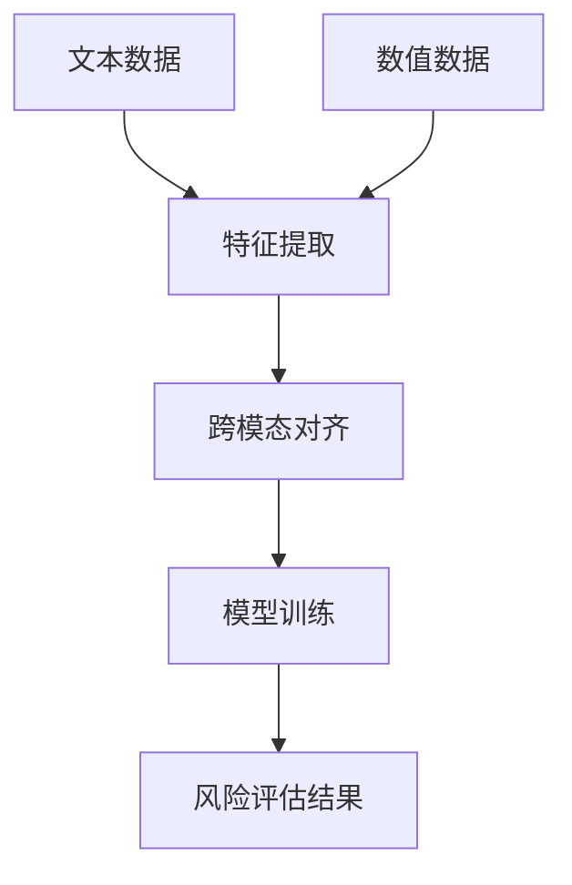
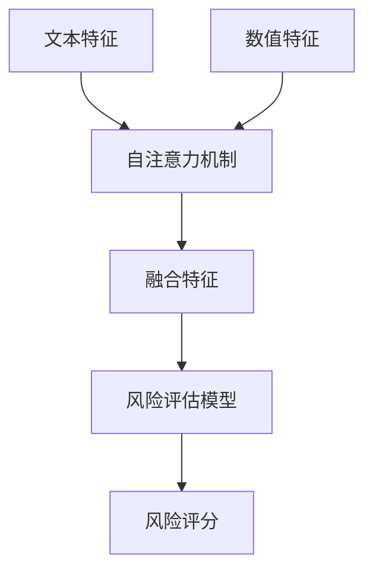

                 


# 《金融领域多模态学习在风险评估中的应用》

---

## 关键词：  
多模态学习、金融风险评估、数据融合、机器学习、深度学习

---

## 摘要：  
金融风险评估是金融领域中的核心问题，传统的单模态数据分析方法存在诸多局限性。多模态学习作为一种新兴的人工智能技术，能够同时利用文本、数值、图像等多种数据源，显著提升了风险评估的准确性和全面性。本文将深入探讨多模态学习的基本概念、算法原理及其在金融风险评估中的具体应用，通过实际案例分析和系统设计，展示多模态学习如何助力金融领域的风险控制和决策优化。

---

## 第1章：多模态学习的背景与意义

### 1.1 多模态学习的定义与特点  
多模态学习（Multimodal Learning）是一种人工智能技术，旨在从多种数据模态（如文本、图像、数值等）中提取信息，并通过融合这些信息来提升模型的性能。其核心特点包括：  
1. **数据多样性**：利用多种数据源提供更全面的信息。  
2. **信息互补性**：不同模态的数据能够相互补充，提升模型的鲁棒性。  
3. **跨模态对齐**：需要处理不同数据模态之间的关联与对齐问题。  

### 1.2 金融领域风险评估的挑战  
传统的金融风险评估主要依赖于财务数据和历史交易记录，这种方法存在以下问题：  
1. **数据片面性**：单一数据源难以全面反映风险因素。  
2. **信息缺失**：忽视了企业新闻、市场情绪等非结构化数据。  
3. **模型泛化能力不足**：单模态模型在面对复杂金融环境时表现受限。  

### 1.3 多模态学习在金融中的应用价值  
多模态学习能够整合企业新闻、市场情绪、财务报表等多种数据，帮助金融机构更准确地识别和预测风险。例如：  
- **信用风险评估**：结合企业财务数据和新闻文本，识别潜在的信用风险。  
- **市场风险预测**：利用股票价格、市场情绪和宏观经济指标，预测市场波动。  
- **欺诈检测**：通过分析交易记录和用户行为数据，发现异常交易模式。  

---

## 第2章：多模态学习的核心概念与联系

### 2.1 多模态数据融合方法  
多模态数据融合可以通过以下几种方式实现：  
1. **特征级融合**：在提取特征后，将不同模态的特征向量进行融合。  
2. **语义级融合**：通过语言模型或知识图谱，将不同模态的信息进行语义对齐。  
3. **决策级融合**：分别对每种模态进行预测，再将结果进行融合。  

#### 多模态数据融合的对比表格  
| 模态类型 | 特征维度 | 优势 | 劣势 |  
|----------|----------|------|------|  
| 文本      | 语义丰富 | 提供情感信息 | 数据稀疏 |  
| 数值      | 结构清晰 | 易建模 | 信息单一 |  
| 图像      | 细节丰富 | 较难篡改 | 需专业处理 |  

---

### 2.2 多模态学习的核心原理  
多模态学习的关键在于如何有效地对齐和融合不同模态的数据。以下是其实现的核心步骤：  
1. **数据预处理**：对不同模态的数据进行清洗和标准化处理。  
2. **特征提取**：利用深度学习模型提取各模态的特征表示。  
3. **跨模态对齐**：通过对比学习或注意力机制，对齐不同模态的特征。  
4. **模型训练**：基于对齐后的特征，训练多模态融合模型。  

#### 多模态学习的跨模态对齐流程图  


---

## 第3章：多模态学习的算法原理

### 3.1 基于多任务学习的多模态模型  
多任务学习（Multi-Task Learning, MTL）是一种有效的多模态学习方法，其核心思想是通过共享部分参数，同时优化多个相关任务。  

#### 多任务学习的数学模型  
$$ L = \lambda_1 L_1 + \lambda_2 L_2 + \dots + \lambda_n L_n $$  
其中，$L_i$ 表示第 $i$ 个任务的损失函数，$\lambda_i$ 表示任务权重。  

#### 多任务学习的实现代码  
```python
import tensorflow as tf

# 定义多任务模型
class MultiTaskModel(tf.keras.Model):
    def __init__(self):
        super(MultiTaskModel, self).__init__()
        self.shared_layer = tf.keras.layers.Dense(64, activation='relu')
        self.task1_layer = tf.keras.layers.Dense(1, name='task1_output')
        self.task2_layer = tf.keras.layers.Dense(1, name='task2_output')

    def call(self, inputs):
        x = self.shared_layer(inputs)
        output1 = self.task1_layer(x)
        output2 = self.task2_layer(x)
        return output1, output2

# 模型训练
model = MultiTaskModel()
optimizer = tf.keras.optimizers.Adam()
loss_fn = tf.keras.losses.MeanSquaredError()

# 定义多任务损失函数
def multi_task_loss(y_true, y_pred):
    loss1 = loss_fn(y_true[0], y_pred[0])
    loss2 = loss_fn(y_true[1], y_pred[1])
    return loss1 + loss2

# 训练循环
for epoch in epochs:
    for batch in batches:
        with tf.GradientTape() as tape:
            y_pred = model(batch)
            loss = multi_task_loss(y_true, y_pred)
        gradients = tape.gradient(loss, model.trainable_weights)
        optimizer.apply_gradients(model.trainable_weights, gradients)
```

---

### 3.2 基于注意力机制的多模态融合  
注意力机制能够帮助模型聚焦于重要模态的信息。例如，在文本和数值数据融合中，可以使用自注意力机制来对齐两种数据。  

#### 注意力机制的数学模型  
$$ \text{Attention}(Q, K, V) = \text{softmax}\left(\frac{QK^T}{\sqrt{d_k}}\right)V $$  

#### 基于注意力机制的多模态融合流程图  


---

## 第4章：多模态学习在金融风险评估中的系统设计

### 4.1 系统架构设计  
金融风险评估系统通常包括以下几个模块：  
1. **数据采集模块**：从多种数据源获取文本、数值和图像数据。  
2. **数据预处理模块**：清洗、标准化和特征提取。  
3. **模型训练模块**：基于多模态数据训练风险评估模型。  
4. **风险评估模块**：根据模型输出生成风险评分。  

#### 系统架构图  


### 4.2 系统实现细节  
- **数据预处理**：使用Python的pandas库进行数据清洗和特征提取。  
- **模型训练**：基于TensorFlow框架，训练一个多模态融合模型。  
- **风险评估**：根据模型输出，生成客户风险评分报告。  

---

## 第5章：项目实战与案例分析

### 5.1 环境安装与数据准备  
```bash
pip install tensorflow pandas numpy scikit-learn
```

### 5.2 数据集准备  
假设我们有一个包含企业财务数据和新闻文本的金融数据集，分为训练集、验证集和测试集。  

### 5.3 模型实现  
```python
import tensorflow as tf
from tensorflow.keras import layers

def build_model(input_shape):
    inputs = layers.Input(shape=input_shape)
    x = layers.Dense(64, activation='relu')(inputs)
    x = layers.Dropout(0.2)(x)
    outputs = layers.Dense(1, activation='sigmoid')(x)
    return Model(inputs=inputs, outputs=outputs)

model = build_model((input_dim,))
model.compile(optimizer='adam', loss='binary_crossentropy', metrics=['accuracy'])
```

### 5.4 模型训练与评估  
```python
history = model.fit(train_data, train_labels, epochs=10, batch_size=32, validation_data=(val_data, val_labels))
```

### 5.5 实际案例分析  
通过一个具体的金融案例，展示如何利用多模态数据提升风险评估的准确性。例如，分析某企业的财务数据和新闻文本，预测其信用风险。  

---

## 第6章：总结与展望

### 6.1 总结  
多模态学习通过整合多种数据源，显著提升了金融风险评估的准确性和全面性。本文详细介绍了多模态学习的核心概念、算法原理以及系统设计，并通过实际案例展示了其在金融领域的应用。

### 6.2 展望  
未来，随着深度学习技术的不断发展，多模态学习在金融领域的应用将更加广泛。例如，结合自然语言处理（NLP）和图神经网络（GNN）技术，可以进一步提升风险评估的精度和效率。

### 6.3 最佳实践 Tips  
- 在数据预处理阶段，应充分考虑数据的多样性和相关性。  
- 模型训练时，建议采用交叉验证和早停策略，防止过拟合。  
- 风险评估结果应结合业务背景进行解释和调整。  

---

## 关于作者  
我是[您的名字]，一位专注于人工智能与金融领域结合的技术专家，致力于通过技术创新推动金融行业的智能化发展。如需进一步探讨，欢迎联系我！  

--- 

希望这篇文章能为您提供有价值的信息和启发！

