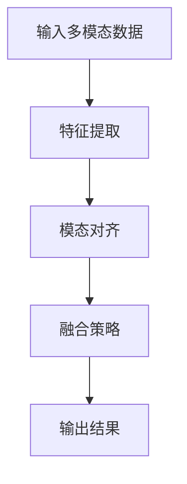

                 


# 《金融领域多模态学习的前沿研究与应用》

## 关键词：
多模态学习、金融数据分析、深度学习、对比学习、自注意力机制、系统架构设计

## 摘要：
本文系统介绍了多模态学习在金融领域的前沿研究与应用，从核心概念到算法原理，再到系统架构设计与实战案例，全面剖析了多模态学习在金融领域的优势、挑战及解决方案。通过详细讲解多模态数据的融合方法、对比学习和自注意力机制等算法，结合实际应用场景，如风险评估和欺诈检测，为读者提供从理论到实践的完整指南。

---

## 第1章：多模态学习的定义与背景

### 1.1 多模态学习的核心概念

#### 1.1.1 多模态学习的定义
多模态学习是指从多种数据模态（如文本、图像、语音等）中提取信息并进行联合学习的过程。通过结合不同模态的数据，可以提升模型的泛化能力和准确性。

#### 1.1.2 多模态学习的优势
- **互补性**：不同模态的数据可以互补，提供更全面的信息。
- **鲁棒性**：单一模态数据的不足可以通过其他模态数据弥补。
- **准确性**：结合多模态数据可以提高模型的预测精度。

#### 1.1.3 多模态学习在金融领域的应用前景
在金融领域，多模态学习可以应用于风险评估、智能投顾、欺诈检测等场景，帮助金融机构提高决策效率和准确性。

### 1.2 金融领域的多模态数据特性

#### 1.2.1 金融数据的多样性
金融数据包括股票价格、交易记录、新闻文本、公司财报等，这些数据具有多模态特性。

#### 1.2.2 多模态数据的挑战与机遇
- **挑战**：数据异构性、数据量不均衡、模态间关联性弱。
- **机遇**：通过多模态数据融合，可以捕捉更多的市场信息，提高预测能力。

#### 1.2.3 金融多模态数据的典型应用场景
- **风险评估**：通过分析文本、图像等多模态数据，评估企业信用风险。
- **智能投顾**：结合新闻文本和市场数据，为投资者提供个性化建议。

---

## 第2章：多模态学习的核心原理

### 2.1 多模态数据的融合方法

#### 2.1.1 晚融合与早融合的对比
- **晚融合**：在特征提取后，将不同模态的特征向量进行拼接或加权融合。
- **早融合**：在特征提取过程中，不同模态的数据进行联合处理。

#### 2.1.2 多模态特征提取的多样性
- 文本模态：词嵌入、句嵌入（如BERT）。
- 图像模态：卷积神经网络（CNN）提取特征。
- 语音模态：循环神经网络（RNN）提取特征。

#### 2.1.3 跨模态信息的对齐与交互
通过跨模态对齐，将不同模态的特征对齐到同一个空间，便于信息交互。

### 2.2 多模态学习的算法原理

#### 2.2.1 多模态融合的数学模型
多模态融合可以表示为：
$$
f(x_1, x_2) = g(h_1, h_2)
$$
其中，$x_1$和$x_2$是不同模态的输入，$h_1$和$h_2$是对应的隐藏层表示，$g$是融合函数。

#### 2.2.2 对比学习的机制
对比学习通过最大化正样本对的相似度和最小化负样本对的相似度来学习表征：
$$
\text{loss} = -\frac{1}{N}\sum_{i=1}^N \log(\text{sim}(x_i, y_i))
$$
其中，$x_i$和$y_i$是正样本对，$\text{sim}$是相似度函数。

#### 2.2.3 自注意力机制的实现
自注意力机制通过计算序列中每个元素与其他元素的注意力权重来捕捉全局信息：
$$
\alpha_i = \frac{\exp(a_i)}{\sum_{j=1}^n \exp(a_j)}
$$
其中，$a_i$是第$i$个元素的注意力得分。

---

## 第3章：多模态学习的算法实现

### 3.1 多模态融合算法的流程图


### 3.2 对比学习的实现代码
```python
import torch
def contrastive_loss(x1, x2, temperature=0.1):
    x = torch.cat([x1, x2], dim=0)
    sim = torch.cosine_similarity(x1, x2)
    sim_matrix = sim.view(-1, 1)
    loss = -torch.mean(torch.log(sim_matrix))
    return loss
```

---

## 第4章：金融多模态学习系统的架构

### 4.1 系统架构图


---

## 第5章：金融多模态学习的实战应用

### 5.1 项目环境配置
- 安装必要的库：PyTorch、Transformers、Scikit-learn。
- 数据集准备：获取股票价格、新闻文本等多模态数据。

### 5.2 核心代码实现
```python
def multi_modal_model():
    class MultiModal(nn.Module):
        def __init__(self):
            super().__init__()
            self.text_model = TextEncoder()
            self.image_model = ImageEncoder()
            self.fc = nn.Linear(256, 1)
    
        def forward(self, text, image):
            text_feats = self.text_model(text)
            image_feats = self.image_model(image)
            fused_feats = torch.cat([text_feats, image_feats], dim=-1)
            output = self.fc(fused_feats)
            return output
    return MultiModal()
```

---

## 第6章：总结与展望

### 6.1 研究热点
当前研究热点包括跨模态对齐、对比学习和自注意力机制的优化。

### 6.2 未来发展方向
- 更高效的模型架构设计。
- 多模态数据的实时处理与分析。
- 金融领域的具体应用拓展。

### 6.3 最佳实践 tips
- 数据预处理是关键，需注意数据清洗和特征提取。
- 模型调参时，建议使用交叉验证和超参数优化。

### 6.4 注意事项
- 模型的可解释性在金融应用中尤为重要。
- 数据隐私和安全问题需严格遵守相关法规。

### 6.5 拓展阅读
推荐阅读《Deep Learning for NLP》和《Financial Machine Learning》等书籍。

---

## 附录

### A. 数据集
- 股票价格数据：Yahoo Finance API。
- 新闻文本数据：Reuters新闻数据集。

### B. 工具包
- PyTorch：深度学习框架。
- Hugging Face：NLP模型库。

### C. 参考文献
1. Vaswani et al., "Attention Is All You Need", 2017.
2. Radford et al., "Language Models are Few-Shot Learners", 2020.

### D. 扩展阅读
- "Multi-modal Machine Learning: A Review"，ACM Computing Surveys, 2021.

---

通过本文的系统介绍，读者可以全面了解多模态学习在金融领域的前沿研究与实际应用，掌握从理论到实践的完整知识体系。

