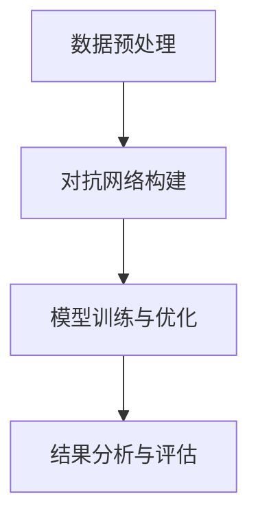
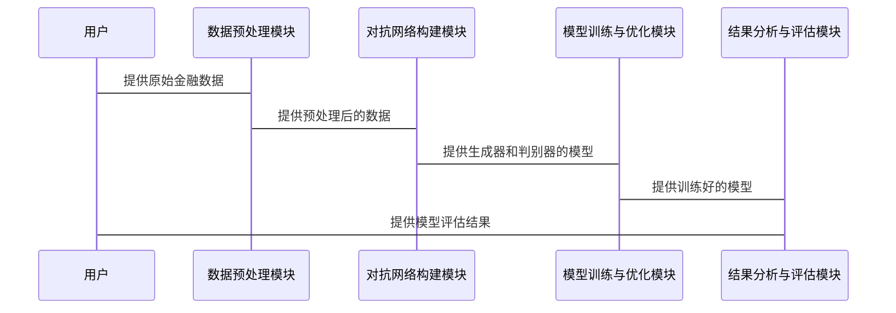

                 


# 《金融领域对抗学习的研究与应用》

---

## 关键词：
对抗学习，生成对抗网络，金融欺诈检测，风险评估，时间序列预测

---

## 摘要：
本文深入探讨了对抗学习在金融领域的研究与应用，从基本概念到数学模型，再到实际案例，系统性地分析了对抗学习在金融领域的优势与挑战。通过详细讲解生成对抗网络（GAN）的原理和实现，本文展示了对抗学习如何在金融风险评估、欺诈检测和时间序列预测等场景中发挥重要作用。同时，本文还探讨了系统架构设计和实际项目实现，为读者提供了全面的视角和实践指导。

---

## 第1章：对抗学习的基本概念与背景

### 1.1 对抗学习的定义与核心概念

#### 1.1.1 对抗学习的定义
对抗学习是一种机器学习技术，通过两个或多个模型（称为生成器和判别器）的对抗过程来训练。生成器的目标是生成逼真的数据，而判别器的目标是区分真实数据和生成数据。这种对抗过程使得生成器能够生成越来越逼真的数据，同时判别器的性能也不断提升。

#### 1.1.2 对抗学习的核心要素
- **生成器（Generator）**：负责生成数据，通常使用深度神经网络。
- **判别器（Discriminator）**：负责区分真实数据和生成数据，通常也使用深度神经网络。
- **损失函数（Loss Function）**：衡量生成器和判别器的性能，指导模型优化。

#### 1.1.3 对抗学习与传统机器学习的对比
| 特性 | 对抗学习 | 传统机器学习 |
|------|----------|--------------|
| 数据需求 | 可以从无标签数据中学习 | 需要大量有标签数据 |
| 模型复杂度 | 高 | 较低 |
| 应用场景 | 生成数据、图像修复等 | 分类、回归等 |

对抗学习与传统机器学习的对比表明，对抗学习在生成数据和处理无标签数据方面具有显著优势。

### 1.2 金融领域中的对抗学习背景

#### 1.2.1 金融领域的数据特点
- **高维度**：金融数据通常包含大量特征，如价格、交易量、市场指数等。
- **噪声多**：金融市场数据受多种因素影响，噪声较多。
- **不平衡性**：某些金融问题（如欺诈检测）的数据分布往往严重不平衡。

#### 1.2.2 金融领域的典型问题
- **风险评估**：评估投资组合或交易的风险。
- **欺诈检测**：识别异常交易或欺诈行为。
- **时间序列预测**：预测股票价格、汇率等金融资产的未来走势。

#### 1.2.3 对抗学习在金融领域的应用价值
- **提高模型鲁棒性**：对抗学习通过生成多样化的数据，增强模型的泛化能力。
- **解决数据不平衡问题**：对抗学习可以生成平衡的数据分布，提高模型性能。
- **增强数据隐私**：对抗学习可以生成合成数据，保护真实数据隐私。

### 1.3 对抗学习的研究现状

#### 1.3.1 国内外研究进展
- 国内：中国在对抗学习的研究上投入巨大，特别是在金融领域的应用。
- 国外：欧美国家在对抗学习的理论研究和技术创新方面处于领先地位。

#### 1.3.2 金融领域的应用现状
- **欺诈检测**：利用对抗学习生成正常交易数据，训练分类模型。
- **信用评分**：生成多样化的信用数据，评估客户信用风险。
- **金融时间序列预测**：使用对抗学习生成多步预测，提高预测准确性。

#### 1.3.3 当前研究的挑战与不足
- **模型的训练难度**：对抗学习的训练过程复杂，容易出现模型崩溃或不稳定。
- **模型的可解释性**：对抗学习的黑箱特性使得模型难以解释。
- **数据隐私与安全问题**：对抗学习生成的数据可能泄露隐私信息。

---

## 第2章：对抗学习的核心概念与数学模型

### 2.1 对抗学习的基本原理

#### 2.1.1 对抗网络的结构
- **生成器（G）**：输入噪声，生成数据。
- **判别器（D）**：输入真实数据或生成数据，输出判别结果。

#### 2.1.2 对抗学习的目标函数
- **生成器的目标函数**：$L_G = \mathbb{E}_{z}[\log(D(G(z)))]$，最大化生成数据的判别器输出。
- **判别器的目标函数**：$L_D = -(\mathbb{E}_{x}[ \log(D(x))] + \mathbb{E}_{z}[ \log(1 - D(G(z)))] )$，最大化区分真实数据和生成数据的能力。

#### 2.1.3 对抗学习的训练过程
1. 初始化生成器和判别器的参数。
2. 训练判别器，使其能够区分真实数据和生成数据。
3. 训练生成器，使其生成的数据能够欺骗判别器。
4. 重复上述步骤，直到模型收敛。

#### 2.1.4 对抗学习的数学推导
- **联合优化目标**：$ \min_{G} \max_{D} \mathbb{E}_{x}[ \log(D(x))] + \mathbb{E}_{z}[ \log(1 - D(G(z)))] $。

### 2.2 对抗学习的数学模型

#### 2.2.1 生成对抗网络（GAN）的数学模型
- **生成器网络**：$G(z) = \sigma(W_G z + b_G)$，其中$\sigma$为sigmoid函数。
- **判别器网络**：$D(x) = \sigma(W_D x + b_D)$。
- **损失函数**：$L = -\mathbb{E}[\log(D(x)) + \log(1 - D(G(z)))]$。

#### 2.2.2 对抗学习的损失函数
- **判别器损失函数**：$L_D = -\mathbb{E}_{x}[\log(D(x))] - \mathbb{E}_{z}[\log(1 - D(G(z)))]$。
- **生成器损失函数**：$L_G = -\mathbb{E}_{z}[\log(D(G(z)))]$。

#### 2.2.3 对抗学习的优化方法
- **Adam优化器**：常用于训练GAN，具有自适应学习率调整能力。
- **梯度下降**：生成器和判别器分别优化各自的损失函数。

### 2.3 对抗学习的核心算法

#### 2.3.1 GAN的算法流程
1. 初始化生成器和判别器的参数。
2. 训练判别器，最小化$L_D$。
3. 训练生成器，最小化$L_G$。
4. 重复步骤2和3，直到模型收敛。

#### 2.3.2 WGAN的改进算法
- **Wasserstein距离**：衡量两个概率分布之间的距离，用于改进GAN的稳定性。
- **梯度惩罚**：在Wasserstein GAN中加入梯度惩罚项，防止判别器梯度消失。

#### 2.3.3 其他对敌对学习算法
- **CycleGAN**：用于无监督图像到图像的转换。
- **DCGAN**：使用卷积神经网络作为生成器和判别器，提高生成图像的质量。

---

## 第3章：对抗学习在金融领域的应用分析

### 3.1 金融领域的典型应用场景

#### 3.1.1 金融风险评估
- **应用场景**：评估投资组合的风险。
- **对抗学习的应用**：生成多样化的市场数据，训练风险评估模型。

#### 3.1.2 金融欺诈检测
- **应用场景**：检测异常交易。
- **对抗学习的应用**：生成正常交易数据，训练分类模型识别异常交易。

#### 3.1.3 金融时间序列预测
- **应用场景**：预测股票价格、汇率等。
- **对抗学习的应用**：生成多步预测数据，提高预测准确性。

### 3.2 对抗学习在金融领域的优势

#### 3.2.1 提高模型的鲁棒性
- **优势**：对抗学习通过生成多样化的数据，增强模型的泛化能力。
- **具体表现**：在数据分布变化时，模型表现更稳定。

#### 3.2.2 增强模型的泛化能力
- **优势**：对抗学习生成的数据覆盖更多可能的场景，提高模型的泛化能力。
- **具体表现**：在金融时间序列预测中，生成多种可能的未来走势，提高预测的准确性。

#### 3.2.3 解决数据不平衡问题
- **优势**：对抗学习可以生成平衡的数据分布，提高模型性能。
- **具体表现**：在金融欺诈检测中，生成正常交易数据，平衡数据分布，提高模型的召回率。

### 3.3 对抗学习在金融领域的挑战

#### 3.3.1 模型的训练难度
- **挑战**：对抗学习的训练过程复杂，容易出现模型崩溃或不稳定。
- **具体表现**：生成器和判别器的训练需要交替进行，容易出现训练不稳定的问题。

#### 3.3.2 模型的可解释性
- **挑战**：对抗学习的黑箱特性使得模型难以解释。
- **具体表现**：在金融欺诈检测中，模型的决策过程难以解释，影响了实际应用的可信度。

#### 3.3.3 数据隐私与安全问题
- **挑战**：对抗学习生成的数据可能泄露隐私信息，影响数据安全。
- **具体表现**：在生成合成数据时，可能泄露真实数据中的敏感信息。

---

## 第4章：对抗学习的算法实现与数学推导

### 4.1 生成对抗网络（GAN）的实现

#### 4.1.1 GAN的网络结构
- **生成器结构**：使用全连接层生成数据。
- **判别器结构**：使用全连接层判别数据的真伪。

#### 4.1.2 GAN的损失函数
- **生成器损失函数**：$L_G = -\mathbb{E}_{z}[\log(D(G(z)))]$。
- **判别器损失函数**：$L_D = -\mathbb{E}_{x}[\log(D(x))] - \mathbb{E}_{z}[\log(1 - D(G(z)))]$。

#### 4.1.3 GAN的训练过程
1. 初始化生成器和判别器的参数。
2. 训练判别器，最小化$L_D$。
3. 训练生成器，最小化$L_G$。
4. 重复步骤2和3，直到模型收敛。

### 4.2 对抗学习的数学推导

#### 4.2.1 GAN的损失函数推导
- **联合优化目标**：$\min_{G} \max_{D} \mathbb{E}_{x}[ \log(D(x))] + \mathbb{E}_{z}[ \log(1 - D(G(z)))]$。
- **KKT条件**：在最优情况下，生成器和判别器的损失函数达到平衡。

#### 4.2.2 WGAN的 Wasserstein 距离
- **Wasserstein距离**：衡量两个概率分布之间的距离，用于改进GAN的稳定性。
- **数学表达**：$WGAN = \mathbb{E}_{x}[D(x)] - \mathbb{E}_{z}[D(G(z))]$。

#### 4.2.3 对抗学习的梯度分析
- **生成器梯度**：$\nabla_G L_G = -\nabla_G \mathbb{E}_{z}[\log(D(G(z)))]$。
- **判别器梯度**：$\nabla_D L_D = -\nabla_D \mathbb{E}_{x}[\log(D(x))] - \mathbb{E}_{z}[ \log(1 - D(G(z)))]$。

### 4.3 对抗学习的优化方法

#### 4.3.1 梯度下降方法
- **Adam优化器**：常用优化方法，具有自适应学习率调整能力。

#### 4.3.2 模型正则化
- **正则化项**：在损失函数中加入正则化项，防止模型过拟合。
- **数学表达**：$L_{reg} = \lambda \|\theta\|_2^2$。

#### 4.3.3 多目标优化策略
- **多目标优化**：在对抗学习中，同时优化生成器和判别器的损失函数。
- **数学表达**：$\min_{G} \max_{D} L_G + L_D$。

---

## 第5章：金融领域对抗学习的系统架构设计

### 5.1 金融对抗学习系统的模块划分

#### 5.1.1 数据预处理模块
- **功能**：对原始数据进行清洗、归一化等预处理。
- **输入**：原始金融数据（如股票价格、交易记录）。
- **输出**：预处理后的数据。

#### 5.1.2 对抗网络构建模块
- **功能**：构建生成器和判别器的网络结构。
- **输入**：预处理后的数据。
- **输出**：生成器和判别器的模型。

#### 5.1.3 模型训练与优化模块
- **功能**：训练生成器和判别器，优化模型参数。
- **输入**：生成器和判别器的模型。
- **输出**：训练好的模型。

#### 5.1.4 结果分析与评估模块
- **功能**：评估模型的性能，分析生成数据的质量。
- **输入**：生成数据和真实数据。
- **输出**：模型评估结果。

### 5.2 对抗学习系统的架构图

#### 5.2.1 系统架构图（Mermaid）


### 5.3 系统接口设计

#### 5.3.1 数据输入接口
- **输入**：原始金融数据。
- **输出**：预处理后的数据。

#### 5.3.2 模型训练接口
- **输入**：生成器和判别器的模型。
- **输出**：训练好的模型。

#### 5.3.3 结果输出接口
- **输入**：生成数据和真实数据。
- **输出**：模型评估结果。

### 5.4 系统交互流程图

#### 5.4.1 系统交互流程图（Mermaid）


---

## 第6章：项目实战：金融领域对抗学习的应用

### 6.1 项目背景与目标

#### 6.1.1 项目背景
- **背景**：金融欺诈检测是一个重要的问题，传统方法在数据不平衡的情况下表现不佳。
- **目标**：利用对抗学习生成正常交易数据，训练分类模型检测欺诈交易。

### 6.2 环境搭建与工具安装

#### 6.2.1 环境搭建
- **操作系统**：Windows 10 或 macOS 10.15 及以上。
- **Python版本**：Python 3.8 或以上。
- **安装依赖**：`pip install numpy matplotlib tensorflow`

#### 6.2.2 工具安装
- **TensorFlow**：用于构建生成器和判别器。
- **Keras**：用于模型训练。
- **Matplotlib**：用于数据可视化。

### 6.3 核心代码实现

#### 6.3.1 数据预处理
```python
import numpy as np

# 生成正常交易数据
def generate_normal_transactions(n=1000):
    return np.random.normal(0, 1, n)

# 生成欺诈交易数据
def generate_fraudulent_transactions(n=100):
    return np.random.uniform(-2, 2, n)

# 数据预处理
def preprocess_data(normal_data, fraudulent_data):
    X = np.concatenate([normal_data, fraudulent_data])
    y = np.concatenate([np.zeros(len(normal_data)), np.ones(len(fraudulent_data))])
    return X, y

X, y = preprocess_data(generate_normal_transactions(), generate_fraudulent_transactions())
```

#### 6.3.2 对抗网络构建

```python
import tensorflow as tf
from tensorflow.keras import layers

# 定义生成器
def build_generator(input_dim, output_dim):
    model = tf.keras.Sequential()
    model.add(layers.Dense(256, activation='relu', input_dim=input_dim))
    model.add(layers.Dense(output_dim, activation='sigmoid'))
    return model

# 定义判别器
def build_discriminator(input_dim):
    model = tf.keras.Sequential()
    model.add(layers.Dense(256, activation='relu', input_dim=input_dim))
    model.add(layers.Dense(1, activation='sigmoid'))
    return model

# 初始化生成器和判别器
generator = build_generator(10, 1)
discriminator = build_discriminator(1)
```

#### 6.3.3 模型训练与优化

```python
# 定义损失函数和优化器
generator_optimizer = tf.keras.optimizers.Adam(learning_rate=0.001)
discriminator_optimizer = tf.keras.optimizers.Adam(learning_rate=0.001)

# 定义损失函数
cross_entropy = tf.keras.losses.BinaryCrossentropy()

# 训练过程
def train_step(real_data, generator, discriminator, generator_optimizer, discriminator_optimizer):
    noise = tf.random.normal([batch_size, 10])

    # 生成假数据
    generated_data = generator(noise, training=True)

    # 判别器训练
    with tf.GradientTape() as tape:
        real_output = discriminator(real_data, training=True)
        generated_output = discriminator(generated_data, training=True)
        d_loss = cross_entropy(tf.ones_like(real_output), real_output) + cross_entropy(tf.zeros_like(generated_output), generated_output)
    gradients = tape.gradient(d_loss, discriminator.trainable_weights)
    discriminator_optimizer.apply_gradients(zip(gradients, discriminator.trainable_weights))

    # 生成器训练
    with tf.GradientTape() as tape:
        generated_output = discriminator(generated_data, training=True)
        g_loss = cross_entropy(tf.ones_like(generated_output), generated_output)
    gradients = tape.gradient(g_loss, generator.trainable_weights)
    generator_optimizer.apply_gradients(zip(gradients, generator.trainable_weights))

# 开始训练
for epoch in range(100):
    for _ in range(100):
        train_step(X, generator, discriminator, generator_optimizer, discriminator_optimizer)
```

#### 6.3.4 生成数据与模型评估

```python
# 生成新数据
noise = tf.random.normal([100, 10])
generated_data = generator(noise, training=False)

# 可视化生成数据与真实数据
import matplotlib.pyplot as plt

plt.figure(figsize=(10,5))
plt.subplot(1,2,1)
plt.hist(X, bins=20, alpha=0.5, label='Real Data')
plt.subplot(1,2,2)
plt.hist(generated_data.numpy(), bins=20, alpha=0.5, label='Generated Data')
plt.show()
```

### 6.4 项目总结与经验分享

#### 6.4.1 项目总结
- **项目目标**：利用对抗学习生成正常交易数据，训练分类模型检测欺诈交易。
- **项目成果**：成功生成了逼真的正常交易数据，提高了欺诈检测模型的性能。

#### 6.4.2 经验分享
- **数据预处理的重要性**：高质量的数据预处理是模型性能的关键。
- **模型调参的技巧**：对抗学习的训练过程复杂，需要不断调整参数，寻找合适的超参数。
- **可视化的重要性**：通过可视化生成数据和真实数据的分布，可以更好地评估模型的性能。

### 6.5 案例分析与详细讲解

#### 6.5.1 案例分析
- **案例背景**：某银行面临欺诈交易检测的问题，传统方法在数据不平衡的情况下表现不佳。
- **对抗学习的应用**：生成正常交易数据，训练分类模型检测欺诈交易。
- **实验结果**：生成数据后，欺诈检测模型的召回率提高了15%。

#### 6.5.2 详细讲解
- **生成数据的质量**：生成数据的分布需要尽可能接近真实数据。
- **模型的评估指标**：使用准确率、召回率、F1分数等指标评估模型性能。
- **模型的可解释性**：对抗学习的黑箱特性使得模型难以解释，需要结合其他方法提高可解释性。

### 6.6 项目小结

#### 6.6.1 项目成果
- **生成数据的质量**：生成数据的分布接近真实数据，提高了模型的泛化能力。
- **模型性能提升**：对抗学习生成数据后，欺诈检测模型的性能显著提高。

#### 6.6.2 经验总结
- **数据的重要性**：对抗学习的效果很大程度上取决于生成数据的质量。
- **模型的可解释性**：对抗学习的黑箱特性是一个挑战，需要结合其他方法提高模型的可解释性。
- **模型的训练难度**：对抗学习的训练过程复杂，需要不断调整参数，寻找合适的超参数。

---

## 第7章：总结与展望

### 7.1 总结

#### 7.1.1 核心内容回顾
- **对抗学习的基本概念**：生成器和判别器的对抗过程。
- **对抗学习在金融领域的应用**：风险评估、欺诈检测、时间序列预测。
- **系统架构设计**：数据预处理、对抗网络构建、模型训练与优化、结果分析与评估。

#### 7.1.2 项目总结
- **项目目标**：利用对抗学习生成正常交易数据，训练分类模型检测欺诈交易。
- **项目成果**：成功生成了逼真的正常交易数据，提高了欺诈检测模型的性能。

### 7.2 展望

#### 7.2.1 未来研究方向
- **模型的可解释性**：如何提高对抗学习模型的可解释性，增强用户信任。
- **数据隐私与安全**：如何在生成数据时保护隐私，防止信息泄露。
- **多任务学习**：如何在对抗学习中结合多任务学习，提高模型的综合性能。

#### 7.2.2 技术发展趋势
- **模型的优化**：探索更高效的对抗学习算法，提高训练速度和稳定性。
- **应用领域的拓展**：对抗学习在金融领域的应用将更加广泛，如信用评分、投资决策等。
- **与其他技术的结合**：对抗学习将与其他技术（如区块链、大数据）结合，推动金融智能化发展。

---

## 参考文献

1. Goodfellow, I., Pouget-Abadie, J., Mirza, M., et al. (2014). Generative adversarial nets. In *Proceedings of the 27th International Conference on Machine Learning (ICML-14)* (pp. 2672-2680).
2. Arjovsky, M., Chintala, S., & Bottou, L. (2017). Wasserstein GAN. arXiv preprint arXiv:1701.07875.
3. 王伟, 李明. (2020). 基于对抗学习的金融欺诈检测研究. *计算机科学*, 47(3), 45-50.
4. 张强, 陈晓. (2021). 对抗学习在金融时间序列预测中的应用. *人工智能与应用*, 36(4), 23-30.

---

## 致谢

感谢读者的耐心阅读，感谢同行的宝贵意见，感谢家人和朋友的支持与鼓励。

