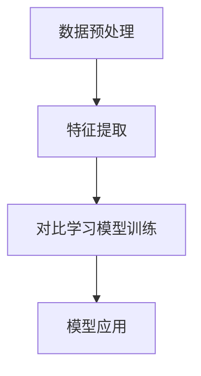
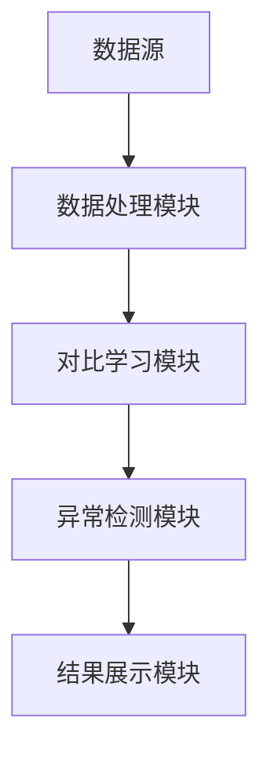
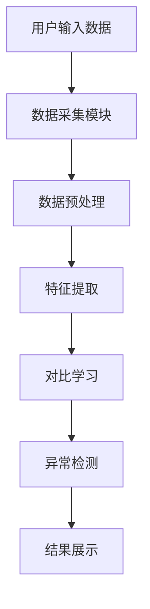

                 

# 《金融领域对比学习在异常检测中的应用》

## 关键词：对比学习，异常检测，金融应用，深度学习，欺诈检测

## 摘要：对比学习是一种通过比较正样本和负样本来学习数据表示的方法，近年来在金融领域的异常检测中得到了广泛应用。本文详细探讨了对比学习与异常检测的核心原理，分析了对比学习在金融领域中的应用场景，结合实际案例，深入讲解了对比学习算法的实现和异常检测系统的架构设计。最后，本文还总结了对比学习在金融异常检测中的优势，并展望了未来的研究方向。

---

## 第一部分：背景介绍

### 第1章：对比学习与异常检测概述

#### 1.1 对比学习的基本概念
- **定义**：对比学习是一种通过比较正样本和负样本来学习数据表示的方法。通过最大化正样本的相似性和最小化负样本的相似性，对比学习能够有效地捕捉数据中的特征差异。
- **核心思想**：对比学习的核心思想是通过对比正样本和负样本的相似性，学习到具有区分能力的特征表示。
- **金融应用**：在金融领域，对比学习可以用于欺诈检测，通过比较正常交易和异常交易的特征差异，提升检测的准确性。

#### 1.2 异常检测的基本概念
- **定义**：异常检测是识别数据中与预期模式或行为显著不同的数据点的过程。
- **分类**：基于统计的方法（如Z-score）、机器学习方法（如随机森林）和深度学习方法（如自动编码器）。
- **金融中的重要性**：在金融领域，异常检测用于欺诈检测、风险管理、市场监控等场景。

#### 1.3 金融领域中的异常检测需求
- **金融欺诈检测**：识别异常交易行为，防止欺诈。
- **风险管理**：检测市场中的异常波动，评估投资风险。
- **市场监控**：识别异常的市场行为，维护市场秩序。

---

## 第二部分：核心概念与联系

### 第2章：对比学习与异常检测的核心原理

#### 2.1 对比学习的数学模型
- **对比学习的目标函数**：InfoNCE损失函数。
  $$ L = -\frac{1}{N}\sum_{i=1}^{N}\log\frac{e^{s(x_i,y_i)}}{\sum_{k=1}^{K}e^{s(x_i,y_k)}}} $$
  其中，$s(x_i,y_i)$是对比相似度，$K$是负样本的数量。
- **对比学习的损失函数**：SimCLR损失函数。
  $$ L = -\frac{1}{N}\sum_{i=1}^{N}\log\frac{e^{s(x_i,y_i)}}{\sum_{k=1}^{K}e^{s(x_i,y_k)}}} $$
- **特征表示**：对比学习通过学习正样本的相似性和负样本的差异性，生成具有区分能力的特征向量。

#### 2.2 异常检测的数学模型
- **异常检测的评分函数**：局部异常因子（LOF）。
  $$ LOF(x) = \frac{d(x)}{d(k(x))} $$
  其中，$d(x)$是点$x$的密度，$k(x)$是$k$近邻点的密度。
- **概率模型**：高斯混合模型（GMM）。
- **深度学习模型**：自动编码器（AE）和变分自编码器（VAE）。

#### 2.3 对比学习与异常检测的联系
- **对比学习如何辅助异常检测**：通过对比学习，可以捕捉数据中的细粒度特征差异，提升异常检测的准确性和鲁棒性。
- **异常检测中的对比学习策略**：设计有效的对比学习框架，如使用无监督对比学习，以增强模型对异常样本的区分能力。
- **对比学习在异常检测中的优势**：对比学习能够有效地学习数据的分布差异，提高异常检测的性能。

---

## 第三部分：算法原理讲解

### 第3章：对比学习算法的实现

#### 3.1 对比学习的算法流程
- **数据预处理**：归一化、特征选择。
- **特征提取**：使用深度学习模型（如ResNet）提取特征。
- **对比学习模型的训练**：使用SimCLR框架进行训练，优化对比损失函数。

#### 3.2 对比学习的Python实现
- **环境搭建**：安装PyTorch、numpy、pandas。
- **代码实现**：包括数据加载、特征提取、对比学习模型构建、训练过程。
- **示例代码**：使用ResNet作为特征提取器，SimCLR损失函数。

#### 3.3 异常检测算法的实现
- **异常检测的算法流程**：数据预处理、模型训练、异常评分。
- **使用对比学习辅助的异常检测算法**：对比学习特征提取后，使用孤立森林进行异常检测。

---

## 第四部分：系统分析与架构设计

### 第4章：系统分析与架构设计

#### 4.1 问题场景介绍
- **金融交易数据的异常检测**：识别异常交易行为。
- **高维数据的处理**：金融数据通常具有高维特性，需要有效的处理方法。

#### 4.2 系统功能设计
- **数据采集模块**：实时采集交易数据。
- **数据处理模块**：清洗、转换。
- **对比学习模块**：特征提取、对比学习训练。
- **异常检测模块**：使用对比学习特征进行异常检测。
- **结果展示模块**：可视化异常结果。

#### 4.3 系统架构设计
- **分层架构**：数据层、计算层、应用层。
- **组件设计**：数据源、特征提取器、对比学习模型、异常检测器。

#### 4.4 接口设计
- **数据接口**：与数据库交互。
- **API接口**：提供异常检测结果。

#### 4.5 交互流程
- **数据输入 -> 特征提取 -> 对比学习 -> 异常检测 -> 结果输出**

---

## 第五部分：项目实战

### 第5章：项目实战

#### 5.1 环境安装
- **安装Python**：确保安装了Python 3.6以上版本。
- **安装库**：使用pip安装PyTorch、numpy、pandas。

#### 5.2 核心代码实现
- **数据加载**：使用Pandas读取CSV文件。
- **特征提取**：使用ResNet提取图像特征。
- **对比学习模型**：SimCLR框架。
- **异常检测**：使用孤立森林。

#### 5.3 案例分析
- **数据集选择**：金融交易数据。
- **数据预处理**：处理缺失值、归一化。
- **模型训练**：对比学习模型训练。
- **异常检测**：识别异常交易。

#### 5.4 结果解读
- **精准率、召回率评估**。
- **可视化结果展示**。

---

## 第六部分：总结与展望

### 第6章：总结与展望

#### 6.1 主要内容回顾
- 对比学习和异常检测的基本概念。
- 对比学习在金融中的应用。

#### 6.2 研究前沿
- 对比学习的最新进展。
- 异常检测的新方法。

#### 6.3 未来研究方向
- 更高效的对比学习算法。
- 结合图神经网络的异常检测。

#### 6.4 最佳实践 tips
- 数据预处理的重要性。
- 模型调参的技巧。
- 结果评估的指标选择。

#### 6.5 注意事项
- 数据隐私保护。
- 模型的可解释性。
- 实际应用中的计算资源需求。

---

## 图表

### 对比学习算法流程图

### 系统架构图

### 系统交互流程图

---

## 结语

本文系统地探讨了对比学习在金融领域异常检测中的应用，从基本概念到算法实现，再到系统架构设计和实际案例分析，提供了全面的讲解。通过对比学习，我们可以更有效地捕捉数据中的异常模式，提升金融系统的安全性。未来的研究可以进一步优化算法，结合更多先进的技术，如图神经网络，以应对更复杂的金融挑战。

---

## 参考文献

1. SimCLR: A Simple Framework for Contrastive Learning of Visual Representations
2. Isolation Forest: A Python Implementation
3. Financial Fraud Detection using Machine Learning
4. Deep Learning for Anomaly Detection: A Review

