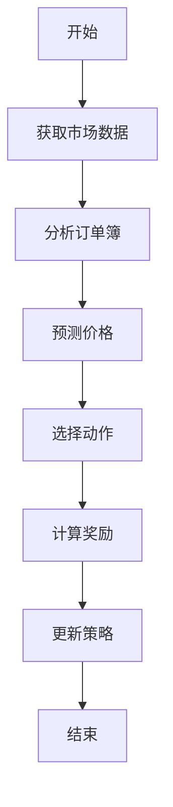
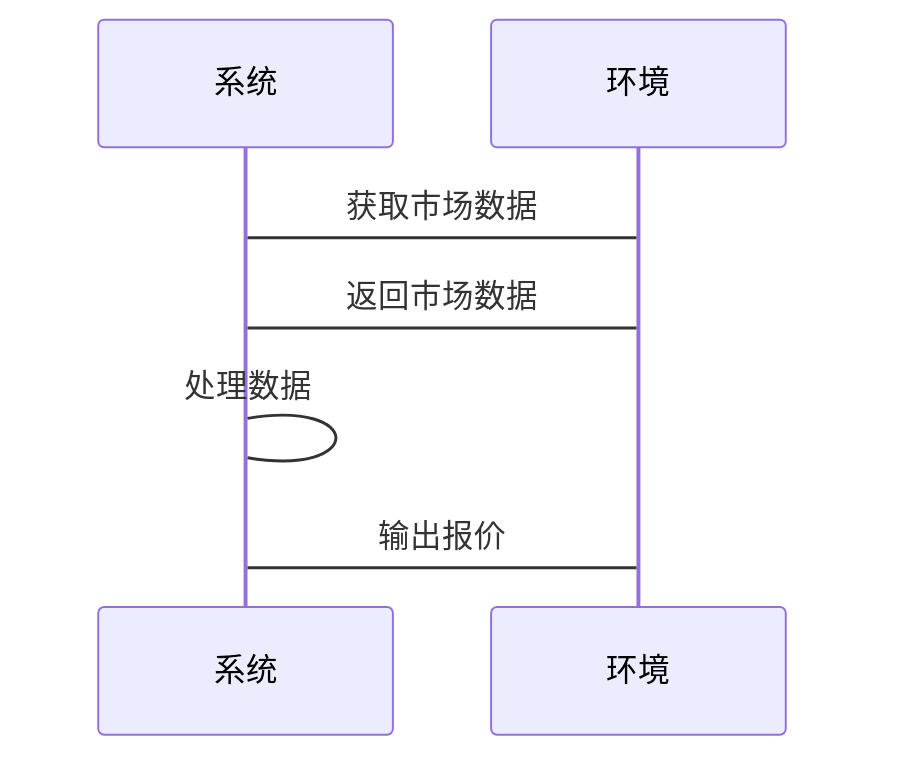

                 


# 《金融领域强化学习在市场做市商策略中的应用》

---

## 关键词：强化学习、做市商策略、金融市场、Q-learning、策略梯度、深度学习

---

## 摘要：本文探讨了强化学习在金融做市商策略中的应用，分析了强化学习的基本原理、核心算法及其在做市商策略优化中的优势。通过构建强化学习框架，详细讲解了做市商策略的系统设计与实现，并通过实际案例展示了强化学习在提升做市商策略效率和收益中的实际效果。

---

# 第1章: 强化学习与金融市场做市商策略的背景

## 1.1 强化学习的基本概念

### 1.1.1 强化学习的定义

强化学习（Reinforcement Learning，简称RL）是一种机器学习方法，通过智能体（Agent）在环境中采取行动，并根据获得的奖励（Reward）来学习策略（Policy）。智能体的目标是通过最大化累积奖励来优化其行为。

### 1.1.2 强化学习的核心要素

- **状态（State）**：环境中的当前情况，表示智能体所处的环境信息。
- **动作（Action）**：智能体在给定状态下采取的行为。
- **奖励（Reward）**：智能体采取某个动作后，环境给予的反馈，表示该动作的好坏程度。
- **策略（Policy）**：智能体选择动作的概率分布，表示在给定状态下选择某个动作的概率。
- **值函数（Value Function）**：衡量某个状态或动作-状态对的“好”程度。

### 1.1.3 强化学习与传统机器学习的对比

| 特性 | 监督学习 | 无监督学习 | 强化学习 |
|------|----------|------------|----------|
| 数据 | 标签数据 | 未标记数据 | 环境反馈 |
| 目标 | 预测 | 发现模式 | 最大化奖励 |
| 交互 | 无 | 无 | 有 |

---

## 1.2 金融市场与做市商的定义

### 1.2.1 金融市场的基本概念

金融市场是买卖金融资产的场所，包括股票、债券、期货等。市场参与者包括投资者、机构、做市商等。

### 1.2.2 做市商的定义与角色

做市商（Market Maker）是金融市场中提供买卖报价的机构，通过在市场中买卖证券来维持市场流动性，并从买卖价差中获利。

### 1.2.3 做市商在金融市场中的重要性

- 维持市场流动性
- 提供价格发现
- 降低交易成本

---

## 1.3 强化学习在做市商策略中的应用背景

### 1.3.1 做市商策略的复杂性

- 市场环境动态变化
- 高频交易挑战
- 多因素影响

### 1.3.2 强化学习在策略优化中的优势

- 适应动态环境
- 实时优化决策
- 处理非线性关系

### 1.3.3 当前市场对智能做市商的需求

- 高频交易的需求
- 数据量的增加
- 市场深度的复杂性

---

# 第2章: 强化学习的核心概念与原理

## 2.1 强化学习的基本原理

### 2.1.1 状态、动作、奖励的定义

- **状态（State）**：市场中的当前情况，例如价格、订单簿信息。
- **动作（Action）**：做市商采取的行为，例如调整报价或数量。
- **奖励（Reward）**：做市商的收益或损失。

### 2.1.2 Q-learning算法的基本原理

Q-learning是一种经典的强化学习算法，通过维护一个Q表来记录每个状态-动作对的期望奖励。算法通过不断更新Q表，找到最优策略。

### 2.1.3 策略梯度方法的简介

策略梯度方法通过优化策略参数，直接在策略空间中寻找最优策略。它适用于复杂环境，能够处理高维状态空间。

---

## 2.2 强化学习的核心概念对比

### 2.2.1 监督学习与强化学习的对比

- 监督学习依赖于标签数据，强化学习依赖于环境反馈。
- 监督学习适用于预测任务，强化学习适用于策略优化。

### 2.2.2 强化学习与无监督学习的对比

- 强化学习通过与环境交互学习，无监督学习通过发现数据模式学习。
- 强化学习适用于动态环境，无监督学习适用于静态数据。

---

## 2.3 强化学习的数学模型与公式

### 2.3.1 Q-learning的数学公式

$$ Q(s, a) = Q(s, a) + \alpha (r + \gamma \max Q(s', a') - Q(s, a)) $$

其中：
- \( Q(s, a) \)：当前状态-动作对的Q值
- \( \alpha \)：学习率
- \( r \)：奖励
- \( \gamma \)：折扣因子
- \( Q(s', a') \)：下一个状态-动作对的Q值

### 2.3.2 策略梯度的优化方法

策略梯度通过优化策略参数 \( \theta \) 来最大化期望奖励：

$$ \nabla_{\theta} J(\theta) = \mathbb{E}_{s,a}[ \nabla_{\theta} \log \pi(a|s) Q(s,a) ] $$

其中：
- \( J(\theta) \)：目标函数
- \( \pi(a|s) \)：策略函数
- \( Q(s,a) \)：值函数

---

## 2.4 强化学习在金融做市商策略中的应用框架

### 2.4.1 做市商策略的强化学习框架

- **状态空间**：市场中的价格、订单信息等。
- **动作空间**：调整报价、数量等。
- **奖励函数**：收益、风险等。

### 2.4.2 强化学习在做市商策略中的核心算法

- **Q-learning**：适用于简单环境。
- **策略梯度**：适用于复杂环境。
- **深度强化学习**：结合深度学习处理高维数据。

### 2.4.3 做市商策略的强化学习流程

1. **状态观测**：获取市场信息。
2. **动作选择**：根据当前策略选择动作。
3. **奖励机制**：计算奖励并更新策略。
4. **策略优化**：通过不断迭代优化策略。

---

## 2.5 强化学习在做市商策略中的数学模型

### 2.5.1 Q-learning的数学公式

如上所述，Q-learning通过不断更新Q表来优化策略。

### 2.5.2 策略梯度的优化方法

策略梯度通过优化策略参数 \( \theta \) 来最大化期望奖励。

---

# 第3章: 做市商策略的系统分析与架构设计

## 3.1 做市商策略的系统功能设计

### 3.1.1 系统功能模块划分

- **订单簿处理**：处理市场订单信息。
- **价格预测**：预测未来价格走势。
- **风险控制**：控制市场风险。

### 3.1.2 各模块的功能描述

- **订单簿处理**：分析市场订单信息，提取价格、成交量等特征。
- **价格预测**：基于历史数据预测未来价格。
- **风险控制**：根据市场波动调整策略。

### 3.1.3 系统功能流程图



---

## 3.2 系统架构设计

### 3.2.1 分层架构设计

- **数据层**：处理原始数据。
- **算法层**：实现强化学习算法。
- **策略层**：优化做市商策略。

### 3.2.2 模块之间的交互关系

- 数据层提供市场数据，算法层进行处理，策略层优化策略。

### 3.2.3 系统架构的优缺点分析

- **优点**：模块化设计，便于维护和扩展。
- **缺点**：可能增加系统复杂性。

---

## 3.3 系统接口设计

### 3.3.1 系统输入接口设计

- **市场数据接口**：接收市场订单信息。
- **策略参数接口**：接收策略参数。

### 3.3.2 系统输出接口设计

- **报价输出接口**：输出买卖报价。
- **日志输出接口**：输出系统日志。

### 3.3.3 系统交互流程图



---

## 3.4 系统架构的详细描述

- **数据层**：处理和存储市场数据。
- **算法层**：实现强化学习算法。
- **策略层**：优化做市商策略。

---

# 第4章: 做市商策略的项目实战

## 4.1 项目环境安装

### 4.1.1 安装Python和必要库

```bash
pip install numpy pandas tensorflow
```

### 4.1.2 安装金融数据接口

```bash
pip install pandas-datareader
```

---

## 4.2 系统核心实现源代码

### 4.2.1 强化学习算法实现

```python
import numpy as np

class QLearning:
    def __init__(self, state_space_size, action_space_size):
        self.state_space_size = state_space_size
        self.action_space_size = action_space_size
        self.Q = np.zeros((state_space_size, action_space_size))
    
    def get_action(self, state):
        return np.argmax(self.Q[state])
    
    def update_Q(self, state, action, reward, next_state):
        alpha = 0.1
        gamma = 0.9
        self.Q[state, action] += alpha * (reward + gamma * np.max(self.Q[next_state]) - self.Q[state, action])
```

### 4.2.2 做市商策略实现

```python
import pandas as pd
from pandas_datareader import DataReader

def get_market_data(ticker):
    return DataReader(ticker, 'yahoo')

def calculate_reward(prices):
    return prices[-1] - prices[-2]

class MarketMaker:
    def __init__(self, ticker):
        self.ticker = ticker
        self.prices = get_market_data(ticker)
    
    def update_strategy(self):
        reward = calculate_reward(self.prices)
        # 使用Q-learning更新策略
        # 假设状态和动作空间已定义
        self.agent.update_Q(current_state, action, reward, next_state)
```

---

## 4.3 代码应用解读与分析

### 4.3.1 强化学习算法实现

- **QLearning类**：实现Q-learning算法，维护Q表，更新Q值。
- **MarketMaker类**：实现做市商策略，获取市场数据，更新策略。

### 4.3.2 做市商策略实现

- **get_market_data**：获取市场数据。
- **calculate_reward**：计算收益。
- **MarketMaker**：实现做市商策略，更新策略。

---

## 4.4 实际案例分析

### 4.4.1 案例背景

假设我们有一个股票交易市场，做市商需要根据市场数据调整买卖报价。

### 4.4.2 策略训练

训练Q-learning算法，使其能够根据市场数据选择最优报价。

### 4.4.3 策略测试

测试策略在历史数据上的表现，验证其有效性和稳定性。

---

## 4.5 项目小结

通过本项目，我们展示了如何使用强化学习优化做市商策略。通过Q-learning算法，我们能够根据市场数据调整报价，实现收益最大化。

---

# 第5章: 强化学习在做市商策略中的最佳实践

## 5.1 最佳实践 tips

### 5.1.1 数据预处理

- 清洗数据
- 标准化数据

### 5.1.2 模型调优

- 调整学习率
- 优化网络结构

### 5.1.3 风险控制

- 设置止损
- 监控市场风险

---

## 5.2 小结

强化学习在做市商策略中的应用具有显著优势，能够实时优化策略，适应市场变化。

---

## 5.3 注意事项

- 确保数据质量
- 避免过拟合
- 监控系统风险

---

## 5.4 拓展阅读

- 《强化学习：算法与应用》
- 《深度强化学习入门》
- 《金融市场的智能算法交易》

---

# 结语

通过本文的详细讲解，我们了解了强化学习在金融做市商策略中的应用，从理论到实践，深入分析了其优势和实现方法。未来，随着技术的进步，强化学习在金融领域的应用将更加广泛和深入。

