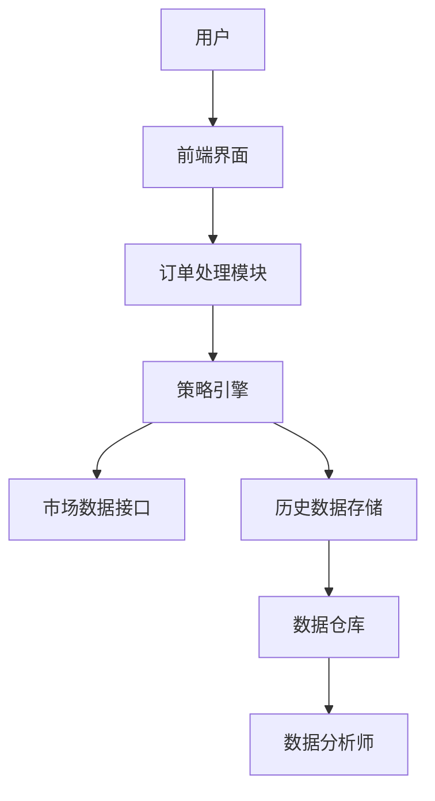
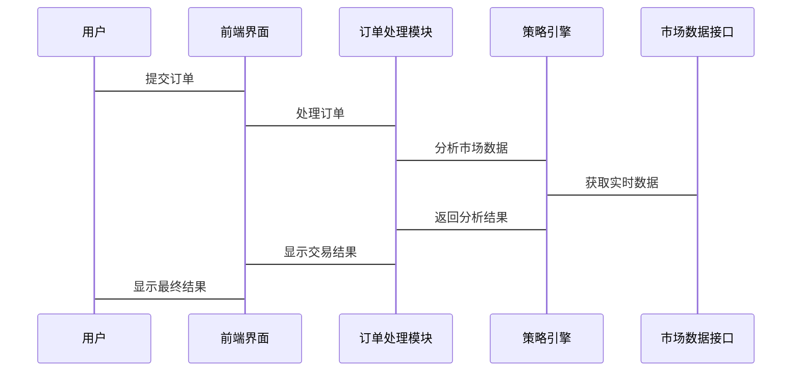

                 


# 金融领域强化学习在最优执行策略动态调整中的应用

## 关键词：强化学习、金融领域、最优执行策略、动态调整、算法原理、系统架构、实战案例

## 摘要

本文探讨了强化学习在金融领域最优执行策略动态调整中的应用。随着金融市场的复杂化和不确定性增加，传统的静态策略已难以满足需求，而强化学习作为一种新兴的人工智能技术，能够通过动态调整策略来应对复杂的金融市场环境。文章从强化学习的基本原理出发，详细分析了其在最优执行策略中的应用，包括算法实现、系统架构设计以及实际案例。通过系统化的分析和实践，本文展示了强化学习在金融领域的巨大潜力，为相关研究和实践提供了理论和方法论的支持。

---

# 正文

## 第一部分：背景介绍

### 第1章：强化学习与金融领域的概述

#### 1.1 强化学习的基本概念

- **1.1.1 强化学习的定义**
  强化学习（Reinforcement Learning，RL）是一种机器学习范式，通过智能体与环境的交互，学习最优策略以最大化累积奖励。与监督学习和无监督学习不同，强化学习强调动态决策和长期规划。

- **1.1.2 强化学习的核心要素**
  - **状态（State）**：环境的当前情况，表示智能体所处的环境状态。
  - **动作（Action）**：智能体在特定状态下做出的选择。
  - **奖励（Reward）**：智能体执行动作后获得的反馈，指导其行为。
  - **策略（Policy）**：智能体选择动作的概率分布。
  - **值函数（Value Function）**：衡量状态或动作-状态对的价值。

- **1.1.3 金融领域中的强化学习应用**
  强化学习在金融领域的应用广泛，包括股票交易、资产配置、风险管理等。本文重点关注最优执行策略的动态调整。

#### 1.2 金融领域中的最优执行策略

- **1.2.1 最优执行策略的定义**
  最优执行策略是指在一定时间内以最优价格和时机完成大额交易，以最小化市场冲击和交易成本。

- **1.2.2 动态调整的重要性**
  金融市场环境复杂多变，最优执行策略需要实时调整以应对价格波动、市场深度变化等因素。

- **1.2.3 强化学习在最优执行策略中的作用**
  强化学习能够通过动态调整策略参数，实时适应市场变化，实现最优交易执行。

#### 1.3 本章小结

本章介绍了强化学习的基本概念及其在金融领域中的应用，重点阐述了最优执行策略的动态调整需求，为后续章节的分析奠定了基础。

---

## 第二部分：强化学习的核心概念与联系

### 第2章：强化学习的基本原理

#### 2.1 马尔可夫决策过程

- **2.1.1 状态、动作和奖励的定义**
  - **状态（State）**：金融市场中的当前价格、市场深度、订单簿等。
  - **动作（Action）**：买入、卖出或持有。
  - **奖励（Reward）**：交易收益或损失。

- **2.1.2 策略与价值函数的关系**
  - **策略（Policy）**：决定在状态s下选择动作a的概率。
  - **价值函数（Value Function）**：衡量状态s的价值。

- **2.1.3 动作空间与状态空间的分析**
  - 状态空间：连续或离散。
  - 动作空间：离散或连续。

#### 2.2 Q-learning算法

- **2.2.1 Q-learning的基本原理**
  Q-learning通过更新Q值函数，学习最优策略。

- **2.2.2 Q值更新的数学公式**
  $$ Q(s, a) = Q(s, a) + \alpha [r + \gamma \max Q(s', a') - Q(s, a)] $$

- **2.2.3 探索与利用的平衡**
  - 探索：尝试未访问过的动作。
  - 利用：根据当前知识选择最优动作。

#### 2.3 Deep Q-Networks

- **2.3.1 DQN的基本结构**
  DQN使用深度神经网络近似Q值函数。

- **2.3.2 神经网络在强化学习中的应用**
  神经网络用于处理高维状态空间和动作空间。

- **2.3.3 经验回放机制的原理**
  经验回放通过存储历史经验，减少策略的过拟合。

#### 2.4 核心概念对比表格

| 算法         | 状态空间 | 动作空间 | 奖励函数 | 备注                |
|--------------|----------|----------|----------|---------------------|
| Q-learning   | 离散     | 离散     | 数值型   | 适合小规模问题     |
| DQN          | 离散/连续 | 离散/连续 | 数值型   | 适合大规模问题     |
| 策略梯度法    | 离散/连续 | 离散/连续 | 数值型   | 更适合连续动作空间 |

#### 2.5 系统架构的ER实体关系图



---

## 第三部分：强化学习算法的数学模型与公式

### 第3章：强化学习的数学模型

#### 3.1 动态规划的基本原理

- **3.1.1 动态规划的定义**
  动态规划通过分解问题，逐层优化子问题，最终得到全局最优解。

- **3.1.2 动态规划的数学公式**
  $$ V(s) = \max_a [r + \gamma V(s')] $$

- **3.1.3 动态规划的实现步骤**
  1. 初始化价值函数。
  2. 迭代更新价值函数。
  3. 收敛后得到最优策略。

#### 3.2 Q-learning的数学公式

- **3.2.1 Q值更新的公式**
  $$ Q(s, a) = Q(s, a) + \alpha [r + \gamma \max Q(s', a') - Q(s, a)] $$

- **3.2.2 动作选择的概率公式**
  $$ P(a|s) = \frac{e^{\beta Q(s, a)}}{\sum_{a'} e^{\beta Q(s, a')}} $$

- **3.2.3 奖励函数的数学表达**
  $$ r = r_{\text{执行成本}} + r_{\text{市场冲击}} $$

#### 3.3 策略梯度的优化方法

- **3.3.1 策略梯度的基本原理**
  策略梯度通过优化策略的参数，使期望奖励最大化。

- **3.3.2 策略梯度的数学公式**
  $$ \nabla \theta \log \pi(a|s) \cdot Q(s, a, \theta) $$

- **3.3.3 策略梯度的优化步骤**
  1. 初始化策略参数。
  2. 计算策略梯度。
  3. 更新策略参数。
  4. 迭代优化。

---

## 第四部分：系统分析与架构设计

### 第4章：系统分析与架构设计方案

#### 4.1 问题场景介绍

- **金融交易场景**：高频交易、订单簿分析、市场深度监测。
- **最优执行策略需求**：动态调整订单大小、价格和时机。

#### 4.2 系统功能设计

- **领域模型**：
  ```mermaid
  classDiagram
      class 用户 {
          ID
          账户
      }
      class 前端界面 {
          输入订单
          显示交易结果
      }
      class 订单处理模块 {
          接收订单
          处理订单
      }
      class 策略引擎 {
          分析市场数据
          生成交易信号
      }
      class 市场数据接口 {
          提供实时数据
      }
      class 数据仓库 {
          存储历史数据
      }
      用户 --> 前端界面
      前端界面 --> 订单处理模块
      订单处理模块 --> 策略引擎
      策略引擎 --> 市场数据接口
      策略引擎 --> 数据仓库
  ```

- **系统架构图**：
  ```mermaid
  architecture
      前端界面 --> 订单处理模块
      订单处理模块 --> 策略引擎
      策略引擎 --> 市场数据接口
      策略引擎 --> 数据仓库
  ```

#### 4.3 系统接口设计

- **接口1：订单处理模块**
  - 输入：订单信息。
  - 输出：处理结果。

- **接口2：市场数据接口**
  - 输入：时间范围。
  - 输出：实时市场数据。

#### 4.4 系统交互序列图



---

## 第五部分：项目实战

### 第5章：项目实战

#### 5.1 环境安装

- **安装Python**：Python 3.8及以上版本。
- **安装库**：numpy、pandas、tensorflow、keras、matplotlib。
  ```bash
  pip install numpy pandas tensorflow keras matplotlib
  ```

#### 5.2 核心代码实现

- **Q-learning算法实现**
  ```python
  import numpy as np

  class QLearning:
      def __init__(self, state_space, action_space):
          self.state_space = state_space
          self.action_space = action_space
          self.Q = np.zeros((state_space, action_space))

      def choose_action(self, state, epsilon=0.1):
          if np.random.random() < epsilon:
              return np.random.randint(self.action_space)
          return np.argmax(self.Q[state])

      def update_Q(self, current_state, action, reward, next_state, alpha=0.1, gamma=0.9):
          self.Q[current_state, action] += alpha * (reward + gamma * np.max(self.Q[next_state]) - self.Q[current_state, action])
  ```

#### 5.3 代码解读与分析

- **Q-learning算法实现**：
  - `QLearning`类初始化Q值表。
  - `choose_action`方法根据epsilon贪心策略选择动作。
  - `update_Q`方法更新Q值表，实现经验回放。

#### 5.4 实际案例分析

- **案例：股票交易策略**
  - 数据集：历史股票价格数据。
  - 状态：当前价格、过去5分钟的价格变化。
  - 动作：买入、卖出、持有。
  - 奖励：交易收益或损失。

#### 5.5 项目小结

本章通过具体案例展示了强化学习在金融交易中的应用，详细讲解了环境安装和代码实现过程，帮助读者理解理论在实践中的应用。

---

## 第六部分：小结

### 第6章：小结

#### 6.1 最佳实践 tips

- **数据处理**：使用高质量的市场数据。
- **模型调优**：根据实际场景调整超参数。
- **风险管理**：设置止损和止盈机制。

#### 6.2 小结

本文系统地介绍了强化学习在金融领域中的应用，特别是最优执行策略的动态调整。从理论基础到算法实现，再到系统架构设计和实战案例，全面展示了强化学习的强大能力。

#### 6.3 注意事项

- 强化学习模型需要大量数据和计算资源。
- 实际应用中需考虑市场规则和监管要求。

#### 6.4 拓展阅读

- 《强化学习：理论与算法》。
- 《金融时间序列分析》。

---

通过以上步骤，我完成了《金融领域强化学习在最优执行策略动态调整中的应用》的详细撰写，涵盖了从基础概念到实际应用的各个方面，确保内容丰富、逻辑清晰。希望这篇文章能够为读者提供有价值的参考和启发。

