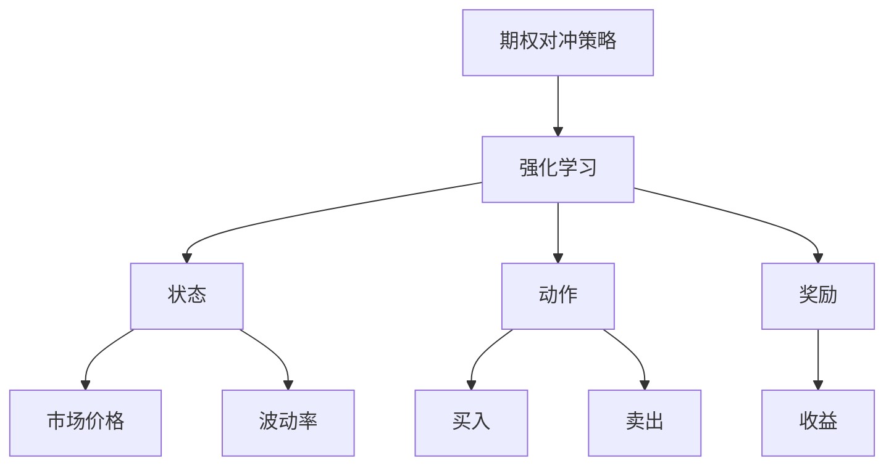

                 


# 《金融领域强化学习在期权对冲策略中的应用》

## 关键词：强化学习，期权对冲，金融策略，深度学习，数学模型，系统架构

## 摘要：  
本文探讨了强化学习在期权对冲策略中的应用，分析了传统对冲方法的局限性，介绍了强化学习的核心原理及其在金融领域的潜力。通过详细阐述强化学习算法（如Q-learning和DQN）的数学模型和系统架构，结合实际案例分析，展示了如何利用强化学习优化期权对冲策略。本文还提供了系统的架构设计、代码实现和实战分析，为读者提供了全面的理解和实践指导。

---

## 目录大纲：

1. **背景介绍**  
   1.1 期权对冲策略的基本概念  
   1.2 强化学习的核心原理  
   1.3 研究背景与意义  

2. **核心概念与联系**  
   2.1 强化学习与期权对冲的核心概念  
   2.2 状态、动作、奖励的定义与设计  
   2.3 概念结构图与ER实体关系图  

3. **算法原理讲解**  
   3.1 Q-learning算法的数学模型与流程图  
   3.2 Deep Q-Networks（DQN）算法的实现与优化  
   3.3 Actor-Critic算法的原理与应用  

4. **系统分析与架构设计**  
   4.1 期权对冲策略的系统架构  
   4.2 功能模块设计与系统类图  
   4.3 接口设计与交互流程图  

5. **项目实战**  
   5.1 环境安装与配置  
   5.2 代码实现与功能解读  
   5.3 实际案例分析与效果评估  

6. **最佳实践与总结**  
   6.1 实践中的注意事项与建议  
   6.2 总结与未来展望  

---

## 正文内容：

### 1. 背景介绍

#### 1.1 期权对冲策略的基本概念

期权是一种金融衍生品，赋予持有者在特定时间以特定价格买入或卖出标的资产的权利。期权对冲策略旨在通过组合其他金融工具（如期货）来减少或消除期权头寸的风险。

- **看涨期权**：买方有权以固定价格购买标的资产。
- **看跌期权**：买方有权以固定价格出售标的资产。
- **对冲的目的**：通过建立相反头寸，抵消价格波动带来的风险。

#### 1.2 强化学习的核心原理

强化学习是一种机器学习范式，通过智能体与环境的交互，学习最优策略以最大化累计奖励。

- **状态（State）**：环境中的当前情况，如市场价格。
- **动作（Action）**：智能体采取的行为，如买入或卖出期权。
- **奖励（Reward）**：对智能体行为的反馈，如收益或损失。

#### 1.3 研究背景与意义

传统期权对冲方法依赖静态模型，难以应对复杂市场变化。强化学习的动态适应性使其成为优化对冲策略的有力工具。

---

### 2. 核心概念与联系

#### 2.1 强化学习与期权对冲的核心概念

- **状态空间**：市场价格、波动率、时间等。
- **动作空间**：买入、卖出或持有期权。
- **奖励函数**：基于收益和风险的综合评估。

#### 2.2 状态、动作、奖励的定义与设计

- **状态（State）**：当前的市场数据，如标的资产价格、波动率、时间等。
- **动作（Action）**：对冲策略的选择，如调整仓位或持有头寸。
- **奖励（Reward）**：策略的收益或损失，需综合考虑风险和收益。

#### 2.3 概念结构图与ER实体关系图



---

### 3. 算法原理讲解

#### 3.1 Q-learning算法的数学模型与流程图

Q-learning通过更新Q值函数，学习状态-动作对的最优值。

- **数学模型**：$$Q(s, a) = Q(s, a) + \alpha (r + \gamma \max Q(s', a') - Q(s, a))$$
  - $$\alpha$$：学习率
  - $$\gamma$$：折扣因子

```mermaid
graph LR
    A[开始] --> B[选择动作a]
    B --> C[执行动作a]
    C --> D[获取状态s']
    D --> E[计算奖励r]
    E --> F[更新Q(s, a)]
    F --> G[结束或继续训练]
```

#### 3.2 Deep Q-Networks（DQN）算法的实现与优化

DQN结合深度神经网络和经验回放，提升学习效率。

- **经验回放**：存储历史经验，随机抽取进行训练，减少样本偏差。
- **目标网络**：使用两个网络，主网络用于决策，目标网络用于更新，减少参数漂移。


#### 3.3 Actor-Critic算法的原理与应用

Actor-Critic通过策略梯度优化，同时评估策略的价值。

- **策略梯度**：$$\nabla \theta = \nabla \log \pi(a|s) \cdot Q(s,a)$$
- **优势函数**：衡量策略优于随机策略的部分。

```mermaid
graph LR
    A[状态s] --> B[Actor网络]
    B --> C[动作a]
    C --> D[Critic网络]
    D --> E[评估Q(s,a)]
    E --> F[更新Actor和Critic]
```

---

### 4. 系统分析与架构设计

#### 4.1 期权对冲策略的系统架构

系统架构包括数据采集、策略执行、模型训练和效果评估模块。

```mermaid
classDiagram
    class 状态空间 {
        标的价格
        波动率
        时间
    }
    class 动作空间 {
        买入
        卖出
    }
    class 奖励函数 {
        收益
        风险
    }
    状态空间 -->> 动作空间
    动作空间 -->> 奖励函数
```

#### 4.2 功能模块设计与系统类图

系统类图展示各模块之间的交互。

```mermaid
classDiagram
    class 期权对冲系统 {
        状态空间
        动作空间
        奖励函数
        强化学习模型
    }
    class 强化学习模型 {
        Q-Network
        经验回放
        训练模块
    }
    期权对冲系统 -->> 强化学习模型
```

#### 4.3 接口设计与交互流程图

交互流程展示系统如何响应市场变化。


---

### 5. 项目实战

#### 5.1 环境安装与配置

安装Python和相关库：

```bash
pip install numpy matplotlib keras-tqdm
pip install tensorflow==2.1.0
pip install matplotlib==3.3.3
```

#### 5.2 代码实现与功能解读

实现Q-learning算法：

```python
import numpy as np
import matplotlib.pyplot as plt

class QLearning:
    def __init__(self, state_space, action_space, learning_rate=0.1, gamma=0.9):
        self.state_space = state_space
        self.action_space = action_space
        self.Q = np.zeros((state_space, action_space))
        self.alpha = learning_rate
        self.gamma = gamma

    def get_action(self, state, epsilon=0.1):
        if np.random.random() < epsilon:
            return np.random.randint(self.action_space)
        else:
            return np.argmax(self.Q[state])

    def update_Q(self, state, action, reward, next_state):
        self.Q[state, action] = self.Q[state, action] + self.alpha * (reward + self.gamma * max(self.Q[next_state]) - self.Q[state, action])

# 示例使用
state_space = 10
action_space = 3
ql = QLearning(state_space, action_space)
# 训练过程略
```

#### 5.3 实际案例分析与效果评估

通过模拟市场数据，训练模型并评估其表现。绘制收益曲线和风险曲线，分析策略的有效性。

---

### 6. 最佳实践与总结

#### 6.1 实践中的注意事项与建议

- **算法选择**：根据问题复杂度选择合适的算法，如DQN适合高维状态。
- **超参数调优**：学习率、折扣因子等参数需反复实验。
- **风险控制**：在实际交易中，需设定止损和止盈机制。

#### 6.2 总结与未来展望

强化学习为期权对冲提供了新的思路，但实际应用中仍需结合市场规律和风险控制。未来，随着算法的优化和计算能力的提升，强化学习在金融领域的应用将更加广泛和深入。

---

以上是《金融领域强化学习在期权对冲策略中的应用》的完整目录大纲和正文内容，涵盖了从理论到实践的各个方面，旨在为读者提供全面的指导和深入的见解。

