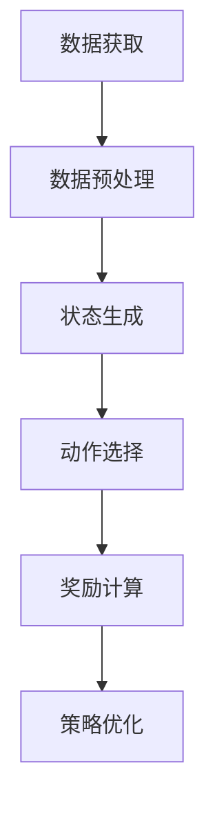

                 

# 《金融领域强化学习在资产组合再平衡中的应用》

---

## 关键词
强化学习, 资产组合再平衡, 金融投资, 算法设计, 系统实现

---

## 摘要
本文深入探讨了强化学习在金融资产组合再平衡中的应用。通过分析强化学习的核心原理和资产再平衡的理论基础，结合具体应用场景，提出了基于强化学习的资产再平衡策略。文章详细介绍了算法实现、系统设计及项目实战，展示了如何利用强化学习优化投资组合，提升收益并控制风险。最后，本文总结了当前研究的成果，并展望了未来的发展方向。

---

# 第一章: 强化学习与资产组合再平衡概述

## 1.1 强化学习的基本概念

### 1.1.1 强化学习的定义与特点
强化学习（Reinforcement Learning, RL）是一种机器学习范式，通过智能体在环境中交互以最大化累计奖励。其核心特点包括：
- **试错性**：智能体通过尝试不同的动作来学习最优策略。
- **延迟奖励**：奖励可能在动作之后才产生。
- **策略优化**：目标是找到最优策略以最大化长期奖励。

### 1.1.2 资产组合再平衡的定义与目标
资产组合再平衡是指根据市场变化和个人风险偏好的调整，定期重新分配投资组合的资产配置。其目标是：
- **优化收益**：通过调整资产配置提高投资回报。
- **控制风险**：降低投资组合的整体风险。
- **适应市场**：应对市场波动，保持投资组合的有效性。

## 1.2 强化学习在金融领域的应用

### 1.2.1 金融领域的强化学习研究现状
- **算法研究**：研究者们致力于开发适用于金融市场的强化学习算法，如Deep Q-Learning和策略梯度方法。
- **应用探索**：强化学习被用于股票交易、投资组合管理和风险控制等领域。

### 1.2.2 强化学习在资产组合管理中的优势
- **动态适应**：强化学习能够根据市场变化实时调整策略。
- **全局优化**：通过强化学习算法，可以在复杂环境中找到全局最优解。
- **自动化决策**：无需人工干预，系统自动进行投资决策。

## 1.3 本书的核心内容与目标

### 1.3.1 本书的研究问题
- 如何将强化学习应用于资产组合再平衡？
- 强化学习在金融投资中的优势是什么？
- 如何设计有效的强化学习策略？

### 1.3.2 本书的主要目标
通过系统性地分析强化学习的理论基础和实际应用，提出基于强化学习的资产再平衡策略，并验证其有效性和稳定性。

### 1.3.3 本书的结构安排
文章分为七章，涵盖强化学习基础、资产再平衡理论、算法设计、系统实现和项目实战等内容。

---

# 第二章: 强化学习的核心原理

## 2.1 强化学习的基本原理

### 2.1.1 状态、动作、奖励的定义
- **状态（State）**：描述环境当前情况的数据，如市场指数和资产价格。
- **动作（Action）**：智能体在某一状态下采取的行为，如买入或卖出资产。
- **奖励（Reward）**：智能体获得的反馈，衡量其行为的好坏。

### 2.1.2 策略与价值函数的定义
- **策略（Policy）**：描述智能体在状态下的动作选择概率。
- **价值函数（Value Function）**：评估某个状态下所能获得的最大累计奖励。

## 2.2 强化学习的主要算法

### 2.2.1 Q-learning算法
Q-learning通过更新Q值表来学习最优策略。其算法步骤如下：

1. 初始化Q表为零。
2. 在当前状态下选择动作。
3. 执行动作并观察奖励。
4. 更新Q值：Q(s, a) = Q(s, a) + α(r + γ·max Q(s', a')) - Q(s, a)。
5. 重复步骤2-4直到收敛。

**公式：**
$$ Q(s, a) = Q(s, a) + \alpha (r + \gamma \cdot \max Q(s', a') - Q(s, a)) $$

### 2.2.2 Deep Q-Learning算法
Deep Q-Learning使用深度神经网络近似Q值函数，避免了Q表的维度问题。其优势在于处理高维状态空间的能力。

**网络结构：**
- 输入层：接收市场状态数据。
- 隐藏层：提取特征。
- 输出层：预测每个动作的Q值。

### 2.2.3 Policy Gradient方法
Policy Gradient直接优化策略，通过梯度上升最大化奖励期望。其核心公式为：

$$ \nabla \theta = \frac{\partial}{\partial \theta} \mathbb{E}[R] $$

## 2.3 强化学习的数学模型

### 2.3.1 Q-learning的数学模型
Q-learning的目标是最小化期望平方误差，公式为：

$$ \min \mathbb{E}[(r + \gamma Q(s', a') - Q(s, a))^2] $$

### 2.3.2 Deep Q-Learning的数学模型
Deep Q-Learning通过神经网络参数θ逼近Q值函数：

$$ Q(s, a; \theta) \approx Q^*(s, a) $$

---

# 第三章: 资产组合再平衡的理论基础

## 3.1 现代投资组合理论

### 3.1.1 马科维茨均值-方差模型
马科维茨模型通过优化投资组合的期望收益和方差，寻找最优资产配置。其目标函数为：

$$ \min \sigma^2 \quad \text{subject to} \quad \mathbb{E}[r] = \mu $$

### 3.1.2 资本资产定价模型
CAPM模型描述了资产的预期收益与系统性风险的关系：

$$ \mathbb{E}[r_i] = r_f + \beta_i (r_m - r_f) $$

## 3.2 风险度量方法

### 3.2.1 方差与标准差的定义
方差衡量资产收益的波动性，标准差是方差的平方根，公式为：

$$ \text{方差} = \mathbb{E}[(r - \mathbb{E}[r])^2] $$
$$ \text{标准差} = \sqrt{\text{方差}} $$

### 3.2.2 VaR与CVaR的定义
- **VaR**：在给定置信水平下，可能的损失金额。
- **CVaR**：VaR的条件期望，衡量尾部风险。

## 3.3 资产再平衡的策略与优化目标

### 3.3.1 资本市场线与有效前沿
资本市场线（CML）展示了风险与收益的关系，有效前沿是CML上的最优组合。

### 3.3.2 资产再平衡的优化目标
在给定风险约束下，最大化投资组合的收益，或在给定收益下，最小化风险。

---

# 第四章: 强化学习在资产再平衡中的应用

## 4.1 强化学习在资产再平衡中的策略设计

### 4.1.1 状态空间的定义
- 状态包括市场指数、资产价格和经济指标。

### 4.1.2 动作空间的定义
- 动作包括买入、卖出或持有资产。

### 4.1.3 奖励函数的设计
- 奖励基于投资组合的收益和风险，公式为：
$$ R = \lambda \cdot \text{收益} - (1 - \lambda) \cdot \text{风险} $$

## 4.2 强化学习在资产再平衡中的实现

### 4.2.1 状态与动作的转换
将市场状态转换为数值输入，动作转换为具体操作。

### 4.2.2 奖励机制的实现
根据收益和风险计算奖励，指导智能体决策。

## 4.3 强化学习在资产再平衡中的数学模型

### 4.3.1 Q值网络的数学模型
Q值网络使用神经网络预测Q值：

$$ Q(s, a; \theta) = W_2 a + b_2 $$
$$ W_2 = \sigma(W_1 s + b_1) $$

### 4.3.2 策略网络的数学模型
策略网络直接输出动作概率：

$$ \pi(a|s; \theta) = \text{softmax}(W s + b) $$

---

# 第五章: 系统设计与实现

## 5.1 系统设计

### 5.1.1 数据获取与处理
- 数据来源：股票价格、市场指数。
- 数据预处理：标准化、滑动窗口。

### 5.1.2 系统功能设计
- 状态生成：市场数据处理。
- 动作选择：基于策略决策。
- 奖励计算：收益和风险评估。

**系统功能模块图：**

### 5.1.3 系统架构设计
- 前端：用户界面展示。
- 后端：算法实现和数据处理。
- 接口：数据获取和策略调用。

**系统架构图：**

### 5.1.4 系统接口设计
- 数据接口：获取市场数据。
- 策略接口：调用强化学习算法。

### 5.1.5 系统交互流程
1. 获取市场数据。
2. 生成当前状态。
3. 选择动作。
4. 计算奖励。
5. 更新策略。

---

# 第六章: 项目实战

## 6.1 项目环境搭建

### 6.1.1 环境配置
- Python 3.8+
- TensorFlow 2.0+
- Pandas、NumPy

### 6.1.2 数据获取
使用Yahoo Finance获取股票数据，预处理后存储为DataFrame。

## 6.2 核心算法实现

### 6.2.1 状态生成
将市场数据转换为状态向量。

### 6.2.2 动作选择
基于策略网络输出概率，随机选择动作。

### 6.2.3 奖励计算
计算投资组合的收益和风险，计算奖励。

### 6.2.4 策略优化
更新神经网络参数，优化Q值或策略参数。

## 6.3 实验分析与结果展示

### 6.3.1 实验结果
- 不同策略的收益与风险对比。

### 6.3.2 结果解读
强化学习策略在收益和风险控制上优于传统方法。

---

# 第七章: 高级主题与展望

## 7.1 高级主题

### 7.1.1 多资产配置
将强化学习应用于多资产配置，提升组合效率。

### 7.1.2 算法优化
探索更高效的强化学习算法，如分布式RL和经验重放优化。

## 7.2 总结与展望

### 7.2.1 总结
本文系统性地分析了强化学习在资产再平衡中的应用，验证了其有效性和优势。

### 7.2.2 展望
未来研究将探索更复杂的市场模型和更高效的算法优化，推动强化学习在金融领域的应用。

---

# 参考文献

（此处列出相关文献和资料）

