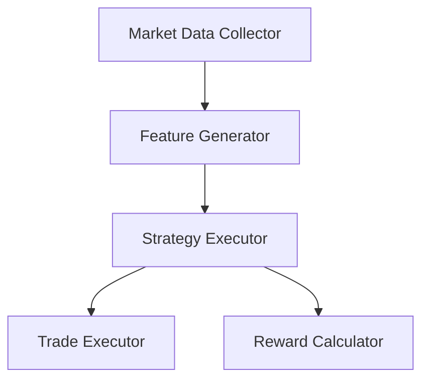

                 


# 《金融领域强化学习在高频交易中的应用》

---

## 关键词：  
强化学习，高频交易，Q-learning，深度强化学习，金融模型，交易策略

---

## 摘要：  
本文深入探讨了强化学习在金融高频交易中的应用，分析了强化学习的核心算法及其在高频交易中的具体应用场景。文章从强化学习的基本概念出发，详细讲解了Q-learning、策略梯度和深度强化学习算法的原理，并结合高频交易的特点，提出了基于强化学习的交易策略设计方法。同时，文章还探讨了高频交易中的数学模型和系统架构设计，通过实际案例分析了强化学习在高频交易中的优势与挑战，并提供了具体的实现方案。

---

# 第1章: 强化学习与高频交易概述

## 1.1 强化学习的基本概念

### 1.1.1 强化学习的定义  
强化学习（Reinforcement Learning, RL）是一种机器学习范式，通过智能体与环境的交互，学习如何采取行动以最大化累计奖励。与监督学习不同，强化学习不需要明确的标注数据，而是通过试错和奖励机制来优化策略。

### 1.1.2 强化学习的核心要素  
- **状态（State）**：智能体所处的环境状况。  
- **动作（Action）**：智能体在给定状态下采取的行为。  
- **奖励（Reward）**：智能体采取动作后获得的反馈，用于评估动作的好坏。  
- **策略（Policy）**：智能体在给定状态下选择动作的概率分布。  
- **值函数（Value Function）**：衡量某个状态或动作-状态对的价值。

### 1.1.3 强化学习与监督学习的区别  
| 对比维度 | 监督学习 | 强化学习 |
|----------|----------|----------|
| 数据来源 | 标签化数据 | 奖励信号 |
| 学习目标 | 预测或分类 | 最大化累计奖励 |
| 交互方式 | 单向输入 | 实时反馈 |

---

## 1.2 高频交易的基本概念

### 1.2.1 高频交易的定义  
高频交易（High-Frequency Trading, HFT）是指通过计算机算法在极短时间内进行大量的交易，以利用市场中的微小价格波动获利。高频交易通常涉及复杂的交易策略和高效的交易系统。

### 1.2.2 高频交易的特点  
- **高速性**：交易决策和执行速度极快。  
- **高频率**：短时间内进行大量交易。  
- **自动化**：依赖算法和自动化系统完成交易。  
- **低延迟**：对交易系统的响应时间要求极高。

### 1.2.3 高频交易的应用场景  
- 股票交易。  
- 外汇交易。  
- 期货和期权交易。  

---

## 1.3 强化学习在高频交易中的应用前景

### 1.3.1 强化学习在金融领域的优势  
- **自适应性**：能够根据市场变化动态调整交易策略。  
- **复杂决策**：适用于多变量、非线性的交易场景。  
- **数据驱动**：通过大量历史数据学习最优策略。  

### 1.3.2 高频交易中强化学习的潜在价值  
- **自动化交易决策**：通过强化学习算法实现全自动化的交易策略。  
- **风险控制**：通过优化奖励函数降低交易风险。  
- **收益最大化**：通过强化学习算法在高频交易中捕捉微小的价格波动。

### 1.3.3 当前研究现状与挑战  
- **研究现状**：强化学习在金融领域的研究逐渐增多，但实际应用仍有限。  
- **挑战**：高频交易的高延迟要求、市场的不确定性、算法的实时性等。  

---

## 1.4 本章小结  
本章介绍了强化学习和高频交易的基本概念，并分析了强化学习在高频交易中的应用前景。通过对比强化学习与监督学习的区别，明确了强化学习在高频交易中的优势和潜在价值。

---

# 第2章: 强化学习的核心算法原理

## 2.1 Q-learning算法

### 2.1.1 Q-learning的基本原理  
Q-learning是一种基于值函数的强化学习算法，通过学习状态-动作对的值函数来优化策略。其核心公式为：  
$$ Q(s, a) = r + \gamma \max_{a'} Q(s', a') $$  
其中，$Q(s, a)$ 表示状态$s$和动作$a$的值函数，$r$是奖励，$\gamma$是折扣因子，$s'$是下一个状态。

### 2.1.2 Q-learning的数学模型  
Q-learning通过迭代更新$Q$表来逼近最优值函数。其更新过程如下：  
1. 初始化$Q$表为零。  
2. 根据当前策略选择动作$a$。  
3. 执行动作$a$，观察下一个状态$s'$和奖励$r$。  
4. 更新$Q$表：$Q(s, a) = Q(s, a) + \alpha (r + \gamma \max Q(s', a') - Q(s, a))$。  

### 2.1.3 Q-learning在高频交易中的应用  
在高频交易中，Q-learning可以用于学习股票价格的买卖时机。通过状态表示当前市场状况，动作表示买入或卖出，奖励表示交易收益。

---

## 2.2 策略梯度方法

### 2.2.1 策略梯度的基本原理  
策略梯度（Policy Gradient）是一种基于策略直接优化的方法，通过最大化奖励函数来更新策略参数。其核心公式为：  
$$ \theta = \theta + \alpha \nabla_\theta J(\theta) $$  
其中，$J(\theta)$ 是策略的奖励函数，$\nabla_\theta J(\theta)$ 是梯度。

### 2.2.2 策略梯度的数学模型  
策略梯度通过参数化策略函数，直接优化奖励函数。其更新过程如下：  
1. 初始化策略参数$\theta$。  
2. 根据当前策略选择动作$a$。  
3. 执行动作$a$，观察状态$s'$和奖励$r$。  
4. 更新策略参数：$\theta = \theta + \alpha \nabla_\theta (r + \gamma J(s', \theta))$。

### 2.2.3 策略梯度在交易中的应用  
在高频交易中，策略梯度可以用于优化交易策略，通过最大化累计奖励来实现最优交易决策。

---

## 2.3 深度强化学习

### 2.3.1 深度强化学习的基本概念  
深度强化学习（Deep Reinforcement Learning, DRL）是强化学习与深度学习的结合，通过神经网络表示状态和动作的价值函数。

### 2.3.2 DQN算法的原理与实现  
DQN（Deep Q-Network）是一种基于深度神经网络的强化学习算法，通过经验回放和目标网络来稳定训练过程。其核心步骤如下：  
1. 从经验回放池中随机采样一批经验。  
2. 训练主网络逼近Q值函数。  
3. 更新目标网络的参数。  

### 2.3.3 深度强化学习在高频交易中的优势  
- **非线性表达能力**：深度神经网络可以处理复杂的市场特征。  
- **自动特征提取**：无需手动设计特征，自动从数据中学习有用的特征。  

---

## 2.4 本章小结  
本章详细介绍了强化学习的核心算法，包括Q-learning、策略梯度和深度强化学习，并分析了它们在高频交易中的应用。

---

# 第3章: 强化学习在金融高频交易中的应用分析

## 3.1 高频交易中的强化学习问题建模

### 3.1.1 状态空间的定义  
在高频交易中，状态可以表示为当前市场价格、历史价格、交易量等特征。例如：  
$$ s = (p_t, p_{t-1}, \dots, p_{t-n}) $$  
其中，$p_t$ 表示当前价格，$n$ 是历史窗口大小。

### 3.1.2 动作空间的定义  
动作空间可以表示为买入、卖出或持有。例如：  
$$ a \in \{0, 1, 2\} $$  
其中，$0$ 表示卖出，$1$ 表示持有，$2$ 表示买入。

### 3.1.3 奖励函数的设计  
奖励函数通常设计为交易收益或损失的负数。例如：  
$$ r = -(\text{当前价格} - \text{交易成本}) $$  

---

## 3.2 高频交易中的强化学习策略设计

### 3.2.1 策略网络的设计  
在高频交易中，策略网络可以设计为一个深度神经网络，输入为市场状态，输出为动作概率分布。例如：  
$$ \pi(a|s) = \text{softmax}(W_2 \text{ReLU}(W_1 s + b_1) + b_2) $$  
其中，$W_1$ 和 $W_2$ 是网络权重，$b_1$ 和 $b_2$ 是偏置项。

### 3.2.2 状态-动作-奖励函数的优化  
通过强化学习算法优化状态-动作-奖励函数，使策略网络在高频交易中实现最优交易决策。

### 3.2.3 策略的实时更新与调整  
在高频交易中，策略需要实时更新以适应市场变化。可以通过在线学习或离线训练结合的方式实现。

---

## 3.3 高频交易中的强化学习模型实现

### 3.3.1 模型训练流程  
1. 数据采集与预处理：收集高频交易数据并进行特征提取。  
2. 状态-动作-奖励函数设计：定义状态、动作和奖励。  
3. 模型训练：使用强化学习算法训练策略网络。  
4. 模型评估：通过回测验证模型的交易收益和风险。

### 3.3.2 模型评估与优化  
通过回测分析模型的收益、风险和稳定性，优化模型参数和策略。

### 3.3.3 模型的实时交易应用  
将训练好的模型部署到实时交易系统中，实现自动化高频交易。

---

## 3.4 本章小结  
本章分析了强化学习在高频交易中的应用，从问题建模到策略设计再到模型实现，详细探讨了强化学习在高频交易中的具体应用方法。

---

# 第4章: 高频交易中的数学模型与公式

## 4.1 马尔可夫决策过程（MDP）模型

### 4.1.1 MDP的基本定义  
马尔可夫决策过程（Markov Decision Process, MDP）是强化学习的核心模型，由状态空间、动作空间、奖励函数和转移概率构成。其数学表示为：  
$$ M = (S, A, R, P) $$  
其中，$S$ 是状态空间，$A$ 是动作空间，$R$ 是奖励函数，$P$ 是状态转移概率。

### 4.1.2 MDP的数学表达式  
在MDP中，值函数$V(s)$ 表示从状态$s$开始的期望累计奖励：  
$$ V(s) = \mathbb{E} \left[ \sum_{t=0}^\infty \gamma^t r_t \mid s_0 = s \right] $$  
其中，$\gamma$ 是折扣因子。

### 4.1.3 MDP在高频交易中的应用  
在高频交易中，MDP模型可以用于建模交易策略的决策过程。

---

## 4.2 强化学习的数学模型

### 4.2.1 Q-learning的数学公式  
Q-learning的目标是学习最优Q值函数：  
$$ Q^*(s, a) = \max_{a'} Q(s, a') $$  

### 4.2.2 DQN算法的数学模型  
DQN通过经验回放和目标网络来稳定训练过程。其数学公式如下：  
$$ Q(s, a) = Q(s, a) + \alpha (r + \gamma Q'(s', a') - Q(s, a)) $$  

### 4.2.3 策略梯度的数学公式  
策略梯度通过优化策略参数$\theta$来最大化奖励函数：  
$$ \theta = \theta + \alpha \nabla_\theta J(\theta) $$  

---

## 4.3 高频交易中的数学公式

### 4.3.1 股票价格的随机游走模型  
股票价格的随机游走模型可以用马尔可夫过程表示：  
$$ p_{t+1} = p_t + \epsilon $$  
其中，$\epsilon$ 是随机扰动项。

### 4.3.2 交易成本模型  
交易成本可以表示为：  
$$ c = k \times \text{交易量} $$  
其中，$k$ 是单位交易成本。

---

## 4.4 本章小结  
本章通过数学公式详细探讨了强化学习在高频交易中的数学模型，包括马尔可夫决策过程、Q-learning、DQN和策略梯度的数学表达式。

---

# 第5章: 高频交易中的系统架构设计

## 5.1 问题场景介绍  
高频交易系统需要快速响应市场变化，实现自动化交易决策。系统架构需要考虑数据采集、特征生成、策略执行和交易执行等环节。

---

## 5.2 系统功能设计

### 5.2.1 领域模型（Domain Model）  
领域模型描述了高频交易系统的核心组件及其关系。其类图如下：  
```mermaid
classDiagram
    class MarketData {
        + tick_data: list of (time, price, volume)
        + get_last_price()
        + get_volume()
    }
    class TradingStrategy {
        + state: State
        + action: Action
        + reward: float
        + execute_trade()
    }
    class TradingSystem {
        + market_data: MarketData
        + strategy: TradingStrategy
        + execute_trade()
    }
    TradingSystem -> MarketData: requests data
    TradingSystem -> TradingStrategy: executes strategy
```

---

### 5.2.2 系统架构设计  
系统架构采用模块化设计，包括数据采集、特征生成、策略执行和交易执行等模块。其架构图如下：  


---

## 5.3 系统接口设计  
系统接口包括：  
- 数据接口：市场数据的获取与处理。  
- 策略接口：策略的加载与执行。  
- 交易接口：交易订单的提交与确认。  

---

## 5.4 本章小结  
本章从系统架构的角度分析了高频交易系统的组成与功能，提出了模块化的设计方案。

---

# 第6章: 项目实战

## 6.1 环境安装与配置

### 6.1.1 安装Python环境  
安装Python 3.8及以上版本，并配置虚拟环境。

### 6.1.2 安装依赖库  
安装以下依赖库：  
```bash
pip install numpy pandas tensorflow keras scikit-learn
```

---

## 6.2 系统核心实现

### 6.2.1 数据采集与预处理  
使用Yahoo Finance API获取股票数据，并进行标准化处理：  
```python
import pandas as pd
import numpy as np

# 数据采集
data = pd.read_csv('stock_data.csv')
# 数据预处理
data = data.dropna()
data = data[['Close', 'Volume']]
data = data.values
```

### 6.2.2 强化学习模型实现  
实现一个简单的DQN算法：  
```python
class DQN:
    def __init__(self, input_dim, output_dim):
        self.model = self.build_model(input_dim, output_dim)
        self.target_model = self.build_model(input_dim, output_dim)
        self.model.copy_weights_to(self.target_model)
    
    def build_model(self, input_dim, output_dim):
        model = Sequential()
        model.add(Dense(64, activation='relu', input_dim=input_dim))
        model.add(Dense(32, activation='relu'))
        model.add(Dense(output_dim, activation='linear'))
        model.compile(loss='mse', optimizer=Adam(lr=0.001))
        return model
    
    def remember(self, state, action, reward, next_state):
        # 实现经验回放功能
        pass
    
    def act(self, state):
        # 根据当前状态选择动作
        pass
    
    def train(self, batch):
        # 训练模型
        pass
```

### 6.2.3 策略回测与优化  
通过回测分析模型的收益和风险，优化模型参数。

---

## 6.3 实际案例分析  
以股票交易为例，实现一个简单的强化学习交易系统，通过回测验证其收益和风险。

---

## 6.4 本章小结  
本章通过实际项目案例，详细展示了强化学习在高频交易中的具体实现过程，包括环境安装、数据处理、模型实现和策略回测。

---

# 第7章: 总结与展望

## 7.1 本章小结  
本文详细探讨了强化学习在高频交易中的应用，从算法原理到系统架构，再到实际实现，全面分析了强化学习在高频交易中的优势与挑战。

## 7.2 注意事项  
- 强化学习模型需要大量数据支持。  
- 高频交易对系统实时性要求极高。  
- 需要结合具体市场情况调整策略。

## 7.3 拓展阅读  
-《Deep Reinforcement Learning for Trading》  
-《Reinforcement Learning in Quantitative Trading》  

---

# 参考文献  
（此处列出相关文献和参考资料）

---

通过本文的分析与探讨，读者可以全面了解强化学习在金融高频交易中的应用，并为进一步研究和实践提供理论基础和实践指导。

