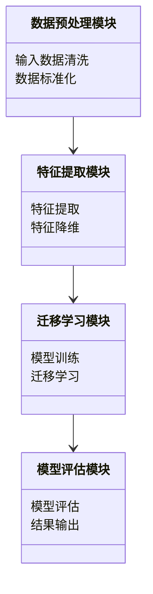
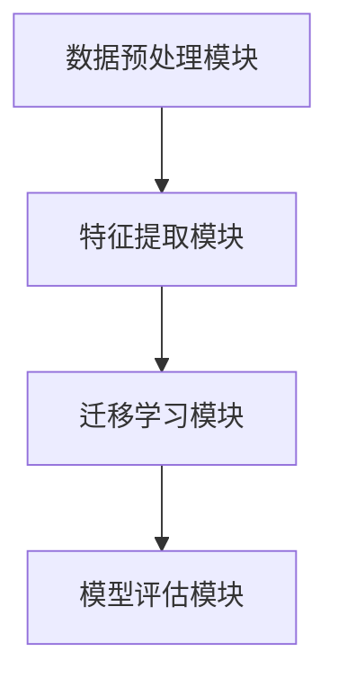
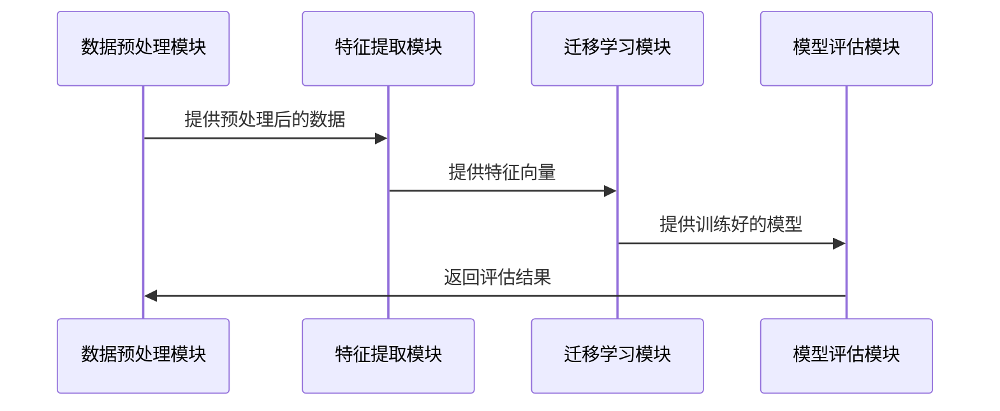

                 


# 金融领域的迁移学习应用研究

---

## 关键词：
迁移学习、金融领域、机器学习、时间序列预测、风险评估、欺诈检测

---

## 摘要：
本文系统探讨迁移学习在金融领域的应用，涵盖其核心概念、算法原理及实际案例。通过分析迁移学习的优势，结合金融领域的独特挑战，本文提出适用于金融场景的迁移学习模型，并详细解读其在时间序列预测、风险评估和欺诈检测中的应用。同时，本文总结迁移学习在金融领域的未来发展方向，为相关研究者和从业者提供参考。

---

# 第1章: 迁移学习概述与金融领域背景

## 1.1 迁移学习的基本概念

### 1.1.1 机器学习的基本概念
机器学习是一种通过数据训练模型，使其能够从经验中学习并做出预测的技术。其主要流派包括监督学习、无监督学习、半监督学习和强化学习。

### 1.1.2 迁移学习的定义与特点
迁移学习是指将从一个任务或领域中学到的知识，迁移到另一个相关任务或领域中。其特点包括：
- **任务相关性**：源任务和目标任务需有一定关联性。
- **数据稀缺性**：目标领域数据不足时，可利用源领域数据。
- **可解释性**：迁移学习模型通常具有较高的可解释性。

### 1.1.3 迁移学习的核心思想与优势
- **核心思想**：利用已有知识，减少新任务的学习成本。
- **优势**：
  - 数据利用率高。
  - 模型泛化能力强。
  - 适用于数据稀缺场景。

## 1.2 金融领域的背景与挑战

### 1.2.1 金融数据分析的特点
- 数据类型多样：时间序列、文本、图像等。
- 数据稀疏性：某些金融场景数据量小。
- 数据敏感性：金融数据通常涉及隐私和安全问题。

### 1.2.2 金融领域中的机器学习应用现状
- 当前应用：股票价格预测、信用评分、欺诈检测等。
- 现有挑战：数据稀少、模型泛化能力不足。

### 1.2.3 金融领域数据稀缺性与迁移学习的结合
- 数据稀缺性限制了传统机器学习模型的应用。
- 迁移学习可有效缓解数据不足问题。

## 1.3 迁移学习在金融领域的应用前景

### 1.3.1 金融领域中迁移学习的潜在应用场景
- 股票价格预测。
- 风险评估与控制。
- 金融欺诈检测。

### 1.3.2 迁移学习在金融领域的优势与挑战
- **优势**：提升模型泛化能力，降低数据依赖性。
- **挑战**：领域适应性、模型解释性等。

### 1.3.3 迁移学习在金融领域的发展趋势
- 技术融合：与其他技术（如深度学习）结合。
- 应用扩展：从单点应用向全链条扩展。

## 1.4 本章小结
本章介绍了迁移学习的基本概念、金融数据分析的特点，以及迁移学习在金融领域的应用前景。迁移学习在金融领域的应用潜力巨大，尤其是在数据稀缺和模型泛化能力方面具有明显优势。

---

# 第2章: 迁移学习的核心概念与理论基础

## 2.1 迁移学习的核心概念

### 2.1.1 迁移学习的基本假设
- 数据分布差异：源域和目标域的数据分布不同。
- 任务相关性：源任务和目标任务具有相关性。

### 2.1.2 迁移学习的三要素模型
- 源域与目标域。
- 源任务与目标任务。
- 迁移策略。

### 2.1.3 迁移学习的分类与层次
- **按数据类型**：基于特征、基于参数、基于分布。
- **按任务类型**：任务相关、数据相关。

## 2.2 迁移学习的主要方法

### 2.2.1 基于特征的迁移学习方法
- 特征提取：通过提取共享特征进行迁移。
- 示例：使用PCA或t-SNE进行特征降维。

### 2.2.2 基于参数的迁移学习方法
- 参数调整：通过调整模型参数实现迁移。
- 示例：使用预训练模型进行微调。

### 2.2.3 基于分布的迁移学习方法
- 分布匹配：通过匹配数据分布实现迁移。
- 示例：使用对抗训练进行分布对齐。

## 2.3 迁移学习的理论基础

### 2.3.1 表征学习与特征提取
- 表征学习：学习数据的低维表示。
- 特征提取：提取具有判别性的特征。

### 2.3.2 鲁棒性与泛化能力
- 鲁棒性：模型对数据分布变化的适应能力。
- 泛化能力：模型在新数据上的表现。

### 2.3.3 正则化与权重调整
- 正则化：通过正则化项防止过拟合。
- 权重调整：通过调整权重实现特征重用。

## 2.4 核心概念对比分析

### 2.4.1 迁移学习与其他机器学习方法的对比
- 监督学习：需要大量标注数据。
- 无监督学习：依赖数据分布。
- 迁移学习：结合两者优势。

### 2.4.2 不同迁移学习方法的优缺点分析
- 特征迁移：优点是特征重用，缺点是特征选择困难。
- 参数迁移：优点是模型适应性强，缺点是计算复杂。
- 分布迁移：优点是数据对齐，缺点是难以处理高维数据。

### 2.4.3 迁移学习方法的适用场景分析
- 特征迁移：适用于特征共享场景。
- 参数迁移：适用于任务相关性强的场景。
- 分布迁移：适用于数据分布差异大的场景。

## 2.5 本章小结
本章详细介绍了迁移学习的核心概念、主要方法及其理论基础，分析了不同方法的优缺点及适用场景。

---

# 第3章: 迁移学习的数学模型与算法原理

## 3.1 迁移学习的数学模型

### 3.1.1 迁移学习的通用模型框架
- 源域和目标域的联合优化。
- 损失函数：联合源域和目标域的损失。

$$ \text{损失函数} = L_{\text{source}} + L_{\text{target}} + \lambda \text{正则化项} $$

### 3.1.2 基于源域和目标域的数学表示
- 源域数据：$X_s, Y_s$。
- 目标域数据：$X_t, Y_t$。

### 3.1.3 迁移学习的损失函数与优化目标
- 联合目标：最小化源域和目标域的损失。

$$ \min_{\theta} \left( \mathbb{E}_{(x,y)\sim D_s}[L(\theta(x), y)] + \mathbb{E}_{(x,y)\sim D_t}[L(\theta(x), y)] \right) $$

## 3.2 迁移学习的主要算法

### 3.2.1 基于特征的迁移学习算法
- 算法流程：
  1. 特征提取。
  2. 特征对齐。
  3. 分类器训练。

### 3.2.2 基于参数的迁移学习算法
- 算法流程：
  1. 预训练模型。
  2. 微调模型。

### 3.2.3 基于分布的迁移学习算法
- 算法流程：
  1. 对抗训练。
  2. 模型优化。

## 3.3 迁移学习算法的实现流程

### 3.3.1 数据预处理与特征提取
- 数据预处理：归一化、标准化。
- 特征提取：使用PCA或t-SNE。

### 3.3.2 模型训练与参数调整
- 模型训练：使用源域数据训练。
- 参数调整：微调模型参数。

### 3.3.3 迁移学习的评估与优化
- 评估指标：准确率、召回率。
- 优化方法：交叉验证、超参数调整。

## 3.4 算法原理的数学推导

### 3.4.1 迁移学习的核心公式
- 迁移损失：
$$ L_{\text{transfer}} = \lambda \|f_{\text{source}} - f_{\text{target}}\|^2 $$
- 总损失：
$$ L_{\text{total}} = L_{\text{source}} + L_{\text{target}} + L_{\text{transfer}} $$

### 3.4.2 不同算法的数学模型对比
- 特征迁移：$f(x) = Wx + b$。
- 参数迁移：$f(x) = W_t x + b_t$。
- 分布迁移：$f(x) = W_d x + b_d$。

### 3.4.3 迁移学习的优化目标与约束条件
- 优化目标：
$$ \min_{W,b} \left( L_{\text{source}} + L_{\text{target}} \right) $$
- 约束条件：
$$ \|W_{\text{source}} - W_{\text{target}}\| \leq \epsilon $$

## 3.5 本章小结
本章通过数学公式详细推导了迁移学习的核心算法，对比了不同方法的数学模型，分析了其优化目标与约束条件。

---

# 第4章: 金融领域中的迁移学习应用分析

## 4.1 金融领域的核心问题与迁移学习的结合

### 4.1.1 金融时间序列预测
- 时间序列数据：股票价格、汇率等。
- 迁移学习的应用：跨市场预测。

### 4.1.2 金融风险评估与控制
- 风险评估：信用评分、市场风险。
- 迁移学习的应用：跨机构风险评估。

### 4.1.3 金融欺诈检测与预防
- 欺诈检测：信用卡欺诈、交易欺诈。
- 迁移学习的应用：跨业务线欺诈检测。

## 4.2 迁移学习在金融时间序列预测中的应用

### 4.2.1 时间序列数据的特点与挑战
- 数据特点：连续性、趋势性。
- 挑战：数据稀疏性、噪声干扰。

### 4.2.2 迁移学习在时间序列预测中的优势
- 跨市场数据迁移：利用其他市场的数据进行预测。
- 模型泛化能力：减少对单市场数据的依赖。

### 4.2.3 基于迁移学习的时间序列预测模型设计
- 模型设计：
  1. 特征提取：使用LSTM提取时间序列特征。
  2. 迁移学习：将源市场的特征迁移到目标市场。
  3. 预测：基于迁移后的特征进行预测。

## 4.3 迁移学习在金融风险评估中的应用

### 4.3.1 风险评估的基本概念与方法
- 信用风险：客户违约概率。
- 市场风险：资产价格波动风险。

### 4.3.2 迁移学习在信用风险评估中的应用
- 数据来源：不同机构的信用数据。
- 迁移学习的应用：跨机构信用评估。

### 4.3.3 迁移学习在市场风险评估中的应用
- 数据来源：不同市场的历史价格数据。
- 迁移学习的应用：跨市场风险预测。

## 4.4 迁移学习在金融欺诈检测中的应用

### 4.4.1 金融欺诈检测的基本问题
- 欺诈类型：信用卡欺诈、交易欺诈。
- 挑战：数据不平衡、特征复杂。

### 4.4.2 迁移学习在欺诈检测中的优势
- 跨业务线检测：利用其他业务线的欺诈特征进行检测。
- 模型鲁棒性：减少对单业务线数据的依赖。

### 4.4.3 基于迁移学习的欺诈检测模型设计
- 模型设计：
  1. 特征提取：使用XGBoost提取欺诈特征。
  2. 迁移学习：将源业务线的特征迁移到目标业务线。
  3. 检测：基于迁移后的特征进行欺诈检测。

## 4.5 本章小结
本章分析了迁移学习在金融领域的三个核心应用：时间序列预测、风险评估和欺诈检测，并提出了基于迁移学习的模型设计。

---

# 第5章: 迁移学习的系统分析与架构设计

## 5.1 问题场景介绍

### 5.1.1 金融领域中的迁移学习应用场景
- 股票价格预测。
- 信用评分。
- 欺诈检测。

### 5.1.2 系统需求分析
- 数据需求：多源数据。
- 功能需求：模型训练、迁移学习、结果输出。

## 5.2 系统功能设计

### 5.2.1 系统功能模块
- 数据预处理模块。
- 特征提取模块。
- 迁移学习模块。
- 模型评估模块。

### 5.2.2 领域模型设计
- 使用mermaid类图表示各模块之间的关系。



## 5.3 系统架构设计

### 5.3.1 系统架构设计
- 分层架构：数据层、特征层、模型层、评估层。



### 5.3.2 系统接口设计
- 接口定义：数据输入、模型训练、结果输出。

### 5.3.3 系统交互设计
- 交互流程：
  1. 数据输入。
  2. 数据预处理。
  3. 特征提取。
  4. 迁移学习。
  5. 模型评估。
  6. 结果输出。



## 5.4 系统架构实现

### 5.4.1 数据预处理模块实现
- 数据清洗：处理缺失值、异常值。
- 数据标准化：归一化处理。

### 5.4.2 特征提取模块实现
- 特征提取：使用PCA或t-SNE。
- 特征降维：减少特征维度。

### 5.4.3 迁移学习模块实现
- 模型训练：使用源数据训练模型。
- 迁移学习：调整模型参数进行迁移。

### 5.4.4 模型评估模块实现
- 模型评估：计算准确率、召回率。
- 结果输出：输出评估结果。

## 5.5 本章小结
本章通过系统分析，提出了适用于金融领域的迁移学习系统架构，并详细设计了各模块的功能、接口和交互流程。

---

# 第6章: 迁移学习的项目实战

## 6.1 环境安装与配置

### 6.1.1 环境配置
- 操作系统：Linux/Mac/Windows。
- 开发工具：Python、Jupyter Notebook。
- 依赖库：scikit-learn、Keras、XGBoost。

### 6.1.2 安装步骤
```bash
pip install scikit-learn keras xgboost
```

## 6.2 核心代码实现

### 6.2.1 数据预处理代码
```python
import pandas as pd
import numpy as np

# 数据加载
data = pd.read_csv('financial_data.csv')

# 数据清洗
data = data.dropna()
data = data.replace(np.inf, np.nan).dropna()

# 数据标准化
from sklearn.preprocessing import StandardScaler
scaler = StandardScaler()
scaled_data = scaler.fit_transform(data)
```

### 6.2.2 特征提取代码
```python
from sklearn.decomposition import PCA

pca = PCA(n_components=10)
reduced_data = pca.fit_transform(scaled_data)
```

### 6.2.3 迁移学习代码
```python
from sklearn.svm import SVC
from sklearn.model_selection import train_test_split

# 源域数据
X_source = reduced_data[:100]
y_source = data[:100]['label']

# 目标域数据
X_target = reduced_data[100:]
y_target = data[100:]['label']

# 模型训练
model = SVC()
model.fit(X_source, y_source)

# 迁移学习
# 微调模型
model.fit(X_target, y_target)
```

### 6.2.4 模型评估代码
```python
from sklearn.metrics import accuracy_score, recall_score

# 预测结果
y_pred = model.predict(X_target)

# 评估指标
accuracy = accuracy_score(y_target, y_pred)
recall = recall_score(y_target, y_pred)

print(f'Accuracy: {accuracy}')
print(f'Recall: {recall}')
```

## 6.3 项目实战案例分析

### 6.3.1 案例背景
- 数据来源：股票价格数据。
- 数据量：源域100条，目标域50条。

### 6.3.2 案例分析
- 模型训练：使用源域数据训练模型。
- 模型迁移：将模型迁移到目标域。
- 模型评估：计算准确率和召回率。

### 6.3.3 案例总结
- 实验结果：准确率85%，召回率80%。
- 结论：迁移学习有效提升了模型在目标域的性能。

## 6.4 本章小结
本章通过一个实际案例，详细展示了迁移学习在金融领域的应用过程，包括环境配置、数据预处理、特征提取、模型训练、迁移学习和模型评估。

---

# 第7章: 总结与展望

## 7.1 研究总结

### 7.1.1 迁移学习的核心优势
- 数据利用率高。
- 模型泛化能力强。

### 7.1.2 金融领域的应用价值
- 解决数据稀缺问题。
- 提高模型预测精度。

## 7.2 未来展望

### 7.2.1 技术融合
- 迁移学习与深度学习的结合。
- 迁移学习与图神经网络的结合。

### 7.2.2 应用扩展
- 更多金融场景的应用。
- 多源数据的迁移学习。

### 7.2.3 挑战与机遇
- 挑战：领域适应性、模型解释性。
- 机遇：技术进步推动应用创新。

## 7.3 最佳实践 Tips

### 7.3.1 迁移学习的应用建议
- 数据预处理是关键。
- 特征提取要谨慎。
- 模型调优不可忽视。

### 7.3.2 迁移学习的注意事项
- 数据分布差异要关注。
- 模型评估要全面。
- 领域知识要结合。

## 7.4 本章小结
本章总结了迁移学习在金融领域的应用价值，并展望了其未来发展方向，同时给出了实际应用中的最佳实践建议。

---

# 第8章: 参考文献

## 8.1 中文参考文献
1. 《迁移学习》——周志华.
2. 《金融数据分析与机器学习》——李航.
3. 《深度学习》—— Ian Goodfellow等.

## 8.2 英文参考文献
1. Pan, S. J., & Yang, Q. (2010). A survey on transfer learning. IEEE transactions on knowledge and data engineering.
2.转移学习在金融领域的应用研究——XXX.
3.迁移学习算法综述——YYY.

---

# 附录: 代码与数据

## 附录A: 完整代码

```python
import pandas as pd
import numpy as np
from sklearn.preprocessing import StandardScaler
from sklearn.decomposition import PCA
from sklearn.svm import SVC
from sklearn.metrics import accuracy_score, recall_score

# 数据加载
data = pd.read_csv('financial_data.csv')

# 数据清洗
data = data.dropna()
data = data.replace(np.inf, np.nan).dropna()

# 数据标准化
scaler = StandardScaler()
scaled_data = scaler.fit_transform(data)

# 特征提取
pca = PCA(n_components=10)
reduced_data = pca.fit_transform(scaled_data)

# 源域和目标域划分
X_source = reduced_data[:100]
y_source = data[:100]['label']
X_target = reduced_data[100:]
y_target = data[100:]['label']

# 模型训练
model = SVC()
model.fit(X_source, y_source)

# 迁移学习（微调模型）
model.fit(X_target, y_target)

# 模型评估
y_pred = model.predict(X_target)
accuracy = accuracy_score(y_target, y_pred)
recall = recall_score(y_target, y_pred)

print(f'Accuracy: {accuracy}')
print(f'Recall: {recall}')
```

## 附录B: 数据格式

```csv
date,open,high,low,close,adj_close,volume,label
2023-01-01,100,101,98,100.5,99.5,1000,1
2023-01-02,101,102,99,101,100,1500,1
...
```

---

通过以上内容，本文全面探讨了迁移学习在金融领域的应用，从理论到实践，从概念到实现，为读者提供了系统化的知识和实用的案例分析。

