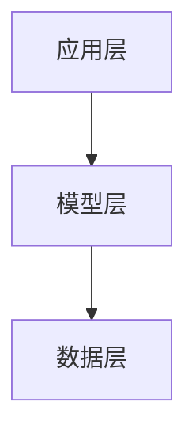
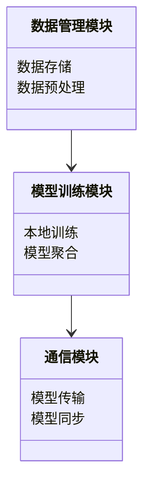
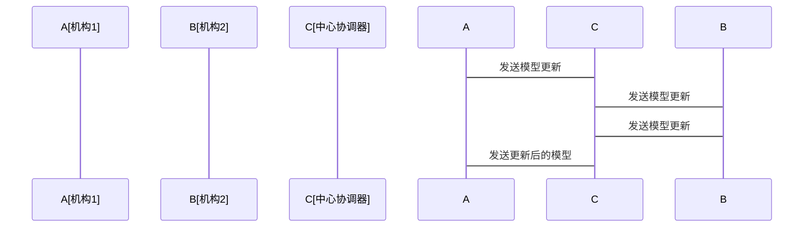

                 


# 《金融领域联邦学习在跨机构信用评分中的应用》

---

> **关键词**：联邦学习、跨机构信用评分、数据隐私、机器学习、金融系统

> **摘要**：随着金融行业对数据驱动决策的需求日益增加，跨机构信用评分的重要性也逐渐凸显。然而，数据隐私和机构间协作的挑战使得传统的数据共享方式难以满足需求。联邦学习作为一种新兴的人工智能技术，能够在不共享原始数据的前提下，实现跨机构的模型训练与联合优化。本文将深入探讨联邦学习在金融领域跨机构信用评分中的应用，分析其技术原理、系统架构、实际案例以及最佳实践。

---

# 第一部分: 联邦学习与跨机构信用评分概述

## 第1章: 联邦学习的基本概念与背景

### 1.1 联邦学习的定义与核心特点
联邦学习（Federated Learning）是一种分布式机器学习技术，允许多个机构在不共享原始数据的情况下，协作训练共享的模型。其核心特点包括：
- **数据隐私**：数据无需离开原始机构，仅传输模型更新。
- **机构协作**：多个机构协同训练模型，提升模型的泛化能力。
- **分布式训练**：基于通信协议的分布式算法，支持同步或异步更新。

### 1.2 联邦学习在金融领域的应用背景
#### 1.2.1 金融领域数据隐私问题
金融数据通常包含敏感信息（如收入、信用历史等），数据泄露可能引发严重后果。联邦学习通过局部模型更新，解决了数据隐私问题。

#### 1.2.2 跨机构信用评分的必要性
信用评分需要结合多个机构的数据（如银行、征信机构等），才能全面评估用户的信用风险。联邦学习提供了跨机构协作的解决方案。

#### 1.2.3 联邦学习在金融领域的优势
- **数据多样性**：结合多个机构的多样数据，提升模型性能。
- **实时性**：支持在线更新，适应动态信用评分需求。
- **合规性**：符合数据隐私法规（如GDPR）。

### 1.3 联邦学习的技术架构与核心要素
#### 1.3.1 联邦学习的技术架构
- **中心协调器**：负责任务分配和模型同步。
- **参与机构**：每个机构维护本地数据和模型，仅传输更新。
- **通信协议**：确保安全高效的数据传输和模型更新。

#### 1.3.2 联邦学习的核心要素
| 核心要素       | 描述                                   |
|----------------|----------------------------------------|
| 数据隐私       | 确保数据不被泄露，仅传输模型更新       |
| 机构协作       | 多机构协同训练，共享模型性能           |
| 分布式算法     | 支持分布式训练，适应大规模数据集       |

#### 1.3.3 联邦学习的边界与外延
- **边界**：仅涉及模型更新，不处理原始数据。
- **外延**：可结合区块链、同态加密等技术，进一步提升安全性。

---

## 第2章: 联邦学习的核心概念与原理

### 2.1 联邦学习的核心概念
#### 2.1.1 联邦学习的三要素
- **本地模型**：每个机构训练的模型。
- **全局模型**：所有机构联合优化的模型。
- **通信协议**：模型更新的传输和同步机制。

#### 2.1.2 联邦学习的通信机制
- **同步联邦学习**：所有机构同时更新模型，周期性同步。
- **异步联邦学习**：机构按需更新模型，通信延迟较低。

#### 2.1.3 联邦学习的安全性与隐私保护
- **数据加密**：使用加密技术保护数据传输。
- **模型加密**：对模型更新进行加密，防止中间人攻击。

### 2.2 联邦学习的算法原理
#### 2.2.1 联邦学习的基本流程
1. **初始化**：所有机构初始化本地模型。
2. **本地训练**：每个机构在本地数据上训练模型。
3. **模型聚合**：中心协调器聚合各机构的模型更新。
4. **模型分发**：中心协调器将更新后的模型分发给各机构。

#### 2.2.2 联邦学习的数学模型
- **损失函数**：定义模型的优化目标。
- **优化算法**：如随机梯度下降（SGD）或Adam优化器。

#### 2.2.3 联邦学习的优化方法
- **模型平均**：简单平均各机构的模型更新。
- **加权平均**：根据机构数据量或模型性能加权。

### 2.3 联邦学习的算法对比与选择
#### 2.3.1 联邦学习的主流算法
- **FedAvg**：基于模型平均的联邦学习算法。
- **FedSGD**：基于随机梯度下降的联邦学习算法。

#### 2.3.2 算法的优缺点对比
| 算法名称 | 优点                           | 缺点                           |
|----------|--------------------------------|--------------------------------|
| FedAvg   | 实现简单，收敛速度快           | 对数据异质性敏感               |
| FedSGD   | 适合小批量数据更新             | 收敛速度较慢                   |

---

## 第3章: 联邦学习在信用评分中的应用

### 3.1 信用评分的基本概念
#### 3.1.1 信用评分的定义
信用评分是根据个人或企业的信用历史、收入、负债等信息，评估其信用风险的过程。

#### 3.1.2 信用评分的核心要素
- **信用历史**：还款记录。
- **收入水平**：收入能力。
- **负债情况**：债务负担。

### 3.2 联邦学习在信用评分中的应用场景
#### 3.2.1 跨机构信用评分的需求
- **数据多样性**：结合多个机构的数据，提升评分准确性。
- **实时性**：动态更新评分，适应市场变化。

#### 3.2.2 联邦学习在信用评分中的优势
- **数据隐私保护**：确保数据不被泄露。
- **模型性能提升**：通过跨机构协作，提升模型泛化能力。

### 3.3 联邦学习在信用评分中的实现流程
#### 3.3.1 数据准备与预处理
- **数据清洗**：处理缺失值、异常值。
- **数据标准化**：统一数据格式，方便模型训练。

#### 3.3.2 模型训练与优化
- **本地训练**：每个机构在本地数据上训练模型。
- **模型聚合**：中心协调器聚合各机构的模型更新。

#### 3.3.3 模型评估与部署
- **模型评估**：评估模型的准确性和稳定性。
- **模型部署**：将模型部署到实际业务中，实时评分。

---

## 第4章: 联邦学习的算法实现与数学模型

### 4.1 联邦学习的数学模型
#### 4.1.1 损失函数的定义与优化
- **损失函数**：定义模型的优化目标。
- **优化算法**：如随机梯度下降（SGD）或Adam优化器。

#### 4.1.2 联邦学习的优化方法
- **模型平均**：简单平均各机构的模型更新。
- **加权平均**：根据机构数据量或模型性能加权。

#### 4.1.3 联邦学习的收敛性分析
- **收敛性**：分析模型是否收敛到全局最优。

### 4.2 联邦学习的算法实现
#### 4.2.1 联邦学习的通信机制
- **同步联邦学习**：所有机构同时更新模型，周期性同步。
- **异步联邦学习**：机构按需更新模型，通信延迟较低。

#### 4.2.2 联邦学习的同步与异步策略
- **同步策略**：所有机构同时更新模型，确保模型一致性。
- **异步策略**：机构按需更新模型，提高通信效率。

#### 4.2.3 联邦学习的隐私保护技术
- **数据加密**：使用加密技术保护数据传输。
- **模型加密**：对模型更新进行加密，防止中间人攻击。

### 4.3 联邦学习的数学公式与代码实现
#### 4.3.1 联邦学习的数学公式
$$ \text{损失函数} = \sum_{i=1}^{n} \text{损失}_i $$
$$ \text{优化目标} = \min_{\theta} \sum_{i=1}^{n} \text{损失}_i $$

#### 4.3.2 联邦学习的Python代码实现
```python
import numpy as np
from sklearn.linear_model import SGDRegressor

# 初始化模型参数
theta = np.zeros((n_features, 1))

# 联邦学习循环
for round in range(num_rounds):
    # 本地训练
    for i in range(num_institutions):
        # 机构i的本地数据
        X_i = institutions[i]['X']
        y_i = institutions[i]['y']
        
        # 训练模型
        model = SGDRegressor().fit(X_i, y_i)
        
        # 更新全局模型
        theta = theta + (model.coef_ - theta) * (1 / num_institutions)
    
    # 分发更新后的模型
    for i in range(num_institutions):
        institutions[i]['model'] = theta.copy()
```

#### 4.3.3 联邦学习的算法优化与调优
- **学习率调整**：动态调整学习率，加速收敛。
- **模型复杂度优化**：选择合适的模型结构，防止过拟合。

---

## 第5章: 联邦学习的系统架构与设计

### 5.1 联邦学习的系统架构
#### 5.1.1 联邦学习的分层架构
- **应用层**：用户界面和业务逻辑。
- **模型层**：模型训练和更新。
- **数据层**：数据存储和管理。

#### 5.1.2 联邦学习的分层架构图


#### 5.1.3 联邦学习的通信协议
- **HTTP**：用于模型更新的传输。
- **WebSocket**：实时通信，支持异步更新。

### 5.2 联邦学习的系统功能设计
#### 5.2.1 系统功能模块
- **数据管理模块**：数据存储和预处理。
- **模型训练模块**：本地训练和模型聚合。
- **通信模块**：模型更新的传输和同步。

#### 5.2.2 系统功能模块图


### 5.3 联邦学习的系统接口设计
#### 5.3.1 系统接口
- **训练接口**：启动模型训练。
- **同步接口**：模型更新同步。
- **评分接口**：实时信用评分。

#### 5.3.2 系统接口图


---

## 第6章: 联邦学习的项目实战

### 6.1 环境安装与配置
- **安装Python**：确保Python版本为3.6以上。
- **安装依赖库**：如`numpy`、`scikit-learn`、`flask`。

### 6.2 系统核心实现
#### 6.2.1 本地训练实现
```python
from sklearn.linear_model import SGDRegressor

def local_train(X, y):
    model = SGDRegressor().fit(X, y)
    return model.coef_
```

#### 6.2.2 模型聚合实现
```python
def aggregate(models, num_institutions):
    return np.mean(models, axis=0)
```

### 6.3 实际案例分析
#### 6.3.1 数据准备
- **训练数据**：收集多个机构的信用数据。
- **测试数据**：用于模型评估。

#### 6.3.2 模型训练与评估
```python
# 训练过程
for round in range(num_rounds):
    local_models = []
    for i in range(num_institutions):
        # 获取机构i的本地数据
        X_i = institutions[i]['X']
        y_i = institutions[i]['y']
        
        # 本地训练
        model = SGDRegressor().fit(X_i, y_i)
        local_models.append(model.coef_)
    
    # 模型聚合
    global_model = aggregate(local_models, num_institutions)
    
    # 更新机构模型
    for i in range(num_institutions):
        institutions[i]['model'] = global_model.copy()
```

#### 6.3.3 模型评估
```python
# 评估模型性能
X_test = ...
y_test = ...

predicted = global_model.predict(X_test)
accuracy = accuracy_score(y_test, predicted)
print(f"模型准确率：{accuracy}")
```

### 6.4 项目总结
- **项目目标**：实现跨机构信用评分的联邦学习系统。
- **项目成果**：成功训练并部署了联邦学习模型，提升了信用评分的准确性和安全性。

---

## 第7章: 最佳实践与总结

### 7.1 最佳实践
#### 7.1.1 数据预处理
- 确保数据清洗和标准化，提升模型训练效果。
- 处理数据异质性，避免模型性能下降。

#### 7.1.2 模型调优
- 动态调整学习率和优化算法，加速模型收敛。
- 防止模型过拟合，选择合适的正则化参数。

#### 7.1.3 安全保障
- 使用加密技术保护数据传输和模型更新。
- 定期进行安全审计，确保系统安全性。

### 7.2 项目小结
- 联邦学习在跨机构信用评分中的应用，有效解决了数据隐私和协作问题。
- 通过分布式训练和模型聚合，提升了信用评分的准确性和泛化能力。

### 7.3 注意事项
- **数据隐私**：确保数据不被泄露，严格遵守相关法规。
- **模型性能**：定期评估模型性能，及时优化模型。
- **系统安全**：加强系统安全防护，防止攻击和数据泄露。

### 7.4 拓展阅读
- **论文推荐**：深入阅读联邦学习的经典论文，了解最新的研究成果。
- **技术书籍**：推荐阅读《Distributed Machine Learning》等书籍，提升技术深度。

---

通过以上内容，我们可以看到联邦学习在金融领域跨机构信用评分中的巨大潜力。随着技术的不断发展，联邦学习将在更多金融场景中得到广泛应用，为行业带来更多的创新和价值。

