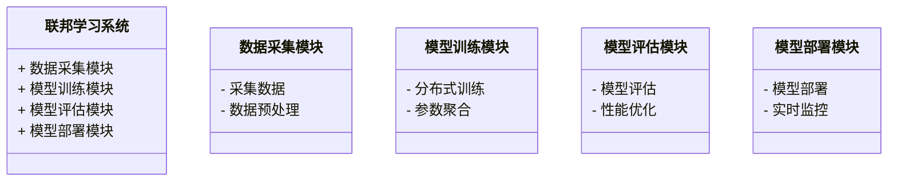
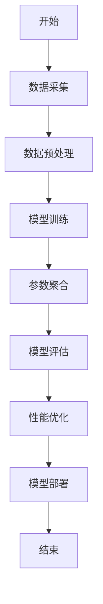
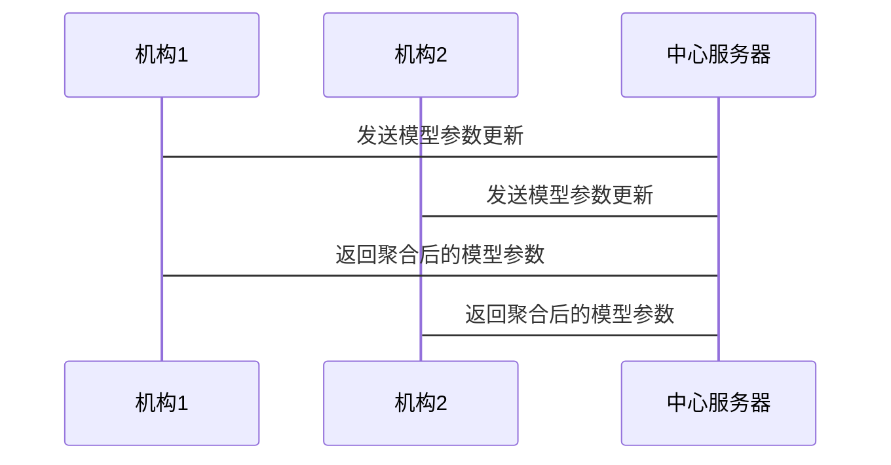

                 

<think>
好的，我现在需要根据用户的要求，逐步构建一篇关于《金融领域联邦学习在跨机构风险评估中的应用》的技术博客文章。我将按照用户提供的目录大纲结构，详细展开每一部分的内容，确保逻辑清晰、结构紧凑，并且符合技术博客的专业性要求。

### 第一部分: 背景与概述

#### 第1章: 联邦学习与跨机构风险评估的背景

##### 1.1 联邦学习的起源与定义

首先，我需要解释联邦学习的起源。联邦学习（Federated Learning）是一种分布式机器学习技术，允许多个机构在不共享原始数据的情况下，共同训练一个统一的模型。这种技术起源于对数据隐私和安全的保护需求，尤其是在金融行业，数据往往涉及客户的敏感信息，直接共享风险极高。

接下来，我需要定义联邦学习并介绍其特点。联邦学习的核心在于数据不出域，通过在各个机构本地进行模型训练，并将模型更新后的参数汇总到中心服务器，从而实现模型的联合训练。其特点包括数据隐私保护、分布式计算、模型更新高效等。

然后，我需要说明联邦学习的核心目标，即在保护数据隐私的前提下，提升模型的准确性和泛化能力，同时促进跨机构的合作与数据共享。

##### 1.2 跨机构风险评估的必要性

在这一部分，我需要阐述金融机构进行风险评估的需求。金融行业面临的信用风险、市场风险、操作风险等，都需要通过全面的数据分析来评估和预测。然而，单个机构的数据往往不足以覆盖整个市场的风险情况，因此跨机构的数据协作变得尤为重要。

我需要解释跨机构协作的重要性。通过联邦学习，多个金融机构可以在不共享原始数据的情况下，共同构建更全面的风险评估模型，提升风险预测的准确性和全面性。

此外，我还需要强调联邦学习在风险评估中的应用价值。联邦学习不仅能够提高模型的准确性，还能通过数据的多样化，增强模型的鲁棒性和抗过拟合能力，从而更好地应对复杂的金融风险。

##### 1.3 本章小结

在小结部分，我需要总结联邦学习的核心概念，包括其定义、特点以及在跨机构协作中的应用。同时，我还需要强调跨机构风险评估的必要性，以及联邦学习在其中发挥的关键作用。

---

### 第二部分: 联邦学习的核心概念与原理

#### 第2章: 联邦学习的核心原理

##### 2.1 联邦学习的基本原理

在这一部分，我需要详细讲解联邦学习的基本原理，包括其通信机制、同步与异步模式，以及模型更新策略。

首先，通信机制是联邦学习的关键部分。数据不出域，各个机构仅交换模型参数的更新，而不是原始数据。这可以通过加密通信或安全通道实现，确保数据的安全性和隐私性。

其次，同步与异步模式是联邦学习中的两种主要训练方式。同步模式下，所有机构同时更新模型，并将结果同步到中心服务器；异步模式下，各个机构可以独立更新模型，中心服务器根据接收的更新进行汇总。异步模式在应对网络延迟和数据量大的情况下更具优势。

最后，模型更新策略决定了如何聚合各个机构的模型参数。常见的策略包括平均法和加权法。平均法简单有效，适用于各机构数据量相似的情况；加权法则根据各机构的数据量或重要性赋予不同的权重，适用于数据分布不均匀的情况。

##### 2.2 联邦学习与传统机器学习的对比

为了更好地理解联邦学习的优势，我需要将其与传统机器学习进行对比，包括数据隐私保护、模型训练效率以及协作方式等方面。

在数据隐私保护方面，传统机器学习通常需要集中所有数据进行训练，数据泄露风险较高；而联邦学习通过数据不出域的方式，有效保护了数据隐私。

在模型训练效率方面，联邦学习由于数据分布广泛，训练过程可能需要多次迭代和通信，效率相对较低；但随着技术的优化，如边缘计算和高效的通信协议，效率问题正在逐步解决。

在协作方式方面，传统机器学习通常由单一机构完成，而联邦学习则强调多机构协作，促进了数据的共享和模型的联合优化。

##### 2.3 联邦学习在跨机构中的应用

在跨机构风险评估中，联邦学习的应用主要体现在数据协作、模型共享和隐私保护等方面。

数据协作方面，联邦学习允许各个金融机构共享模型参数，而不泄露各自的客户数据，从而构建更全面的风控模型。

模型共享方面，通过联邦学习，各机构可以联合训练一个统一的模型，提升模型的泛化能力和准确性，同时避免了单一机构数据不足的问题。

隐私保护方面，联邦学习结合差分隐私、同态加密等技术，确保了模型训练过程中的数据安全性，防止敏感信息泄露。

##### 2.4 本章小结

在本章小结中，我需要总结联邦学习的核心原理，包括其通信机制、同步与异步模式，以及模型更新策略。同时，我还需要强调联邦学习在跨机构协作中的应用价值，特别是在数据隐私保护和模型优化方面的重要性。

---

### 第三部分: 联邦学习的数学模型与算法原理

#### 第3章: 联邦学习的数学模型

##### 3.1 联邦学习的优化目标

首先，我需要定义联邦学习的优化目标。通常，联邦学习的目标是最小化全局损失函数，即：

$$ L = \sum_{i=1}^{n} L_i(x_i, \theta) $$

其中，\( L_i \) 是第 \( i \) 个机构的损失函数，\( x_i \) 是该机构的数据，\( \theta \) 是模型参数。

##### 3.2 联邦学习的同步与异步算法

接下来，我需要详细讲解同步与异步算法的数学模型。同步算法中，所有机构同时更新模型，并将结果同步到中心服务器；异步算法中，机构可以独立更新模型，中心服务器根据接收的更新进行汇总。

同步算法的数学模型可以表示为：

$$ \theta_{t+1} = \frac{1}{n} \sum_{i=1}^{n} \theta_t^{(i)} } $$

其中，\( \theta_t^{(i)} \) 是第 \( i \) 个机构在第 \( t \) 轮的模型参数。

异步算法的数学模型则较为复杂，通常涉及时间戳和延迟更新。

##### 3.3 联邦学习的隐私保护机制

在隐私保护方面，联邦学习常用的差分隐私技术可以通过在模型更新中添加噪声，确保单个机构的数据对整体模型影响微小。其数学模型可以表示为：

$$ \Delta \theta = \theta + \text{noise} $$

其中，noise 是随机生成的噪声，用于保护数据隐私。

##### 3.4 本章小结

在本章小结中，我需要总结联邦学习的数学模型，包括其优化目标、同步与异步算法，以及隐私保护机制。这些模型为联邦学习的实现提供了理论基础，确保了数据的安全性和模型的准确性。

---

### 第四部分: 联邦学习的系统架构与设计

#### 第4章: 联邦学习的系统架构设计

##### 4.1 系统功能设计

在系统功能设计部分，我需要详细描述各个模块的功能。包括数据采集模块、模型训练模块、模型评估模块和模型部署模块。

数据采集模块负责从各个机构收集必要的数据，确保数据的完整性和准确性。模型训练模块负责在各个机构本地进行模型训练，并将模型参数更新上传到中心服务器。模型评估模块用于评估模型的性能，包括准确率、召回率等指标。模型部署模块则负责将最终的模型应用于实际业务场景中。

##### 4.2 系统架构图

为了更直观地展示系统架构，我需要使用Mermaid图来绘制系统的类图和流程图。



流程图部分可以展示数据从采集到部署的整个流程：



##### 4.3 系统接口设计

在系统接口设计部分，我需要详细描述各个模块之间的接口。例如，数据采集模块需要与各个机构的数据源进行对接，模型训练模块需要与各个机构的本地计算节点进行通信，模型评估模块需要接收各个机构的评估结果等。

##### 4.4 系统交互图

为了展示系统各模块之间的交互过程，我需要使用Mermaid序列图。



---

### 第五部分: 联邦学习的项目实战

#### 第5章: 项目实战

##### 5.1 环境安装

在项目实战部分，我需要详细指导读者如何搭建联邦学习的开发环境。通常，这包括安装Python、TensorFlow Federated（TFF）库、Flask框架等工具。

##### 5.2 系统核心实现源代码

接下来，我需要提供联邦学习系统的核心实现代码。例如，使用TFF库进行模型训练的代码：

```python
import tensorflow as tf
import tensorflow_federated as tff

# 定义模型架构
model = tf.keras.Sequential([
    tf.keras.layers.Dense(64, activation='relu', input_shape=(input_dim,)),
    tf.keras.layers.Dense(1, activation='sigmoid')
])

# 编译模型
model.compile(optimizer='sgd', loss='binary_crossentropy')

# 使用TFF进行联邦学习
tff federated averaging algorithm:

federated_algorithm = tff.algorithms.federated_fully_connected_model(
    model,
    optimizer=tf.keras.optimizers.SGD(learning_rate=0.1)
)

# 进行联邦训练
state = federated_algorithm.initialize()
for round in range(num_rounds):
    state = federated_algorithm.update(state, clients_data)
```

##### 5.3 实际案例分析

在案例分析部分，我需要选择一个具体的金融场景，例如信用风险评估，详细讲解联邦学习如何应用于其中。通过实际数据的处理和模型的训练，展示联邦学习在提升模型准确性方面的优势。

##### 5.4 项目小结

在项目小结中，我需要总结项目的关键点，包括环境搭建、代码实现、案例分析等，并强调联邦学习在实际应用中的潜力和挑战。

---

### 第六部分: 联邦学习的挑战与解决方案

#### 第6章: 挑战与解决方案

##### 6.1 联邦学习的挑战

在挑战部分，我需要分析联邦学习在实际应用中可能面临的问题，例如数据异质性、通信开销、模型收敛性等。

##### 6.2 解决方案

针对上述挑战，我需要提出相应的解决方案。例如，采用异步训练模式降低通信开销，使用差分隐私技术保护数据隐私，设计适应性算法应对数据异质性问题。

##### 6.3 本章小结

在本章小结中，我需要总结联邦学习面临的挑战及其解决方案，强调在实际应用中需要综合考虑各种因素，以实现高效、安全的模型训练。

---

### 第七部分: 总结与展望

#### 第7章: 总结与展望

##### 7.1 本章总结

在总结部分，我需要回顾全文，强调联邦学习在金融领域跨机构风险评估中的重要性，总结其核心概念、算法原理和系统设计。

##### 7.2 未来展望

最后，我需要展望联邦学习的发展前景，提出未来的研究方向，例如更高效的通信协议、更强大的隐私保护技术，以及更广泛的应用场景。

---

### 第八部分: 最佳实践与注意事项

#### 第8章: 最佳实践与注意事项

##### 8.1 最佳实践

在最佳实践部分，我需要提供一些实用的建议，例如选择合适的联邦学习框架、合理设计模型架构、优化通信机制等。

##### 8.2 注意事项

同时，我还需要提醒读者在实际应用中需要注意的问题，例如数据隐私的严格保护、模型的可解释性、系统的安全性等。

##### 8.3 本章小结

在本章小结中，我需要总结最佳实践和注意事项，帮助读者更好地理解和应用联邦学习技术。

---

通过以上结构，我将逐步展开每一个部分的内容，确保文章逻辑清晰、结构紧凑，并且符合技术博客的专业性要求。每一部分都将详细展开，确保读者能够全面理解联邦学习在金融领域跨机构风险评估中的应用。

