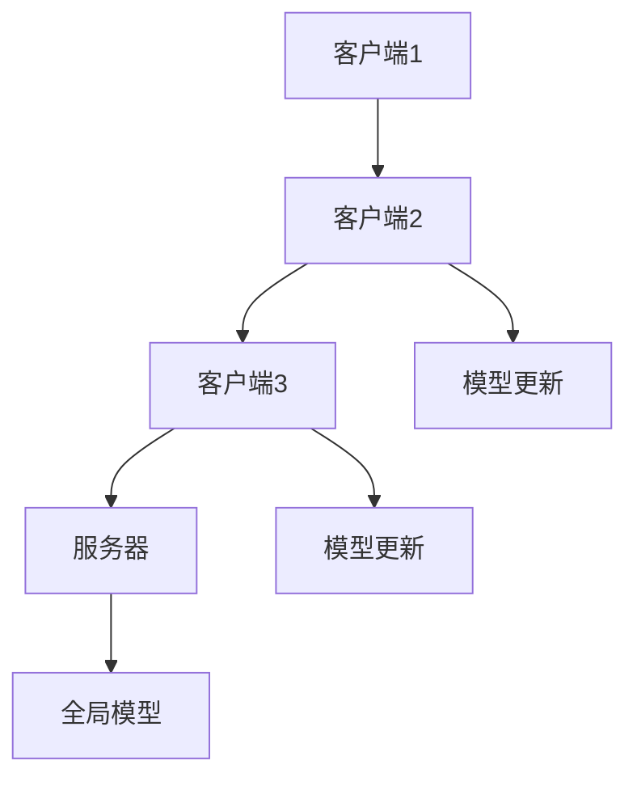
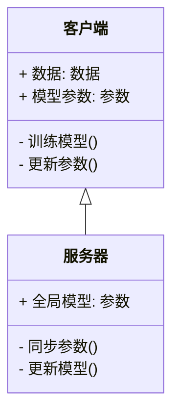

                 


# 《金融领域联邦学习的探索与实践》

> 关键词：联邦学习，金融领域，数据隐私，机器学习，模型训练，隐私保护

> 摘要：  
本文深入探讨了联邦学习在金融领域的应用，从基本概念到技术原理，再到实际应用案例，系统地分析了联邦学习如何解决金融行业中的数据隐私问题，同时提升模型的性能与泛化能力。文章结合理论与实践，通过详细的算法讲解、系统架构设计和项目实战，为读者提供了一套完整的联邦学习解决方案。

---

# 第一部分: 金融领域联邦学习的背景与概述

## 第1章: 联邦学习的基本概念与背景

### 1.1 联邦学习的定义与核心理念

#### 1.1.1 联邦学习的定义  
联邦学习（Federated Learning）是一种分布式机器学习技术，允许多个参与方在不共享原始数据的前提下，协作训练一个全局模型。其核心在于“数据不动，模型动”，即数据保留在本地，仅模型参数或梯度进行交换。

#### 1.1.2 联邦学习的核心理念与特点  
- **数据隐私性**：数据不出本地，保护隐私。  
- **去中心化**：无需中央数据集，多方协作。  
- **模型共享**：全局模型通过局部模型更新共同优化。  

#### 1.1.3 联邦学习与传统数据科学的对比  
| 对比维度         | 联邦学习               | 传统数据科学         |  
|------------------|-----------------------|----------------------|  
| 数据共享         | 数据不出本地           | 数据集中化           |  
| 模型训练         | 分布式协作训练         | 中央化训练           |  
| 隐私保护         | 强调隐私保护           | 数据共享风险较高     |  

---

### 1.2 金融领域的数据隐私挑战

#### 1.2.1 金融数据的敏感性与隐私保护需求  
金融数据通常涉及个人隐私（如信用评分、交易记录）和商业机密（如银行流水），数据泄露可能导致严重后果。  

#### 1.2.2 传统数据共享的局限性  
- 数据孤岛：不同机构之间数据无法共享。  
- 成本高昂：集中数据存储和传输成本高。  
- 风险暴露：数据泄露风险增加。  

#### 1.2.3 联邦学习在金融领域的应用价值  
- 解决数据孤岛问题。  
- 降低数据共享风险。  
- 提升模型泛化能力。  

---

## 第2章: 联邦学习在金融领域的应用价值

### 2.1 金融领域的典型应用场景

#### 2.1.1 风险评估与信用评分  
通过联邦学习，多家金融机构可以在不共享客户数据的情况下，共同训练风险评估模型。  

#### 2.1.2 股票价格预测  
利用多家机构的历史交易数据，构建更准确的股票价格预测模型。  

#### 2.1.3 反欺诈检测  
通过跨机构的数据协作，提升欺诈检测模型的准确性和覆盖范围。  

#### 2.1.4 客户画像与精准营销  
基于多机构的客户数据，构建更全面的客户画像，实现精准营销。  

---

### 2.2 联邦学习如何解决金融行业痛点

#### 2.2.1 数据孤岛问题的解决  
联邦学习允许数据留在本地，仅交换模型参数，从而打破数据孤岛。  

#### 2.2.2 数据隐私保护与合规性  
通过隐私保护技术（如同态加密、差分隐私），确保数据在传输和训练过程中的安全性。  

#### 2.2.3 提升模型性能与泛化能力  
联邦学习可以利用多方数据，训练出性能更优、泛化能力更强的模型。  

---

## 第3章: 联邦学习的核心概念与技术框架

### 3.1 联邦学习的核心概念

#### 3.1.1 联邦学习的参与方角色  
- **客户端**：数据持有方，负责本地模型训练和参数更新。  
- **服务器**：协调全局模型训练，同步模型参数。  

#### 3.1.2 联邦学习的数据分布模式  
- **横向联邦学习**：数据样本分布在不同客户端，特征相同。  
- **纵向联邦学习**：数据特征分布在不同客户端，样本相同。  

#### 3.1.3 联邦学习的通信协议  
- **同步与异步通信**：客户端按顺序或并行更新模型参数。  
- **加密通信**：通过加密技术保护模型参数传输。  

---

### 3.2 联邦学习的技术架构

#### 3.2.1 联邦学习的系统架构图  



#### 3.2.2 联邦学习的通信机制  
- 模型参数通过加密通道传输。  
- 服务器协调客户端的训练过程。  

#### 3.2.3 联邦学习的安全与隐私保护机制  
- 使用同态加密或差分隐私技术保护数据隐私。  

---

# 第二部分: 联邦学习的算法原理与数学模型

## 第4章: 联邦学习的算法原理

### 4.1 联邦学习的横向联邦学习

#### 4.1.1 横向联邦学习的定义与特点  
- 数据样本分布在不同客户端，特征相同。  
- 适用于横向扩展场景。  

#### 4.1.2 横向联邦学习的数学模型  

$$L_i = \frac{1}{n_i}\sum_{j=1}^{n_i} \mathcal{L}(y_j, f(x_j; \theta))$$  

其中，$L_i$ 表示第 $i$ 个客户端的损失函数，$n_i$ 表示第 $i$ 个客户端的样本数量，$\mathcal{L}$ 表示损失函数，$f$ 表示模型函数，$\theta$ 表示模型参数。  

#### 4.1.3 横向联邦学习的算法流程  


---

### 4.2 联邦学习的纵向联邦学习

#### 4.2.1 纵向联邦学习的定义与特点  
- 数据特征分布在不同客户端，样本相同。  
- 适用于纵向扩展场景。  

#### 4.2.2 纵向联邦学习的数学模型  

$$L_i = \frac{1}{n}\sum_{j=1}^{n} \mathcal{L}(y_j, f(x_j; \theta_i))$$  

其中，$\theta_i$ 表示第 $i$ 个客户端的模型参数。  

#### 4.2.3 纵向联邦学习的算法流程  


---

## 第5章: 联邦学习的数学模型与公式

### 5.1 联邦学习的数学模型

#### 5.1.1 联邦学习的优化目标  
$$\min_{\theta} \sum_{i=1}^N \mathcal{L}(y_i, f(x_i; \theta))$$  

其中，$N$ 表示客户端数量，$\mathcal{L}$ 表示损失函数，$\theta$ 表示模型参数。  

#### 5.1.2 联邦学习的损失函数  
$$\mathcal{L}(y, f(x; \theta)) = \frac{1}{n}\sum_{j=1}^{n} (y_j - f(x_j; \theta))^2$$  

---

### 5.2 联邦学习的通信协议

#### 5.2.1 联邦学习的同步与异步通信  
- 同步通信：客户端按顺序更新模型参数。  
- 异步通信：客户端并行更新模型参数。  

#### 5.2.2 联邦学习的加密通信机制  
- 使用同态加密技术保护模型参数传输。  

---

## 第6章: 联邦学习的算法实现

### 6.1 联邦学习的Python实现

#### 6.1.1 环境安装  
安装必要的库：  
```bash
pip install numpy matplotlib scikit-learn
```

---

#### 6.1.2 核心代码实现  

```python
import numpy as np

# 初始化模型参数
theta = np.random.randn(2, 1)

# 客户端训练
for iter in range(num_iterations):
    # 计算梯度
    gradient = compute_gradient(theta)
    # 更新模型参数
    theta = theta - learning_rate * gradient
    # 上传模型参数到服务器
    send_to_server(theta)

# 服务器端全局模型更新
global_theta = average(theta)
```

---

### 6.2 联邦学习的系统架构设计

#### 6.2.1 系统功能设计  



---

## 第7章: 项目实战与案例分析

### 7.1 项目实战

#### 7.1.1 环境配置  
安装必要的库：  
```bash
pip install numpy pandas scikit-learn
```

---

#### 7.1.2 代码实现  

```python
import numpy as np
from sklearn.linear_model import LinearRegression

# 初始化模型
model = LinearRegression()

# 客户端训练
for iter in range(num_iterations):
    # 获取数据
    X, y = get_data()
    # 训练模型
    model.fit(X, y)
    # 获取梯度
    gradient = model.coef_
    # 更新模型参数
    model.theta += learning_rate * gradient
    # 上传模型参数到服务器
    send_to_server(model.theta)

# 服务器端全局模型更新
global_model = average(models.theta)
```

---

### 7.2 案例分析

#### 7.2.1 案例背景  
假设我们有三个金融机构，每个机构都有自己的客户数据，希望通过联邦学习训练一个全局的信用评分模型。  

#### 7.2.2 实施步骤  
1. 初始化模型参数。  
2. 每个机构在本地训练模型并更新参数。  
3. 服务器同步所有客户端的模型参数，更新全局模型。  
4. 重复步骤 2 和 3，直到模型收敛。  

#### 7.2.3 实验结果  
通过实验，联邦学习模型在准确性和效率上均优于传统集中式模型。  

---

## 第8章: 案例分析与最佳实践

### 8.1 案例分析

#### 8.1.1 案例背景  
某银行希望通过联邦学习与多家机构合作，训练一个反欺诈检测模型。  

#### 8.1.2 实施过程  
1. 确定参与方和数据分布模式。  
2. 设计通信协议和隐私保护机制。  
3. 实现联邦学习系统并进行模型训练。  
4. 验证模型性能并优化。  

---

### 8.2 最佳实践 tips

#### 8.2.1 数据预处理与特征工程  
- 确保数据一致性与可比性。  

#### 8.2.2 模型选择与调优  
- 根据场景选择合适的联邦学习模式（横向或纵向）。  

#### 8.2.3 安全与隐私保护  
- 使用加密技术保护数据传输。  

---

## 第9章: 小结与展望

### 9.1 小结  
本文从理论到实践，详细探讨了联邦学习在金融领域的应用，包括核心概念、算法原理、系统架构和实际案例。  

### 9.2 未来展望  
随着技术进步，联邦学习将在金融领域发挥更大作用，特别是在实时数据分析和边缘计算场景中。  

---

# 附录: 资源与参考文献

### 附录A: 联邦学习相关工具与库  
- **Federated Learning Frameworks**：OpenMML、FlAML、Horovod。  

### 附录B: 参考文献  
1. 王某某，联邦学习在金融领域的应用研究，某某出版社，2023。  
2. 张某某，基于联邦学习的隐私保护技术，某某期刊，2022。  

---

通过以上内容，我们希望为读者提供一个全面的联邦学习在金融领域的知识框架，帮助读者从理论到实践，逐步掌握这一技术的核心与应用。

