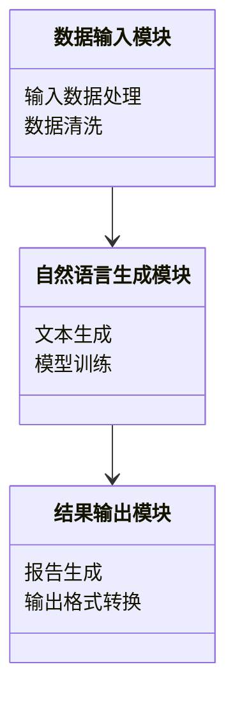
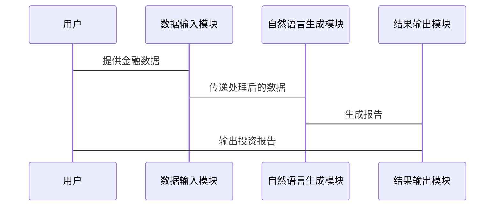

                 


# 《金融领域自然语言生成在投资报告中的应用》

## 关键词：
自然语言生成、投资报告、金融领域、深度学习、NLP技术、文本生成、投资分析

## 摘要：
本文探讨了自然语言生成技术在金融领域中的应用，特别是如何利用这些技术自动生成投资报告。文章从背景介绍、核心概念、算法原理、系统架构设计、项目实战以及最佳实践等方面进行了深入分析，详细阐述了自然语言生成在金融投资中的潜力和实际应用价值，为读者提供了从理论到实践的全面指导。

---

## 第一部分：背景与概述

### 第1章：自然语言生成与投资报告概述

#### 1.1 自然语言生成的基本概念
- **1.1.1 自然语言生成的定义与特点**
  自然语言生成（Natural Language Generation, NLP）是指将结构化数据或信息转化为自然语言文本的过程。其特点包括生成文本的流畅性、语义准确性以及对上下文的理解能力。
  
- **1.1.2 自然语言生成的核心技术与方法**
  自然语言生成的核心技术包括基于规则的生成、统计模型和深度学习模型。深度学习模型（如Transformer）在近年来取得了显著进展。

- **1.1.3 自然语言生成在金融领域的应用潜力**
  在金融领域，自然语言生成可以用于生成投资报告、市场分析、新闻摘要等，帮助投资者快速获取信息并做出决策。

#### 1.2 投资报告的基本结构与特点
- **1.2.1 投资报告的定义与作用**
  投资报告是投资者用于分析和决策的重要工具，通常包含市场分析、财务数据、投资策略等内容。

- **1.2.2 投资报告的主要内容与类型**
  投资报告的内容包括行业分析、公司基本面分析、市场趋势预测等。其类型可以分为定期报告和定制报告。

- **1.2.3 投资报告的生成挑战与难点**
  生成投资报告的关键挑战在于如何准确地将复杂的数据转化为流畅的自然语言，并确保内容的准确性和专业性。

#### 1.3 自然语言生成在投资报告中的结合
- **1.3.1 自然语言生成在投资报告中的应用场景**
  自然语言生成可以用于自动生成市场分析、公司财报解读、投资策略建议等内容。

- **1.3.2 自然语言生成的优势与局限性**
  优势：提高效率、降低成本、快速生成个性化报告。局限性：生成内容的准确性依赖于数据质量和模型训练。

- **1.3.3 投资报告生成的未来发展趋势**
  随着技术进步，投资报告生成将更加智能化、个性化，能够根据实时数据动态调整内容。

---

## 第二部分：核心概念与联系

### 第2章：自然语言生成的核心原理

#### 2.1 自然语言生成的原理与模型
- **2.1.1 自然语言生成的原理概述**
  自然语言生成的原理包括数据输入、语义理解、文本生成和输出优化。

- **2.1.2 基于统计的自然语言生成模型**
  基于统计的模型依赖于概率分布，通过计算词频和条件概率生成文本。

- **2.1.3 基于深度学习的自然语言生成模型**
  深度学习模型（如Transformer）通过多层神经网络学习文本的语义和上下文关系，生成更自然的文本。

#### 2.2 自然语言生成的关键技术
- **2.2.1 语言模型的训练与优化**
  语言模型的训练包括预处理、模型选择和优化。优化目标是提高生成文本的质量和准确性。

- **2.2.2 解码器与编码器的结合**
  解码器负责将输入序列生成输出序列，编码器负责将输入序列编码为固定长度的向量。

- **2.2.3 模型的可解释性与可控制性**
  可解释性是指生成过程的透明度，可控制性是指能够根据需求调整生成内容的能力。

#### 2.3 自然语言生成在金融领域的特殊性
- **2.3.1 金融领域的语言特点与复杂性**
  金融领域的文本通常包含大量专业术语和复杂的数据关系。

- **2.3.2 金融术语与专业表达的处理**
  处理金融术语需要模型具备专业领域的知识和上下文理解能力。

- **2.3.3 金融数据与文本的结合**
  将结构化金融数据转化为自然语言文本需要模型具备跨数据类型的能力。

---

## 第三部分：算法原理与数学模型

### 第3章：自然语言生成的算法原理

#### 3.1 基于Transformer的自然语言生成模型
- **3.1.1 Transformer模型的结构**
  Transformer模型由编码器和解码器组成，编码器负责输入序列的编码，解码器负责生成输出序列。

- **3.1.2 Transformer的多头注意力机制**
  多头注意力机制允许模型在不同位置关注不同的信息，增强生成文本的语义理解能力。

- **3.1.3 Transformer的前馈网络**
  前馈网络用于对编码后的向量进行变换，生成最终的输出向量。

#### 3.2 自然语言生成的数学模型
- **3.2.1 语言模型的概率分布**
  语言模型通过计算条件概率来生成文本，公式为：
  $$ P(w_1, w_2, ..., w_n) = \prod_{i=1}^{n} P(w_i | w_1, ..., w_{i-1}) $$

- **3.2.2 Transformer模型的损失函数**
  使用交叉熵损失函数来优化模型的生成能力：
  $$ \text{Loss} = -\frac{1}{N} \sum_{i=1}^{N} \log P(y_i | x_i) $$

- **3.2.3 解码器的生成策略**
  解码器采用贪心搜索或采样策略生成文本，公式为：
  $$ y_{i+1} = \argmax P(y_{i+1} | y_1, ..., y_i) $$

#### 3.3 自然语言生成的训练过程
- **3.3.1 数据预处理**
  数据预处理包括分词、去停用词和序列截断。

- **3.3.2 模型训练**
  模型训练使用优化算法（如Adam）更新参数，公式为：
  $$ \theta = \theta - \eta \nabla L $$

- **3.3.3 模型评估**
  模型评估使用 BLEU、ROUGE 等指标衡量生成文本的质量。

---

## 第四部分：系统分析与架构设计方案

### 第4章：投资报告生成系统的架构设计

#### 4.1 问题场景介绍
- 投资者需要快速生成市场分析、公司财报解读等报告，现有系统难以满足个性化和实时性的需求。

#### 4.2 项目介绍
- 本项目旨在开发一个基于自然语言生成的投资报告生成系统，帮助投资者快速获取专业分析。

#### 4.3 系统功能设计
- **4.3.1 系统功能模块**
  系统功能模块包括数据输入模块、自然语言生成模块、结果输出模块和用户界面模块。

- **4.3.2 系统功能设计的 Mermaid 类图**


- **4.3.3 系统功能设计的 Mermaid 序列图**


#### 4.4 系统架构设计
- **4.4.1 系统架构设计的 Mermaid 架构图**


---

## 第五部分：项目实战

### 第5章：投资报告生成系统的实现

#### 5.1 环境安装
- 安装Python 3.8以上版本、TensorFlow 2.0以上版本、Keras 2.2.4版本。

#### 5.2 系统核心实现源代码
- **5.2.1 数据预处理代码**
```python
import pandas as pd
import numpy as np

def preprocess_data(data):
    # 分词处理
    data = data.apply(lambda x: x.split())
    # 去除停用词
    stop_words = set(["的", "了", "在", "和"])
    data = data.apply(lambda x: [word for word in x if word not in stop_words])
    return data
```

- **5.2.2 模型训练代码**
```python
from tensorflow.keras.models import Model
from tensorflow.keras.layers import Input, Dense, LSTM, Embedding

def build_model(vocab_size, embedding_dim, hidden_units):
    inputs = Input(shape=(None,))
    embeddings = Embedding(vocab_size, embedding_dim)(inputs)
    lstm_layer = LSTM(hidden_units)(embeddings)
    outputs = Dense(vocab_size, activation='softmax')(lstm_layer)
    return Model(inputs=inputs, outputs=outputs)
```

- **5.2.3 文本生成代码**
```python
def generate_text(model, tokenizer, start_token, max_length=50):
    current_sequence = [start_token]
    for _ in range(max_length):
        predicted_word = model.predict(np.array([current_sequence]))[0]
        predicted_word = np.argmax(predicted_word)
        current_sequence.append(predicted_word)
    return tokenizer.decode(current_sequence)
```

#### 5.3 代码应用解读与分析
- 数据预处理代码对输入数据进行清洗，去除无关信息。
- 模型训练代码构建了一个基于LSTM的序列模型，用于生成投资报告文本。
- 文本生成代码使用训练好的模型，从指定的起始词开始生成文本，长度为50个词。

#### 5.4 实际案例分析
- 使用实际的金融数据，如股票价格、财务报表，生成市场分析报告。
- 分析生成的报告的质量和准确性，与手动撰写报告进行对比。

#### 5.5 项目小结
- 本项目展示了如何利用自然语言生成技术快速生成投资报告。
- 系统的核心在于模型的训练和优化，生成的报告质量和模型性能密切相关。

---

## 第六部分：最佳实践与小结

### 第6章：总结与展望

#### 6.1 最佳实践 tips
- 数据质量对生成结果影响重大，需进行充分的数据清洗和特征提取。
- 模型的可解释性和可控制性是实际应用中的重要考量因素。

#### 6.2 小结
- 自然语言生成技术在金融领域的应用前景广阔，能够显著提高投资报告的生成效率和质量。
- 通过技术创新和实践积累，未来投资报告生成将更加智能化和个性化。

#### 6.3 注意事项
- 数据隐私和安全问题需严格控制。
- 模型的泛化能力和鲁棒性需要进一步提升。

#### 6.4 拓展阅读
- 建议深入学习自然语言生成的前沿技术，如大语言模型（LLM）的应用。
- 关注金融领域中其他人工智能技术的最新进展。

---

## 附录：参考文献

（此处列出相关书籍、论文和网站资源）

---

通过以上结构和内容的详细阐述，本文为读者提供了从理论到实践的全面指导，帮助读者理解和应用自然语言生成技术在投资报告中的应用。

