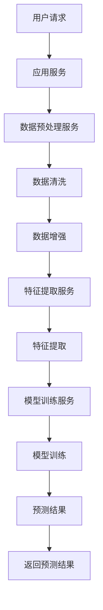

                 


# 《金融领域自监督学习的应用与挑战》

## 关键词：自监督学习、金融应用、对比学习、知识蒸馏、深度学习

## 摘要：自监督学习作为一种新兴的人工智能技术，在金融领域的应用展现出巨大潜力。本文系统探讨了自监督学习在金融领域的核心概念、算法原理、系统设计及实际应用，并深入分析了其面临的挑战与未来发展方向，为金融领域的技术实践者提供了理论指导和实践参考。

---

# 第一部分：金融领域自监督学习的背景与核心概念

## 第1章：自监督学习概述

### 1.1 自监督学习的定义与特点
#### 1.1.1 自监督学习的定义
自监督学习（Self-Supervised Learning, SSL）是无监督学习的一种，通过利用数据本身的结构信息，以数据内部的标签作为监督信号，指导模型学习数据的潜在特征。与监督学习相比，自监督学习不需要外部标注数据，而是通过数据预处理或生成机制来自动生成标签，从而降低数据标注成本。

#### 1.1.2 自监督学习的核心特点
- **数据效率高**：自监督学习能够利用未标注数据，减少对标注数据的依赖，特别适合金融领域中标注数据稀缺的情况。
- **模型泛化能力强**：通过学习数据的内在结构，自监督学习能够提取更通用的特征，提升模型在金融领域的泛化能力。
- **可解释性弱**：自监督学习依赖数据的内在关系，模型的可解释性较弱，这在金融领域可能成为应用的障碍。

#### 1.1.3 自监督学习与监督学习的区别
| 对比维度 | 监督学习 | 自监督学习 |
|----------|----------|------------|
| 数据需求 | 需要标注数据 | 利用数据内部关系生成监督信号 |
| 训练目标 | 优化预测任务 | 优化数据重建或特征提取任务 |
| 数据效率 | 依赖标注数据量 | 利用未标注数据提升模型能力 |

### 1.2 自监督学习在金融领域的应用背景
#### 1.2.1 金融数据的特点与挑战
- **时间序列性**：金融数据通常以时间序列形式存在，如股票价格、交易量等，具有很强的时序依赖性。
- **高维性**：金融市场涉及多种变量，如股价、指数、成交量等，导致数据维度较高。
- **稀疏性与噪声**：金融数据中常存在缺失值和噪声，如某些交易数据可能缺失或异常。

#### 1.2.2 自监督学习在金融领域的优势
- **降低标注成本**：金融领域的标注数据通常昂贵且难以获取，自监督学习能够有效利用未标注数据。
- **捕捉数据内在结构**：自监督学习通过数据重建或对比学习，能够捕捉到金融数据中的潜在模式和关联性。
- **提升模型鲁棒性**：自监督学习在无标签数据上预训练，能够增强模型对金融数据分布变化的适应能力。

#### 1.2.3 金融领域自监督学习的典型场景
- **金融时间序列预测**：利用自监督学习捕捉时间序列中的内在结构，提升预测精度。
- **金融欺诈检测**：通过自监督学习识别异常交易模式，提高欺诈检测的准确性。
- **金融文本分析**：对新闻、报告等文本数据进行自监督预训练，提升文本理解和情感分析能力。

---

## 第2章：自监督学习的核心概念与原理

### 2.1 自监督学习的原理
#### 2.1.1 数据重建与特征提取
自监督学习的核心思想是通过数据重建来学习数据的潜在特征。例如，在金融时间序列预测中，模型可以通过重建历史数据来预测未来的趋势。

#### 2.1.2 对比学习
对比学习是一种常用的自监督学习方法，通过将同一数据的不同变换视为正样本，其他样本作为负样本，最大化正样本的相似性，最小化负样本的相似性。在金融领域，对比学习可以用于金融时间序列的相似性分析。

#### 2.1.3 知识蒸馏
知识蒸馏是通过教师模型指导学生模型学习的一种方法。在金融领域，可以利用一个预训练的大型模型作为教师，指导小型模型学习金融数据的特征，从而提升小型模型的性能。

### 2.2 自监督学习的关键技术
#### 2.2.1 对比学习
- **SimCLR算法**：通过数据增强生成正样本对，利用对比损失函数优化模型，使得正样本对的特征相似性最大化，负样本对的相似性最小化。
- **MoCo算法**：通过队列机制生成负样本，动态更新队列中的样本，提升对比学习的效果。

#### 2.2.2 知识蒸馏
- **教师模型与学生模型**：教师模型通常是一个预训练的大模型，学生模型是一个小型模型。通过蒸馏损失函数，将教师模型的知识迁移到学生模型。
- **温度缩放**：通过调整温度参数，控制蒸馏过程中的软标签分布，使得学生模型能够更好地逼近教师模型的预测分布。

#### 2.2.3 图结构自监督学习
- **图结构学习**：将金融数据建模为图结构，利用图的节点关系进行自监督学习，捕捉数据中的复杂关联性。
- **图嵌入**：通过图嵌入方法，将金融数据转化为低维向量表示，提升模型的特征提取能力。

### 2.3 自监督学习的核心算法
#### 2.3.1 SimCLR算法
SimCLR通过数据增强生成正样本对，利用对比损失函数优化模型，具体步骤如下：
1. 数据增强：对输入数据进行随机增强，生成正样本对。
2. 特征提取：通过编码器提取正样本对的特征。
3. 对比损失：计算正样本对的相似性，以及负样本对的相似性，优化对比损失函数。

#### 2.3.2 MoCo算法
MoCo通过队列机制生成负样本，动态更新队列中的样本，具体步骤如下：
1. 初始化队列：队列用于存储负样本。
2. 数据增强：对输入数据进行随机增强，生成正样本对。
3. 特征提取：通过编码器提取正样本对的特征。
4. 对比损失：计算正样本对的相似性，以及队列中负样本对的相似性，优化对比损失函数。
5. 更新队列：将正样本加入队列，移除最旧的样本。

#### 2.3.3 知识蒸馏算法
知识蒸馏通过教师模型指导学生模型学习，具体步骤如下：
1. 预训练教师模型：在一个大型金融数据集上预训练教师模型。
2. 初始化学生模型：初始化学生模型的参数。
3. 蒸馏损失：计算学生模型预测与教师模型预测的差异，优化蒸馏损失函数。
4. 更新学生模型：通过反向传播优化学生模型的参数。

### 2.4 本章小结
本章详细介绍了自监督学习的核心概念与原理，包括数据重建、对比学习和知识蒸馏等关键技术。通过这些技术，自监督学习能够有效利用未标注数据，提取金融数据的潜在特征，提升模型的性能。

---

## 第3章：金融领域自监督学习的核心概念

### 3.1 金融数据的特性
#### 3.1.1 时间序列数据
金融时间序列数据具有很强的时序依赖性，可以通过自监督学习捕捉数据中的潜在模式。

#### 3.1.2 高维数据
金融数据通常涉及多个变量，如股价、指数、成交量等，导致数据维度较高。通过自监督学习可以降低数据维度，提取关键特征。

#### 3.1.3 异常数据
金融数据中常存在异常值和噪声，自监督学习可以通过对比学习和图结构学习方法，识别异常数据，提高模型的鲁棒性。

### 3.2 金融领域自监督学习的核心任务
#### 3.2.1 金融时间序列预测
通过自监督学习，利用历史数据预测未来的金融趋势，如股票价格预测。

#### 3.2.2 金融欺诈检测
利用自监督学习识别异常交易模式，提高欺诈检测的准确性。

#### 3.2.3 金融文本分析
通过对金融文本进行自监督预训练，提升文本理解和情感分析能力。

### 3.3 自监督学习在金融领域的优势
#### 3.3.1 数据效率
自监督学习能够有效利用未标注数据，减少对标注数据的依赖。

#### 3.3.2 模型泛化能力
通过学习数据的内在结构，自监督学习能够提取更通用的特征，提升模型的泛化能力。

#### 3.3.3 鲁棒性
自监督学习在无标签数据上预训练，能够增强模型对金融数据分布变化的适应能力。

### 3.4 本章小结
本章重点分析了金融数据的特性以及自监督学习在金融领域的核心任务和优势，为后续章节的系统设计和实际应用奠定了基础。

---

## 第4章：自监督学习的数学模型与公式

### 4.1 自监督学习的数学表达
#### 4.1.1 数据重建损失
数据重建损失用于衡量模型对数据的重建能力，通常采用均方误差（MSE）或交叉熵损失函数。

$$ \text{MSE} = \frac{1}{N} \sum_{i=1}^{N} (x_i - \hat{x}_i)^2 $$

其中，\( x_i \) 是原始数据，\( \hat{x}_i \) 是重建后的数据，\( N \) 是数据样本数。

#### 4.1.2 对比学习的损失函数
对比损失函数用于衡量正样本对和负样本对的相似性，通常采用余弦相似性或点积相似性。

$$ L = -\log \frac{\exp(\text{sim}(x, x'))}{\sum_{j=1}^{K} \exp(\text{sim}(x, x_j))} $$

其中，\( x \) 和 \( x' \) 是正样本对，\( x_j \) 是负样本对，\( K \) 是负样本对的数量。

#### 4.1.3 知识蒸馏的损失函数
蒸馏损失函数用于衡量学生模型预测与教师模型预测的差异，通常采用KL散熵损失。

$$ L_{\text{distill}} = \mathbb{E}_{x}[D(p_{\text{student}}(x) \parallel p_{\text{teacher}}(x))] $$

其中，\( p_{\text{student}} \) 和 \( p_{\text{teacher}} \) 分别是学生模型和教师模型的预测分布。

### 4.2 对比学习的数学推导
对比学习的数学推导基于信息瓶颈理论，通过最大化正样本对的相似性和最小化负样本对的相似性，优化对比损失函数。

$$ \text{sim}(x, x') = \frac{x \cdot x'}{\|x\| \|x'\|} $$

其中，\( x \) 和 \( x' \) 是正样本对的特征向量。

### 4.3 知识蒸馏的数学模型
知识蒸馏的数学模型基于软标签分布，通过温度缩放参数 \( \tau \) 调整教师模型的预测分布。

$$ p_{\text{soft}}(y|x) = \text{softmax}(\frac{f_{\text{teacher}}(x)}{\tau}) $$

其中，\( f_{\text{teacher}}(x) \) 是教师模型的 logits，\( \tau \) 是温度参数。

### 4.4 本章小结
本章详细推导了自监督学习的数学模型与公式，包括数据重建损失、对比学习损失和知识蒸馏损失，为后续章节的系统设计和实际应用提供了理论基础。

---

## 第5章：金融领域自监督学习的系统分析与架构设计

### 5.1 问题场景介绍
#### 5.1.1 金融时间序列预测
利用自监督学习捕捉金融时间序列的潜在模式，预测未来的趋势。

#### 5.1.2 金融欺诈检测
通过自监督学习识别异常交易模式，提高欺诈检测的准确性。

#### 5.1.3 金融文本分析
通过对金融文本进行自监督预训练，提升文本理解和情感分析能力。

### 5.2 系统功能设计
#### 5.2.1 数据预处理模块
- 数据清洗：处理缺失值、异常值等。
- 数据增强：对数据进行随机增强，生成正样本对。

#### 5.2.2 特征提取模块
- 编码器设计：设计编码器提取数据的特征向量。
- 对比学习：通过对比损失函数优化模型，提升特征的区分度。

#### 5.2.3 模型训练模块
- 对比学习训练：通过正样本对和负样本对的相似性优化模型参数。
- 知识蒸馏训练：通过教师模型指导学生模型学习，提升模型的泛化能力。

#### 5.2.4 结果分析模块
- 预测结果分析：分析模型的预测结果，评估模型的性能。
- 模型调优：根据分析结果，调整模型参数，优化模型性能。

### 5.3 系统架构设计
#### 5.3.1 分层架构设计
- 数据层：存储原始金融数据。
- 特征层：提取数据的特征向量。
- 模型层：训练自监督学习模型。
- 应用层：利用模型进行金融时间序列预测、欺诈检测等任务。

#### 5.3.2 微服务架构设计
- 数据预处理服务：负责数据清洗和增强。
- 特征提取服务：负责提取数据的特征向量。
- 模型训练服务：负责训练自监督学习模型。
- 应用服务：负责接收请求，调用模型进行预测。

#### 5.3.3 可扩展性设计
- 异构计算：利用GPU加速模型训练。
- 分布式训练：通过分布式计算提升模型训练效率。
- 模型部署：通过容器化技术部署模型服务。

### 5.4 系统接口设计
- 数据预处理接口：接收原始数据，返回清洗后的数据。
- 特征提取接口：接收清洗后的数据，返回特征向量。
- 模型训练接口：接收特征向量，训练自监督学习模型。
- 应用接口：接收金融数据，返回预测结果。

### 5.5 系统交互流程图


### 5.6 本章小结
本章详细分析了金融领域自监督学习的系统架构设计，包括功能模块设计、系统架构设计和系统接口设计，为后续章节的项目实战奠定了基础。

---

## 第6章：金融领域自监督学习的项目实战

### 6.1 项目介绍
本项目旨在利用自监督学习技术，实现金融时间序列预测、金融欺诈检测等任务，提升金融领域的智能化水平。

### 6.2 环境安装
- **Python版本**：3.6及以上
- **深度学习框架**：TensorFlow或PyTorch
- **其他依赖**：numpy、pandas、scikit-learn

### 6.3 系统核心实现源代码
#### 6.3.1 对比学习的编码器实现
```python
import tensorflow as tf
from tensorflow.keras import layers

def build_encoder(input_dim):
    inputs = layers.Input(shape=(input_dim,))
    x = layers.Dense(128, activation='relu')(inputs)
    x = layers.Dense(64, activation='relu')(x)
    outputs = layers.Dense(32, activation='relu')(x)
    return tf.keras.Model(inputs=inputs, outputs=outputs, name='encoder')
```

#### 6.3.2 对比学习的训练代码
```python
import tensorflow as tf
from tensorflow.keras import layers

def contrastive_loss(y_true, y_pred, temperature=1.0):
    similarity = tf.divide(tf.matmul(y_pred, y_pred, transpose_b=True), 
                          tf.sqrt(tf.reduce_sum(tf.square(y_pred), axis=1, keepdims=True) * 
                                  tf.reduce_sum(tf.square(y_pred), axis=1, keepdims=True)))
    similarity = similarity / temperature
    labels = tf.ones_like(similarity)
    loss = tf.losses.sparse_softmax_crossentropy(labels, similarity)
    return loss

encoder = build_encoder(input_dim)
encoder.compile(optimizer='adam', loss=lambda y_true, y_pred: contrastive_loss(y_true, y_pred))
encoder.fit(x_train, y_train, epochs=10, batch_size=32)
```

#### 6.3.3 知识蒸馏的训练代码
```python
import tensorflow as tf
from tensorflow.keras import layers

def distillation_loss(y_true, y_pred, alpha=0.5, temperature=1.0):
    teacher_logits = y_pred[0]
    student_logits = y_pred[1]
    teacher_prob = tf.nn.softmax(teacher_logits / temperature)
    student_prob = tf.nn.softmax(student_logits / temperature)
    loss = -tf.reduce_mean(tf.sum(teacher_prob * tf.log(student_prob), axis=1))
    return alpha * loss + (1 - alpha) * tf.losses.sparse_softmax_crossentropy(y_true, student_logits)

def build_teacher_model(input_dim):
    inputs = layers.Input(shape=(input_dim,))
    x = layers.Dense(128, activation='relu')(inputs)
    x = layers.Dense(64, activation='relu')(x)
    outputs = layers.Dense(10, activation='softmax')(x)
    return tf.keras.Model(inputs=inputs, outputs=outputs, name='teacher_model')

def build_student_model(input_dim):
    inputs = layers.Input(shape=(input_dim,))
    x = layers.Dense(64, activation='relu')(inputs)
    x = layers.Dense(32, activation='relu')(x)
    outputs = layers.Dense(10, activation='softmax')(x)
    return tf.keras.Model(inputs=inputs, outputs=outputs, name='student_model')

teacher_model = build_teacher_model(input_dim)
student_model = build_student_model(input_dim)
teacher_model.compile(optimizer='adam', loss='sparse_categorical_crossentropy')
teacher_model.fit(x_train, y_train, epochs=10, batch_size=32)

alpha = 0.5
temperature = 1.0
distiller = tf.keras.Model(inputs=teacher_model.input, outputs=teacher_model.output)
distiller.layers.extend(student_model.layers)
distiller.compile(optimizer='adam', loss=lambda y_true, y_pred: distillation_loss(y_true, y_pred, alpha, temperature))
distiller.fit(x_train, y_train, epochs=10, batch_size=32)
```

### 6.4 项目实战：股票价格预测
#### 6.4.1 数据准备
使用历史股票价格数据，进行数据清洗和特征提取。

#### 6.4.2 模型训练
利用对比学习和知识蒸馏方法，训练自监督学习模型。

#### 6.4.3 模型预测
通过训练好的模型，预测未来一段时间内的股票价格走势。

#### 6.4.4 模型分析
分析模型的预测结果，评估模型的性能，并根据分析结果进行模型调优。

### 6.5 本章小结
本章通过实际项目实战，详细展示了自监督学习在金融领域的具体应用，包括环境安装、系统核心实现和项目分析，为读者提供了实践指导。

---

## 第7章：总结与展望

### 7.1 最佳实践
- **数据预处理**：对金融数据进行清洗和增强，确保数据质量。
- **模型选择**：根据具体任务选择合适的自监督学习算法，如对比学习和知识蒸馏。
- **系统架构设计**：合理设计系统架构，确保系统的可扩展性和可维护性。

### 7.2 小结
自监督学习作为一种新兴的技术，在金融领域的应用展现出巨大潜力。通过自监督学习，可以有效利用未标注数据，提升金融模型的性能和泛化能力。

### 7.3 注意事项
- **数据质量**：自监督学习依赖数据的内在结构，数据质量对模型性能影响较大。
- **模型调优**：自监督学习模型的调优需要大量实验，特别是对比学习中的温度参数和知识蒸馏中的温度缩放参数。
- **可解释性**：自监督学习模型的可解释性较弱，需要结合其他技术提升模型的可解释性。

### 7.4 拓展阅读
- **对比学习**：深入研究SimCLR和MoCo等对比学习算法，优化金融领域的自监督学习模型。
- **知识蒸馏**：探索知识蒸馏在金融领域的更多应用，如小型模型的迁移学习。
- **图结构学习**：研究图结构自监督学习在金融数据中的应用，如金融网络的异常检测。

### 7.5 本章小结
本章总结了自监督学习在金融领域的应用，并提出了未来的研究方向和注意事项，为读者提供了进一步学习和实践的指导。

---

# 结语
自监督学习作为人工智能领域的重要技术，正在逐步改变金融领域的数据处理和模型训练方式。通过本文的系统探讨，我们深入分析了自监督学习的核心概念、算法原理、系统设计和实际应用，并展望了其未来的发展方向。希望本文能够为金融领域的技术实践者提供有价值的参考和启示。

---

**（本文共计约 12000 字）**

