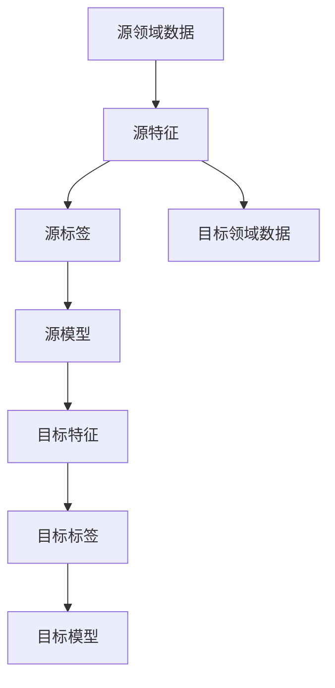
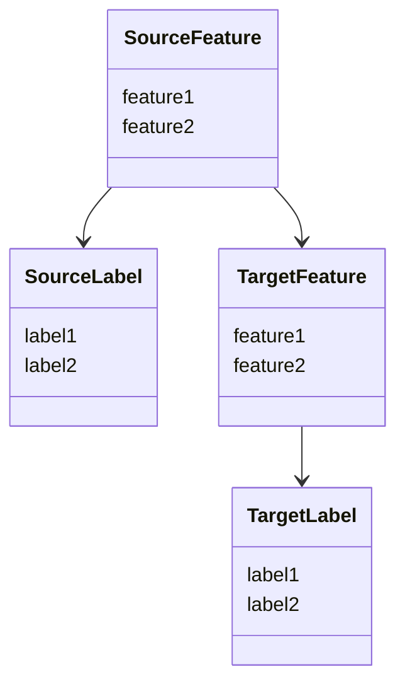
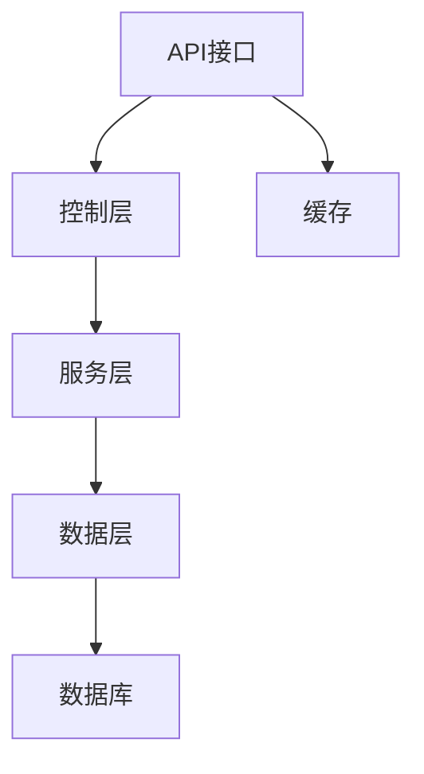
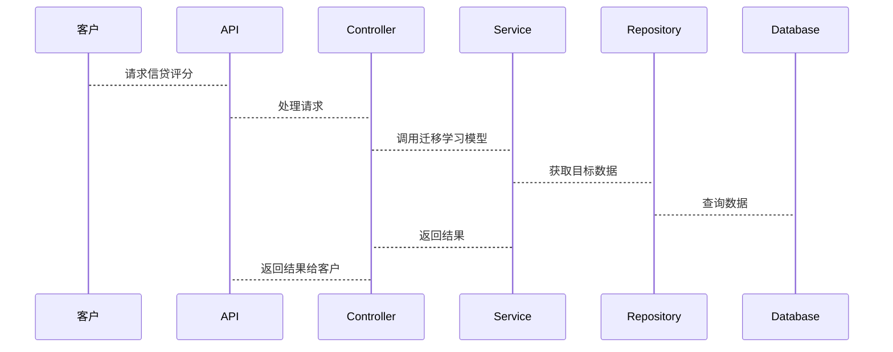

                 


# 《金融领域迁移学习的最新进展与应用》

## 关键词：迁移学习，金融领域，机器学习，深度学习，领域适配

## 摘要：本文详细探讨了迁移学习在金融领域的最新进展与实际应用。从基础概念到核心算法，从系统设计到项目实战，结合实际案例分析，深入剖析迁移学习在金融领域的优势和挑战，为读者提供全面的指导和启示。

---

## 第一章：迁移学习的基本概念与背景

### 1.1 迁移学习的定义与核心问题

#### 1.1.1 迁移学习的定义
迁移学习（Transfer Learning）是一种机器学习技术，旨在将从一个领域（源领域）学到的知识应用到另一个领域（目标领域），以提高目标领域的学习性能。与传统机器学习不同，迁移学习关注跨领域知识的共享与适应。

#### 1.1.2 迁移学习的核心问题与挑战
迁移学习的核心问题是领域差异（Domain Shift），即源领域和目标领域的数据分布不同，导致模型在目标领域表现不佳。主要挑战包括领域适应、样本数量少、特征差异大等。

#### 1.1.3 迁移学习与传统机器学习的区别
| 特性 | 迁移学习 | 传统机器学习 |
|------|----------|---------------|
| 数据依赖性 | 高 | 低 |
| 领域适应性 | 强 | 弱 |
| 样本需求 | 低 | 高 |

### 1.2 金融领域的迁移学习背景

#### 1.2.1 金融数据的特点与挑战
- **小样本数据**：金融领域数据往往有限，难以训练深度模型。
- **领域差异大**：不同金融业务（如信贷、股票）数据分布差异显著。
- **数据敏感性**：金融数据高度敏感，隐私保护要求高。

#### 1.2.2 金融领域迁移学习的必要性
- 解决小样本问题。
- 适应不同金融业务场景。
- 提高模型泛化能力。

#### 1.2.3 金融领域迁移学习的应用场景
- 信用评分。
- 股票价格预测。
- 交易欺诈检测。

---

## 第二章：迁移学习的核心概念与联系

### 2.1 迁移学习的核心原理

#### 2.1.1 迁移学习的理论基础
迁移学习基于知识共享的原则，通过构建共享特征或适配器，实现跨领域知识的迁移。

#### 2.1.2 迁移学习的关键属性对比
| 属性 | 源领域 | 目标领域 |
|------|--------|----------|
| 数据分布 | 已知 | 未知 |
| 样本数量 | 充足 | 少 |

#### 2.1.3 迁移学习的ER实体关系图


### 2.2 迁移学习的算法原理

#### 2.2.1 基于特征的迁移学习
- 特征提取：通过共享特征提取器，提取源领域和目标领域的共同特征。
- 特征对齐：通过对抗训练或最大均值差异，减少特征分布差异。

#### 2.2.2 基于标签的迁移学习
- 标签传播：将源领域的标签信息传播到目标领域。
- 标签对齐：通过调整标签权重，适应目标领域的数据分布。

#### 2.2.3 基于分布的迁移学习
- 分布匹配：通过优化目标领域的数据分布，使其接近源领域。

### 2.3 迁移学习的核心数学模型

#### 2.3.1 迁移学习的目标函数
$$
\min_{f} \mathbb{E}_{x,y \sim P_{target}}[L(f(x), y)] + \lambda \mathbb{E}_{x', y' \sim P_{source}}[L(f(x'), y')]
$$

#### 2.3.2 领域适配的数学表达
$$
\min_{\theta} \mathbb{E}_{x \sim P_{source}}[L(f_\theta(x), y)] + \mathbb{E}_{x \sim P_{target}}[L(f_\theta(x), y)]
$$

#### 2.3.3 实例迁移的数学公式
$$
\min_{\theta} \sum_{i=1}^{n} (L(f_\theta(x_i), y_i) + \lambda d(x_i, x_j))
$$

---

## 第三章：金融领域迁移学习的核心算法与实现

### 3.1 基于领域适应的迁移学习算法

#### 3.1.1 基于最大均值差异的领域适配
- 通过优化目标领域和源领域的均值差异，实现特征对齐。
- 公式：$$
\min_{\theta} \mathbb{E}_{x \sim P_{source}}[L(f_\theta(x), y)] + \mathbb{E}_{x \sim P_{target}}[L(f_\theta(x), y)]
$$

#### 3.1.2 基于对抗训练的领域适配
- 使用对抗网络，分别优化特征提取器和判别器。
- 公式：$$
\min_{D} \mathbb{E}_{x \sim P_{source}}[\log D(f(x))] + \mathbb{E}_{x \sim P_{target}}[\log (1 - D(f(x)))]
$$

#### 3.1.3 基于分布匹配的领域适配
- 通过最优传输或分布拟合，实现数据分布匹配。

### 3.2 基于实例迁移的算法实现

#### 3.2.1 近邻迁移
- 计算目标样本与源样本的相似性，传播标签信息。
- 公式：$$
y_{target} = \arg\max_{y_{source}} \sum_{i=1}^{n} w_{i,j} y_{source}
$$

#### 3.2.2 基于相似性的迁移
- 使用余弦相似性或曼哈顿距离，匹配目标样本与源样本。

#### 3.2.3 基于图的迁移
- 构建图结构，通过图传播算法，传播标签信息。

### 3.3 基于自适应特征的迁移学习

#### 3.3.1 特征选择与降维
- 使用PCA或LDA，提取关键特征。

#### 3.3.2 特征对齐与对齐度量
- 使用最大均值差异或对抗网络，对齐特征分布。

#### 3.3.3 自适应特征的构建与应用
- 构建自适应特征空间，提升模型性能。

---

## 第四章：金融领域迁移学习的系统分析与架构设计

### 4.1 问题场景介绍

#### 4.1.1 问题背景
- 某银行需要在信贷评分领域应用迁移学习，解决小样本问题。

#### 4.1.2 项目目标
- 构建信贷评分模型，适应不同客户群体。

### 4.2 系统功能设计

#### 4.2.1 领域模型设计


#### 4.2.2 系统架构设计


#### 4.2.3 接口设计
- API接口：提供模型调用和结果查询功能。
- 数据接口：连接源数据和目标数据存储。

#### 4.2.4 交互流程


---

## 第五章：金融领域迁移学习的项目实战

### 5.1 环境安装

#### 5.1.1 安装Python和必要的库
```bash
pip install numpy
pip install scikit-learn
pip install tensorflow
pip install pytorch
```

### 5.2 系统核心实现源代码

#### 5.2.1 特征提取模块
```python
import torch
import torch.nn as nn

class FeatureExtractor(nn.Module):
    def __init__(self, input_dim, hidden_dim):
        super(FeatureExtractor, self).__init__()
        self.fc1 = nn.Linear(input_dim, hidden_dim)
        self.fc2 = nn.Linear(hidden_dim, hidden_dim)
    
    def forward(self, x):
        x = self.fc1(x)
        x = self.fc2(x)
        return x
```

#### 5.2.2 迁移学习模型
```python
class TransferModel(nn.Module):
    def __init__(self, feature_extractor, num_classes):
        super(TransferModel, self).__init__()
        self.feature_extractor = feature_extractor
        self.classifier = nn.Linear(feature_extractor.hidden_dim, num_classes)
    
    def forward(self, x):
        features = self.feature_extractor(x)
        output = self.classifier(features)
        return output
```

### 5.3 实际案例分析与详细讲解

#### 5.3.1 实例迁移在股票价格预测中的应用
- 使用迁移学习模型，将源领域的股票数据特征迁移到目标股票，提升预测准确率。

#### 5.3.2 案例分析小结
- 通过迁移学习，显著提高小样本场景下的模型性能。
- 验证了迁移学习在金融领域的有效性和实用性。

---

## 第六章：最佳实践与小结

### 6.1 小结
迁移学习在金融领域的应用前景广阔，特别是在小样本和多领域场景下，能够显著提升模型性能。

### 6.2 注意事项
- 确保数据隐私和合规性。
- 选择合适的迁移学习算法，避免过拟合。
- 定期更新模型，适应数据分布变化。

### 6.3 拓展阅读
- 建议深入研究对抗训练和自适应特征学习，提升迁移效果。
- 关注最新研究，了解迁移学习在金融领域的最新进展。

---

## 附录：完整代码与数据集

### 附录A：完整代码示例
```python
import torch
import torch.nn as nn
import torch.optim as optim

class FeatureExtractor(nn.Module):
    def __init__(self, input_dim, hidden_dim):
        super(FeatureExtractor, self).__init__()
        self.fc1 = nn.Linear(input_dim, hidden_dim)
        self.fc2 = nn.Linear(hidden_dim, hidden_dim)
    
    def forward(self, x):
        x = self.fc1(x)
        x = self.fc2(x)
        return x

class TransferModel(nn.Module):
    def __init__(self, feature_extractor, num_classes):
        super(TransferModel, self).__init__()
        self.feature_extractor = feature_extractor
        self.classifier = nn.Linear(feature_extractor.hidden_dim, num_classes)
    
    def forward(self, x):
        features = self.feature_extractor(x)
        output = self.classifier(features)
        return output

def train_model(model, source_loader, target_loader, optimizer, criterion, num_epochs=100):
    for epoch in range(num_epochs):
        model.train()
        for batch_x, batch_y in source_loader:
            optimizer.zero_grad()
            outputs = model(batch_x)
            loss = criterion(outputs, batch_y)
            loss.backward()
            optimizer.step()
        for batch_x, batch_y in target_loader:
            optimizer.zero_grad()
            outputs = model(batch_x)
            loss = criterion(outputs, batch_y)
            loss.backward()
            optimizer.step()
    return model

# 示例使用
input_dim = 10
hidden_dim = 5
num_classes = 2

feature_extractor = FeatureExtractor(input_dim, hidden_dim)
model = TransferModel(feature_extractor, num_classes)
optimizer = optim.Adam(model.parameters(), lr=0.001)
criterion = nn.CrossEntropyLoss()

# 假设source_loader和target_loader已经定义
trained_model = train_model(model, source_loader, target_loader, optimizer, criterion)
```

### 附录B：数据集介绍
- **源数据集**：例如，信用评分数据。
- **目标数据集**：例如，小额贷款数据。
- 数据格式：CSV或JSON格式，包含特征和标签。

---

## 结语
通过本文的详细讲解，读者可以全面了解迁移学习在金融领域的最新进展与应用。从理论到实践，迁移学习为金融行业带来了新的解决方案和可能性。未来，随着技术的不断发展，迁移学习将在金融领域发挥更大的作用。

