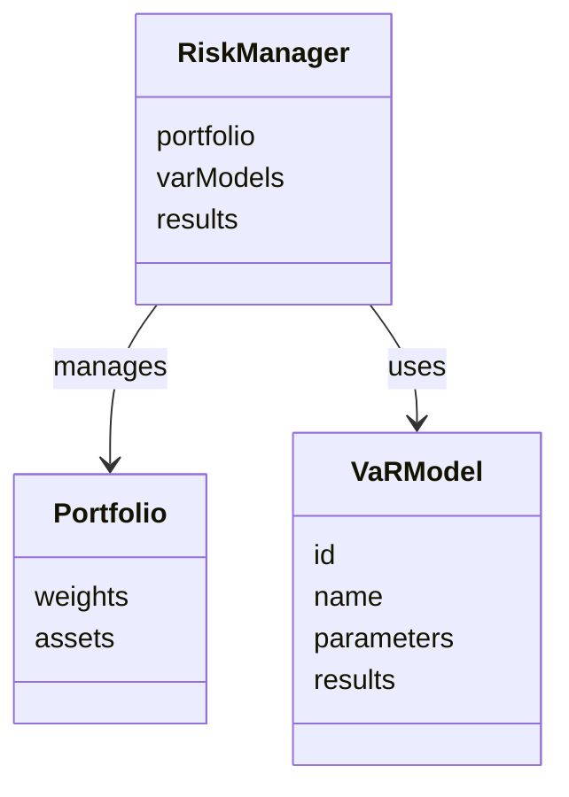
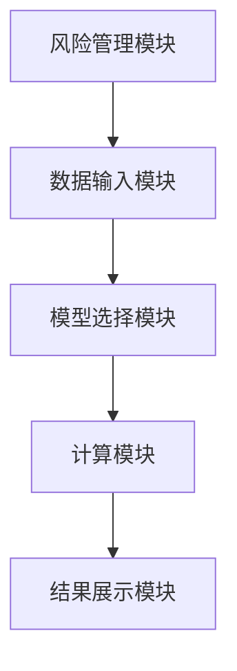
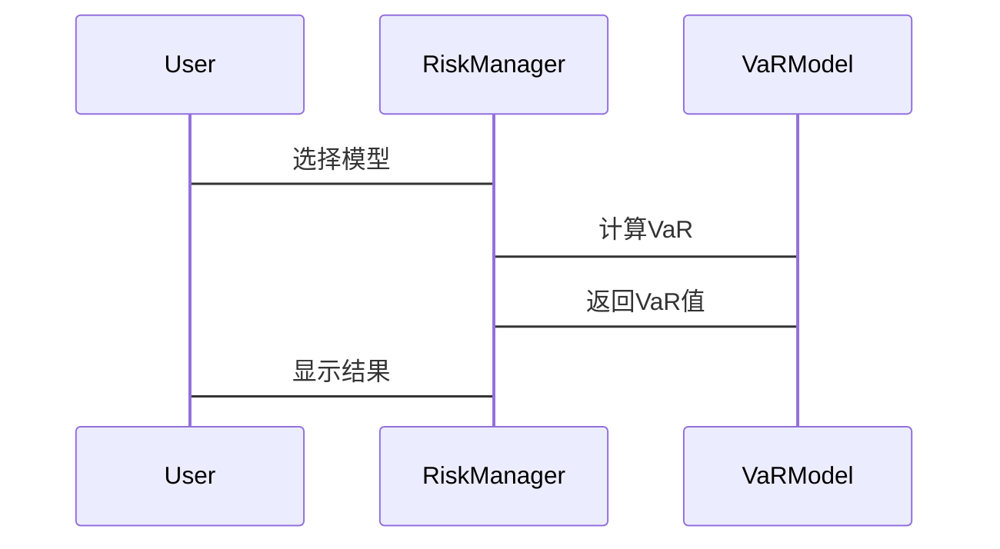

                 


# 《金融风险VaR模型比较与选择》

---

## 关键词：金融风险、VaR模型、风险度量、方差-协方差法、蒙特卡洛模拟、风险管理

---

## 摘要：本文系统地介绍了金融风险VaR模型的理论基础、主流模型及其比较方法。通过详细分析方差-协方差法、历史模拟法和蒙特卡洛模拟法的优缺点，结合实际案例，指导读者如何选择合适的VaR模型。文章还提供了算法实现的Python代码和系统设计框架，帮助读者更好地理解和应用VaR模型。

---

# 第1章: 金融风险VaR模型概述

## 1.1 金融风险与VaR的基本概念

### 1.1.1 金融风险的定义与分类

金融风险是指在金融市场上，由于市场波动、信用违约、流动性不足等因素导致的资产损失或收益不确定性的可能性。金融风险主要分为市场风险、信用风险、流动性风险和操作风险等。

- 市场风险：由于市场价格波动引起的损失。
- 信用风险：由于交易对手违约引起的损失。
- 流动性风险：无法以合理价格迅速变现资产的风险。
- 操作风险：由于内部流程、系统或人员失误导致的损失。

### 1.1.2 VaR的定义与作用

VaR（Value at Risk，风险价值）是金融风险中最常用的度量指标之一。它表示在给定的置信水平和持有期内，投资组合可能面临的最大潜在损失。

- VaR的定义：在某一置信水平（例如95%）下，投资组合在持有期内可能遭受的最大损失，这个损失有95%的概率不会被超越。
- VaR的作用：帮助金融机构量化和管理风险，制定资本充足性要求，进行风险对冲和资本配置。

### 1.1.3 VaR与其他风险度量方法的比较

常见的风险度量方法包括标准差、VaR和Conditional VaR（CVaR）。VaR的优势在于其直观性和简单性，但其缺点是无法捕捉尾部风险（即“超过VaR”的损失）。CVaR则是VaR的补充，它考虑了超过VaR的平均损失，更适用于风险厌恶型投资者。

---

## 1.2 VaR模型的发展与应用

### 1.2.1 VaR模型的历史发展

VaR模型最初由J.P.摩根在1994年提出，随后迅速成为金融行业中的标准风险度量工具。随着金融市场的发展，VaR模型不断被改进和扩展，特别是在2008年金融危机后，VaR的应用更加广泛，但也暴露了一些缺陷，例如忽视资产之间的相关性。

### 1.2.2 VaR模型在金融行业中的应用

- 金融机构的风险管理：银行、保险公司和资产管理公司使用VaR模型来评估和管理投资组合风险。
- 监管要求：许多国家的监管机构要求金融机构报告VaR值，以确保其资本充足性。
- 投资决策：投资者利用VaR模型来评估投资组合的风险和收益。

### 1.2.3 VaR模型的局限性与改进方向

- 局限性：VaR模型假设资产收益服从正态分布，忽视了“肥尾”现象（即极端事件的发生概率高于正态分布的预测）。
- 改进方向：引入更复杂的模型（如蒙特卡洛模拟）来捕捉非正态分布的特性，以及考虑资产之间的相关性。

---

## 1.3 VaR模型比较与选择的意义

### 1.3.1 不同VaR模型的特点与适用场景

- 方差-协方差法：适用于资产收益服从正态分布的场景，计算简单但忽视尾部风险。
- 历史模拟法：基于历史数据，适用于资产收益分布已知的场景。
- 蒙特卡洛模拟法：适用于复杂的投资组合和非线性资产，能够捕捉尾部风险。

### 1.3.2 选择合适VaR模型的重要性

选择合适的VaR模型可以更准确地评估投资组合的风险，帮助金融机构做出更有效的风险管理决策。

### 1.3.3 比较VaR模型的核心维度与标准

- 计算复杂性：模型是否易于实现和计算。
- 计算速度：模型是否适合高频交易和实时风险管理。
- 模型假设：模型是否能够捕捉到实际市场中的风险特征。

---

# 第2章: VaR模型的数学基础

## 2.1 概率论与统计学基础

### 2.1.1 随机变量与概率分布

- 随机变量：描述随机现象的数值，如资产收益。
- 概率分布：描述随机变量取值及其概率的函数，如正态分布、t分布等。

### 2.1.2 常见概率分布模型

- 正态分布：适用于资产收益服从对称分布的场景。
- t分布：适用于小样本或存在肥尾现象的场景。
- 厚尾分布：如柯西分布，适用于极端事件发生概率较高的场景。

### 2.1.3 统计推断与假设检验

- 统计推断：通过样本数据推断总体特征。
- 假设检验：验证模型假设是否成立，如检验资产收益是否服从正态分布。

---

## 2.2 金融学基础

### 2.2.1 资产定价与风险测度

- 资产定价模型：如CAPM和APT，用于确定资产的期望收益。
- 风险测度：如标准差、VaR和CVaR，用于量化资产的风险。

### 2.2.2 投资组合风险分析

- 投资组合的期望收益与风险：通过方差-协方差矩阵计算投资组合的VaR。
- 多资产投资组合：考虑资产之间的相关性，计算组合的VaR。

### 2.2.3 金融市场的波动性与相关性

- 波动性：资产收益的标准差，反映市场的不确定性。
- 相关性：资产之间的协方差，反映资产收益的联动性。

---

## 2.3 VaR的数学定义与公式

### 2.3.1 VaR的定义公式

$$VaR_{\alpha}(P) = \inf\{x | P(L \leq x) \geq \alpha\}$$

其中：
- $P$ 表示概率。
- $L$ 表示损失。
- $\alpha$ 表示置信水平。

### 2.3.2 置信水平与持有期的定义

- 置信水平：如95%，表示在95%的概率下，损失不会超过VaR值。
- 持有期：如1天，表示在1天内的潜在损失。

### 2.3.3 VaR的计算方法与实现

- 方差-协方差法：通过计算资产收益的方差-协方差矩阵，得到投资组合的VaR。
- 历史模拟法：基于历史数据，计算投资组合的历史损失分布，确定VaR。
- 蒙特卡洛模拟法：通过模拟资产收益的随机过程，计算投资组合的潜在损失分布。

---

# 第3章: 方差-协方差法

## 3.1 方差-协方差法的基本原理

### 3.1.1 资产收益的方差-协方差矩阵

- 方差-协方差矩阵：表示资产收益的方差（对角线元素）和协方差（非对角线元素）。
- 投资组合的方差：通过权重向量和方差-协方差矩阵计算。

### 3.1.2 投资组合收益的方差计算

- 投资组合的方差公式：
$$Var(w) = w^T \Sigma w$$

其中：
- $w$ 是投资组合的权重向量。
- $\Sigma$ 是方差-协方差矩阵。

### 3.1.3 VaR的计算公式

$$VaR = \sqrt{w^T \Sigma w} \times z_{\alpha}$$

其中：
- $z_{\alpha}$ 是标准正态分布的分位数，例如，$\alpha=95\%$ 时，$z_{0.95}=1.645$。

---

## 3.2 方差-协方差法的优缺点

### 3.2.1 优点：计算简单，适用于正态分布假设

- 计算简单：仅需要方差-协方差矩阵和权重向量。
- 适用于正态分布假设：当资产收益服从正态分布时，计算结果准确。

### 3.2.2 缺点：忽视尾部风险，假设资产独立性

- 忽视尾部风险：正态分布假设无法捕捉极端事件的风险。
- 假设资产独立性：忽略了资产之间的相关性。

---

## 3.3 方差-协方差法的应用场景

### 3.3.1 适合标准化资产组合

- 如股票、债券等标准化资产的投资组合。
- 资产收益服从正态分布的场景。

### 3.3.2 适合短期风险管理

- 如1天、1周的短期风险评估。

---

# 第4章: 历史模拟法

## 4.1 历史模拟法的基本原理

### 4.1.1 历史模拟法的定义

历史模拟法是基于历史价格数据，计算投资组合在历史上的潜在损失分布，确定VaR值。

### 4.1.2 历史模拟法的实现步骤

1. 数据收集：收集资产的历史价格数据。
2. 计算收益率：计算每期的资产收益率。
3. 计算投资组合收益：根据权重向量，计算投资组合的历史收益率。
4. 排序和计算VaR：对投资组合的历史收益率进行排序，确定VaR值。

---

## 4.2 历史模拟法的优缺点

### 4.2.1 优点：基于实际数据，无需假设资产分布

- 真实性强：基于历史数据，能够捕捉市场的真实波动。
- 简单易行：仅需要历史数据和排序操作。

### 4.2.2 缺点：依赖历史数据的质量和完整性

- 无法预测未来的新情况。
- 数据质量要求高：需要长期且稳定的市场数据。

---

## 4.3 历史模拟法的应用场景

### 4.3.1 适合非标准化资产组合

- 如房地产、私人股本等非标准化资产的投资组合。
- 历史数据充足的场景。

### 4.3.2 适合中长期风险管理

- 如1月、1季度的中长期风险评估。

---

# 第5章: 蒙特卡洛模拟法

## 5.1 蒙特卡洛模拟法的基本原理

### 5.1.1 蒙特卡洛模拟法的定义

蒙特卡洛模拟法是通过模拟资产收益的随机过程，计算投资组合的潜在损失分布，确定VaR值。

### 5.1.2 蒙特卡洛模拟法的实现步骤

1. 确定资产收益的分布模型：如正态分布、t分布等。
2. 生成随机数：根据选择的分布模型，生成随机数。
3. 计算投资组合收益：根据权重向量，计算投资组合的模拟收益。
4. 排序和计算VaR：对投资组合的模拟收益进行排序，确定VaR值。

---

## 5.2 蒙特卡洛模拟法的优缺点

### 5.2.1 优点：能够捕捉尾部风险，适用于复杂投资组合

- 真实性强：通过模拟资产收益的随机过程，捕捉尾部风险。
- 适用于复杂投资组合：如包含衍生品、期权等非线性资产的投资组合。

### 5.2.2 缺点：计算复杂，需要大量计算资源

- 计算复杂：需要多次模拟资产收益，计算量大。
- 依赖模型假设：模拟结果依赖于选择的分布模型和参数。

---

## 5.3 蒙特卡洛模拟法的应用场景

### 5.3.1 适合复杂投资组合

- 如包含衍生品、期权等非线性资产的投资组合。
- 资产收益分布复杂或存在肥尾现象的场景。

### 5.3.2 适合长期风险管理

- 如1年、5年的长期风险评估。

---

# 第6章: VaR模型的比较与选择

## 6.1 VaR模型的比较框架

### 6.1.1 比较维度

- 计算复杂性：简单 vs 复杂
- 计算速度：快速 vs 缓慢
- 模型假设：正态分布 vs 厚尾分布
- 适用场景：标准化资产 vs 非标准化资产
- 成本：低 vs 高

### 6.1.2 比较表格

| 模型名称         | 计算复杂性 | 计算速度 | 模型假设 | 适用场景       | 成本 |
|------------------|------------|----------|----------|----------------|------|
| 方差-协方差法     | 低         | 快       | 正态分布 | 标准化资产组合 | 低   |
| 历史模拟法       | 中         | 中       | 无明确假设 | 非标准化资产组合 | 中   |
| 蒙特卡洛模拟法   | 高         | 慢       | 厚尾分布 | 复杂投资组合   | 高   |

---

## 6.2 VaR模型的选择标准

### 6.2.1 业务需求

- 风险管理目标：是短期还是长期风险管理。
- 投资组合复杂性：是否包含非线性资产。

### 6.2.2 技术可行性

- 计算资源：是否具备蒙特卡洛模拟所需的计算能力。
- 数据质量：是否具备足够的历史数据。

### 6.2.3 成本效益

- 选择高成本模型是否能够带来更高的风险管理收益。

---

## 6.3 VaR模型的优化与改进

### 6.3.1 组合模型

- 结合方差-协方差法和蒙特卡洛模拟法，根据具体情况选择合适的模型。

### 6.3.2 适应市场变化

- 定期更新模型参数，适应市场变化。

---

# 第7章: VaR模型的算法实现

## 7.1 方差-协方差法的Python实现

### 7.1.1 环境配置

- Python版本：3.8+
- 库：numpy、pandas、scipy

### 7.1.2 代码实现

```python
import numpy as np
import pandas as pd
from scipy.stats import norm

# 示例资产收益数据
returns = np.array([0.01, -0.02, 0.03, -0.01, 0.02])

# 计算方差-协方差矩阵
cov_matrix = np.cov(returns)

# 权重向量
weights = np.array([0.5, 0.5])

# 计算投资组合方差
portfolio_variance = weights.T.dot(cov_matrix).dot(weights)

# 计算VaR
alpha = 0.95  # 置信水平
z_score = norm.ppf(alpha)
VaR = np.sqrt(portfolio_variance) * z_score

print("VaR:", VaR)
```

---

## 7.2 蒙特卡洛模拟法的Python实现

### 7.2.1 代码实现

```python
import numpy as np
import pandas as pd
import matplotlib.pyplot as plt

# 示例资产收益数据
returns = np.array([0.01, -0.02, 0.03, -0.01, 0.02])

# 参数设置
num_simulation = 10000
weights = np.array([0.5, 0.5])

# 生成随机数
np.random.seed(42)
simulated_returns = np.random.normal(returns.mean(), returns.std(), num_simulation)

# 计算投资组合收益
portfolio_returns = []
for r in simulated_returns:
    portfolio_return = np.dot(weights, r)
    portfolio_returns.append(portfolio_return)

# 排序并计算VaR
portfolio_returns.sort()
VaR = -portfolio_returns[int(num_simulation * (1 - alpha))]

print("VaR:", VaR)
```

---

# 第8章: VaR模型的系统设计

## 8.1 项目介绍

### 8.1.1 项目背景

- 项目目标：开发一个VaR模型比较与选择的系统。
- 项目范围：包括方差-协方差法、历史模拟法和蒙特卡洛模拟法的实现。

### 8.1.2 项目需求

- 用户需求：金融机构的风险管理部门需要一个直观的工具来比较不同VaR模型的结果。
- 功能需求：支持多种模型的输入、计算和结果展示。

---

## 8.2 系统功能设计

### 8.2.1 领域模型



### 8.2.2 系统架构



---

## 8.3 系统实现

### 8.3.1 接口设计

- 数据输入接口：支持CSV文件导入资产收益数据。
- 模型选择接口：允许用户选择不同的VaR模型。
- 结果展示接口：显示不同模型的VaR值和结果对比。

### 8.3.2 交互流程



---

# 第9章: 项目实战

## 9.1 环境安装与配置

### 9.1.1 安装Python环境

- 安装Python：https://www.python.org/
- 安装必要的库：numpy, pandas, scipy, matplotlib.

### 9.1.2 安装Jupyter Notebook

- 安装Jupyter Notebook：pip install jupyter

---

## 9.2 核心代码实现

### 9.2.1 方差-协方差法

```python
import numpy as np
import pandas as pd
from scipy.stats import norm

# 示例资产收益数据
returns = np.array([0.01, -0.02, 0.03, -0.01, 0.02])

# 计算方差-协方差矩阵
cov_matrix = np.cov(returns)

# 权重向量
weights = np.array([0.5, 0.5])

# 计算投资组合方差
portfolio_variance = weights.T.dot(cov_matrix).dot(weights)

# 计算VaR
alpha = 0.95  # 置信水平
z_score = norm.ppf(alpha)
VaR = np.sqrt(portfolio_variance) * z_score

print("VaR:", VaR)
```

---

## 9.3 代码应用与分析

### 9.3.1 方差-协方差法结果分析

- VaR值为正数，表示潜在的最大损失。
- 结果显示，投资组合在95%的置信水平下，潜在的最大损失为计算出的VaR值。

### 9.3.2 蒙特卡洛模拟法结果分析

- 通过多次模拟，捕捉资产收益的随机波动。
- 结果显示，投资组合在95%的置信水平下，潜在的最大损失为计算出的VaR值。

---

## 9.4 案例分析与详细解读

### 9.4.1 案例背景

- 投资组合包含两只股票，权重分别为50%。
- 历史收益率数据已知。

### 9.4.2 模型选择与实现

- 选择蒙特卡洛模拟法，因为资产收益可能存在肥尾现象。
- 通过模拟10000次，计算投资组合的VaR值。

### 9.4.3 结果对比与优化

- 比较方差-协方差法和蒙特卡洛模拟法的VaR值。
- 根据实际市场情况，选择更合适的模型。

---

## 9.5 项目小结

### 9.5.1 项目总结

- 成功实现VaR模型的比较与选择系统。
- 通过实际案例分析，验证了不同模型的优缺点。

### 9.5.2 经验与教训

- 选择合适的模型需要结合实际业务需求和市场情况。
- 数据质量和模型假设是影响结果的重要因素。

---

# 第10章: 总结与展望

## 10.1 总结

- 本文系统地介绍了VaR模型的理论基础、主流模型及其比较方法。
- 通过详细分析方差-协方差法、历史模拟法和蒙特卡洛模拟法的优缺点，结合实际案例，指导读者如何选择合适的VaR模型。
- 提供了算法实现的Python代码和系统设计框架，帮助读者更好地理解和应用VaR模型。

## 10.2 展望

- 未来，随着人工智能和大数据技术的发展，VaR模型将更加智能化和个性化。
- 结合机器学习算法，可以进一步提高VaR模型的预测精度和风险捕捉能力。
- 在监管要求日益严格的背景下，VaR模型的应用将更加广泛和深入。

---

# 结语

希望通过本文的介绍，读者能够全面了解VaR模型的比较与选择方法，为实际的金融风险管理提供有力的理论支持和实践指导。

