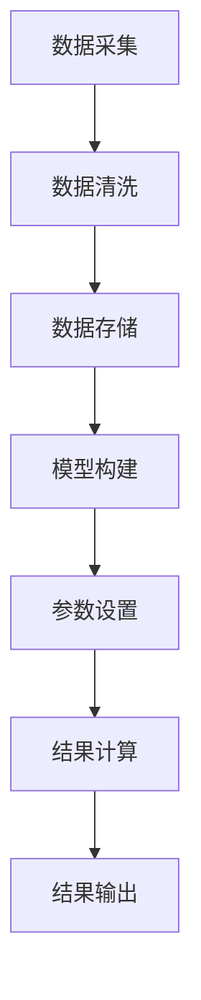
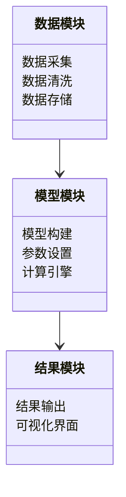
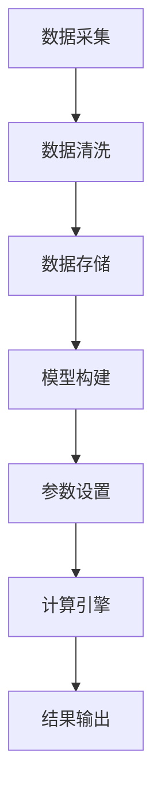
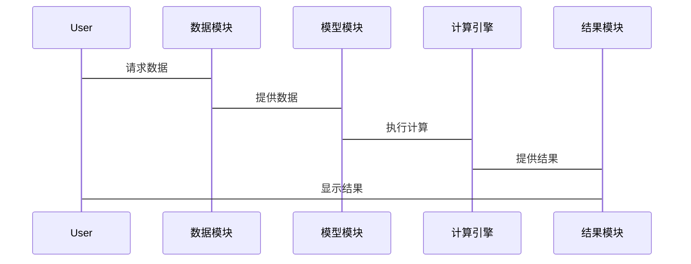

                 


---

# 金融风险压力测试模型

> **关键词**: 金融风险，压力测试，风险管理，VaR，CVaR，情景分析

> **摘要**: 本文深入探讨了金融风险压力测试模型的核心概念、理论基础、系统架构及实际应用。通过概率统计与风险度量方法的结合，分析了情景生成技术在压力测试中的重要性，并详细介绍了压力测试模型的数学模型和系统设计。最后，通过实际案例分析，展示了压力测试模型在金融风险管理中的应用价值。

---

# 第一部分: 金融风险压力测试模型引言

## 第1章: 压力测试的基本概念与重要性

### 1.1 压力测试的定义与背景

#### 1.1.1 金融风险的基本概念
金融风险是指在金融活动中，由于各种不确定性因素导致的损失可能性。常见的金融风险包括市场风险、信用风险、流动性风险和操作风险。

#### 1.1.2 压力测试的定义与目的
压力测试是一种用于评估金融机构在极端市场条件下的稳健性的方法。其目的是通过模拟极端市场情景，评估金融机构在这些情景下的损失承受能力和资本充足性。

#### 1.1.3 压力测试在金融监管中的作用
压力测试是金融监管的重要工具，用于评估金融机构在极端市场条件下的抗风险能力，确保金融系统的稳定性。

### 1.2 压力测试的发展历程

#### 1.2.1 国际金融危机与压力测试的兴起
2008年金融危机暴露了金融机构在极端市场条件下的脆弱性，促使各国监管机构开始重视压力测试。

#### 1.2.2 各国监管机构对压力测试的重视
国际上，美联储、欧洲央行等监管机构开始要求金融机构定期进行压力测试，并公开测试结果。

#### 1.2.3 压力测试框架的演变
随着金融市场的复杂化，压力测试框架逐渐从简单的假设情景分析发展为结合定量分析和定性分析的综合方法。

### 1.3 压力测试的框架与流程

#### 1.3.1 压力测试的基本框架
压力测试通常包括情景设定、数据准备、模型构建、结果分析和报告撰写五个阶段。

#### 1.3.2 压力测试的实施流程
1. 情景设定：确定测试的情景，如市场崩盘、利率上升等。
2. 数据准备：收集历史数据和市场数据。
3. 模型构建：建立压力测试模型，模拟极端市场条件下的资产表现。
4. 结果分析：评估金融机构在极端情景下的损失情况。
5. 报告撰写：总结测试结果，提出改进建议。

#### 1.3.3 压力测试的关键环节
- **情景设定**：情景的合理性和代表性直接影响测试结果。
- **数据准备**：数据的准确性和完整性是模型构建的基础。
- **模型构建**：模型的科学性和复杂度决定了测试的精确性。

### 1.4 压力测试的应用场景

#### 1.4.1 银行与金融机构的风险管理
压力测试帮助银行评估在极端市场条件下的资本充足性和流动性。

#### 1.4.2 投资组合风险评估
通过压力测试，投资者可以评估其投资组合在极端市场条件下的风险敞口。

#### 1.4.3 企业财务稳健性分析
企业可以通过压力测试评估其财务状况在极端经济环境下的稳定性。

### 1.5 本章小结
压力测试是金融风险管理的重要工具，通过模拟极端市场情景，帮助金融机构评估风险并制定应对策略。

---

# 第二部分: 金融风险压力测试模型的理论基础

## 第2章: 概率统计与风险度量方法

### 2.1 概率统计基础

#### 2.1.1 概率分布的基本概念
概率分布描述了随机变量取值及其概率的分布情况，常见的概率分布包括正态分布、t分布和泊松分布。

#### 2.1.2 常见概率分布模型
- **正态分布**：适用于资产收益的分布。
- **t分布**：适用于小样本数据的分布。
- **泊松分布**：适用于事件发生次数的分布。

#### 2.1.3 统计推断与假设检验
统计推断是通过样本数据推断总体特征的方法，假设检验用于验证假设的真伪。

### 2.2 风险度量方法

#### 2.2.1 坍缩标准差法（VaR）
VaR（Value at Risk）是指在一定置信水平下，资产组合在一定持有期内的最大可能损失。

$$ VaR_{\alpha} = \min\{x | P(Loss \leq x) \geq \alpha\} $$

#### 2.2.2 置信区间法（CVaR）
CVaR（Conditional Value at Risk）是指在VaR的基础上，计算超过VaR值的平均损失。

$$ CVaR_{\alpha} = \frac{1}{1-\alpha} \int_{\alpha}^{1} x dF(x) $$

#### 2.2.3 其他风险度量指标
- **最大回撤（Maximum Drawdown）**：衡量投资组合在一定时间段内的最大亏损。
- **波动率（Volatility）**：衡量资产收益的波动程度。

### 2.3 情景分析与假设检验

#### 2.3.1 情景分析的基本原理
情景分析是通过假设不同的市场情景，评估资产组合在不同情景下的表现。

#### 2.3.2 假设检验在压力测试中的应用
通过假设检验，可以验证压力测试结果的显著性和可靠性。

#### 2.3.3 情景生成方法的优缺点
- **历史情景法**：基于历史数据生成情景，具有可验证性。
- **假设情景法**：基于假设条件生成情景，具有灵活性。

---

### 2.3.4 压力测试的情景生成方法

#### 2.3.4.1 历史情景法
使用历史市场数据生成情景，模拟极端市场条件。

#### 2.3.4.2 假设情景法
基于假设条件生成情景，如模拟市场崩盘、利率上升等。

#### 2.3.4.3 随机情景法
使用随机数生成器生成情景，模拟市场波动。

---

## 第3章: 压力测试模型的核心概念与联系

### 3.1 压力测试模型的原理

#### 3.1.1 模型的输入
- **市场数据**：历史价格、收益率等。
- **资产组合**：金融机构的资产组合。
- **情景设定**：极端市场情景。

#### 3.1.2 模型的处理
- **数据预处理**：清洗和标准化数据。
- **模型构建**：建立资产组合在不同情景下的收益和损失模型。

#### 3.1.3 模型的输出
- **VaR**：在一定置信水平下的最大损失。
- **CVaR**：超过VaR的平均损失。
- **其他指标**：最大回撤、波动率等。

### 3.2 压力测试模型的数学模型

#### 3.2.1 VaR的计算公式
$$ VaR_{\alpha} = \mu + z_{\alpha} \cdot \sigma $$

其中，$\mu$ 是均值，$\sigma$ 是标准差，$z_{\alpha}$ 是对应置信水平的分位数。

#### 3.2.2 CVaR的计算公式
$$ CVaR_{\alpha} = \mu + \frac{z_{\alpha} \cdot \sigma}{2} $$

### 3.3 压力测试模型的系统架构

#### 3.3.1 系统模块划分
- **数据模块**：数据采集、清洗和存储。
- **模型模块**：模型构建、参数设置和计算。
- **结果模块**：结果输出和可视化。

#### 3.3.2 系统架构图


---

# 第三部分: 金融风险压力测试模型的系统架构设计

## 第4章: 系统功能设计

### 4.1 领域模型设计



### 4.2 系统架构设计



### 4.3 系统接口设计

- **数据接口**：提供API，供外部系统调用数据。
- **模型接口**：提供API，供外部系统调用模型。
- **结果接口**：提供API，供外部系统获取测试结果。

### 4.4 系统交互设计



---

# 第四部分: 金融风险压力测试模型的项目实战

## 第5章: 项目实战

### 5.1 环境安装

```bash
pip install numpy pandas matplotlib
```

### 5.2 核心代码实现

#### 5.2.1 数据准备
```python
import numpy as np
import pandas as pd

# 生成模拟数据
np.random.seed(42)
data = np.random.normal(0, 1, 1000)
df = pd.DataFrame(data, columns=['returns'])
```

#### 5.2.2 模型实现
```python
def calculate VaR(data, alpha=0.95):
    sorted_data = np.sort(data)
    index = int(alpha * len(data))
    VaR = sorted_data[index]
    return VaR

def calculate CVaR(data, alpha=0.95):
    sorted_data = np.sort(data)
    index = int(alpha * len(data))
    CVaR = np.mean(sorted_data[index:])
    return CVaR
```

#### 5.2.3 情景分析
```python
import matplotlib.pyplot as plt

# 绘制VaR和CVaR的对比图
plt.figure(figsize=(10, 6))
plt.plot(data, label='Returns')
plt.axhline(y=calculate VaR(data), color='red', linestyle='--', label='VaR')
plt.axhline(y=calculate CVaR(data), color='blue', linestyle='--', label='CVaR')
plt.legend()
plt.show()
```

### 5.3 案例分析
通过模拟数据，计算VaR和CVaR，分析资产组合在极端市场条件下的风险敞口。

### 5.4 结果解读
通过可视化图表，解读压力测试结果，评估资产组合的抗风险能力。

---

# 第五部分: 金融风险压力测试模型的最佳实践

## 第6章: 最佳实践

### 6.1 小结
压力测试是金融风险管理的重要工具，通过模拟极端市场情景，评估金融机构的抗风险能力。

### 6.2 注意事项
- 数据的准确性和完整性。
- 模型的科学性和合理性。
- 结果的合理性和可解释性。

### 6.3 未来展望
随着金融市场的复杂化，压力测试模型将更加注重实时性和动态性，结合人工智能技术，提高测试的精确性和效率。

---

# 结语

金融风险压力测试模型是金融风险管理的重要工具，通过模拟极端市场情景，帮助金融机构评估风险并制定应对策略。本文从理论基础到系统架构，再到实际应用，全面介绍了压力测试模型的核心概念和实现方法。未来，随着技术的发展，压力测试模型将更加智能化和动态化，为金融风险管理提供更强大的支持。

--- 

以上是基于《金融风险压力测试模型》的完整技术博客文章，涵盖了从基础概念到系统设计再到项目实战的全过程。

