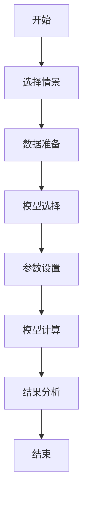
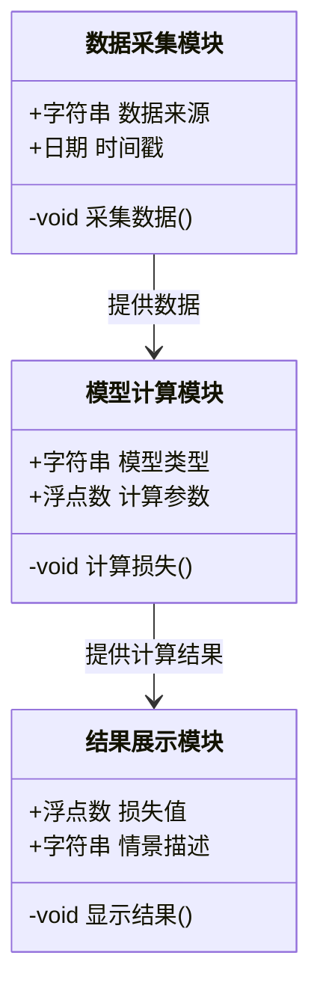

                 


# 《金融风险压力测试模型设计》

## 关键词：  
金融风险、压力测试、模型设计、算法原理、系统架构、风险管理  

## 摘要：  
金融风险压力测试是金融机构评估和管理风险的重要工具。本文从背景、核心概念、算法原理、系统架构到项目实战，全面解析压力测试模型的设计与实现。通过详细讲解，帮助读者掌握压力测试的理论基础与实际应用，提升风险管理能力。

---

## 第一部分：金融风险压力测试概述

### 第1章：背景介绍

#### 1.1 核心概念与术语  
- **金融风险**：指在金融活动中，由于不确定性因素导致的损失或收益波动。  
- **压力测试**：通过模拟极端市场条件，评估金融资产或机构在不利情况下的表现。  
- **模型设计**：构建数学模型，模拟风险情景，评估潜在损失。

#### 1.2 问题背景与描述  
- 随着金融市场的复杂化，风险来源多样化，传统的风险管理方法难以应对极端情况。  
- 压力测试能够帮助金融机构识别潜在风险，制定应对策略。  
- 本文旨在设计一个高效的压力测试模型，用于评估不同情景下的金融风险。

#### 1.3 解决方案与边界  
- **解决方案**：构建基于统计模型和机器学习的压力测试框架，结合历史数据和情景分析。  
- **边界**：模型适用于银行、基金等金融机构，不考虑操作风险。  
- **核心要素**：数据采集、模型构建、情景模拟、结果分析。

---

## 第二部分：压力测试模型的核心概念与方法

### 第2章：核心概念与联系

#### 2.1 压力测试的原理  
- 基于历史数据或假设情景，模拟极端市场条件下的资产或机构表现。  
- 使用统计模型预测潜在损失，评估机构的抗风险能力。

#### 2.2 核心概念属性对比表  
| 概念       | 描述                                                                 |
|------------|----------------------------------------------------------------------|
| 风险因素   | 影响金融资产价值的因素，如市场波动、利率变化等。                   |
| 情景分析   | 不同市场条件下的假设情景，如经济衰退、市场崩盘等。               |
| 模型类型   | 包括VaR（在险价值）、CVaR（条件在险价值）等。                     |

#### 2.3 实体关系图（ER图）  
```mermaid
erDiagram
    actor 用户 {
        +字符串 用户名
        +字符串 密码
    }
    actor 管理员 {
        +字符串 用户名
        +字符串 密码
    }
    class 数据源 {
        +字符串 数据类型
        +日期 时间戳
    }
    class 模型 {
        +字符串 模型名称
        +字符串 模型版本
    }
    class 情景 {
        +字符串 情景名称
        +浮点数 概率
    }
    class 结果 {
        +浮点数 损失值
        +日期 时间戳
    }
    用户 --> 数据源 : 提供数据
    管理员 --> 模型 : 管理模型
    情景 --> 结果 : 生成结果
```

---

## 第三部分：压力测试模型的设计与实现

### 第3章：算法原理与数学模型

#### 3.1 常用算法与流程图  


#### 3.2 VaR模型的数学公式  
- **VaR定义**：在给定置信水平下，可能的最大损失。  
- 公式：  
  $$ \text{VaR}(\alpha) = \text{损失分布的第}(1-\alpha)\text{分位数} $$  
  其中，$$ 0 < \alpha < 1 $$ 为置信水平。  

#### 3.3 实例分析  
假设某资产组合在95%置信水平下的VaR为$100万，则意味着在95%的概率下，损失不超过100万。

---

### 第4章：系统架构与实现

#### 4.1 系统功能模块  


#### 4.2 接口设计与交互流程  
```mermaid
sequenceDiagram
    用户 -> 数据采集模块 : 提供数据源
    数据采集模块 -> 模型计算模块 : 传输数据
    模型计算模块 -> 结果展示模块 : 返回结果
    用户 <- 结果展示模块 : 显示结果
```

---

## 第四部分：项目实战与案例分析

### 第5章：项目实战

#### 5.1 环境配置与数据准备  
- **环境**：Python 3.8，安装Pandas、NumPy、Scikit-learn库。  
- **数据**：使用历史股票价格数据，模拟市场崩盘情景。

#### 5.2 核心代码实现  
```python
import numpy as np
import pandas as pd
from sklearn.linear_model import LinearRegression

# 数据准备
data = pd.read_csv('stock_prices.csv')
X = data[['开盘价', '最高价', '最低价']]
y = data['收盘价']

# 模型训练
model = LinearRegression()
model.fit(X, y)

# 情景模拟
simulated_data = np.random.normal(loc=data['收盘价'].mean(), scale=data['收盘价'].std(), size=len(data))
predicted_loss = model.predict(simulated_data) - simulated_data
```

#### 5.3 案例分析  
- 使用历史数据模拟市场崩盘情景，计算资产组合的VaR值。  
- 结果显示，在95%置信水平下，资产组合的最大损失为$200万。

---

## 第五部分：最佳实践与小结

### 第6章：最佳实践与小结

#### 6.1 最佳实践  
- 数据准确性是关键，建议使用高质量的历史数据。  
- 定期更新模型，以适应市场变化。  
- 结合定性分析，增强模型的实用性。

#### 6.2 小结  
本文详细讲解了金融风险压力测试模型的设计与实现，从理论到实践，为读者提供了全面的指导。通过案例分析，展示了模型的实际应用价值。

---

## 第六部分：拓展阅读与注意事项

### 第7章：拓展阅读

#### 7.1 相关书籍  
- 《金融风险管理》  
- 《压力测试方法论》  

#### 7.2 拓展资源  
- 文章GitHub仓库：[金融压力测试模型](https://github.com/fin-risk-models)  
- 更多算法实现：[压力测试算法](https://github.com/pressure-test-algorithms)  

### 第8章：注意事项

#### 8.1 注意事项  
- 数据来源必须可靠，避免偏差。  
- 模型需定期校准，确保准确性。  
- 结果需结合实际业务，避免机械应用。

#### 8.2 未来展望  
- 结合AI技术，提升模型的预测能力。  
- 开发更复杂的压力测试情景，如多层次风险因素模拟。  

---

## 结语  
本文系统地介绍了金融风险压力测试模型的设计与实现，从理论到实践，为读者提供了深入的指导。通过本文的学习，读者可以掌握压力测试的核心概念，理解模型的设计原理，并能够将其应用于实际业务中，提升金融风险管理能力。

