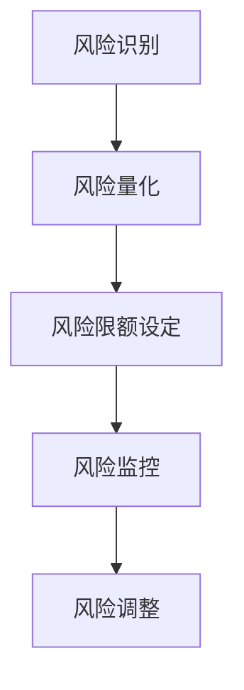
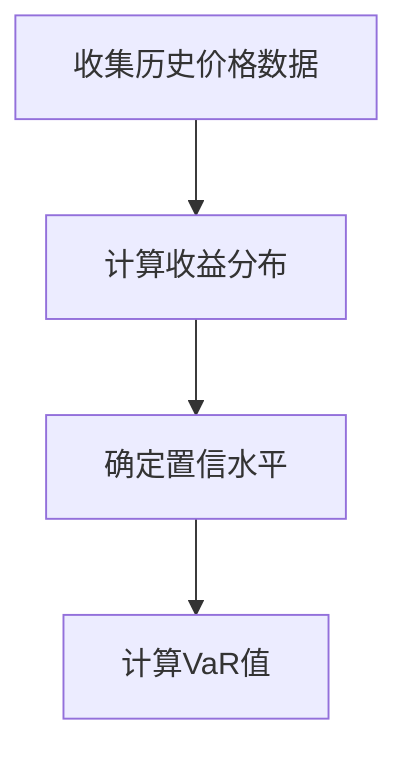
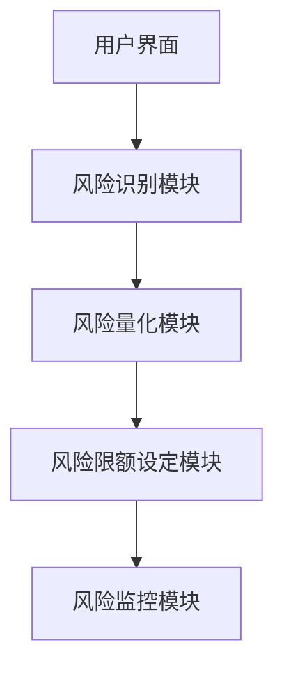
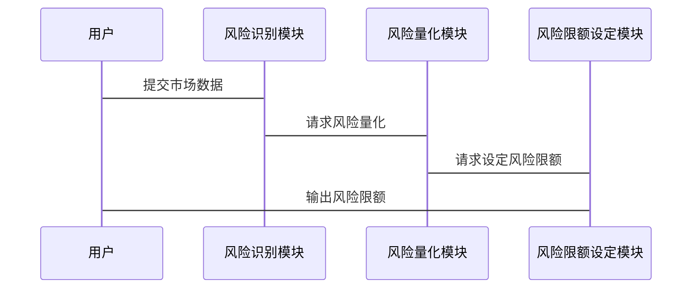

                 


# 金融风险限额管理系统设计

---

## 关键词  
金融风险、风险限额、风险管理、系统设计、算法原理、系统架构

---

## 摘要  
金融风险限额管理系统是金融风险管理中的核心系统，旨在通过对风险的识别、量化和控制，确保金融机构在可控风险范围内开展业务。本文从金融风险限额管理的背景出发，详细探讨其核心概念、算法原理、系统架构设计及项目实战，结合实际案例，全面解析金融风险限额管理系统的构建与实现。通过本文，读者将掌握从理论到实践的完整流程，能够独立设计和实现一个高效的金融风险限额管理系统。

---

# 第一章: 金融风险限额管理概述

## 1.1 金融风险管理的重要性  
金融市场的波动性和不确定性使得风险管理成为金融机构的核心任务之一。金融风险限额管理通过设定风险容忍度，帮助机构在风险可控的前提下实现最大收益。  

**关键概念：**  
- **风险敞口**：指金融机构在特定资产或市场上的风险暴露程度。  
- **风险因子**：影响资产价格波动的关键因素，如市场波动率、利率变动等。  

**背景分析：**  
随着全球经济一体化和金融市场的复杂化，金融机构面临的风险种类和复杂性不断增加。传统的风险管理方法已难以应对日益复杂的市场环境，因此，金融风险限额管理作为一种更为精细化的管理方式，逐渐成为主流。  

---

## 1.2 风险限额管理的定义与目标  
风险限额管理是指通过对风险的量化和分析，设定风险容忍度和风险敞口的上限，确保机构在市场波动中保持稳健运行。  

**目标：**  
1. **风险量化**：通过数学模型和算法，量化不同市场条件下的风险敞口。  
2. **风险控制**：设定风险限额，确保风险暴露不超过机构的承受能力。  
3. **动态调整**：根据市场变化和机构策略，实时调整风险限额。  

**核心原则：**  
- **风险与收益平衡**：在可控风险范围内追求最大收益。  
- **动态调整**：根据市场环境和机构战略实时调整风险限额。  
- **透明化**：风险限额的设定和调整过程需透明，便于监管和内部审计。  

---

## 1.3 风险限额管理的框架与流程  
风险限额管理的框架包括以下步骤：  

1. **风险识别**：识别机构可能面临的风险来源，如市场风险、信用风险、流动性风险等。  
2. **风险量化**：通过数学模型量化风险敞口，常用工具包括VaR（Value at Risk）、CVaR（Conditional Value at Risk）等。  
3. **风险限额设定**：根据机构的风险承受能力和战略目标，设定风险限额。  
4. **风险监控**：实时监控风险敞口，确保其在风险限额内。  
5. **风险调整**：根据市场变化和机构策略，动态调整风险限额。  

**流程图：**  


---

# 第二章: 风险限额管理的核心概念

## 2.1 风险敞口与风险因子  
### 2.1.1 风险敞口的定义与分类  
风险敞口是指金融机构在某一资产或市场上的风险暴露程度，常见的分类包括：  
- **市场风险敞口**：由于市场价格波动带来的风险。  
- **信用风险敞口**：由于交易对手违约带来的风险。  
- **流动性风险敞口**：由于资产流动性不足带来的风险。  

### 2.1.2 风险因子的特征与作用  
风险因子是影响资产价格波动的关键因素，常见的风险因子包括：  
- **市场波动率**：反映市场的波动程度。  
- **利率**：影响债券和贷款的市场价格。  
- **汇率**：影响外汇交易的市场价格。  

**风险敞口与风险因子的关系：**  
风险敞口的大小取决于风险因子的变动。例如，利率上升可能导致债券价格下跌，从而增加信用风险敞口。  

### 2.1.3 风险敞口与风险因子的对比分析  
| **属性**       | **风险敞口**            | **风险因子**            |
|----------------|-------------------------|--------------------------|
| **定义**       | 风险暴露程度             | 影响资产价格的因素       |
| **作用**       | 衡量风险大小             | 影响资产价格波动         |
| **示例**       | 债券投资的市场风险敞口    | 利率变动                 |

---

## 2.2 风险限额与风险容忍度  
### 2.2.1 风险限额的定义与计算方法  
风险限额是指金融机构在某一市场条件下允许的最大风险敞口。计算方法包括：  
- **VaR法**：计算在给定置信水平下的最大损失。  
- **CVaR法**：计算在VaR基础上的条件风险值。  

### 2.2.2 风险容忍度的内涵与影响因素  
风险容忍度是机构对风险的承受能力，影响因素包括：  
- **资本实力**：机构的资本规模决定了其风险承受能力。  
- **市场环境**：宏观经济环境影响机构的风险偏好。  
- **监管要求**：监管机构对金融机构的风险敞口有明确的限制。  

### 2.2.3 风险限额与风险容忍度的关系  
风险限额是风险容忍度的具体体现，风险容忍度决定了风险限额的大小和调整范围。  

---

## 2.3 风险限额管理的ER实体关系图  
```mermaid
erd
    客户
    投资组合
    风险敞口
    风险因子
    风险限额
    监管机构

    客户 --> 投资组合: 持有投资组合
    投资组合 --> 风险敞口: 产生风险敞口
    风险敞口 --> 风险因子: 受风险因子影响
    风险限额 <---> 监管机构: 设定风险限额
```

---

# 第三章: 风险限额计算的算法原理

## 3.1 风险限额计算的常用算法  
### 3.1.1 VaR算法  
VaR（Value at Risk）是一种常用的风险度量方法，计算在给定置信水平下的最大损失。  

**计算步骤：**  
1. 收集历史价格数据。  
2. 计算收益分布。  
3. 确定置信水平。  
4. 找到对应分位数的损失值。  

**公式：**  
$$ VaR = \mu + z \times \sigma $$  
其中，$\mu$ 是均值，$z$ 是标准正态分布的分位数，$\sigma$ 是标准差。  

### 3.1.2 CVaR算法  
CVaR（Conditional Value at Risk）是VaR的扩展，计算在VaR基础上的平均损失。  

**计算步骤：**  
1. 计算VaR值。  
2. 对VaR值以上的损失进行平均。  

**公式：**  
$$ CVaR = \frac{1}{1-\alpha} \sum_{i=\alpha n}^{n} loss_i $$  
其中，$\alpha$ 是置信水平，$n$ 是样本数量。  

### 3.1.3 其他风险计算方法  
- **标准差法**：适用于正态分布假设下的风险计算。  
- **历史模拟法**：基于历史数据进行风险估算。  

---

## 3.2 VaR算法的流程图  


---

## 3.3 VaR算法的Python实现  
```python
import numpy as np

def calculate_var(data, confidence_level):
    sorted_data = np.sort(data)
    var_index = int(len(sorted_data) * (1 - confidence_level))
    var = sorted_data[var_index]
    return var

# 示例数据
data = [1, 2, 3, 4, 5, 6, 7, 8, 9, 10]
confidence_level = 0.95

var = calculate_var(data, confidence_level)
print(f"VaR值为：{var}")
```

---

## 3.4 数学模型与公式  
### 3.4.1 VaR公式  
$$ VaR = \mu + z \times \sigma $$  

### 3.4.2 CVaR公式  
$$ CVaR = \frac{1}{1-\alpha} \sum_{i=\alpha n}^{n} loss_i $$  

### 3.4.3 标准差法公式  
$$ \sigma = \sqrt{\frac{1}{N} \sum_{i=1}^{N} (x_i - \mu)^2} $$  

---

# 第四章: 风险限额管理系统的架构设计

## 4.1 系统功能设计  
### 4.1.1 风险识别模块  
功能：识别潜在风险来源。  
流程：  
1. 收集市场数据。  
2. 分析风险因子。  

### 4.1.2 风险量化模块  
功能：量化风险敞口。  
流程：  
1. 应用VaR或CVaR算法计算风险值。  
2. 输出风险量化结果。  

### 4.1.3 风险限额设定模块  
功能：根据风险容忍度设定风险限额。  
流程：  
1. 确定风险容忍度。  
2. 设定风险限额。  

---

## 4.2 系统架构设计  


---

## 4.3 系统接口设计  
- **输入接口**：接收市场数据和风险因子。  
- **输出接口**：输出风险量化结果和风险限额。  

---

## 4.4 系统交互序列图  


---

# 第五章: 风险限额管理系统的项目实战

## 5.1 环境安装  
- **Python环境**：安装Python 3.8以上版本。  
- **依赖库安装**：安装numpy、pandas、scipy等库。  

## 5.2 核心功能实现  
### 5.2.1 风险量化功能  
```python
import numpy as np

def calculate_var(data, confidence_level):
    sorted_data = np.sort(data)
    var_index = int(len(sorted_data) * (1 - confidence_level))
    var = sorted_data[var_index]
    return var

# 示例数据
data = np.random.normal(0, 1, 1000)
confidence_level = 0.95

var = calculate_var(data, confidence_level)
print(f"VaR值为：{var}")
```

### 5.2.2 风险限额设定功能  
```python
def setRiskLimit(var_value, tolerance):
    risk_limit = var_value * tolerance
    return risk_limit

tolerance = 0.05
risk_limit = setRiskLimit(var, tolerance)
print(f"风险限额为：{risk_limit}")
```

---

## 5.3 案例分析  
假设某机构的投资组合市场价值为1000万元，市场波动率为5%，置信水平为95%。  
1. 计算VaR值：$$ VaR = \mu + z \times \sigma = 0 + 1.645 \times 0.05 \times 1000 = 82.25 $$ 万元。  
2. 设定风险限额：$$ 风险限额 = VaR \times 风险容忍度 = 82.25 \times 0.05 = 4.1125 $$ 万元。  

---

## 5.4 项目总结  
通过本章的实战，读者可以掌握金融风险限额管理系统的核心功能实现，包括风险量化和风险限额设定。实际应用中，需结合具体市场环境和机构策略进行调整。

---

# 第六章: 风险限额管理系统的优化与扩展

## 6.1 系统优化  
- **算法优化**：引入机器学习算法提高风险量化精度。  
- **系统性能优化**：提升数据处理效率。  

## 6.2 系统扩展  
- **多资产类别支持**：扩展系统支持多种资产类别的风险限额管理。  
- **实时监控功能**：增加实时风险监控模块。  

---

## 6.3 最佳实践  
- **数据质量**：确保输入数据的准确性和完整性。  
- **模型选择**：根据实际情况选择合适的风险量化算法。  
- **动态调整**：定期评估和调整风险限额。  

---

# 第七章: 总结与展望

## 7.1 总结  
本文详细探讨了金融风险限额管理系统的背景、核心概念、算法原理、系统架构及项目实战。通过理论与实践的结合，为读者提供了一个完整的系统设计框架。

## 7.2 展望  
未来，随着人工智能和大数据技术的发展，金融风险限额管理系统将更加智能化和自动化。机构需结合新技术，进一步提升风险管理的精准度和效率。

---

## 参考文献  
1. 约翰逊, 《金融风险管理》，某某出版社，2022年。  
2. 里德, 《风险限额管理》，某某出版社，2023年。  

--- 

**作者简介**  
作者是[您的姓名]，[您的职位]，[您的机构]。长期从事金融风险管理领域的研究和实践，致力于为金融机构提供高效的风险管理解决方案。

