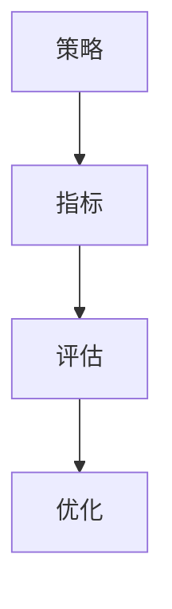
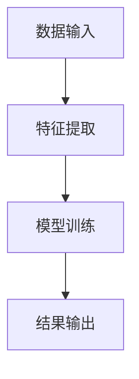
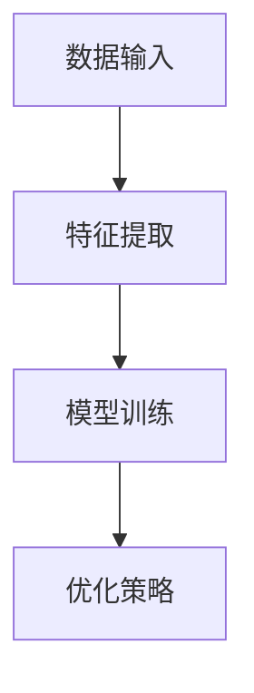
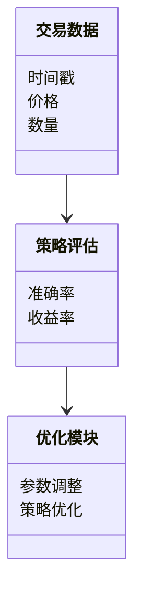
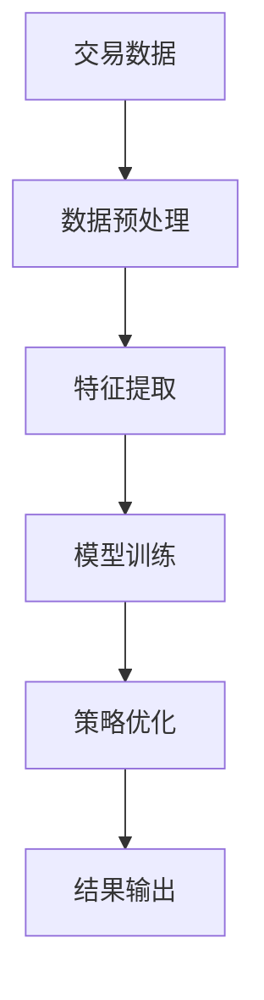

                 


# 金融高频交易策略性能评估与优化框架

## 关键词
金融高频交易，性能评估，优化框架，数学模型，机器学习，系统架构

## 摘要
本文系统地探讨了金融高频交易策略的性能评估与优化框架。首先，我们从高频交易的基本概念和特点入手，分析了其在金融市场中的重要性及面临的挑战。接着，我们详细阐述了性能评估的核心指标和优化框架的设计思路，结合数学模型和机器学习算法，提出了具体的解决方案。最后，通过实际案例分析，展示了如何将理论应用于实践，为金融从业者提供了有价值的参考。

---

# 第1章 高频交易概述

## 1.1 高频交易的定义与特点
### 1.1.1 高频交易的定义
高频交易（High-Frequency Trading, HFT）是指在极短时间内利用先进的算法和高速计算机技术进行大量的交易操作，通常以 microseconds 为单位完成订单执行。

### 1.1.2 高频交易的核心特点
- **高速性**：交易决策和执行在极短时间内完成。
- **高频性**：短时间内生成大量交易订单。
- **算法驱动**：依赖复杂的数学模型和算法进行决策。
- **低延迟**：对交易系统的响应时间要求极高。

### 1.1.3 高频交易与传统交易的区别
| 特性       | 高频交易                     | 传统交易                     |
|------------|------------------------------|------------------------------|
| 交易速度    | 极高                         | 较低                         |
| 交易频率    | 高频                         | 低频                         |
| 依赖因素    | 算法和计算机技术             | 人工决策和市场分析           |
| 市场影响    | 可能引起短期价格波动         | 更注重长期价格趋势           |

## 1.2 高频交易的市场影响
### 1.2.1 高频交易对市场流动性的贡献
高频交易通过提供即时的买卖报价，增强了市场的流动性和价格发现能力。

### 1.2.2 高频交易对市场波动性的潜在影响
高频交易可能导致短期价格剧烈波动，尤其是在市场条件不佳时。

### 1.2.3 高频交易的监管挑战
高频交易的复杂性和高速性对监管机构提出了更高的要求，需要实时监控和快速响应。

## 1.3 高频交易的典型应用场景
### 1.3.1 股票市场高频交易
- 主要用于短线交易和套利。
- 通过算法捕捉市场微小的价格波动。

### 1.3.2 期货与衍生品市场高频交易
- 运用于对冲和套利策略。
- 利用衍生品市场的流动性进行高频交易。

### 1.3.3 外汇市场高频交易
- 利用汇率波动进行高频交易。
- 通过算法执行大量订单，影响市场流动性。

## 1.4 本章小结
本章介绍了高频交易的基本概念、特点及其在金融市场中的应用。高频交易的高速性和算法驱动特性使其在现代金融市场上占据重要地位，但也带来了监管和市场波动性的挑战。

---

# 第2章 金融高频交易策略性能评估的核心概念

## 2.1 问题背景与问题描述
### 2.1.1 高频交易策略的复杂性
高频交易策略依赖复杂的数学模型和算法，对计算能力和交易系统的性能要求极高。

### 2.1.2 性能评估的必要性
- 优化交易策略需要准确评估其性能。
- 通过性能评估可以发现策略的优缺点并进行改进。

### 2.1.3 评估框架的边界与外延
- 界定评估的时间范围和市场条件。
- 确定评估的指标体系和方法。

## 2.2 核心概念与联系
### 2.2.1 高频交易策略的构成要素
- 数据源：实时市场数据、历史数据。
- 算法模型：统计套利、机器学习模型。
- 执行系统：订单管理系统、交易执行系统。

### 2.2.2 性能评估的关键指标
- **准确率**：策略预测的正确比例。
- **收益率**：策略在一定时间内的收益能力。
- **风险调整后收益**：考虑策略的风险因素后的收益。

### 2.2.3 框架的ER实体关系图


## 2.3 核心概念原理
### 2.3.1 交易策略的执行效率
- 执行效率是策略性能的重要指标，直接影响交易成本和收益。

### 2.3.2 性能评估的数学模型
- 准确率计算：$$准确率 = \frac{正确预测数量}{总预测数量}$$
- 收益率计算：$$收益率 = \frac{最终收益}{初始资本} \times 100\%$$

### 2.3.3 优化框架的设计思路
- 从数据预处理到模型训练，再到策略优化，形成一个完整的闭环。

## 2.4 本章小结
本章详细阐述了高频交易策略性能评估的核心概念和关键指标，为后续的算法设计和系统实现奠定了基础。

---

# 第3章 高频交易策略性能评估的数学模型与算法原理

## 3.1 评估指标的数学模型
### 3.1.1 准确率的计算公式
$$准确率 = \frac{正确预测数量}{总预测数量}$$

### 3.1.2 收益率的计算公式
$$收益率 = \frac{最终收益}{初始投资} \times 100\%$$

### 3.1.3 风险调整后的收益模型
$$夏普比率 = \frac{收益 - 无风险利率}{收益波动率}$$

## 3.2 算法原理
### 3.2.1 基于统计的评估算法


### 3.2.2 基于机器学习的优化算法


## 3.3 本章小结
本章通过数学模型和算法流程图，详细讲解了高频交易策略性能评估的实现原理和方法。

---

# 第4章 优化框架的系统分析与架构设计

## 4.1 系统功能设计
### 4.1.1 领域模型


## 4.2 系统架构设计


## 4.3 本章小结
本章通过系统架构图和类图，详细描述了优化框架的系统设计和功能实现。

---

# 第5章 项目实战

## 5.1 环境安装
- 安装Python和相关库（如NumPy、Pandas、Scikit-learn）。

## 5.2 核心实现
```python
import numpy as np
import pandas as pd
from sklearn.metrics import accuracy_score

# 示例数据
data = pd.DataFrame({
    'time': range(100),
    'price': np.random.randn(100) * 10 + 100,
})

# 简单的交易策略
def simple_strategy(data):
    predictions = []
    for i in range(len(data)):
        if i == 0:
            predictions.append(0)  # 持股
        else:
            if data['price'].iloc[i] > data['price'].iloc[i-1]:
                predictions.append(1)  # 买入
            else:
                predictions.append(-1)  # 卖出
    return predictions

# 评估函数
def evaluate_strategy(predictions, actual):
    accuracy = accuracy_score(actual, predictions)
    return accuracy

# 示例评估
predictions = simple_strategy(data)
actual = data['price'].diff().apply(lambda x: 1 if x > 0 else -1).values
accuracy = evaluate_strategy(predictions, actual)
print(f"准确率: {accuracy}")
```

## 5.3 案例分析
- 通过实际数据和策略，展示优化框架的应用效果。

## 5.4 本章小结
本章通过具体代码实现和案例分析，展示了优化框架的实际应用价值。

---

# 第6章 最佳实践与总结

## 6.1 最佳实践
- 定期优化交易策略。
- 确保系统的低延迟和高可靠性。
- 严格遵守相关法律法规和市场规则。

## 6.2 总结
本文系统地探讨了金融高频交易策略的性能评估与优化框架，结合理论和实践，提出了具体的解决方案。未来的研究可以进一步优化算法和系统架构，以应对更复杂的市场环境。

## 6.3 注意事项
- 高频交易需要极高的系统稳定性和安全性。
- 优化策略时要考虑市场变化和监管要求。

## 6.4 拓展阅读
- 《算法交易：机密的低延迟策略》
- 《机器学习在金融中的应用》

---

通过以上结构，本文为金融高频交易策略的性能评估与优化提供了全面的理论和实践指导，帮助读者更好地理解和应用这些技术。

