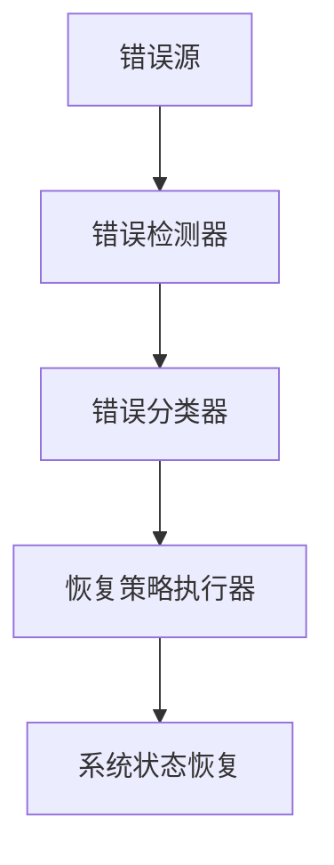
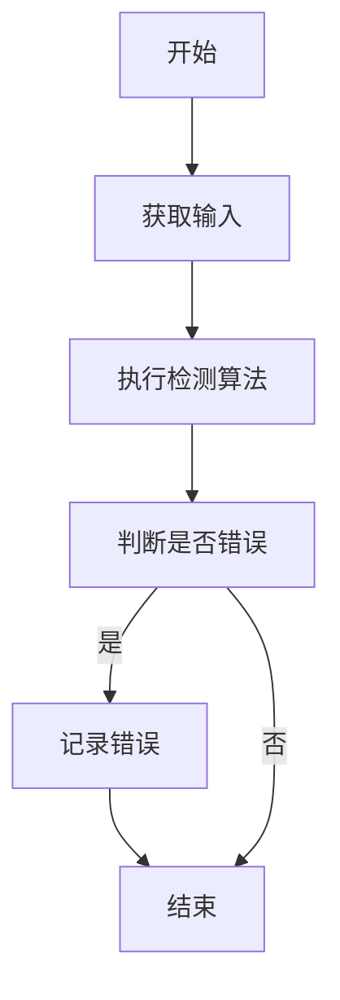
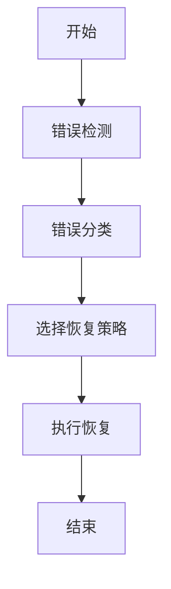
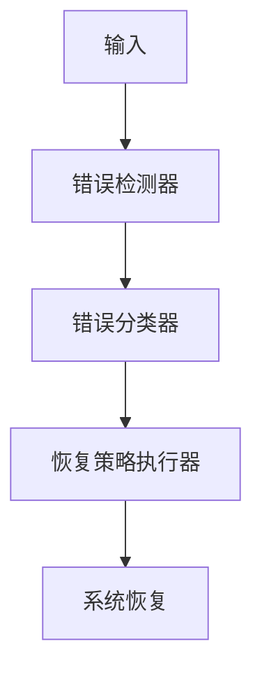

                 


# 错误处理与恢复：提高AI Agent的鲁棒性

> 关键词：错误处理，AI Agent，鲁棒性，恢复机制，故障检测，容错设计

> 摘要：在AI Agent开发中，错误处理与恢复是确保系统鲁棒性和可靠性的重要环节。本文将深入探讨错误处理的核心概念、算法原理、系统架构设计以及实际项目中的应用，帮助读者全面掌握如何在AI Agent中实现高效的错误处理与恢复机制，从而提高系统的稳定性和用户体验。

---

# 第1章: 错误处理与恢复的背景介绍

## 1.1 错误处理的重要性

### 1.1.1 问题背景
AI Agent作为人工智能的核心组件，广泛应用于自动驾驶、智能客服、机器人控制等领域。在实际应用中，AI Agent会面临各种不确定性因素，例如传感器故障、网络中断、用户输入错误等。这些因素可能导致系统运行异常，甚至崩溃，从而影响用户体验和系统稳定性。

### 1.1.2 问题描述
AI Agent在运行过程中可能遇到多种错误，例如逻辑错误、输入错误、资源不足错误等。这些错误如果得不到及时处理，可能导致系统卡死、输出错误结果，甚至引发更严重的问题。

### 1.1.3 问题解决的必要性
错误处理是确保AI Agent稳定运行的关键。通过有效的错误检测和恢复机制，可以减少系统故障的发生，提高系统的可靠性和用户体验。

## 1.2 AI Agent的基本概念

### 1.2.1 AI Agent的定义
AI Agent是一种能够感知环境、自主决策并执行任务的智能实体。它可以基于传感器输入、用户指令或内部逻辑进行操作。

### 1.2.2 AI Agent的核心要素
AI Agent的核心要素包括感知能力、决策能力、执行能力、通信能力等。这些能力共同决定了AI Agent的智能化水平和任务执行能力。

### 1.2.3 AI Agent的分类与应用场景
AI Agent可以根据功能和应用场景分为多种类型，例如：
- **知识型AI Agent**：用于问答系统、智能助手。
- **行动型AI Agent**：用于机器人控制、自动驾驶。
- **监控型AI Agent**：用于实时监控、异常检测。

## 1.3 错误处理与恢复的定义

### 1.3.1 错误处理的定义
错误处理是指在AI Agent运行过程中，检测和识别系统中的错误，并采取相应的措施进行处理。

### 1.3.2 恢复机制的定义
恢复机制是指在错误发生后，系统采取的一系列操作，以将系统恢复到正常状态或安全状态。

### 1.3.3 错误处理与恢复的边界与外延
错误处理的边界包括错误检测、错误分类、错误恢复等环节。外延则涉及错误预防、错误监控、错误日志记录等方面。

## 1.4 错误处理与恢复的核心要素

### 1.4.1 错误检测机制
错误检测机制是错误处理的基础，包括实时监控、状态验证、异常检测等方法。

### 1.4.2 错误分类与优先级
错误分类是指将错误按照严重程度、类型、来源等进行分类。优先级决定了错误处理的顺序。

### 1.4.3 错误恢复策略
错误恢复策略包括重试、回滚、替换、降级等方法，具体取决于错误的类型和系统状态。

## 1.5 本章小结
本章介绍了错误处理与恢复的重要性和AI Agent的基本概念，明确了错误处理的核心要素，为后续章节的深入分析奠定了基础。

---

# 第2章: 错误处理与恢复的核心概念与联系

## 2.1 错误处理的原理

### 2.1.1 错误检测的原理
错误检测基于系统的状态变化和预期结果的对比。例如，传感器输入与预期不符时，系统会触发错误检测机制。

### 2.1.2 错误分类的原理
错误分类基于错误的特征，例如错误类型、错误来源、错误影响范围等。常见的分类方法包括基于规则的分类和基于模型的分类。

### 2.1.3 错误恢复的原理
错误恢复通过执行预定义的恢复策略，将系统状态恢复到正常或安全状态。例如，重试机制、回滚机制等。

## 2.2 错误处理与恢复的机制

### 2.2.1 错误检测机制
错误检测机制包括实时监控、状态验证、异常检测等。例如，使用概率模型检测异常输入。

### 2.2.2 错误隔离机制
错误隔离是指在检测到错误后，将错误的影响范围限制在最小的范围内，避免影响整个系统。

### 2.2.3 错误恢复机制
错误恢复机制包括重试、替换、降级等方法。例如，当网络中断时，AI Agent可以暂时切换到离线模式。

## 2.3 错误处理与恢复的实体关系图



## 2.4 本章小结
本章详细讲解了错误处理与恢复的核心概念和机制，通过实体关系图展示了各个部分的关系。

---

# 第3章: 错误处理与恢复的算法原理

## 3.1 错误检测算法

### 3.1.1 错误检测的数学模型
错误检测可以通过概率模型来实现，例如：
$$P(error) = \frac{E}{N}$$
其中，$E$ 表示错误数量，$N$ 表示总操作次数。

### 3.1.2 错误检测的实现步骤


## 3.2 错误恢复算法

### 3.2.1 恢复策略的分类
恢复策略可以分为重试、回滚、替换、降级等类型。例如，当网络请求失败时，系统可以重试几次。

### 3.2.2 恢复策略的实现
恢复策略的实现需要考虑系统的当前状态和错误的类型。例如，使用状态机来管理恢复过程。

## 3.3 错误处理与恢复的代码示例

### 3.3.1 错误检测示例
```python
def detect_error(inputs):
    # 检测输入是否符合预期
    if not isinstance(inputs, dict):
        return "输入格式错误"
    # 检测输入内容是否异常
    if "temperature" not in inputs:
        return "缺少温度参数"
    return None
```

### 3.3.2 错误恢复示例
```python
def recover_from_error(error_type):
    if error_type == "网络中断":
        return "重试"
    elif error_type == "传感器故障":
        return "切换到备用传感器"
    return "默认策略"
```

## 3.4 本章小结
本章通过数学模型和代码示例，详细讲解了错误检测和恢复的算法原理，为后续的系统设计奠定了基础。

---

# 第4章: 错误处理与恢复的系统分析与架构设计

## 4.1 错误处理的场景分析

### 4.1.1 AI Agent的典型应用场景
AI Agent可以应用于自动驾驶、智能客服、机器人控制等领域。例如，在自动驾驶中，传感器故障可能导致系统误判。

### 4.1.2 错误处理的场景分类
错误处理的场景可以分为输入错误、逻辑错误、资源错误等。

## 4.2 系统功能设计

### 4.2.1 系统功能模块
系统功能模块包括错误检测模块、错误分类模块、恢复策略执行模块等。

### 4.2.2 系统功能流程


## 4.3 系统架构设计

### 4.3.1 系统架构图


### 4.3.2 系统接口设计
系统接口包括错误检测接口、错误分类接口、恢复策略执行接口等。

## 4.4 本章小结
本章通过场景分析和系统架构设计，展示了如何在AI Agent中实现高效的错误处理与恢复机制。

---

# 第5章: 错误处理与恢复的项目实战

## 5.1 项目背景与目标

### 5.1.1 项目背景
本项目旨在设计一个智能客服系统的错误处理与恢复机制，确保系统在面对输入错误、网络中断等情况下能够稳定运行。

### 5.1.2 项目目标
通过实现错误检测、分类和恢复，提高系统的稳定性和用户体验。

## 5.2 环境安装与配置

### 5.2.1 环境要求
- Python 3.8+
- pip 20.0+
- 项目依赖：numpy, scikit-learn

### 5.2.2 安装依赖
```bash
pip install numpy scikit-learn
```

## 5.3 系统核心实现

### 5.3.1 错误检测模块
```python
def detect_error(inputs):
    # 检测输入是否为空
    if not inputs:
        return "输入为空错误"
    # 检测输入格式
    if not isinstance(inputs, dict):
        return "输入格式错误"
    return None
```

### 5.3.2 错误恢复模块
```python
def recover_from_error(error_type):
    if error_type == "输入为空错误":
        return "默认回复"
    elif error_type == "输入格式错误":
        return "提示用户重新输入"
    return "未知错误处理"
```

## 5.4 代码实现与解读

### 5.4.1 系统实现
```python
class AIAssistant:
    def __init__(self):
        self.error_detector = ErrorDetector()
        self.error_classifier = ErrorClassifier()
        self.recovery_strategy = RecoveryStrategy()

    def process_input(self, inputs):
        error = self.error_detector.detect_error(inputs)
        if error:
            error_type = self.error_classifier.classify_error(error)
            recovery = self.recovery_strategy.get_recoveryStrategy(error_type)
            self.apply_recovery(recovery)
            return "处理失败，请重试"
        # 处理正常情况
        return "处理成功"
```

### 5.4.2 代码解读
- **ErrorDetector** 类用于检测输入中的错误。
- **ErrorClassifier** 类用于对错误进行分类。
- **RecoveryStrategy** 类根据错误类型选择恢复策略。

## 5.5 项目小结
本章通过实际项目案例，展示了如何在AI Agent中实现错误处理与恢复机制，提高了系统的稳定性和用户体验。

---

# 第6章: 错误处理与恢复的最佳实践

## 6.1 最佳实践

### 6.1.1 错误检测机制的设计
- 使用多种检测方法，例如基于规则的检测和基于模型的检测。
- 定期更新错误检测模型，以应对新的错误类型。

### 6.1.2 错误恢复策略的选择
- 根据错误类型和系统状态选择合适的恢复策略。
- 设计默认策略，以应对未知错误。

### 6.1.3 错误日志记录
- 记录错误类型、错误发生时间、错误处理结果等信息。
- 定期分析错误日志，优化错误处理机制。

## 6.2 小结

## 6.3 注意事项

## 6.4 拓展阅读
- 建议阅读相关领域的最新论文和书籍，例如《容错计算原理与应用》。

---

# 附录: 错误处理与恢复的数学模型

## 附录A: 错误概率模型
$$P(error) = \frac{E}{N}$$

## 附录B: 错误检测的分类模型
$$f(x) = \sum_{i=1}^{n} w_i x_i$$

---

# 参考文献
- [1] 《容错计算原理与应用》，作者：XXX，出版社：XXX
- [2] 《人工智能系统设计》，作者：XXX，出版社：XXX

---

# 结束语
错误处理与恢复是确保AI Agent系统鲁棒性和可靠性的重要环节。通过本文的详细讲解和实际案例分析，读者可以全面掌握如何在AI Agent中实现高效的错误处理与恢复机制。未来，随着AI技术的不断发展，错误处理与恢复的研究也将更加深入，为AI Agent的应用提供更强大的支持。

