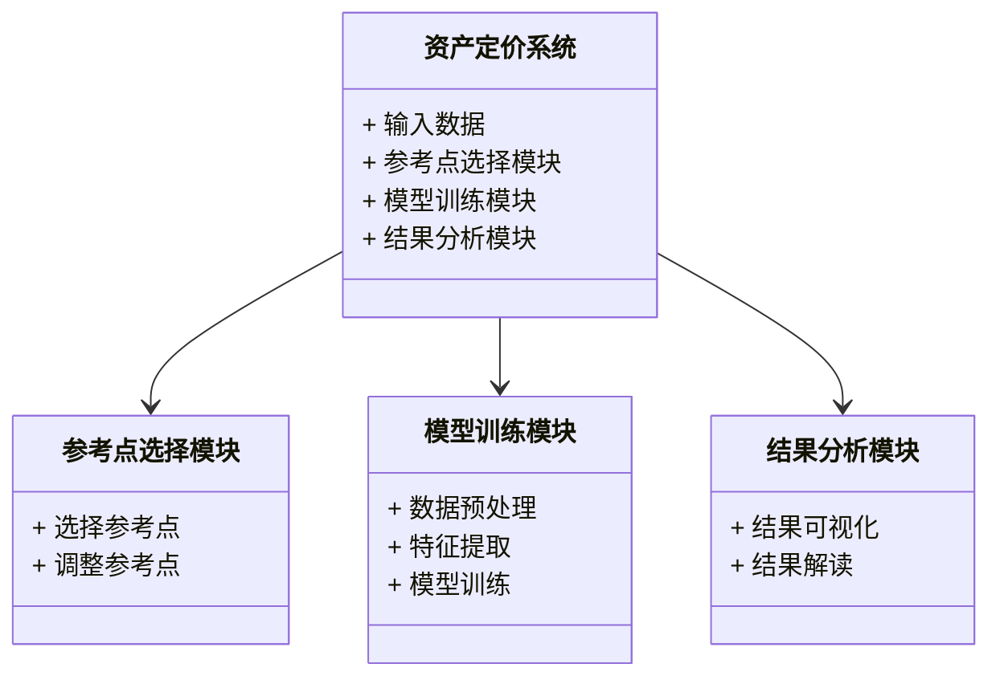
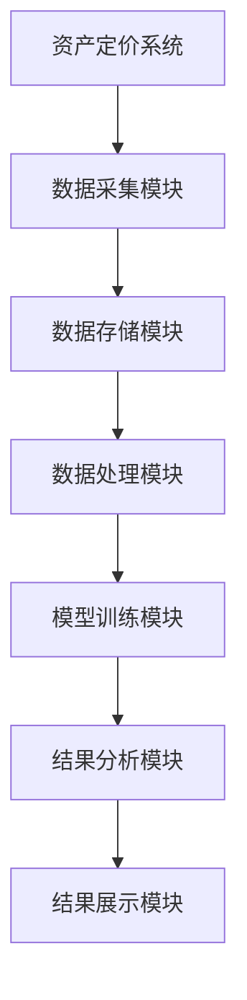

                 


# 锚定效应：参考点如何影响资产定价

> 关键词：锚定效应, 资产定价, 行为金融学, 概率论, 统计学, Python算法, 系统架构设计

> 摘要：本篇文章深入探讨了锚定效应在资产定价中的应用与影响，从心理学和行为金融学的视角分析了参考点如何影响投资者决策，进而影响资产定价。文章结合数学模型、算法实现和系统架构设计，详细阐述了如何量化锚定效应，并通过Python代码示例和实际案例分析，展示了锚定效应在股票、债券等资产定价中的具体表现。文章最后总结了锚定效应分析系统的构建方法，并提出了未来的研究方向和实际应用建议。

---

# 第一部分：锚定效应与资产定价的背景介绍

## 第1章：锚定效应的核心概念

### 1.1 锚定效应的定义与特征

#### 1.1.1 锚定效应的定义
锚定效应是指人们在决策过程中，会受到最初参考点（锚点）的影响，导致判断和选择出现偏差的现象。这种效应在心理学和行为经济学中被广泛研究，尤其是在定价和谈判场景中表现明显。

#### 1.1.2 锚定效应的核心特征
- **参考点依赖性**：锚定效应的核心是参考点的选择，不同的参考点会导致不同的判断。
- **认知偏差**：锚定效应是认知偏差的一种表现，反映了人类在信息处理中的非理性特征。
- **可塑性**：锚定效应的强度和方向可以通过参考点的调整而变化。

#### 1.1.3 锚定效应与资产定价的关系
在资产定价中，锚定效应表现为投资者基于某个参考点（如历史价格、基准收益率等）进行判断，导致价格偏离实际价值。

---

### 1.2 资产定价的背景与问题

#### 1.2.1 资产定价的基本概念
资产定价是指根据资产的风险、收益和市场环境等因素，确定其市场价格的过程。资产定价的核心是找到资产的内在价值，使其与市场价一致。

#### 1.2.2 资产定价中的常见问题
- **信息不对称**：市场参与者掌握的信息不一致，导致价格偏离实际价值。
- **情绪化决策**：投资者的情绪化判断会影响资产价格。
- **参考点偏差**：投资者过度依赖某个参考点，导致价格判断出现偏差。

#### 1.2.3 锚定效应在资产定价中的作用
锚定效应通过影响投资者的判断和决策，间接影响资产定价。例如，投资者可能基于历史价格低估或高估资产的实际价值。

---

## 第2章：锚定效应的形成机制

### 2.1 心理学视角下的锚定效应

#### 2.1.1 心理学视角下的锚定效应
锚定效应是人类认知过程中的常见偏差，表现为人们在决策时过度依赖初始信息，导致判断出现偏差。

#### 2.1.2 锚定效应的来源
- **信息可得性**：人们倾向于依赖容易获取的信息，导致初始信息成为决策的锚点。
- **经验影响**：过去的经验和记忆会影响当前的判断，形成锚点。
- **社会影响**：他人的意见和市场环境也会影响锚点的选择。

#### 2.1.3 锚定效应的影响因素
- **参考点的强度**：参考点越强，锚定效应越明显。
- **信息的不确定性**：信息不明确时，锚定效应更易发生。
- **个体差异**：不同个体的锚定效应表现可能不同。

---

### 2.2 行为金融学视角下的锚定效应

#### 2.2.1 行为金融学的基本概念
行为金融学研究的是金融市场中的个体和群体行为，强调心理因素对投资决策的影响。

#### 2.2.2 锚定效应在行为金融学中的表现
- **股票市场中的锚定效应**：投资者可能基于历史价格或市场指数判断股票价值。
- **债券市场中的锚定效应**：投资者可能基于历史收益率判断债券价值。
- **房地产市场中的锚定效应**：购房者可能基于房价的历史走势判断当前房价。

#### 2.2.3 行为偏差对资产定价的影响
- **过度自信**：投资者过度自信于自己的判断，导致价格偏差。
- **从众心理**：投资者跟随市场趋势，导致价格泡沫。
- **损失厌恶**：投资者避免损失的心理影响定价决策。

---

## 第3章：锚定效应在资产定价中的具体表现

### 3.1 股票定价中的锚定效应

#### 3.1.1 股票市场中的参考点
- **历史价格**：投资者可能参考股票的历史价格进行判断。
- **市场指数**：投资者可能参考市场指数（如道琼斯指数）判断股票价值。

#### 3.1.2 锚定效应对股票价格的影响
- **低估或高估**：投资者基于参考点判断股票价值，可能导致价格低估或高估。
- **市场波动**：锚定效应加剧市场的波动性。

#### 3.1.3 实证分析与案例研究
通过实证分析可以发现，锚定效应在股票市场中普遍存在，尤其是在市场波动较大的情况下。

---

### 3.2 其他资产定价中的锚定效应

#### 3.2.1 债券定价中的锚定效应
- **基准收益率**：投资者可能参考基准收益率判断债券价值。
- **历史收益率**：历史收益率成为债券定价的参考点。

#### 3.2.2 房地产市场中的锚定效应
- **房价历史走势**：购房者可能基于房价的历史走势判断当前房价。
- **市场预期**：市场预期成为房地产定价的重要参考点。

#### 3.2.3 商品定价中的锚定效应
- **历史价格**：消费者可能基于历史价格判断商品价值。
- **市场趋势**：市场趋势成为商品定价的参考点。

---

# 第二部分：锚定效应的数学模型与算法原理

## 第4章：锚定效应的数学模型

### 4.1 基于概率论的锚定效应模型

#### 4.1.1 概率分布的基本概念
概率分布描述了随机变量可能取值及其概率，是概率论的核心概念。

#### 4.1.2 锚定效应的概率模型
- **概率密度函数**：描述锚定效应的分布情况。
- **累积分布函数**：描述锚定效应的累计概率。

#### 4.1.3 模型的数学表达式
$$ P(x) = \frac{1}{\sigma \sqrt{2\pi}} e^{-\frac{(x-\mu)^2}{2\sigma^2}} $$
其中，$\mu$ 是均值，$\sigma$ 是标准差。

---

### 4.2 基于统计学的锚定效应模型

#### 4.2.1 统计学基础
统计学是研究数据收集、分析和推断的学科，是锚定效应建模的重要工具。

#### 4.2.2 锚定效应的统计模型
- **回归分析**：通过回归分析研究参考点对资产定价的影响。
- **方差分析**：分析不同参考点对资产定价的差异。

#### 4.2.3 模型的假设检验
通过假设检验验证模型的显著性和适用性。

---

## 第5章：锚定效应的算法实现

### 5.1 锚定效应的算法步骤

#### 5.1.1 数据预处理
- **数据清洗**：处理缺失值和异常值。
- **数据标准化**：对数据进行标准化处理。

#### 5.1.2 特征提取
- **特征选择**：选择影响锚定效应的关键特征。
- **特征工程**：构建新的特征以提高模型性能。

#### 5.1.3 模型训练
- **训练集划分**：将数据划分为训练集和测试集。
- **模型训练**：使用训练数据训练锚定效应模型。

#### 5.1.4 结果分析
- **结果可视化**：通过可视化工具展示模型结果。
- **结果解读**：分析模型结果对资产定价的影响。

---

### 5.2 使用Python实现锚定效应算法

#### 5.2.1 环境搭建
- **安装Python**：安装Python编程语言。
- **安装依赖库**：安装numpy、pandas、scikit-learn等依赖库。

#### 5.2.2 数据加载与处理
```python
import numpy as np
import pandas as pd

# 加载数据
data = pd.read_csv('anchor_data.csv')

# 数据预处理
data = data.dropna()  # 删除缺失值
data = (data - data.mean()) / data.std()  # 标准化处理
```

#### 5.2.3 模型实现
```python
from sklearn.linear_model import LinearRegression

# 特征选择
X = data[['参考点1', '参考点2']]
y = data['目标变量']

# 模型训练
model = LinearRegression()
model.fit(X, y)

# 模型预测
y_pred = model.predict(X)
```

#### 5.2.4 结果可视化
```python
import matplotlib.pyplot as plt

plt.scatter(X['参考点1'], y, color='blue', label='真实值')
plt.scatter(X['参考点1'], y_pred, color='red', label='预测值')
plt.xlabel('参考点1')
plt.ylabel('目标变量')
plt.legend()
plt.show()
```

---

# 第三部分：系统分析与架构设计

## 第6章：锚定效应分析系统的架构设计

### 6.1 系统需求分析

#### 6.1.1 问题场景介绍
- **问题背景**：资产定价中存在锚定效应，影响市场判断。
- **项目目标**：构建一个基于锚定效应的资产定价分析系统。

#### 6.1.2 项目介绍
- **项目目标**：分析锚定效应对资产定价的影响。
- **项目范围**：涵盖股票、债券等多种资产类型。

---

### 6.2 系统功能设计

#### 6.2.1 领域模型设计（Mermaid类图）


---

### 6.3 系统架构设计（Mermaid架构图）



---

## 第7章：项目实战与总结

### 7.1 项目实战

#### 7.1.1 环境配置
- **操作系统**：Windows 10或更高版本。
- **编程语言**：Python 3.8或更高版本。
- **依赖库**：numpy、pandas、scikit-learn。

#### 7.1.2 数据预处理与特征工程
```python
import pandas as pd
import numpy as np

# 数据加载
data = pd.read_csv('anchor_data.csv')

# 删除缺失值
data = data.dropna()

# 标准化处理
data = (data - data.mean()) / data.std()
```

#### 7.1.3 模型实现与结果分析
```python
from sklearn.linear_model import LinearRegression
import matplotlib.pyplot as plt

# 特征选择
X = data[['参考点1', '参考点2']]
y = data['目标变量']

# 模型训练
model = LinearRegression()
model.fit(X, y)

# 模型预测
y_pred = model.predict(X)

# 结果可视化
plt.scatter(X['参考点1'], y, color='blue', label='真实值')
plt.scatter(X['参考点1'], y_pred, color='red', label='预测值')
plt.xlabel('参考点1')
plt.ylabel('目标变量')
plt.legend()
plt.show()
```

---

### 7.2 总结与展望

#### 7.2.1 总结
本篇文章详细探讨了锚定效应在资产定价中的应用，从理论到实践，结合数学模型和算法实现，展示了如何量化锚定效应并应用于实际资产定价分析。

#### 7.2.2 展望
未来的研究可以进一步探索锚定效应的动态变化，结合机器学习算法，构建更复杂的模型，以更好地理解和预测资产定价中的锚定效应。

---

### 7.3 最佳实践 Tips

#### 7.3.1 数据处理建议
- 在数据预处理阶段，确保数据的完整性和准确性。
- 在特征提取阶段，选择与锚定效应相关的特征。

#### 7.3.2 模型优化建议
- 使用更复杂的模型（如随机森林、神经网络）进行建模。
- 通过交叉验证优化模型参数。

#### 7.3.3 实际应用建议
- 在实际资产定价中，结合多参考点进行综合判断。
- 定期更新参考点，以适应市场变化。

---

# 结语

锚定效应是资产定价中不可忽视的重要因素，理解其原理和影响有助于投资者做出更理性的决策。通过数学模型和算法实现，我们可以更精确地量化锚定效应，并将其应用于实际资产定价分析中。未来的研究和实践将进一步深化对锚定效应的理解，并推动资产定价领域的创新发展。

