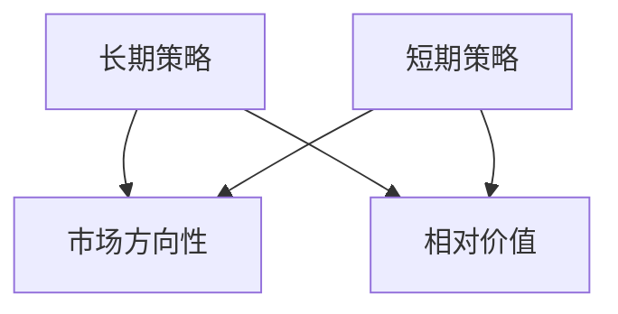

                 

# 长短期策略：平衡市场方向性与相对价值

> 关键词：长短期策略，市场方向性，相对价值，投资策略，策略优化

> 摘要：本文深入探讨了在投资领域中如何平衡长期和短期策略，以实现市场方向性与相对价值的优化。通过分析长短期策略的核心概念、算法原理、系统设计以及实际案例，本文为投资者提供了一种科学的策略选择和优化方法，帮助他们在复杂多变的市场环境中做出更明智的投资决策。

---

# 第一部分: 长短期策略的背景与核心概念

## 第1章: 长短期策略的背景与问题背景

### 1.1 问题背景

#### 1.1.1 投资市场的复杂性
投资市场是一个复杂且动态变化的环境，投资者需要在长期和短期目标之间找到平衡。市场的波动性、经济周期、政策变化等因素都会影响投资策略的有效性。

#### 1.1.2 长短期策略的定义与特点
- **长期策略**：注重资产的长期增值，关注基本面分析、行业趋势和公司长期盈利能力。
- **短期策略**：关注市场的短期波动，利用技术分析、市场情绪和短期价格变化进行交易。

#### 1.1.3 市场方向性与相对价值的矛盾
市场方向性强调市场的整体趋势，而相对价值关注资产之间的相对价格关系。两者之间的矛盾在于，如何在市场波动中找到平衡点，避免过度偏离长期目标或错失短期机会。

### 1.2 问题描述

#### 1.2.1 投资者面临的决策困境
投资者在选择策略时，常常面临以下困境：
- 长期策略需要耐心和纪律，但在市场剧烈波动时可能承受较大压力。
- 短期策略能够快速捕捉市场机会，但容易受到短期噪声的影响，增加风险。

#### 1.2.2 长短期策略的平衡需求
投资者需要找到一种方法，既能抓住短期市场机会，又能保持长期投资目标的稳定性。

#### 1.2.3 市场波动性与策略选择的关系
市场波动性越高，短期策略的重要性越大；市场稳定性越高，长期策略的可靠性越强。因此，如何根据市场环境动态调整策略成为关键。

### 1.3 问题解决

#### 1.3.1 长短期策略的整合思路
将长期和短期策略结合起来，根据市场环境的变化灵活调整投资比例和策略重点。

#### 1.3.2 市场方向性与相对价值的平衡方法
通过分析市场趋势和资产之间的相对价值，制定动态调整的投资策略。

#### 1.3.3 策略优化与动态调整的实现路径
通过数据驱动的方法，结合技术分析和基本面分析，优化策略参数，实现动态调整。

### 1.4 边界与外延

#### 1.4.1 长短期策略的适用范围
- 长期策略适用于稳定的市场环境和具备长期增长潜力的资产。
- 短期策略适用于波动性较高的市场环境和短期交易机会。

#### 1.4.2 策略选择的边界条件
- 市场周期：牛市、熊市、震荡市等不同周期对策略选择的影响。
- 资产类别：股票、债券、 commodities 等不同资产的特性差异。

#### 1.4.3 市场环境变化对策略的影响
市场环境的变化（如经济政策变化、突发事件）会影响策略的有效性，需要及时调整。

### 1.5 核心概念结构与要素

#### 1.5.1 长短期策略的核心要素
- **时间框架**：长期 vs 短期。
- **目标导向**：增值 vs 投机。
- **风险偏好**：保守 vs 进取。

#### 1.5.2 市场方向性与相对价值的相互作用
- 市场方向性影响资产的相对价值。
- 相对价值变化驱动市场的短期波动。

#### 1.5.3 策略优化的逻辑框架
- 确定投资目标。
- 分析市场环境。
- 选择合适的策略组合。
- 动态调整策略参数。

---

## 第2章: 长短期策略的核心概念与联系

### 2.1 核心概念原理

#### 2.1.1 长期投资的特征与优势
- 长期投资注重资产的内在价值和长期增长潜力。
- 通过分散投资和长期持有降低短期波动风险。

#### 2.1.2 短期投资的特征与优势
- 短期投资关注市场的短期波动和价格变化。
- 适合捕捉市场机会和快速调整投资组合。

#### 2.1.3 长短期策略的结合原理
- 结合长期和短期策略，利用市场的短期波动实现长期目标。
- 通过动态调整策略权重，平衡短期收益与长期目标。

### 2.2 核心概念属性特征对比

| 属性 | 长期策略 | 短期策略 |
|------|---------|---------|
| 时间框架 | 长期 | 短期 |
| 风险偏好 | 保守 | 进取 |
| 目标导向 | 增值 | 投机 |
| 适用场景 | 稳定市场 | 波动市场 |

### 2.3 ER实体关系图

---

## 第3章: 长短期策略的算法原理

### 3.1 算法原理

#### 3.1.1 长期投资策略的数学模型
长期投资策略可以基于资产的内在价值进行评估，常用的模型包括：
- 市盈率模型：$$ P/E = \frac{P}{E} $$
- 市净率模型：$$ P/B = \frac{P}{B} $$
- 股息率模型：$$ Dividend Yield = \frac{D}{P} $$

#### 3.1.2 短期投资策略的数学模型
短期投资策略常用的技术分析指标包括：
- 均值回归：$$ \text{EMA}(n) = \frac{2}{n+1} \times \text{Close} + \frac{2}{n+1} \times \text{EMA}(n-1) $$
- 动量策略：$$ \text{Momentum} = \text{Current Price} - \text{Previous Price} $$

#### 3.1.3 长短期策略的优化算法
结合长期和短期策略的优化算法可以通过以下步骤实现：
1. **市场趋势分析**：使用动量指标判断市场方向。
2. **相对价值评估**：比较资产的相对价值，选择被低估的资产。
3. **策略权重调整**：根据市场环境动态调整长短期策略的权重。

---

通过以上章节的内容，我们可以清晰地看到，平衡长短期策略的核心在于理解市场方向性与相对价值的相互作用，并通过科学的算法和动态调整来实现最优的投资组合。

