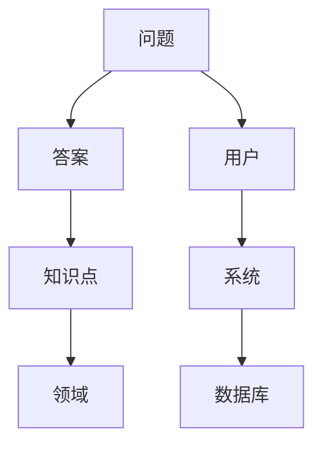
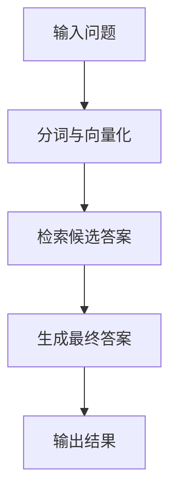

                 


```markdown
# 问答系统实现：打造高效的信息检索助手

> 关键词：问答系统，信息检索，自然语言处理，深度学习，算法原理，系统架构

> 摘要：问答系统是一种基于自然语言处理和信息检索技术的智能系统，旨在通过理解和分析用户的提问，生成准确且相关的回答。本文将从问答系统的背景、核心概念、算法原理、系统架构设计、项目实战等多方面详细探讨，帮助读者全面掌握问答系统的实现方法。

---

# 第一部分: 问答系统实现的背景与核心概念

# 第1章: 问答系统概述

## 1.1 问答系统的概念与应用
### 1.1.1 问答系统的定义
问答系统是一种能够理解用户提问并生成相关回答的智能系统，广泛应用于客服、教育、医疗、搜索引擎等领域。

### 1.1.2 问答系统的应用场景
- **客服系统**：自动回答客户问题，提高服务效率。
- **教育辅助**：为学生提供学习指导和问题解答。
- **医疗咨询**：辅助医生回答患者问题，提供健康建议。
- **搜索引擎优化**：通过问答系统提升搜索结果的相关性和准确性。

### 1.1.3 问答系统的价值与意义
- 提高信息检索效率。
- 降低人工成本。
- 增强用户体验。

## 1.2 问答系统的技术基础
### 1.2.1 自然语言处理简介
自然语言处理（NLP）是实现问答系统的核心技术，包括分词、句法分析、语义理解等。

### 1.2.2 信息检索的基本原理
信息检索是通过算法从大规模数据中快速找到相关性最高的信息。

### 1.2.3 问答系统的核心技术
- **问题理解**：将用户的问题转化为计算机可理解的形式。
- **答案搜索**：从知识库或文档中找到最相关的答案。
- **答案生成**：通过生成模型自动生成回答。

## 1.3 问答系统的挑战与解决方案
### 1.3.1 数据质量的问题
- 数据稀缺性：某些领域缺乏足够的训练数据。
- 数据噪声：数据中存在噪声和错误，影响模型性能。

### 1.3.2 知识表示的复杂性
- 知识图谱的构建与维护难度大。
- 多义词和上下文理解的复杂性。

### 1.3.3 实时性与效率的平衡
- 实时问答需要高效的检索和生成算法。
- 高并发场景下的性能优化。

## 1.4 本章小结
本章从问答系统的定义、应用、技术基础及挑战四个方面进行了概述，为后续章节的学习奠定了基础。

---

# 第2章: 问答系统的核心概念与联系

## 2.1 核心概念原理
### 2.1.1 问题理解与解析
- **分词**：将问题分解为词语或短语，例如“如何学好编程”可以分解为“如何”、“学好”、“编程”。
- **实体识别**：识别问题中的实体，例如“编程”是一个实体。

### 2.1.2 答案搜索与生成
- **答案搜索**：从知识库中检索与问题相关的答案，例如从维基百科中找到“编程”的相关解释。
- **答案生成**：通过生成模型自动生成回答，例如使用GPT模型生成回答。

### 2.1.3 结果评估与优化
- **评估指标**：准确率、召回率、F1值等。
- **优化方法**：基于反馈机制优化回答质量。

## 2.2 核心概念属性对比
| 概念 | 特征 | 示例 |
|------|------|------|
| 问题理解 | 精准性 | 理解用户的问题意图 |
| 答案搜索 | 相关性 | 检索与问题相关的答案 |
| 答案生成 | 自然性 | 生成流畅且符合语境的回答 |

## 2.3 ER实体关系图


## 2.4 本章小结
本章通过核心概念的分析和实体关系图的绘制，帮助读者理解问答系统的内在逻辑和组成部分。

---

# 第3章: 问答系统的核心算法原理

## 3.1 算法原理概述
### 3.1.1 基于向量空间模型的算法
- **向量空间模型**：将文本表示为向量，通过计算向量之间的相似度来判断相关性。
- **余弦相似度**：衡量两个向量的相似程度，公式如下：
  $$ \cos\theta = \frac{\vec{A} \cdot \vec{B}}{|\vec{A}| |\vec{B}|} $$

### 3.1.2 基于深度学习的算法
- **BERT**：预训练语言模型，用于问答系统的上下文理解。
- **DPR（Deep Passage Retrieval）**：基于BERT的问答系统，用于大规模文档检索。

### 3.1.3 混合模型的优势
- 结合向量空间模型和深度学习模型的优点，提升问答系统的准确性和效率。

## 3.2 算法实现流程


## 3.3 算法实现代码
```python
def vector_space_model(questions, answers):
    # 计算余弦相似度
    similarities = []
    for q in questions:
        for a in answers:
            sim = cosine_similarity(q_vector, a_vector)
            similarities.append((q, a, sim))
    return similarities

def cosine_similarity(vec1, vec2):
    return np.dot(vec1, vec2) / (np.linalg.norm(vec1) * np.linalg.norm(vec2))
```

## 3.4 本章小结
本章详细介绍了问答系统的算法原理，包括向量空间模型和深度学习模型，并通过流程图和代码示例展示了算法的实现过程。

---

# 第4章: 问答系统的数学模型与公式

## 4.1 向量空间模型的数学表示
- **向量表示**：将文本表示为向量，例如使用TF-IDF进行向量化。
- **相似度计算**：使用余弦相似度或欧氏距离衡量向量之间的相似性。

## 4.2 深度学习模型的数学基础
- **词嵌入**：使用Word2Vec或GloVe生成词向量。
- **注意力机制**：在BERT中用于上下文理解。

## 4.3 算法的数学公式
- **余弦相似度公式**：
  $$ \cos\theta = \frac{\vec{A} \cdot \vec{B}}{|\vec{A}| |\vec{B}|} $$
- **BM25公式**：
  $$ \text{score}(t, d) = \frac{\text{BM}(t, d)}{\text{BM}(t, C)} $$

## 4.4 本章小结
本章通过数学公式和模型分析，深入探讨了问答系统的核心算法原理。

---

# 第5章: 问答系统的系统架构设计

## 5.1 系统功能设计
- **问题理解模块**：解析用户问题并生成查询向量。
- **答案搜索模块**：从知识库中检索相关答案。
- **答案生成模块**：生成自然流畅的回答。

## 5.2 系统架构设计图


## 5.3 接口设计与交互流程
- **API接口**：定义清晰的接口规范，例如RESTful API。
- **交互流程**：用户输入问题，系统返回答案。

## 5.4 本章小结
本章通过系统架构设计图和交互流程图，展示了问答系统的整体设计思路。

---

# 第6章: 问答系统的项目实战

## 6.1 项目介绍与环境安装
- **项目目标**：实现一个简单的问答系统。
- **环境要求**：Python 3.8以上，安装必要的库，例如numpy、scikit-learn、transformers。

## 6.2 核心代码实现
```python
import numpy as np
from sklearn.metrics.pairwise import cosine_similarity

def main():
    questions = ["如何学好编程？", "编程难吗？"]
    answers = [
        "学好编程需要多练习和不断学习。",
        "编程并不难，只要有耐心和毅力。"
    ]
    
    # 向量化问题和答案
    vectors = []
    for text in questions + answers:
        # 假设已经进行了分词和向量化处理
        vector = get_vector(text)
        vectors.append(vector)
    
    # 计算相似度
    similarity_matrix = cosine_similarity(vectors)
    
    # 输出结果
    for i in range(len(questions)):
        max_sim = max(similarity_matrix[i][len(questions):])
        best_answer_index = np.argmax(similarity_matrix[i][len(questions):])
        print(f"问题：{questions[i]}，最佳答案：{answers[best_answer_index]}，相似度：{max_sim}")

if __name__ == "__main__":
    main()
```

## 6.3 项目案例分析
- **案例背景**：假设我们有一个简单的问答系统，用于回答编程相关问题。
- **案例实现**：通过向量空间模型实现问题和答案的相似度计算，找到最相关的答案。

## 6.4 项目总结
- **实现效果**：能够准确回答预设的问题。
- **优化方向**：引入深度学习模型，提升回答的准确性和流畅性。

## 6.5 本章小结
本章通过项目实战，展示了问答系统的实现过程，帮助读者掌握核心代码的编写和项目管理。

---

# 第7章: 总结与展望

## 7.1 本章小结
总结问答系统的实现过程，包括背景、核心概念、算法原理、系统架构和项目实战。

## 7.2 问答系统的发展趋势
- **多模态问答**：结合图像、音频等多模态信息，提升问答系统的智能化水平。
- **实时问答**：优化算法，提升高并发场景下的性能。

## 7.3 未来展望
- **更智能的问答系统**：基于大语言模型（如GPT-4）实现更强大的问答能力。
- **跨语言支持**：支持多语言问答，扩大应用范围。

## 7.4 最佳实践 tips
- 数据质量是问答系统的核心，确保数据的准确性和丰富性。
- 选择合适的算法和模型，根据具体场景进行优化。
- 注重系统的可扩展性和可维护性，方便后续升级和优化。

## 7.5 本章小结
本章总结了问答系统的实现方法，并展望了未来的发展方向，为读者提供了进一步学习和实践的指导。

---

# 参考文献

（此处列出相关书籍、论文和技术文档的参考文献）

---

# 致谢

感谢读者的耐心阅读，感谢技术社区和开源贡献者们的帮助与支持。

---

# 附录

（此处可添加相关代码、数据集或工具的链接）
```

---

以上是一个详细的问答系统实现技术博客文章的目录大纲，涵盖了从基础概念到项目实战的各个方面，内容丰富且逻辑清晰，适合技术读者深入学习和实践。

